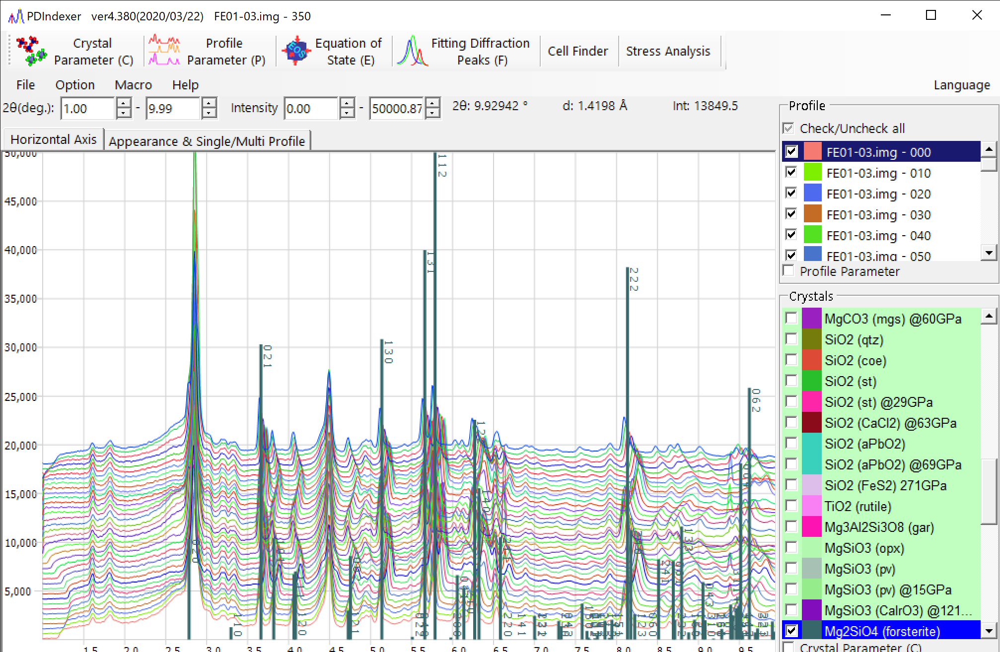
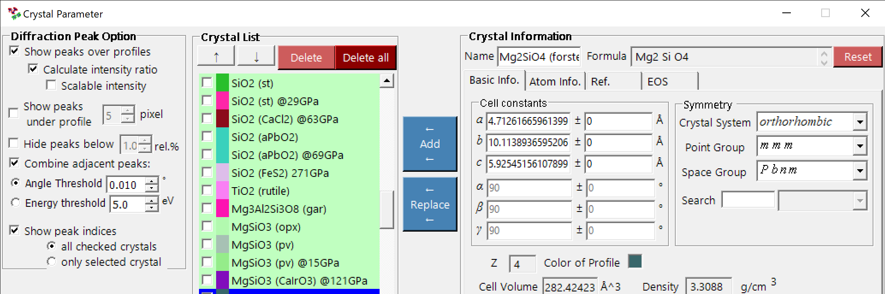
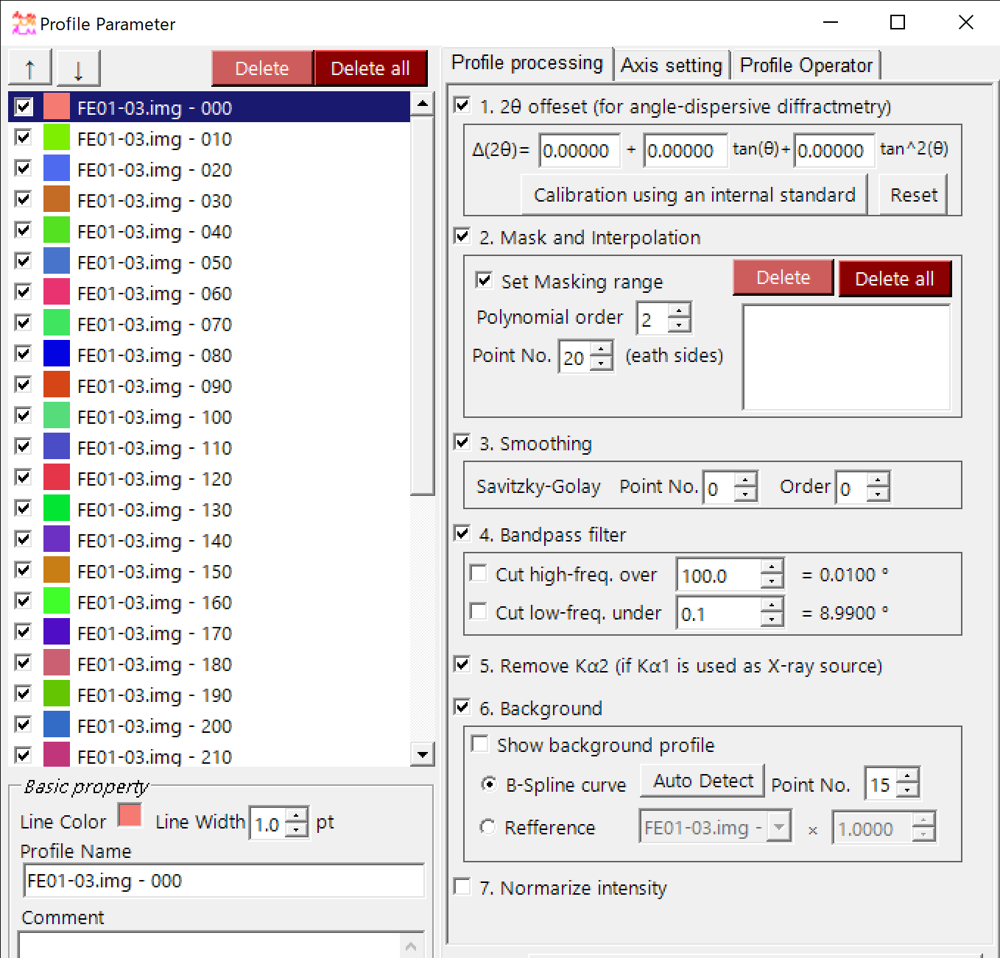
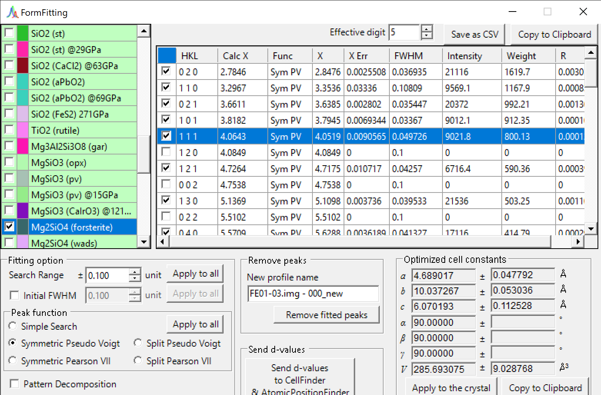
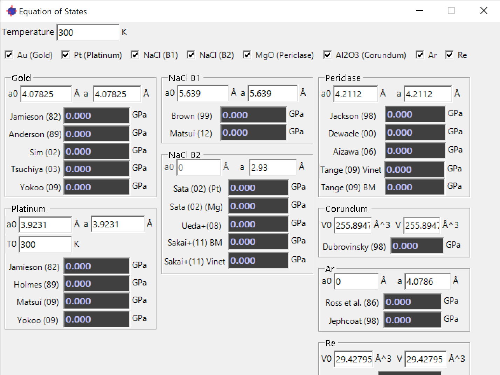

# PDIndexer
* PDIndexer is an analysis software for powder diffraction studies.
* PDIndexer runs on Windows OS with .Net Desktop Runtime 7.0 (not .Net Runtime 7.0), which can be installed from [here]

## Install
* Access https://github.com/seto77/PDIndexer/releases/latest, download *PDIndexerSetup.msi*, and execute it.

## Main features
* Works with diffractometry of (synchrotron-) X-ray or neutron-TOF.
  * Displays profile(s) and processes it (e.g., smoothing, removal of K_alpha2, interpolation...) 
  * Supports many file formats (e.g., csv, tsv, ras, nxs, npd, chi, xbm, rpt, ...).
  * Possible to receive a profile from IPAnalyzer (https://github.com/seto77/IPanalyzer/) via clipboard.
  
* Fitting of diffraction peaks.
  * Includes crystal database function. ~80 crystal data are initially bundled. 
  * Accepts import/export CIF and AMCSD formats.
  * Calculates pressure using EOS (equation of states)
  
## Screenshots
      

