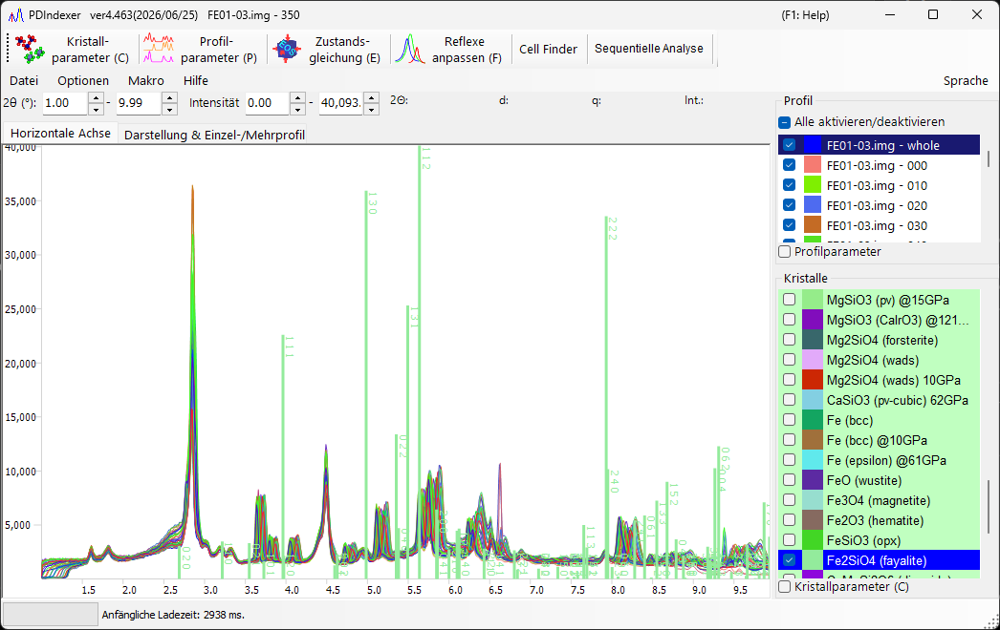
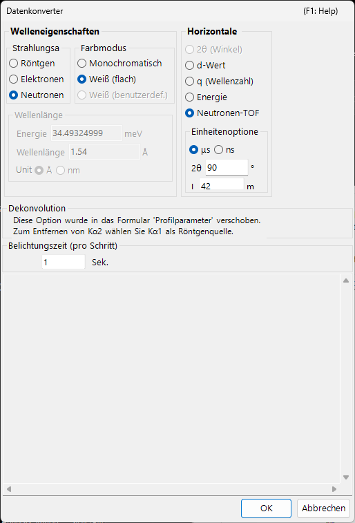

<!-- 260601Cl: migrated from legacy docx + yseto.net web manual -->
# Beugungsprofile

Diese Seite beschreibt die „Profildaten“ selbst (den gemessenen Datensatz), die PDIndexer verarbeitet, sowie das Laden, Anzeigen und Exportieren. Die nach dem Laden angewandte Verarbeitung — Glättung, Untergrundsubtraktion und so weiter — erfolgt im Fenster [Profilparameter](4-profile-parameter.md). Eine vollständige Liste der unterstützten Dateierweiterungen finden Sie unter [Dateiformate](appendix/file-formats.md).

## Was ein Profil ist

Ein Profil ist ein eindimensionaler Datensatz vom Typ „horizontale Achse vs. Intensität“, der aus einer Pulverdiffraktionsmessung gewonnen wird. Die horizontale Achse wird je nach Messgeometrie auf eine der folgenden Arten dargestellt:

- \( 2\theta \) (Beugungswinkel) für winkeldispersive Beugung (gewöhnliche Röntgenbeugung)
- Energie für energiedispersive Messungen (weiße Röntgenstrahlung, SSD-Detektion)
- Flugzeit für die Neutronen-Flugzeitmethode (TOF)
- In jedem Fall können die Daten intern auch nach Umrechnung in den Netzebenenabstand (d-Wert) \( d \) oder den Streuvektor \( q \) verarbeitet werden

Die vertikale Achse ist die Beugungsintensität, die als `Raw Counts` oder `Count per Step (CPS)` auf einer linearen oder logarithmischen Skala dargestellt werden kann (siehe `Vertical Axis` auf der Seite [Hauptfenster](1-main-window.md)).

## Unterstützte Eingabeformate

`File ▸ Read profile(s)` lädt sowohl das eigene Format von PDIndexer als auch Ausgaben anderer Programme und generische Textformate.

| Erweiterung | Inhalt |
| --- | --- |
| `pdi` / `pdi2` | Natives Profilformat von PDIndexer (enthält Achseneinstellungen und Verarbeitungsinformationen) |
| `csv` | WinPIP-Ausgabe (kommagetrennt) |
| `chi` | Fit2D-Ausgabe |
| `tsv` | Tabulatorgetrennter Text |
| `ras` | Rigaku-Format (RAS) |
| `nxs` | NeXus-Format |
| `npd` / `xbm` / `rpt` (`rpf`) | SSD-Rohdaten (Halbleiterdetektor) |
| Sonstiger Text | Jeder zweispaltige Winkel- (oder d-Wert-)–Intensitäts-Text ist in der Regel lesbar |

!!! note "Generischen Text einlesen"
    Dateien, die als Winkel–Intensitäts-Text gespeichert sind, lassen sich in der Regel auch dann lesen, wenn sie keinem der oben genannten Standardformate entsprechen. Wenn der Typ der horizontalen Achse oder die Wellenlänge/Energie nicht bestimmt werden kann, geben Sie diese im unten beschriebenen Dialog `Data Converter` an.

Die ausführliche Spezifikation jedes Formats ist unter [Dateiformate](appendix/file-formats.md) zusammengestellt.

## Wie geladen wird

Profile können auf verschiedene Arten geladen werden.

- **Menü** — `File ▸ Read profile(s)`. Es können mehrere Dateien gleichzeitig ausgewählt werden.
- **Drag & Drop** — Ziehen Sie Dateien aus dem Explorer auf das Hauptfenster.
- **Watch Clipboard** — Wenn `Option ▸ Watch Clipboard` aktiviert ist, werden aus anderen Apps (z. B. IPAnalyzer oder CSManager) kopierte Profile/Kristalle automatisch importiert.
- **Watch File** — Wenn `Option ▸ Watch File` aktiviert und mit `Set Directory to the watch` ein Ordner ausgewählt ist, werden neu erstellte `pdi`-Profildateien in diesem Ordner automatisch eingelesen. Das ist praktisch für die Echtzeitanzeige während einer kontinuierlichen Messung.

!!! tip "Horizontale Achse automatisch ausrichten"
    Wenn `After reading profile, change horizontal axis` aktiviert ist, wird die Anzeige der horizontalen Achse unmittelbar nach dem Einlesen an das neu geladene Profil angepasst.

## Modus Single Profile vs. Multi Profiles

Schalten Sie den Anzeigemodus mit `Single/Multi Profile` auf der rechten Seite des Hauptfensters um.

- **`Single Profile`** — Beim Laden eines neuen Profils werden die vorherigen Daten ersetzt; es wird immer nur ein Profil angezeigt.
- **`Multi Profiles`** — Geladene Profile werden überlagert. Verwenden Sie `Increasing intensity by a profile`, um die Intensität jedes Profils leicht zu versetzen, sodass sich mehrere Kurven leichter unterscheiden lassen. Bei aktiviertem `Change automatically color` wird jedem Profil automatisch eine Zeichenfarbe zugewiesen.

## Profil-Checkliste

Die Liste `Profile` auf der linken Seite des Hauptfensters zeigt alle geladenen Profile.

- Nur angehakte Profile werden im zentralen Anzeigebereich gezeichnet. Verwenden Sie `Check/Uncheck all`, um sie alle auf einmal umzuschalten.
- Klicken Sie auf die Spalte `Color`, um die Zeichenfarbe jedes Profils zu ändern.
- Ordnen Sie die Einträge in der Liste neu an, um die Zeichenreihenfolge der Überlagerung anzupassen.
- Die Liste ist im Modus Single Profile deaktiviert und zeigt im Modus Multi Profiles mehrere Profile an.

Ausführlichere Profileinstellungen (Name, Linienart, Glättung, Untergrundsubtraktion, Achsenkorrektur, Profiloperationen und so weiter) werden im Fenster [Profilparameter](4-profile-parameter.md) vorgenommen, das durch Anhaken des Kontrollkästchens `Profile Parameter` unterhalb der Liste geöffnet wird.

## Dialog Data Converter

Wenn Sie eine generische Textdatei laden, deren Typ der horizontalen Achse nicht bestimmt werden kann, oder SSD-Rohdaten (energiedispersiv), öffnet sich der Dialog `Data Converter`, in dem Sie die horizontale Achse der einzulesenden Daten und die zugehörigen Parameter angeben können.

Im Dialog werden die folgenden Punkte eingestellt.

| Punkt | Inhalt |
| --- | --- |
| Einstellung der horizontalen Achse | Geben Sie den Typ der horizontalen Achse der Daten an (Röntgen-Wellenlänge/-Energie, 2θ, Neutronen-TOF-Länge/-Winkel usw.) sowie die passenden Quellenparameter. |
| `Exposure time (per step)` | Belichtungs- (Mess-)zeit pro Datenschritt in Sekunden. Sie wird für die CPS-Umrechnung verwendet; Werte ≤ 0 werden als 1 behandelt. |
| `Deconvolution` | Die Kα2-Entfernung wurde in das Formular [Profilparameter](4-profile-parameter.md) verschoben. Um sie zu entfernen, wählen Sie Kα1 als Röntgenquelle. |
| `Low energy cutoff` unter `For SSD data` | Verwirft die niederenergetische Seite des EDX-Spektrums unterhalb des rechts angegebenen Schwellenwerts (eV). |

Wenn der Typ der horizontalen Achse energiedispersiv ist (weiße Röntgenstrahlung, EDX), geben Sie die Energiekalibrierungskoeffizienten von `E = a₀ + a₁ n + a₂ n²` (E: Energie in eV, n: Kanalnummer) ein, um Kanalnummern in Energie umzurechnen. Klicken Sie auf `OK`, um die Einstellungen anzuwenden und die Daten zu konvertieren, oder auf `Cancel`, um den Import abzubrechen.

## Profile exportieren

- **`File ▸ Save profile(s)`** — Speichert alle geladenen Profile im nativen `pdi2`-Format von PDIndexer. Achseneinstellungen und Verarbeitungsinformationen bleiben erhalten.
- **`File ▸ Export the selected profile(s)`** — Exportiert die ausgewählten Profile in einem der folgenden Formate:
  - `as CSV (comma separated values) file` — kommagetrennt (Winkel, Intensität)
  - `as TSV (tab separated values) file` — tabulatorgetrennt
  - `as GSAS file` — GSAS-Datenformat (Rietveld)

!!! note "Die Abbildung speichern"
    Um die gerenderte Abbildung statt der Profildaten zu speichern, verwenden Sie `File ▸ Copy to Clipboard` oder `File ▸ Save as Metafile` (EMF). EMF ist ein Vektorformat, das in PowerPoint und Word importiert werden kann.
