<!-- 260601Cl: migrated from legacy docx + yseto.net web manual -->
# Kristallparameter

Ein Klick auf das Symbol `Kristallparameter` in der Symbolleiste des Hauptfensters öffnet das unten gezeigte Unterfenster. Hier legen Sie fest, von welchen Kristallen die Beugungspeaks angezeigt werden und wie diese Peaks gezeichnet werden. Im unteren Teil des Fensters ist eine Kristalldatenbank zum Suchen und Importieren von Strukturen integriert.

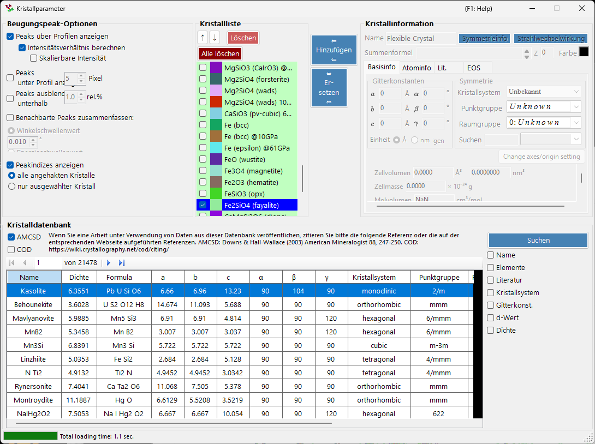

Das Fenster gliedert sich in vier Hauptbereiche.

| Bereich | Zweck |
| --- | --- |
| `Beugungspeak-Optionen` | Wie Beugungslinien angezeigt werden |
| `Kristallliste` | Eine mit dem Hauptfenster geteilte Kristall-Prüfliste |
| `Kristallinformation` | Detaillierte Parameter für den ausgewählten Kristall (in Registerkarten) |
| `Kristalldatenbank` | AMCSD-basierte Suche und Import |

---

## Beugungspeak-Optionen

Konfiguriert die Anzeige der Beugungslinien.

### Peaks über Profilen anzeigen

Legt fest, ob Beugungslinien überlagert auf den Profildaten gezeichnet werden.

### Intensitätsverhältnis berechnen {#calculate-intensity-ratio}

Legt fest, ob die Beugungsintensitäten (ihre Verhältnisse) aus den Strukturdaten berechnet werden.

!!! note
    Wenn keine Atompositionen eingegeben wurden, werden Intensitäten unabhängig vom Zustand des Kontrollkästchens nicht berechnet. Zur Eingabe der Atomdaten siehe die [Registerkarte Atominfo](#atom-info-tab).

### Skalierbare Intensität

Legt fest, ob alle Beugungslinien global skaliert werden können, ohne ihre relativen Intensitätsverhältnisse zu ändern.

### Peaks unter Profil anzeigen

Legt fest, ob Beugungspeaks unterhalb des Profils gezeichnet werden.

#### Peakhöhe

Legt die Höhe der unterhalb des Profils gezeichneten Peaks in Pixeln (`pixel`) fest.

### Benachbarte Peaks zusammenfassen

Legt fest, ob die Intensitäten von Peaks zusammengeführt werden, die zwar kristallographisch inäquivalent sind, aber nahezu identische oder exakt gleiche 2θ-Werte besitzen.

Im kubischen System sind beispielsweise die Ebenen (333) und (115) inäquivalent, besitzen jedoch exakt denselben Netzebenenabstand (d-Wert) und überlagern sich daher in der Beobachtung. Wenn dieses Kontrollkästchen aktiviert ist, können Sie ihre kombinierte Intensität anzeigen.

| Element | Beschreibung |
| --- | --- |
| `Winkelschwellenwert` | Wie nahe Peaks sein müssen, um zusammengefasst zu werden, angegeben in Grad (`°`). |
| `Energieschwellenwert` | Bei energiedispersiven Daten der Zusammenfassungsbereich, angegeben in Energie (`eV`). |

!!! tip
    Im alten Handbuch wurde der Schwellenwert in Ångström angegeben, in der aktuellen Version wird er je nach Art der horizontalen Achse in Grad (`°`) oder in Energie (`eV`) angegeben.

### Peaks ausblenden unterhalb

Legt fest, ob Peaks entfernt werden, die im Vergleich zur stärksten Reflexion zu schwach sind. Der Schwellenwert wird als Verhältnis relativ zur stärksten Linie angegeben (`rel.%`).

### Peakindizes anzeigen

Legt fest, für welche Kristalle die Indizes der Beugungslinien (Miller-Indizes) beschriftet werden.

| Option | Ziel |
| --- | --- |
| `alle angehakten Kristalle` | Jeder angehakte Kristall |
| `nur ausgewählter Kristall` | Nur der aktuell in der Liste ausgewählte Kristall |

---

## Kristallliste

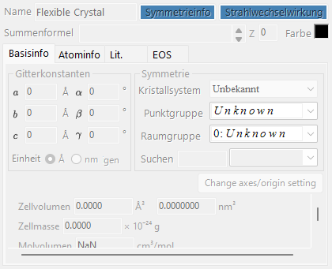

Zeigt dieselben Informationen wie die Profil-Prüfliste im Hauptfenster. Für angehakte Kristalle werden die Beugungslinien im Hauptfenster gezeichnet. Jede Zeile zeigt ein Kontrollkästchen (`Häkchen`), eine Zeichenfarbe (`Peakfarbe`) und den Kristallnamen (`Kristall`).

### Pfeil-nach-oben/-unten-Schaltflächen (↑ / ↓)

Ändern die Reihenfolge der Kristalle.

!!! note
    Die Zeilen 1 bis 6 sind für die Zustandsgleichung (EOS) reserviert und können nicht umsortiert werden. Einzelheiten siehe [Zustandsgleichung](5-equation-of-states.md).

### Hinzufügen

Fügt den im Bereich Kristallinformation rechts (siehe unten) konfigurierten Kristall als neuen Eintrag zur Liste hinzu.

### Ersetzen

Ersetzt den aktuell ausgewählten Kristall durch den im Bereich Kristallinformation rechts konfigurierten Kristall.

### Löschen

Entfernt den aktuell ausgewählten Kristall aus der Liste.

### Alle löschen

Entfernt jeden Kristall aus der Liste.

---

## Kristallinformation {#crystal-information}

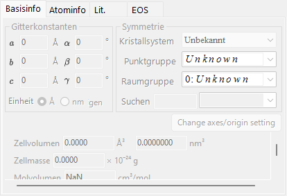

Bearbeitet und zeigt detaillierte Informationen für den ausgewählten Kristall über mehrere Registerkarten an. Die Hauptregisterkarten sind:

| Registerkarte | Inhalt |
| --- | --- |
| `Basisinfo` | Gitterparameter, Kristallsystem, Raumgruppe und weitere Basisinformationen |
| `Atominfo` | Atomarten, Besetzungen, Koordinaten und Temperaturfaktoren |
| `Lit.` | Referenzinformationen zur Quellpublikation, zu den Autoren usw. |
| `EOS` | Einstellungen der Zustandsgleichung für Kompression und thermische Ausdehnung |

### Registerkarte Basisinfo

Legt Basisinformationen wie die Gitterparameter (a, b, c, α, β, γ), das Kristallsystem und die Raumgruppe fest. Die Wahl einer Raumgruppe schränkt automatisch die bearbeitbaren Gitterparameter und die Freiheitsgrade der Atomkoordinaten ein.

!!! tip
    Ein Rechtsklick auf ein Gitterparameter-Feld zeigt ein Menü an, das die Gitterparameter auf ihre Werte beim Programmstart (oder zum Zeitpunkt des Imports der Struktur aus der Datenbank) zurücksetzt. Das ist praktisch, wenn Sie nach Änderungen durch die Anpassung zu den ursprünglichen Referenzwerten zurückkehren möchten.

### Registerkarte Atominfo {#atom-info-tab}

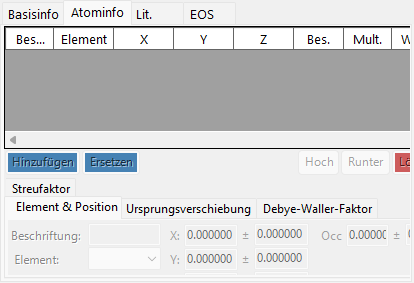

Legt für jedes Atom das Element, die Besetzung, die fraktionellen Koordinaten sowie die isotropen/anisotropen Temperaturfaktoren fest. Wenn hier Atompositionen eingegeben werden, können Beugungsintensitäten über [Intensitätsverhältnis berechnen](#calculate-intensity-ratio) berechnet werden.

### Registerkarte Lit.

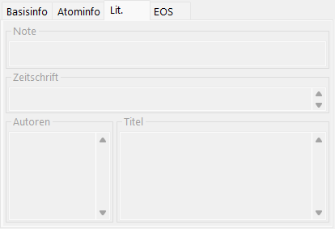

Enthält Referenzinformationen wie Titel der Publikation, Name der Zeitschrift und Autoren, die als Quelle der Kristallstruktur dienen. Aus der Kristalldatenbank importierte Strukturen haben diese Informationen automatisch ausgefüllt.

### Registerkarte EOS

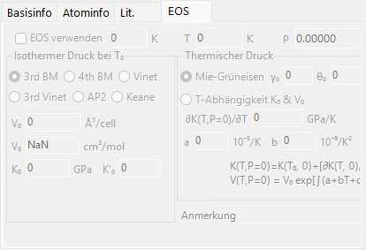

Legt die kristallspezifische Zustandsgleichung (EOS) fest, die bestimmt, wie sich die Gitterparameter mit Druck und Temperatur ändern. Die wichtigsten Eingabefelder sind:

| Feld | Beschreibung |
| --- | --- |
| `Use EOS` | Aktiviert die EOS-Druckberechnung für diesen Kristall. |
| `T0` / `Temperature` | Referenz-/Messtemperatur. |
| `V0` | Referenzvolumen der Elementarzelle. |
| `K0`, `K'0` | Isothermer Kompressionsmodul und seine Druckableitung. |
| Isotherme Form | `BM3` (Birch-Murnaghan dritter Ordnung, Standard) / `BM4` / `Vinet` / `AP2` / `Keane`. |
| Thermischer Druck | `Mie-Grüneisen` (Standard; Parameter \( \gamma_0, \theta_0, q \)) / `T-dependence K0&V0`. |

Die Formeln und Symboldefinitionen finden Sie unter [Zustandsgleichung](5-equation-of-states.md).

---

## Kristalldatenbank

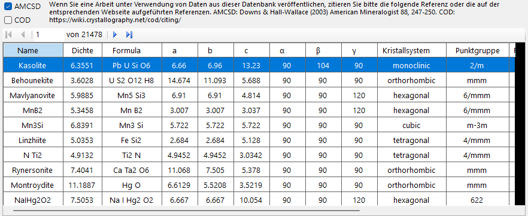

Bietet Such- und Importfunktionen für mehr als 20.000 Kristallstrukturen. Diese Datenbank basiert auf der American Mineralogist Crystal Structure Database (AMCSD).

!!! warning "Citation"
    Wenn Sie diese Kristalldaten verwenden, lesen Sie bitte <http://rruff.geo.arizona.edu/AMS/amcsd.php> sorgfältig und zitieren Sie unbedingt die folgende Referenz.

    > Downs, R.T. and Hall-Wallace, M. (2003) The American Mineralogist Crystal Structure Database. *American Mineralogist* **88**, 247-250.

### Tabelle

Listet die in der Datenbank enthaltenen Kristalle auf. Wenn Suchbedingungen eingegeben sind, werden nur die Kristalle angezeigt, die ihnen entsprechen.

Durch Auswahl eines beliebigen Kristalls in der Tabelle werden dessen Informationen an [Kristallinformation](#crystal-information) übertragen. Um ihn zur Kristallliste hinzuzufügen, drücken Sie im Bereich Kristallliste die Schaltfläche `Hinzufügen` oder `Ersetzen`.

### Suchoptionen

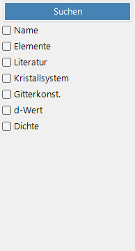

Geben Sie die Suchbedingungen ein. Drücken Sie nach der Eingabe die Schaltfläche `Suchen` oder die Eingabetaste. Jede Bedingung kann über ihr Kontrollkästchen aktiviert oder deaktiviert werden.

#### Name

Geben Sie den Kristallnamen ein.

#### Elemente

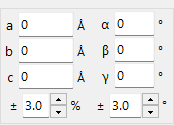

Ein Druck auf die Schaltfläche `Periodensystem` öffnet ein separates Fenster, in dem Sie die zu suchenden Elemente auswählen. Jede Element-Schaltfläche wechselt bei jedem Druck ihren Zustand.

Mit den Schaltflächen oben im Fenster lässt sich der Zustand aller Elemente auf einmal umschalten.

| Schaltfläche | Bedeutung |
| --- | --- |
| `may or not include` | Das Element kann vorhanden sein oder nicht (hebt alle Element-Einschränkungen auf). |
| `must include` | Muss enthalten sein (nur Kristalle, die alle angegebenen Elemente enthalten, bleiben erhalten). |
| `must exclude` | Muss ausgeschlossen sein (Kristalle, die eines der angegebenen Elemente enthalten, werden entfernt). |

!!! tip
    Wenn `Streufaktor ignorieren` aktiviert ist, können Sie suchen, ohne Streufaktoren zu berücksichtigen.

#### Literatur

Geben Sie den Titel der Publikation, den Namen der Zeitschrift oder den Autorennamen ein.

#### Kristallsystem

Suche durch Angabe des Kristallsystems.

#### Gitterkonst.

Geben Sie die Gitterparameter und die zulässige Toleranz ein.

#### d-Wert

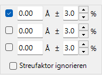

Geben Sie den d-Wert einer starken Reflexion und die zulässige Toleranz ein.

#### Dichte

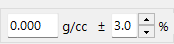

Geben Sie die Dichte und die zulässige Toleranz ein.
