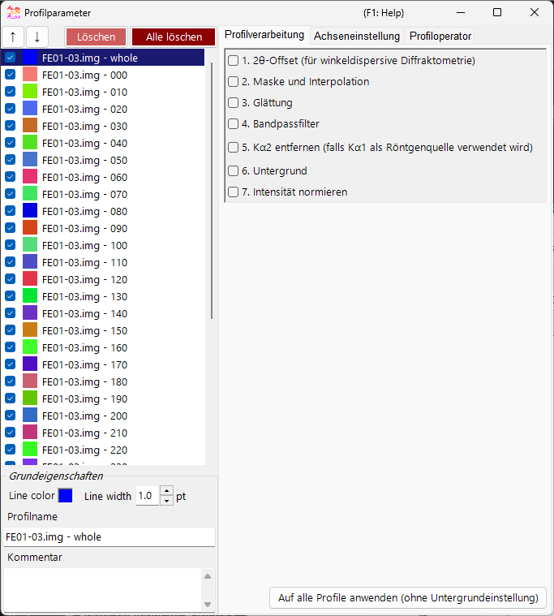
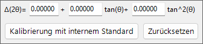
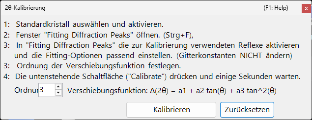
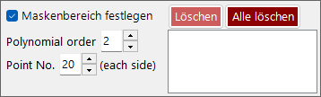
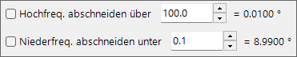
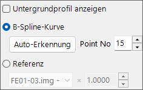
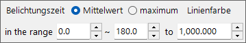

<!-- 260601Cl: migrated from legacy docx + yseto.net web manual -->
# Profilparameter

Ein Klick auf das Symbol `Profile parameter` (Profilparameter) im Hauptfenster öffnet dieses Unterfenster. Hier nehmen Sie detaillierte Einstellungen für die geladenen Profile vor und wenden verschiedene numerische Verarbeitungen an.

Die linke Seite des Fensters enthält die [Profil-Prüfliste](#profile), und die rechte Seite ist in drei Registerkartenseiten unterteilt — [Profilverarbeitung](#profile-processing), [Achseneinstellung](#axis-setting) und [Profiloperator](#profile-operator). Jeder Verarbeitungsschritt kann mit einem Kontrollkästchen ein-/ausgeschaltet werden und wird von oben nach unten in Reihenfolge angewendet.

!!! note
    Die in diesem Fenster vorgenommenen Einstellungen werden in Echtzeit auf die Profile im [Hauptfenster](1-main-window.md) übertragen. Für Einstellungen auf der Kristallseite, wie die Einheit der horizontalen Achse und die Indexbeschriftungen der Beugungslinien, siehe [Kristallparameter](3-crystal-parameter.md).

---

## Profil-Prüfliste {#profile}

Die Liste auf der linken Seite des Fensters zeigt dieselben Informationen wie die Profil-Prüfliste im Hauptfenster. Die Auswahl eines Profils in der Liste macht es zum Ziel der Verarbeitung und der Einstellungen auf der rechten Seite des Fensters.

| Element | Beschreibung |
| --- | --- |
| `↑` `↓` (Aufwärts-/Abwärtspfeil-Schaltflächen) | Ändern die Reihenfolge der Profile in der Liste. |
| `Delete` (Löschen) | Löscht das ausgewählte Profil. |
| `Delete all` (Alle löschen) | Löscht alle Profile. |

Im Bereich `Basic property` (Grundeigenschaften) unterhalb der Liste bearbeiten Sie die grundlegenden Attribute des ausgewählten Profils.

| Element | Beschreibung |
| --- | --- |
| `Line Color` (Linienfarbe) | Klicken Sie, um die Zeichenfarbe des ausgewählten Profils zu ändern. |
| `Line Width` (Linienbreite) | Legt die Linienstärke des Profils fest (`pt`). |
| `Profile Name` (Profilname) | Legt den Namen des Profils fest. |
| `Comment` (Kommentar) | Ein Kommentarfeld zur freien Eingabe. |

---

## Profilverarbeitung {#profile-processing}

Auf der Registerkarte `Profile processing` wenden Sie verschiedene numerische Verarbeitungen auf das ausgewählte Profil an. Die Schritte 1–7 können jeweils unabhängig mit einem Kontrollkästchen aktiviert werden, und die aktivierten werden in numerischer Reihenfolge angewendet.

### 1. 2θ offset {#two-theta-offset}

`1. 2θ offeset (for angle-dispersive diffractmetry)` korrigiert den Winkel winkeldispersiver Daten. Der Korrekturausdruck ist eine quadratische Funktion von \( \tan\theta \).

$$ \Delta(2\theta) = a_0 + a_1 \tan\theta + a_2 \tan^2\theta $$

Wenn das Profil ein internes Standardmaterial (eine Probe mit bekannten Gitterkonstanten) enthält, drücken Sie die Schaltfläche `Calibration using an internal standard` (Kalibrierung mit internem Standard) und folgen Sie den Meldungen; die Koeffizienten der quadratischen Funktion werden dann automatisch bestimmt. Im Kalibrierungsdialog werden beobachtete Peakpositionen den theoretischen Peakpositionen des Standards zugeordnet und die Koeffizienten angepasst.

Die Schaltfläche `Reset` setzt die von Ihnen festgelegten Offset-Koeffizienten zurück.

!!! tip
    Interne Standards sind üblicherweise Materialien mit präzise bestimmten Gitterkonstanten, wie Si oder LaB₆. Nach der Kalibrierung werden die korrigierten 2θ-Werte direkt in allen nachfolgenden Analysen verwendet.

### 2. Mask and Interpolation {#mask}

`2. Mask and Interpolation` maskiert einen angegebenen Winkelbereich (oder Energiebereich) und interpoliert das Profil unter Verwendung der Intensitäten außerhalb des maskierten Bereichs.

| Element | Beschreibung |
| --- | --- |
| `Set Masking range` (Maskenbereich festlegen) | Legt den zu maskierenden Bereich der horizontalen Achse fest. |
| `Point No.` | Legt die Anzahl der Endpunkte (je Seite) fest, die für die Interpolation verwendet werden. |
| `Polynomial order` (Polynomgrad) | Legt den Grad des für die Interpolation verwendeten Polynoms fest. |
| `Save Masking Ranges` / `Read Masking Ranges` | Speichern die konfigurierten Maskenbereiche in einer Datei oder lesen sie zurück. |
| `Delete` / `Delete all` | Löschen einen einzelnen Maskenbereich oder alle. |

### 3. Smoothing {#smoothing}

`3. Smoothing` wendet eine Glättung auf das ausgewählte Profil an. Der Glättungsalgorithmus ist die `Savitzky-Golay`-Methode.

Bei dieser Methode wird für jede betrachtete \(x\)-Position eine Anpassung nach der Methode der kleinsten Quadrate mit einem Polynom vom Grad `Order` an die Daten innerhalb von \(\pm\) `Point No.` um diesen Punkt durchgeführt, und der Wert der resultierenden Funktion \(F(x)\) wird als neue Intensität an dieser \(x\)-Position übernommen.

!!! note
    Bei `Order` \(= 1\) ist die Savitzky–Golay-Glättung äquivalent zu einem einfachen gleitenden Mittelwert. Eine Erhöhung von `Order` erhält die Peakformen besser, während eine Erhöhung von `Point No.` die Glättung verstärkt.

### 4. Bandpass filter {#bandpass}

`4. Bandpass filter` verwendet eine Fourier-Transformation (FFT), um Komponenten oberhalb oder unterhalb angegebener Frequenzen abzuschneiden.

| Element | Beschreibung |
| --- | --- |
| `Cut high-freq. over` (Hochfrequenz abschneiden) | Entfernt Komponenten mit einer höheren Frequenz als dem angegebenen Wert (reduziert Hochfrequenzrauschen). |
| `Cut low-freq. under` (Niederfrequenz abschneiden) | Entfernt Komponenten mit einer niedrigeren Frequenz als dem angegebenen Wert (entfernt einen langsam veränderlichen Untergrund). |

### 5. Remove Kα2 {#remove-ka2}

`5. Remove Kα2 (if Kα1 is used as X-ray source)`: Wenn das ausgewählte Profil mit Röntgenstrahlen gemessen wurde, bei denen Kα1 und Kα2 nicht getrennt sind, und es unter Angabe von Kα1 geladen wurde, entfernt das Aktivieren dieser Option die von Kα2 stammende Beugungsintensität.

!!! warning
    Diese Verarbeitung ist nur wirksam, wenn Kα1 als Röntgenquelle ausgewählt ist. Prüfen und stellen Sie die Einheit der horizontalen Achse und den Strahlungstyp auf der Registerkarte [Achseneinstellung](#axis-setting) ein.

### 6. Background {#background}

`6. Background` subtrahiert den Untergrund vom Profil. Es gibt zwei Methoden.

#### B-Spline curve

Ein Druck auf `Auto Detect` berechnet und subtrahiert den Untergrund automatisch. Mit `Point No.` legen Sie die maximale Anzahl der automatisch zu suchenden Untergrund-Kontrollpunkte fest.

Sie können die Kontrollpunkte auch manuell ändern. Ziehen Sie die runden Kontrollpunkte, die im Hauptfenster gezeichnet sind, mit der Maus, um eine geeignete Kurve zu erstellen.

#### Reference

Sie können ein anderes Profil als Untergrund für das ausgewählte Profil angeben. Das Aktivieren von `Show background profile` zeigt das als Untergrund verwendete Profil an.

!!! note
    Die Untergrundsubtraktion (Schritt 6) ist von der Massenanwendung ausgeschlossen, die mit der unten beschriebenen Schaltfläche `Apply for all profiles` durchgeführt wird.

### 7. Normalize intensity {#normalize}

`7. Normarize intensity` normiert das Profil so, dass der `Average` (Mittelwert) oder das `Maximum` (Maximum) über einen angegebenen Bereich der horizontalen Achse zu einer angegebenen Intensität wird.

| Element | Beschreibung |
| --- | --- |
| `Average` / `Maximum` | Wählen Sie, ob der Mittelwert oder das Maximum innerhalb des Bereichs als Referenz verwendet wird. |
| `intensity between` | Legt den Zielbereich der horizontalen Achse fest. |
| `to` | Legt den Ziel-Intensitätswert nach der Normierung fest. |

### Schaltfläche „Apply for all profiles“ {#apply-all}

Die Schaltfläche `Apply for all profiles (without background setting)` wendet die Einstellungen der Schritte 1–7, **ausgenommen 6. Background**, auf alle Profile gleichzeitig an.

---

## Achseneinstellung {#axis-setting}

Auf der Registerkarte `Axis setting` ändern Sie die Einheit der horizontalen Achse, den Strahlungstyp (einfallender Strahl) und die Energie des einfallenden Strahls des ausgewählten Profils.

| Element | Beschreibung |
| --- | --- |
| `Horizontal axis setting` (Horizontale Achse) | Ändert die aktuelle Einheit der horizontalen Achse (`horizontal unit`). Mit `Shift` können Sie auch die gesamte horizontale Achse verschieben. |
| `Exposure Time` (Belichtungszeit) | Legt die im CPS-Modus (`(for CPS mode)`) verwendete Belichtungszeit (`sec.`) fest. |
| `Vertical axis setting` (Vertikale Achse) | Einstellungen zur vertikalen Achse. |

!!! note
    Die Achseneinstellung hier ändert die physikalische Information, die das Profil selbst enthält (Einheit, Strahlungstyp, Energie). Anders als die rein anzeigebezogene Achsentransformation im Hauptfenster beeinflusst sie, wie die Daten selbst interpretiert werden. Da Strahlungstyp und Energie die Berechnung der Beugungslinienpositionen direkt beeinflussen, stellen Sie die korrekten Werte ein.

---

## Profiloperator {#profile-operator}

Auf der Registerkarte `Profile Operator` führen Sie die Mittelung mehrerer Profile und arithmetische Operationen zwischen Profilen durch.

Nachdem Sie die Zielprofile für die Berechnung und die gewünschte Operation angegeben haben, drücken Sie die Schaltfläche `Calculate`; das Ergebnis wird als neues Profil hinzugefügt.

| Modus | Beschreibung |
| --- | --- |
| `Average` | Mittelt mehrere Profile. |
| `Profile and value` | Operiert zwischen einem Profil und einem Skalarwert. |
| `Two profiles` | Führt eine arithmetische Operation (wie Addition) zwischen zwei Profilen durch. |

Mit `Output name of the profile` können Sie den Namen des erzeugten Profils angeben (der Standardwert ist `Result #01`).

!!! tip
    Dies kann beispielsweise verwendet werden, um mehrere Messungen zu mitteln und das S/N-Verhältnis zu verbessern, oder um die Differenz zweier Profile zu bilden, um die Änderung zwischen ihnen zu extrahieren.
