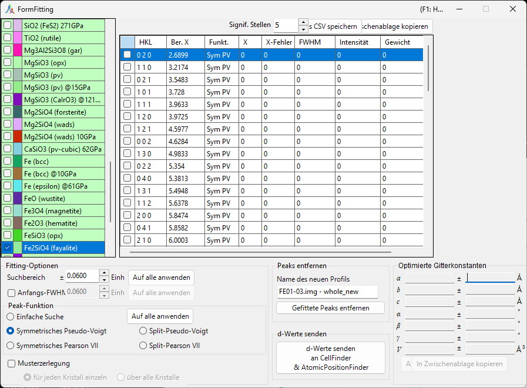
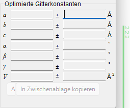
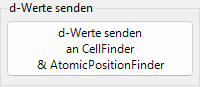
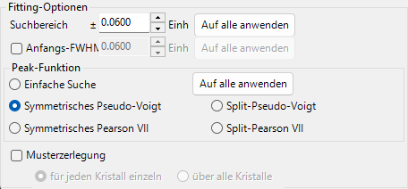
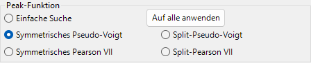
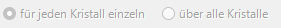
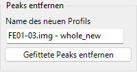
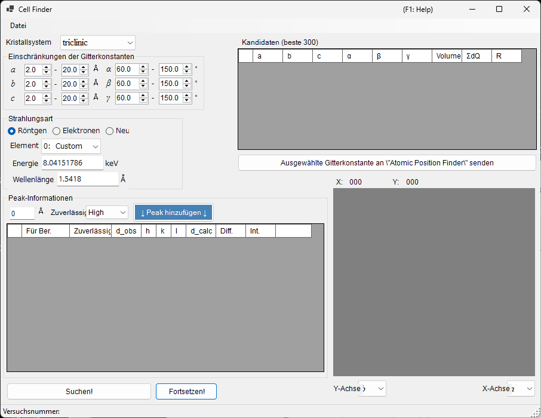
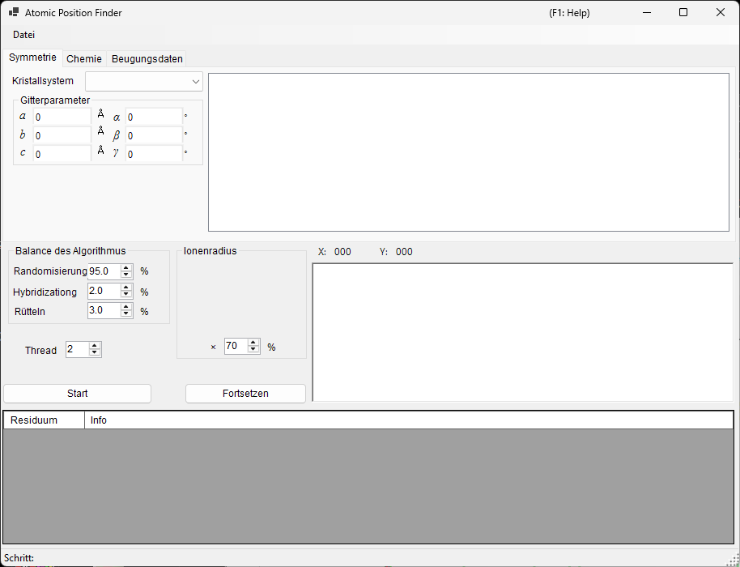

<!-- 260601Cl: migrated from legacy docx + yseto.net web manual -->
# Beugungspeak-Anpassung

Das Werkzeug `Fitting diffraction peaks` passt die Peaks eines Beugungsprofils mit einer geeigneten Funktion an, leitet aus jeder Peakposition 2θ den Netzebenenabstand (d-Wert) ab und verfeinert die Gitterkonstanten mit der Methode der kleinsten Quadrate. Es wird über die Symbolleiste des Hauptfensters gestartet.

## Grundlegender Arbeitsablauf

1. Wählen Sie in der Kristallliste den Zielkristall aus (im Multiprofil-Modus auch das Profil, mit dem Sie arbeiten möchten).
2. Ziehen Sie im Hauptfenster die Beugungslinien mit der Maus so, dass sie möglichst genau mit den gemessenen Peaks zusammenfallen.
3. Wählen Sie aus der Beugungspeak-Liste (einem Listenfeld mit Kontrollkästchen) die Indizes der Beugungslinien, die Sie anpassen möchten.
4. Sobald genügend unabhängige Indizes gewählt sind, damit die Berechnung der kleinsten Quadrate lösbar wird, erscheinen die wahrscheinlichsten Gitterkonstanten mit ihren Fehlern im Bereich `Optimized cell constants` (optimierte Gitterkonstanten) unten rechts.
5. Drücken Sie `Apply to the crystal` (Auf den Kristall anwenden), um die verfeinerten Gitterkonstanten in das Hauptprogramm zurückzuschreiben.

!!! note "Kristall prüfen und auswählen"
    Die Kristallliste spiegelt die des Hauptfensters wider. Damit die Anpassung wirksam wird, muss der Zielkristall sowohl angehakt als auch ausgewählt sein.

## Kristallliste

Die Kristallliste oben links enthält dieselben Kristalle wie das Hauptfenster. Der Kristall, den Sie hier anhaken und auswählen, wird zum Ziel der Anpassung. Siehe [Kristallparameter](3-crystal-parameter.md) für Einzelheiten.

## Beugungspeak-Liste

Hier werden die Beugungslinien des ausgewählten Kristalls aufgelistet. Das Aktivieren des Kontrollkästchens einer Zeile macht diese Beugungslinie zu einem Anpassungsziel. Die Liste enthält Spalten wie die folgenden.

| Spalte | Inhalt |
| --- | --- |
| `Check` | Ob die Linie in die Anpassung einbezogen wird |
| `PeakColor` | Anzeigefarbe |
| `Crystal` | Kristallname |
| `HKL` | Reflexionsindizes |
| `Calc X` | Berechnete Beugungslinienposition |
| `Func` | Verwendete Peak-Funktion |
| `X` | Durch Anpassung erhaltene Peakposition |
| `X Err` | Fehler der Peakposition |
| `FWHM` | Halbwertsbreite |
| `Intensity` | Peak-Intensität |
| `Weight` | Gewicht in der Anpassung nach kleinsten Quadraten |
| `R` | Residuenindex der Anpassung |

Mit den Schaltflächen unterhalb der Liste werden die Ergebnisse exportiert.

- `Copy to clipborad`: Kopiert die Tabelle in die Zwischenablage. Sie kann direkt in Excel und ähnliche Anwendungen eingefügt werden.
- `Save as CSV`: Speichert die Tabelle als `.csv`-Datei. `Effective digit` (signifikante Stellen) legt die Anzahl der Dezimalstellen fest.
- `Clear peaks`: Löscht die Anpassungsergebnisse.

## Fitting option (Fitting-Optionen)

Hier nehmen Sie die detaillierten Einstellungen vor, die beim Anpassen der Peak-Profile verwendet werden.

### Search Range / Initial FWHM

- `Search Range` (Suchbereich): Legt den Bereich fest, über den die Anpassung durchgeführt wird. Das heißt, der Bereich innerhalb von ±Search Range um die berechnete Beugungslinienposition wird als Anpassungsziel für diesen Peak genommen.
- `Initial FWHM` (anfängliche Halbwertsbreite): Gibt die anfängliche Halbwertsbreite der Profilfunktion an. Sie wird als Startwert für die Konvergenz der kleinsten Quadrate verwendet.

Durch Drücken von `Apply to all` (Auf alle anwenden) werden die aktuellen Einstellungen auf einmal auf alle Beugungslinien angewendet.

### Peak function (Peak-Funktion)

Wählt die für die Anpassung verwendete Peak-Funktion.

| Peak-Funktion | Inhalt |
| --- | --- |
| `Simple Search` | Führt keine Funktionsanpassung durch; sie erkennt den intensivsten Punkt innerhalb von ±Search Range um die berechnete Beugungslinienposition als Peakposition. |
| `Symmetric Pseudo Voigt` | Passt mit einer links-rechts-symmetrischen Pseudo-Voigt-Funktion an. |
| `Symmetric Pearson VII` | Passt mit einer links-rechts-symmetrischen Pearson-VII-Funktion an. |
| `Split Pseudo Voigt` | Passt mit einer links-rechts-asymmetrischen (Split-)Pseudo-Voigt-Funktion an. |
| `Split Pearson VII` | Passt mit einer links-rechts-asymmetrischen (Split-)Pearson-VII-Funktion an. |

!!! tip "Empfohlene Funktion"
    Sofern kein besonderer Grund dagegen spricht, wird `Symmetric Pseudo Voigt` wegen seiner überlegenen Stabilität empfohlen.

Die Pseudo-Voigt-Funktion ist eine Linearkombination einer Gauß-Funktion \(G(x)\) und einer Lorentz-Funktion \(L(x)\) mit dem Mischungsparameter \(\eta\), gegeben durch:

$$
\mathrm{pV}(x) = \eta\, L(x) + (1-\eta)\, G(x), \qquad 0 \le \eta \le 1
$$

wobei \(\eta\) der Anteil der Lorentz-Komponente ist. Die Split-Form stellt ein asymmetrisches Profil dar, indem Parameter wie die FWHM links und rechts der Peakposition unabhängig voneinander angesetzt werden.

### Pattern Decomposition (Musterzerlegung)

Wenn sich die Search Ranges von zwei oder mehr ausgewählten Beugungslinien überlappen, wählt diese Option, ob eine Musterzerlegung (gleichzeitige Anpassung der überlappenden Peaks) durchgeführt werden soll.

- `in each crystal` (für jeden Kristall einzeln): Führt die Musterzerlegung für jeden Kristall unabhängig durch.
- `between crystals` (über alle Kristalle): Führt die Musterzerlegung über alle Kristalle hinweg durch.

## Optimized cell constants (optimierte Gitterkonstanten)

Sobald genügend unabhängige Indizes gewählt sind, damit die Berechnung der kleinsten Quadrate lösbar wird, zeigt dieser Bereich die wahrscheinlichsten Gitterkonstanten \(a, b, c, \alpha, \beta, \gamma\) und das Volumen \(V\) an, jeweils mit ihrem Fehler (`±`).

!!! note "Zur NA-Anzeige"
    Wenn die Freiheitsgrade unzureichend sind – das heißt, wenn die Freiheitsgrade der Anzahl der angepassten Peaks entsprechen oder wenn eine bestimmte Gitterkonstante keine Freiheitsgrade hat – wird `NA` anstelle eines Fehlers angezeigt. Die Wahl ausreichend vieler unabhängiger Reflexe ermöglicht die Berechnung der Fehler.

- `Apply to the crystal` (Auf den Kristall anwenden): Schreibt die verfeinerten Gitterkonstanten in den ausgewählten Kristall des Hauptprogramms zurück.
- `Copy to Clipboard` (In Zwischenablage kopieren): Kopiert die optimierten Gitterkonstanten in die Zwischenablage.
- `Reset take off angle` (Take-off-Winkel zurücksetzen): Setzt den Take-off-Winkel zurück.

## Remove fitted peaks (Gefittete Peaks entfernen)

Dies subtrahiert die angepassten Peaks vom Profil und gibt das Residuenprofil als neues Profil aus. Geben Sie in `New profile name` (Name des neuen Profils) den Zielnamen ein und drücken Sie `Remove fitted peaks` (Gefittete Peaks entfernen), um die Subtraktion durchzuführen. Es ist nützlich, um den Untergrund oder die Trennung überlappender Peaks zu überprüfen.

## Verwandte Werkzeuge (Send d-values)

Durch Drücken von `Send d-values to CellFinder && AtomicPositionFinder` werden die aus der Anpassung erhaltenen d-Werte an die folgenden Analysewerkzeuge gesendet, die ebenfalls über die Symbolleiste gestartet werden können.

### Cell Finder

`Cell Finder` sucht ausgehend von einer Reihe gemessener Peakpositionen (einer Liste von d-Werten) rückwärts nach der Elementarzelle (den Gitterkonstanten), die diese Positionen erklärt. Es wird zur Indizierung unbekannter Proben verwendet.

### Atomic Position Finder

`Atomic Position Finder` sucht die Atompositionen in einer Kristallstruktur aus Größen wie den Intensitäten der beobachteten Reflexe.

!!! tip "Identifizierung einer unbekannten Probe"
    Nachdem Sie die Gitterkonstanten mit `Cell Finder` bestimmt haben, registrieren Sie diesen Kristall in der Kristallliste, und Sie können die Gitterkonstanten mit der Anpassung nach kleinsten Quadraten dieses Werkzeugs weiter verfeinern.
