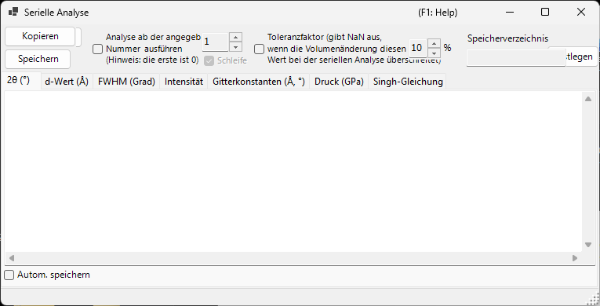
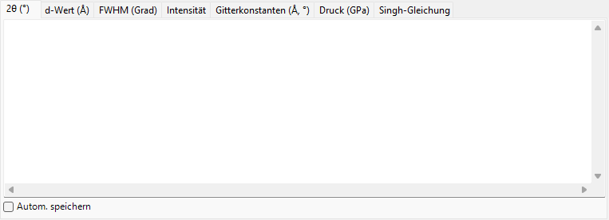
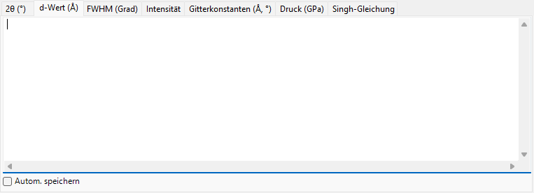
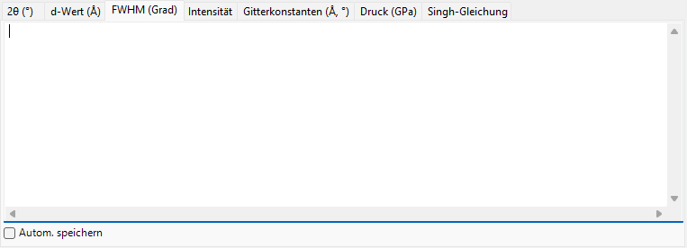
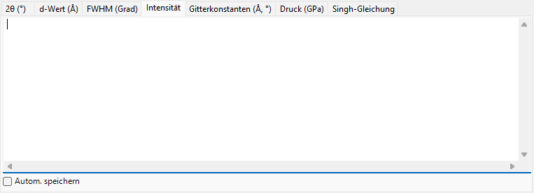
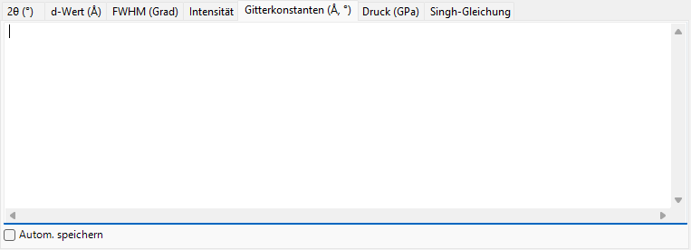
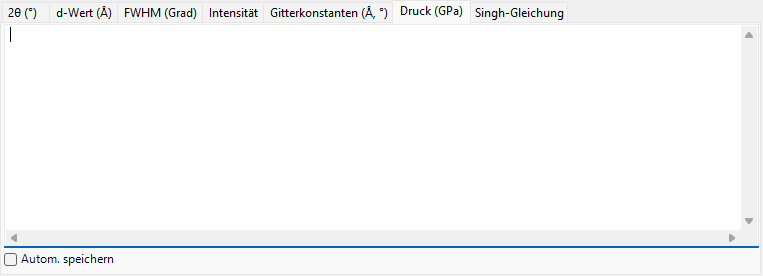
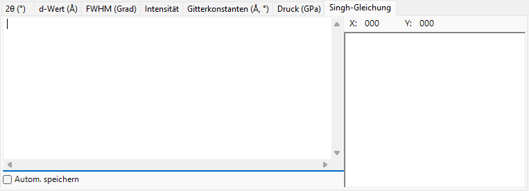

<!-- 260601Cl: migrated from legacy docx + yseto.net web manual -->
# Sequentielle Analyse

`Serielle Analyse` führt dieselbe Peak-Anpassung nacheinander über viele geladene Profile aus und sammelt die Ergebnisse nach Größe geordnet. Sie ist für eine Serie von Profilen gedacht, die aufgenommen wurden, während sich eine Bedingung wie Temperatur, Druck oder Zeit ändert: Die gesamte Serie wird auf einmal verarbeitet, und für jede Beugungslinie werden 2θ, Netzebenenabstand (d-Wert), FWHM, Intensität, Gitterkonstanten, Druck sowie die Ergebnisse der Singh-Gleichung (Analyse von einachsiger Spannung / Gitterverzerrung) jeweils auf einer eigenen Registerkarte tabelliert.

Mit der Schaltfläche `Sequentielle Analyse` in der Symbolleiste des Hauptfensters öffnen und schließen Sie dieses Fenster.

!!! note "Gemeinsam mit [Beugungspeak-Anpassung](6-fitting-diffraction-peaks.md)"
    Die sequentielle Analyse teilt ihre Anpassungseinstellungen mit dem Fenster `Fitting diffraction peaks`. Öffnen Sie zuerst das Fenster `Fitting diffraction peaks`, wählen Sie den Zielkristall aus und markieren Sie die Beugungslinien (Peaks), die Sie anpassen möchten. Sind diese nicht vorbereitet, wenn Sie `Ausführen` drücken, weist Sie eine Meldung darauf hin.

## Grundlegender Arbeitsablauf

1. Laden Sie die gesamte Serie von Profilen, die unter der sich ändernden Bedingung gemessen wurden (mindestens vier Profile sind erforderlich).
2. Öffnen Sie das Fenster [Beugungspeak-Anpassung](6-fitting-diffraction-peaks.md), wählen Sie den Zielkristall und markieren Sie die Beugungslinien, die Sie analysieren möchten. Die dort eingestellte Anpassungsfunktion und der Suchbereich werden von der sequentiellen Analyse wiederverwendet.
3. Optional können Sie die Startnummer, die Schleife, den Toleranzfaktor und die Optionen für das automatische Speichern festlegen (siehe unten).
4. Drücken Sie `Ausführen`. Jedes geladene Profil wird der Reihe nach aktiviert, eine Anpassung nach der Methode der kleinsten Quadrate wird durchgeführt, und die Ergebnisse sammeln sich auf jeder Registerkarte an.
5. Prüfen Sie jede Registerkarte und übernehmen Sie die Daten mit `Kopieren` oder `Speichern` in eine Tabellenkalkulation (Excel usw.).

Fortschritt und verstrichene Zeit werden in der Statusleiste am unteren Rand des Fensters als `... % completed.  Elapsed time: ... sec` angezeigt. Wenn die Analyse abgeschlossen ist, werden die Ergebnisse für 2θ, Netzebenenabstand (d-Wert), FWHM und Intensität gemeinsam in die Zwischenablage kopiert.

!!! tip "Zwei Anpassungen pro Profil"
    Um eine stabile Konvergenz zu erzielen, wird die Anpassung nach der Methode der kleinsten Quadrate für jedes Profil zweimal durchgeführt, bevor das Ergebnis erfasst wird.

## Analyseoptionen

Die Steuerelemente rund um die Schaltfläche `Ausführen` regeln den Analysebereich und die Behandlung von Ausreißern.

| Option | Beschreibung |
| --- | --- |
| `Analyse ab der angegebenen Nummer ausführen (Hinweis: die erste ist 0)` | Wenn aktiviert, beginnt die Analyse bei der im Feld rechts eingestellten Profilnummer statt beim ersten Profil. Das erste Profil hat die Nummer 0. |
| `Schleife` | Beim Start ab einer Nummer werden nach Erreichen des Endes auch die übersprungenen früheren Profile (0 … Start − 1) verarbeitet, mit Umlauf, sodass die gesamte Serie analysiert wird. Nur verfügbar, wenn die Startnummer aktiviert ist. |
| `Toleranzfaktor (gibt NaN aus, wenn die Volumenänderung diesen Wert bei der seriellen Analyse überschreitet)` | Wenn aktiviert, wird eine Anpassung verworfen (Ausgabe `NaN` für diese Zeile), wenn sich das verfeinerte Zellvolumen vom Anfangswert um mehr als den Wert (in %) rechts ändert. Dadurch werden Ausreißer, die durch eine fehlgeschlagene Anpassung entstehen, automatisch verworfen. |

## Ausgabe-Registerkarten

Jede Registerkarte ist eine Tabelle für eine Ausgabegröße. Jede Zeile entspricht einem Profil (dem Profilnamen), und jede Spalte entspricht einer ausgewählten Beugungslinie (hkl-Index oder `Peak No.` bei einem flexiblen Kristall). Die Tabellen werden als tabulatorgetrennter Text gehalten und beim `Kopieren` oder `Speichern` in kommagetrennte Werte (CSV) umgewandelt.

### 2θ (°)

Die angepasste Peak-Position in 2θ (Grad) für jedes Profil und jede Beugungslinie.

### d-Wert (Å)

Der Netzebenenabstand d in Å, berechnet aus jeder Peak-Position. Er wird aus der Wellenlänge und 2θ durch \( d = \dfrac{\lambda}{2\sin\theta} \) ermittelt.

### FWHM (Grad)

Die Halbwertsbreite (FWHM) jedes Peaks in 2θ-Grad, mit der Sie verfolgen können, wie sich die Peak-Breiten ändern.

### Intensität

Die integrierte Intensität (Fläche) jedes Peaks, nützlich zur Verfolgung von Intensitätsänderungen, die mit Phasenübergängen oder Texturänderungen einhergehen.

### Gitterkonstanten (Å, °)

Das verfeinerte Elementarzellvolumen `V`, die Zellkanten `A`, `B`, `C` (Å), die Achsenwinkel `Alpha`, `Beta`, `Gamma` (°) und der geschätzte Fehler jeder Größe (die `_err`-Spalten) für jedes Profil.

### Druck (GPa)

Der aus den Gitterkonstanten jedes Profils mithilfe einer [Zustandsgleichung](5-equation-of-states.md) abgeleitete Druck. Wenn im Fenster `Equation of State` ein Druckstandard wie Gold, Pt, NaCl (B1/B2), MgO, Corundum, Ar, Re, Mo oder Pb ausgewählt ist, erscheint eine Spalte pro Forscher (pro berichteter Skala). Ist kein Standard ausgewählt, wird der Druck aus der dem Zielkristall zugewiesenen Zustandsgleichung berechnet.

### Singh-Gleichung

Die Ergebnisse von Singhs Analyse von einachsiger Spannung / Gitterverzerrung. Die abschließende Zahl jedes Profilnamens wird als Azimutwinkel \( \psi \) (Grad) interpretiert, und für jeden Reflex wird die Beziehung zwischen Azimut und d-Wert nach der Methode der kleinsten Quadrate (Levenberg–Marquardt) angepasst. Für jeden Reflex ergeben sich der spannungsfreie Netzebenenabstand `d0`, der Azimut der maximalen Verzerrung `Ψmax` und eine zur Spannung proportionale Größe `t/6Ghkl` (das Verhältnis der Differenzspannung \( t \) zum Schubmodul \( G_{hkl} \)). Die angepassten Kurven werden außerdem im Diagramm auf der Registerkarte gezeichnet.

!!! note "Wann die Singh-Gleichung gilt"
    Diese Registerkarte arbeitet mit einer Serie im „Spannungsanalyse-Modus", deren Profilnamen auf `...-whole` enden. Jeder Profilname muss einen Azimutwinkel als abschließenden Bestandteil tragen (zum Beispiel `...-30`). Bei einer gewöhnlichen Serie wird diese Registerkarte nicht aktualisiert.

Der durch die Singh-Gleichung ausgedrückte azimutabhängige Netzebenenabstand lautet näherungsweise

$$ d(\psi) = d_0 \left[ 1 + \alpha - 3\,\alpha \left( 1 - \frac{\lambda^2}{4 d^2} \right) \cos^2(\psi - \psi_{\max}) \right] $$

wobei \( \alpha \) `t/6Ghkl` entspricht und \( \psi_{\max} \) der Azimut der maximalen Verzerrung ist.

## Exportieren der Ergebnisse

| Aktion | Beschreibung |
| --- | --- |
| `Kopieren` | Kopiert die aktuell angezeigte Registerkarte als CSV (kommagetrennt) in die Zwischenablage. |
| `Speichern` | Speichert die aktuell angezeigte Registerkarte als CSV-Datei (Dateiname in einem Dialog gewählt). |

### Automatisches Speichern

Jede Registerkarte hat ein Kontrollkästchen `Autom. speichern`, sodass die entsprechende Größe nach `Ausführen` automatisch in eine CSV-Datei geschrieben wird. Das Ziel wird unter `Speicherverzeichnis` angezeigt und mit der Schaltfläche `Festlegen` gewählt. Der Dateiname wird aus dem gemeinsamen Teil der Profilnamen gebildet, mit einem Suffix pro Größe: `_2theta.csv`, `_d.csv`, `_fwhm.csv`, `_intensity.csv`, `_cell.csv`, `_pressure.csv` oder `_Singh.csv`.

!!! tip "Festlegen des Zielordners"
    Ist das automatische Speichern aktiviert, aber der Zielordner nicht festgelegt (existiert nicht), öffnet sich beim Drücken von `Ausführen` ein Dialog zur Ordnerauswahl.

## Verwendung aus einem Makro

Jede Ausgabe der sequentiellen Analyse ist auch aus einem Makro (Python-Skript) verfügbar. Diese entsprechen der Klasse `PDI.Sequential` in [Makro](8-macro.md).

| Makrofunktion | Zugehörige Registerkarte |
| --- | --- |
| `PDI.Sequential.Open()` / `Close()` | Fenster öffnen / schließen |
| `PDI.Sequential.Execute()` | Sequentielle Analyse ausführen |
| `PDI.Sequential.GetCSV_2theta()` | 2θ |
| `PDI.Sequential.GetCSV_D()` | d-Wert |
| `PDI.Sequential.GetCSV_FWHM()` | FWHM |
| `PDI.Sequential.GetCSV_Intensity()` | Intensität |
| `PDI.Sequential.GetCSV_CellConstants()` | Gitterkonstanten |
| `PDI.Sequential.GetCSV_Pressure()` | Druck |
| `PDI.Sequential.GetCSV_Singh()` | Singh-Gleichung |

Jede `GetCSV_...()` gibt die zugehörige Registerkarte als CSV-String zurück. `PDI.Sequential.Directory` liest/setzt den Zielordner, und in Kombination mit `PDI.File.SaveText(...)` werden die Ergebnisse in Dateien geschrieben. Siehe [Makro](8-macro.md) für Einzelheiten.
