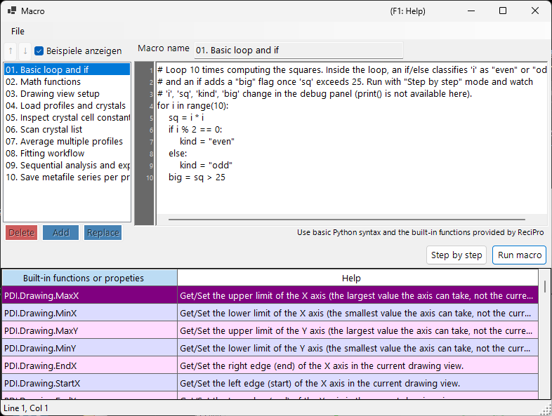

<!-- 260601Cl: migrated from legacy docx + yseto.net web manual -->
# Makro

Die meisten Operationen in PDIndexer lassen sich mit der **Makro**-Funktion automatisieren. Makros sind Python-Skripte, die in [IronPython](https://ironpython.net/) (einer Python-Implementierung, die auf .NET läuft) geschrieben und in einem eigenen Makro-Editor-Fenster bearbeitet und ausgeführt werden. Verwenden Sie sie, um wiederkehrende Aufgaben zu automatisieren, mehrere Dateien stapelweise zu verarbeiten und Ergebnisse in großen Mengen als CSV- oder Bilddateien zu exportieren.



!!! note "Grundkenntnisse in Python"
    Makros akzeptieren die Standard-Python-Syntax (`for`-Schleifen, `if`/`else`, Listen, Funktionen usw.) direkt. Diese Seite erklärt die Sprache Python selbst nicht. Die PDIndexer-spezifische Funktionalität wird über das unten beschriebene `PDI`-Objekt aufgerufen.

## Den Makro-Editor öffnen

Wählen Sie in der Menüleiste des Hauptfensters **Makro → Editor**, um das Makro-Editor-Fenster (mit dem Titel `Macro`) zu öffnen.

Im Editor erstellte und gespeicherte Makros werden außerdem mit ihrem Namen im Menü **Makro** aufgelistet, sodass Sie sie direkt aus dem Menü ausführen können. Die Makroliste wird beim Beenden von PDIndexer automatisch gespeichert und beim nächsten Start wiederhergestellt.

## Aufbau des Editor-Fensters

Das Editor-Fenster besteht aus den folgenden Bereichen.

| Bereich | Beschreibung |
| --- | --- |
| Makroliste (links) | Eine Liste der gespeicherten Makronamen. Klicken Sie auf einen Eintrag, um dieses Makro in den Editor rechts zu laden. |
| Code-Editor (Mitte) | Der Bereich, in dem Sie das Python-Skript eingeben. Er unterstützt eine Zeilennummern-Leiste, automatisches Einrücken, Eingabevervollständigung (Autovervollständigung) und Funktions-Tooltips. |
| Funktionsreferenztabelle | Eine Tabelle aller unter `PDI` verfügbaren Funktionen. Doppelklicken Sie auf eine Zelle, um diesen Funktionsnamen an der Cursorposition in den Code einzufügen. |
| Debug-Panel (rechts) | Zeigt die Variablennamen und -werte am aktuellen Punkt während der Schrittausführung an. |
| Statusleiste | Zeigt die aktuelle Cursorposition (`Line` / `Col`) an. |

### Schaltflächen zur Listenbearbeitung

Verwenden Sie die folgenden Schaltflächen, um die Makroliste zu bearbeiten.

| Schaltfläche | Aktion |
| --- | --- |
| `Add` | Fügt den aktuellen Code unter dem im Namensfeld eingegebenen Namen zur Liste hinzu (fordert zum Überschreiben auf, falls der Name bereits existiert). |
| `Replace` | Ersetzt das in der Liste ausgewählte Makro durch den aktuellen Code. |
| `Delete` | Entfernt das ausgewählte Makro aus der Liste. |
| `↑` / `↓` | Verschiebt das ausgewählte Makro innerhalb der Liste nach oben oder unten. |
| `Show samples` | Schaltet die Anzeige der integrierten Beispielmakros um (siehe unten). |

!!! tip "Speichern und Laden"
    Makros können in einzelnen `.mcr`-Dateien gespeichert und daraus geladen werden. Ziehen Sie eine `.mcr`-Datei per Drag-and-drop auf das Editor-Fenster, um ihren Inhalt zu laden. Das Drücken von `Ctrl+S` nach dem Bearbeiten überschreibt das aktuell ausgewählte Makro.

## Ein Makro ausführen

Führen Sie das Makro über die Schaltflächen am unteren Rand des Code-Editors aus.

| Schaltfläche | Aktion |
| --- | --- |
| `Run macro` | Führt das Makro normal vollständig durch. |
| `Step by step` | Führt das Makro Zeile für Zeile aus. Es hält vor jeder Zeile an und zeigt die aktuellen Variablenwerte im Debug-Panel rechts an. |
| `Next step (F10)` | Geht während der Schrittausführung zur nächsten Zeile weiter (die Taste `F10` funktioniert ebenfalls). |
| `Stop` | Bricht die Ausführung ab. Der Abbruch ist nur während der Ausführung im Modus `Step by step` wirksam. |

!!! warning "print() ist nicht verfügbar"
    Der Makro-Editor besitzt keine Standardausgabe-Konsole, daher wird die Ausgabe von `print()` nicht angezeigt. Um Variablenwerte zu überprüfen, führen Sie das Makro im Modus `Step by step` aus und beobachten Sie die Wertänderungen im Debug-Panel.

### Beispielmakros

Wenn Sie die Schaltfläche `Show samples` aktivieren, werden die integrierten Beispielmakros in der Liste angezeigt (schreibgeschützt). Die Beispiele werden in der aktuellen UI-Sprache (Englisch/Japanisch) angezeigt. Verwenden Sie sie als Referenz, wenn Sie eigene Makros schreiben. Die integrierten Beispiele sind:

| Name | Inhalt |
| --- | --- |
| 01. Basic loop and if | Grundlagen von `for`-Schleifen und `if`/`else` |
| 02. Math functions | Verwendung des Moduls `math` (`pi`, `sin`, `sqrt`, `exp`, `log` usw.) |
| 03. Drawing view setup | Festlegen des Anzeigebereichs mit `PDI.Drawing.SetBounds` |
| 04. Load profiles and crystals | `PDI.File.ReadProfiles` / `ReadCrystals` |
| 05. Inspect crystal cell constants | Auslesen von Gitterkonstanten, Volumen und Druck über `PDI.Crystal` |
| 06. Scan crystal list | Schleife über alle Einträge von `PDI.CrystalList` |
| 07. Average multiple profiles | `PDI.ProfileOperator.Average` |
| 08. Fitting workflow | Eine vollständige `PDI.Fitting`-Sequenz |
| 09. Sequential analysis and export | Ausführen von `PDI.Sequential` und Exportieren als CSV |
| 10. Save metafile series per profile | Stapelweises Speichern je einer EMF pro Profil |

!!! note "Das Modul math ist vorab importiert"
    `import math` wird beim Start des Editors automatisch ausgeführt, sodass Sie das Modul `math` direkt verwenden können, z. B. `math.sqrt(2)`, ohne eine explizite `import`-Anweisung.

---

## Funktionsreferenz

Die gesamte PDIndexer-spezifische Funktionalität wird über die Klassen unterhalb des Wurzelobjekts `PDI` aufgerufen. `PDI` ist im Makro-Gültigkeitsbereich bereits verfügbar, sodass kein `import` erforderlich ist.

Jede der folgenden Tabellen ist aus den `[Help]`-Attributen im Quellcode übernommen. Dieselbe Liste erscheint in der Funktionsreferenztabelle innerhalb des Editor-Fensters sowie in [Abschnitt 6 des Web-Handbuchs](https://yseto.net/soft/pdi/pdi_06).

!!! note "Notation"
    In der Signaturspalte bezeichnet `(get/set)` eine les- und schreibbare Eigenschaft und `(get)` eine schreibgeschützte Eigenschaft. Ein Argument mit `= value` ist ein Standardargument und kann weggelassen werden.

### PDI (Wurzel)

| Mitglied | Signatur | Beschreibung |
| --- | --- | --- |
| `Sleep` | `Sleep(int millisec)` | Pausiert die Makroausführung für die angegebene Anzahl von Millisekunden. |
| `Obj` | `Obj (get/set)` | Ruft Objekte ab bzw. setzt sie, die von einem anderen Programm übergeben wurden (prozessübergreifende Argumente). |

### PDI.File — Datei-Ein-/Ausgabe

| Mitglied | Signatur | Beschreibung |
| --- | --- | --- |
| `GetDirectoryPath` | `GetDirectoryPath(string filename = "")` | Ruft einen Verzeichnispfad ab (mit abschließendem Backslash). Wird `filename` weggelassen, öffnet sich ein Ordnerauswahldialog. Andernfalls wird der Verzeichnisanteil von `filename` zurückgegeben. |
| `GetFileName` | `GetFileName()` | Öffnet einen Dateiauswahldialog und gibt den vollständigen Pfad der gewählten Datei zurück. Gibt eine leere Zeichenkette zurück, wenn der Benutzer abbricht. |
| `GetFileNames` | `GetFileNames()` | Öffnet einen Dateidialog mit Mehrfachauswahl und gibt die vollständigen Pfade der gewählten Dateien zurück. Gibt ein leeres Array zurück, wenn der Benutzer abbricht. |
| `ReadProfiles` | `ReadProfiles(string filename)` | Liest Profildaten aus der angegebenen Datei. Wird `filename` weggelassen (oder existiert nicht), öffnet sich ein Dateiauswahldialog. |
| `SaveProfiles` | `SaveProfiles(string filename)` | Speichert Profildaten in die angegebene Datei. Wird `filename` weggelassen, öffnet sich ein Speicherdialog. |
| `ReadCrystals` | `ReadCrystals(string filename)` | Liest Kristalldaten aus der angegebenen Datei. Wird `filename` weggelassen (oder existiert nicht), öffnet sich ein Dateiauswahldialog. |
| `SaveCrystals` | `SaveCrystals(string filename)` | Speichert Kristalldaten in die angegebene Datei. Wird `filename` weggelassen, öffnet sich ein Speicherdialog. |
| `SaveMetafile` | `SaveMetafile(string filename)` | Speichert das aktuelle Muster als Windows-Metafile (`.emf`). Wird `filename` weggelassen, öffnet sich ein Speicherdialog. |
| `SaveText` | `SaveText(string text, string filename)` | Speichert den angegebenen Textinhalt in eine `.txt`-Datei. Wird `filename` weggelassen, öffnet sich ein Speicherdialog. |

### PDI.Drawing — Zeichenansicht

| Mitglied | Signatur | Beschreibung |
| --- | --- | --- |
| `MaxX` | `MaxX (get/set)` | Ruft die Obergrenze der X-Achse ab bzw. setzt sie (der größte Wert, den die Achse annehmen kann, nicht die aktuelle Ansicht). |
| `MinX` | `MinX (get/set)` | Ruft die Untergrenze der X-Achse ab bzw. setzt sie (der kleinste Wert, den die Achse annehmen kann, nicht die aktuelle Ansicht). |
| `MaxY` | `MaxY (get/set)` | Ruft die Obergrenze der Y-Achse ab bzw. setzt sie (der größte Wert, den die Achse annehmen kann, nicht die aktuelle Ansicht). |
| `MinY` | `MinY (get/set)` | Ruft die Untergrenze der Y-Achse ab bzw. setzt sie (der kleinste Wert, den die Achse annehmen kann, nicht die aktuelle Ansicht). |
| `EndX` | `EndX (get/set)` | Ruft den rechten Rand (das Ende) der X-Achse in der aktuellen Zeichenansicht ab bzw. setzt ihn. |
| `StartX` | `StartX (get/set)` | Ruft den linken Rand (den Anfang) der X-Achse in der aktuellen Zeichenansicht ab bzw. setzt ihn. |
| `EndY` | `EndY (get/set)` | Ruft den oberen Rand (das Ende) der Y-Achse in der aktuellen Zeichenansicht ab bzw. setzt ihn. |
| `StartY` | `StartY (get/set)` | Ruft den unteren Rand (den Anfang) der Y-Achse in der aktuellen Zeichenansicht ab bzw. setzt ihn. |
| `SetBounds` | `SetBounds(double startX, double endX, double startY, double endY)` | Legt die Zeichenansicht durch Angabe der vier Ränder (StartX, EndX, StartY, EndY) fest. |

### PDI.Crystal — Ausgewählter Kristall

Die Gitterkonstanten `CellA`–`CellC` sind in \( \mathrm{\AA} \) angegeben, und `CellAlpha`–`CellGamma` in Grad (deg).

| Mitglied | Signatur | Beschreibung |
| --- | --- | --- |
| `CellVolume` | `CellVolume (get)` | Ruft das Zellvolumen (\( \mathrm{\AA}^3 \)) des ausgewählten Kristalls ab. Gibt 0 zurück, wenn kein Kristall ausgewählt ist. |
| `Pressure` | `Pressure(double volume = 0)` | Ruft den aus der EOS berechneten Druck (GPa) des ausgewählten Kristalls ab. Ist `volume` gleich 0 (Standard), wird das aktuelle Zellvolumen verwendet. |
| `Name` | `Name (get/set)` | Ruft den Namen des ausgewählten Kristalls ab bzw. setzt ihn. |
| `CellA` | `CellA (get/set)` | Ruft die Gitterkonstante a (\( \mathrm{\AA} \)) des ausgewählten Kristalls ab bzw. setzt sie. |
| `CellB` | `CellB (get/set)` | Ruft die Gitterkonstante b (\( \mathrm{\AA} \)) des ausgewählten Kristalls ab bzw. setzt sie. |
| `CellC` | `CellC (get/set)` | Ruft die Gitterkonstante c (\( \mathrm{\AA} \)) des ausgewählten Kristalls ab bzw. setzt sie. |
| `CellAlpha` | `CellAlpha (get/set)` | Ruft die Gitterkonstante alpha (deg) des ausgewählten Kristalls ab bzw. setzt sie. |
| `CellBeta` | `CellBeta (get/set)` | Ruft die Gitterkonstante beta (deg) des ausgewählten Kristalls ab bzw. setzt sie. |
| `CellGamma` | `CellGamma (get/set)` | Ruft die Gitterkonstante gamma (deg) des ausgewählten Kristalls ab bzw. setzt sie. |

### PDI.CrystalList — Kristallliste

| Mitglied | Signatur | Beschreibung |
| --- | --- | --- |
| `Open` | `Open()` | Öffnet das Fenster „Crystal List“. |
| `Close` | `Close()` | Schließt das Fenster „Crystal List“. |
| `Count` | `Count (get)` | Ruft die Gesamtzahl der Kristalle in der Liste ab. |
| `SelectedName` | `SelectedName (get)` | Ruft den Namen des aktuell ausgewählten Kristalls ab. Gibt eine leere Zeichenkette zurück, wenn kein Kristall ausgewählt ist. |
| `SelectedIndex` | `SelectedIndex (get/set)` | Ruft den Index des aktuell ausgewählten Kristalls ab bzw. setzt ihn. |
| `Select` | `Select(int index)` | Wählt den Kristall am angegebenen Index aus. |
| `Check` | `Check(int index = -1, bool state = true)` | Aktiviert oder deaktiviert das Häkchen des Kristalls am angegebenen Index. Ist `index` gleich -1, wird der aktuell ausgewählte Kristall verwendet. |
| `Uncheck` | `Uncheck(int index = -1)` | Deaktiviert das Häkchen des Kristalls am angegebenen Index. Ist `index` gleich -1, wird das Häkchen des aktuell ausgewählten Kristalls deaktiviert. |
| `GetCellVolume` | `GetCellVolume (get)` | Ruft das Zellvolumen (\( \mathrm{\AA}^3 \)) des ausgewählten Kristalls ab. Identisch mit `PDI.Crystal.CellVolume`; aus Gründen der Abwärtskompatibilität beibehalten. |

### PDI.Profile — Ausgewähltes Profil

| Mitglied | Signatur | Beschreibung |
| --- | --- | --- |
| `Comment` | `Comment (get/set)` | Ruft den Kommentartext des aktuell ausgewählten Profils ab bzw. setzt ihn. |
| `Name` | `Name (get/set)` | Ruft den Anzeigenamen des aktuell ausgewählten Profils ab bzw. setzt ihn. |

### PDI.ProfileOperator — Profilarithmetik

Jedes Profil wird über seinen Index in der Liste angegeben. `output` ist der Name, der dem resultierenden Profil gegeben wird.

| Mitglied | Signatur | Beschreibung |
| --- | --- | --- |
| `Average` | `Average(int[] indices, string output)` | Berechnet den Mittelwert der Profile, deren Indizes in `indices` aufgeführt sind (z. B. `[1,3,5,9]`). `output` ist der Name, der dem resultierenden Profil gegeben wird. |
| `AddTwoProfiles` | `AddTwoProfiles(int index1, int index2, string output)` | Berechnet profile1 + profile2. Jedes Profil wird über seinen Index angegeben. `output` ist der Name, der dem resultierenden Profil gegeben wird. |
| `SubtractTwoProfiles` | `SubtractTwoProfiles(int index1, int index2, string output)` | Berechnet profile1 − profile2. Jedes Profil wird über seinen Index angegeben. `output` ist der Name, der dem resultierenden Profil gegeben wird. |
| `MultiplyTwoProfiles` | `MultiplyTwoProfiles(int index1, int index2, string output)` | Berechnet profile1 × profile2. Jedes Profil wird über seinen Index angegeben. `output` ist der Name, der dem resultierenden Profil gegeben wird. |
| `DivideTwoProfiles` | `DivideTwoProfiles(int index1, int index2, string output)` | Berechnet profile1 ÷ profile2. Jedes Profil wird über seinen Index angegeben. `output` ist der Name, der dem resultierenden Profil gegeben wird. |

### PDI.ProfileList — Profilliste

| Mitglied | Signatur | Beschreibung |
| --- | --- | --- |
| `Open` | `Open()` | Öffnet das Fenster „Profile List“. |
| `Close` | `Close()` | Schließt das Fenster „Profile List“. |
| `DeleteAll` | `DeleteAll()` | Löscht alle Profile aus der Liste (ohne Bestätigungsdialog). |
| `Delete` | `Delete(int index)` | Löscht das Profil am angegebenen Index. |
| `Count` | `Count (get)` | Ruft die Gesamtzahl der Profile in der Liste ab. |
| `SelectedName` | `SelectedName (get)` | Ruft den Namen des aktuell ausgewählten Profils ab. Gibt eine leere Zeichenkette zurück, wenn kein Profil ausgewählt ist. |
| `SelectedIndex` | `SelectedIndex (get/set)` | Ruft den Index des aktuell ausgewählten Profils ab bzw. setzt ihn. |
| `Select` | `Select(int index)` | Wählt das Profil am angegebenen Index aus. |
| `Check` | `Check(int index = -1, bool state = true)` | Aktiviert oder deaktiviert das Häkchen des Profils am angegebenen Index. Ist `index` gleich -1, wird das aktuell ausgewählte Profil verwendet. |
| `Uncheck` | `Uncheck(int index = -1)` | Deaktiviert das Häkchen des Profils am angegebenen Index. Ist `index` gleich -1, wird das Häkchen des aktuell ausgewählten Profils deaktiviert. |
| `CheckAll` | `CheckAll()` | Aktiviert das Häkchen jedes Profils in der Liste. |
| `UncheckAll` | `UncheckAll()` | Deaktiviert das Häkchen jedes Profils in der Liste. |

### PDI.Fitting — Peak-Anpassung

Bedient das Fenster [Beugungspeak-Anpassung](6-fitting-diffraction-peaks.md).

| Mitglied | Signatur | Beschreibung |
| --- | --- | --- |
| `Open` | `Open()` | Öffnet das Fenster „Fitting peaks“. |
| `Close` | `Close()` | Schließt das Fenster „Fitting peaks“. |
| `Apply` | `Apply()` | Wendet die optimierten Gitterkonstanten auf den ausgewählten Kristall an (entspricht dem Klicken auf die Schaltfläche `Confirm` im Anpassungsfenster). |
| `Check` | `Check(int index = -1, bool state = true)` | Aktiviert oder deaktiviert das Häkchen der Gitterebene am angegebenen Index. Ist `index` gleich -1, wird die aktuell ausgewählte Ebene verwendet. |
| `Uncheck` | `Uncheck(int index = -1)` | Deaktiviert das Häkchen der Gitterebene am angegebenen Index. Ist `index` gleich -1, wird das Häkchen der aktuell ausgewählten Ebene deaktiviert. |
| `Select` | `Select(int index)` | Wählt die Gitterebene am angegebenen Index aus. |
| `SelectedIndex` | `SelectedIndex (get/set)` | Ruft den Index der aktuell ausgewählten Gitterebene ab bzw. setzt ihn. |
| `Range` | `Range(double range)` | Legt den Peak-Suchbereich für die aktuell ausgewählte Gitterebene fest (in derselben Einheit wie die X-Achse). |

### PDI.Sequential — Sequentielle Analyse

Bedient das Fenster [Sequentielle Analyse](7-sequential-analysis.md). Die CSV-Getter geben die Ergebnisse der zuletzt durchgeführten sequentiellen Analyse als CSV-Zeichenkette zurück.

| Mitglied | Signatur | Beschreibung |
| --- | --- | --- |
| `Directory` | `Directory (get/set)` | Ruft den vollständigen Verzeichnispfad ab bzw. setzt ihn, in dem die Ergebnisse der sequentiellen Analyse gespeichert werden. |
| `Open` | `Open()` | Öffnet das Fenster „Sequential Analysis“. |
| `Close` | `Close()` | Schließt das Fenster „Sequential Analysis“. |
| `Execute` | `Execute()` | Führt die sequentielle Analyse für alle markierten Profile aus. |
| `GetCSV_2theta` | `GetCSV_2theta()` | Ruft die 2-theta-Ergebnisse der zuletzt durchgeführten sequentiellen Analyse als CSV-Zeichenkette ab. |
| `GetCSV_D` | `GetCSV_D()` | Ruft die Netzebenenabstand-Ergebnisse (d-Wert) der zuletzt durchgeführten sequentiellen Analyse als CSV-Zeichenkette ab. |
| `GetCSV_FWHM` | `GetCSV_FWHM()` | Ruft die FWHM-Ergebnisse der zuletzt durchgeführten sequentiellen Analyse als CSV-Zeichenkette ab. |
| `GetCSV_Intensity` | `GetCSV_Intensity()` | Ruft die Peak-Intensitäts-Ergebnisse der zuletzt durchgeführten sequentiellen Analyse als CSV-Zeichenkette ab. |
| `GetCSV_CellConstants` | `GetCSV_CellConstants()` | Ruft die Gitterkonstanten-Ergebnisse der zuletzt durchgeführten sequentiellen Analyse als CSV-Zeichenkette ab. |
| `GetCSV_Pressure` | `GetCSV_Pressure()` | Ruft die Druck-Ergebnisse der zuletzt durchgeführten sequentiellen Analyse als CSV-Zeichenkette ab. |
| `GetCSV_Singh` | `GetCSV_Singh()` | Ruft die Ergebnisse der Singh-Gleichung der zuletzt durchgeführten sequentiellen Analyse als CSV-Zeichenkette ab. |
| `AutoSave2theta` | `AutoSave2theta (get/set)` | Ruft ab bzw. setzt, ob die 2-theta-Ergebnisse nach jedem Lauf der sequentiellen Analyse automatisch gespeichert werden. |
| `AutoSaveDspacing` | `AutoSaveDspacing (get/set)` | Ruft ab bzw. setzt, ob die Netzebenenabstand-Ergebnisse (d-Wert) nach jedem Lauf der sequentiellen Analyse automatisch gespeichert werden. |
| `AutoSaveFWHM` | `AutoSaveFWHM (get/set)` | Ruft ab bzw. setzt, ob die FWHM-Ergebnisse nach jedem Lauf der sequentiellen Analyse automatisch gespeichert werden. |
| `AutoSaveIntensity` | `AutoSaveIntensity (get/set)` | Ruft ab bzw. setzt, ob die Peak-Intensitäts-Ergebnisse nach jedem Lauf der sequentiellen Analyse automatisch gespeichert werden. |
| `AutoSaveCellConstants` | `AutoSaveCellConstants (get/set)` | Ruft ab bzw. setzt, ob die Gitterkonstanten-Ergebnisse nach jedem Lauf der sequentiellen Analyse automatisch gespeichert werden. |
| `AutoSavePressure` | `AutoSavePressure (get/set)` | Ruft ab bzw. setzt, ob die Druck-Ergebnisse nach jedem Lauf der sequentiellen Analyse automatisch gespeichert werden. |
| `AutoSaveSingh` | `AutoSaveSingh (get/set)` | Ruft ab bzw. setzt, ob die Ergebnisse der Singh-Gleichung nach jedem Lauf der sequentiellen Analyse automatisch gespeichert werden. |

## Makro-Beispiel

Als eines der integrierten Beispiele folgt hier ein Makro, das die sequentielle Analyse ausführt und die Ergebnisse als CSV speichert.

```python
# Check all profiles, run sequential analysis, then obtain 2-theta / d-spacing /
# cell-constant / pressure results as CSV strings and save each to a file.
PDI.ProfileList.CheckAll()
PDI.Sequential.Open()
PDI.Sequential.Execute()
dir_path = PDI.File.GetDirectoryPath()
PDI.File.SaveText(PDI.Sequential.GetCSV_2theta(),        dir_path + "seq_2theta.csv")
PDI.File.SaveText(PDI.Sequential.GetCSV_D(),             dir_path + "seq_d.csv")
PDI.File.SaveText(PDI.Sequential.GetCSV_CellConstants(), dir_path + "seq_cell.csv")
PDI.File.SaveText(PDI.Sequential.GetCSV_Pressure(),      dir_path + "seq_pressure.csv")
```

Die übrigen Beispiele können Sie über die Schaltfläche `Show samples` im Editor durchsehen.
