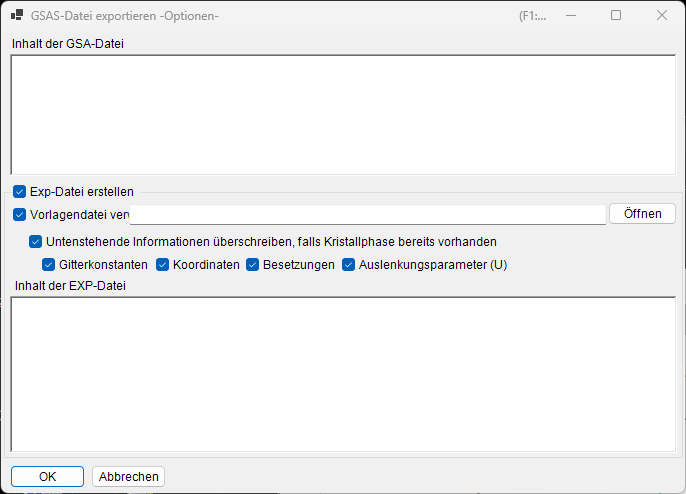

<!-- 260601Cl: migrated from legacy docx + yseto.net web manual -->
# Dateiformate

Die Dateien, die PDIndexer liest und schreibt, lassen sich in drei Gruppen einteilen: **Profildaten**, **Kristalllisten / Kristallstrukturen** und **Zeichnungsausgabe**. Alle diese Ein-/Ausgabevorgänge werden über das Menü **Datei** des [Hauptfensters](../1-main-window.md) aufgerufen.

Diese Seite fasst die unterstützten Erweiterungen, die Ein-/Ausgaberichtung und Hinweise in Tabellenform zusammen.

---

## Profildaten

### Lesen (Read profile(s))

Über **Datei → Profil(e) lesen (Read profile(s))** können Sie mehrere Dateien auf einmal laden. Neben PDIndexers eigenem Format `pdi` / `pdi2` werden verschiedene Winkel-gegen-Intensität- (oder Energie-gegen-Intensität-) Text- und Binärformate unterstützt, etwa das `csv` von WinPIP, das `chi` von Fit2D und das `ras` von Rigaku. Auch nicht in der folgenden Liste aufgeführte Formate lassen sich meist lesen: jede einfache Winkel-gegen-Intensität-Textdatei greift auf einen generischen Parser zurück.

| Erweiterung | Herkunft / Format | Hinweise |
| --- | --- | --- |
| `pdi` / `pdi2` | Natives PDIndexer-Format | Hält das Profil zusammen mit den zugehörigen Informationen (Strahlungsquelle, Wellenlänge, Belichtungszeit usw.) bereit. `pdi2` ist die aktuelle Version. Beim Lesen dieser Dateien wird der Datenkonverter-Dialog nicht angezeigt. |
| `csv` | WinPIP-Ausgabe (kommagetrennt: `angle,intensity`) | Wird über den Datenkonverter-Dialog importiert, in dem Sie die Bedeutung der horizontalen Achse, die Strahlungsquelle und die Wellenlänge angeben. |
| `tsv` | Tabulatorgetrennt (`angle` `[TAB]` `intensity`) | Wird als generischer Text importiert. |
| `chi` | Fit2D-Ausgabe | Die führenden Kopfzeilen werden übersprungen; die Spalten 2 und 4 der vierspaltigen Daten werden als Winkel und Intensität übernommen. |
| `ras` | Rigaku-Format | Textformat, das auch Geräteinformationen enthält. |
| `nxs` | NeXus / HDF5 (SSD, mehrere Detektoren) | Kann mehrere Kanäle (Histogramme) enthalten; jeder wird einzeln energiekalibriert und importiert. |
| `npd` | EDX-Profil (SSD) | Liest `EGC0/1/2`, `2Theta`, `Live time` usw. aus dem Header und wandelt die Kanalnummer in Energie um. |
| `xbm` | EDX-Binärformat (z. B. SP-8 BL04B2) | Metadaten wie Probenname, Messbedingungen und EGC-Kalibrierkoeffizienten werden als Kommentar importiert. |
| `rpt` | Genie-Format (SSD) | Liest Abnahmewinkel, Belichtungszeit und EGC aus dem Header. |
| `xy` | pyFAI-kalibrierter zweispaltiger Text | Liest die Wellenlänge aus dem Header und importiert Winkel gegen Intensität. |
| `gsa` | GSAS-Daten (`BANK`-Block) | Importiert die drei Spalten: Winkel, Intensität, Fehler. |
| Sonstige | Generischer Winkel-gegen-Intensität-Text | Das Trennzeichen Komma / Leerraum / Tabulator wird automatisch erkannt (über den Datenkonverter-Dialog). |

!!! note "Mehrere Dateien auf einmal laden"
    Wenn Sie mehrere Dateien auswählen und lesen, fragt nach dem Bestätigen der Datenkonverter-Einstellungen für die erste Datei eine Meldung, ob für die übrigen Dateien dieselben Einstellungen verwendet werden sollen. Mit **Ja (Yes)** werden die restlichen Dateien ohne Anzeige des Dialogs verarbeitet, was das Laden beschleunigt.

### Datenkonverter-Dialog

Wenn Sie eine andere Datei als `pdi` / `pdi2` lesen (`csv`, `chi`, `ras`, `nxs`, `npd`, `xbm`, `rpt`, `xy`, `gsa` sowie generischen Text), öffnet sich der Dialog **Datenkonverter (Data Converter)**. Hier ordnen Sie die importierten numerischen Spalten den korrekten physikalischen Größen zu, die PDIndexer intern verwendet.

Der Dialog bietet die folgenden Einstellungen.

| Einstellung | Beschreibung |
| --- | --- |
| Horizontale Achse (Horizontal Axis) | Die physikalische Größe (2θ, Energie, Netzebenenabstand (d-Wert), Wellenzahl, TOF usw.) und Einheit, die die erste importierte Spalte darstellt. |
| Strahlungsquelle / Wellenlänge | Röntgen / Neutron / Elektron sowie die charakteristische Röntgenlinie (Kα usw.) oder die Wellenlänge. Dies bestimmt die Umrechnung in Netzebenenabstand (d-Wert) und 2θ. |
| Belichtungszeit (pro Schritt) | Die Belichtungszeit pro Schritt in Sekunden. Wird für die CPS-Anzeige und die Intensitätsnormierung verwendet. |
| Für SSD-Daten | Für SSD-(EDX-)Daten wie `rpt` / `npd` / `xbm` / `nxs` legen Sie die Koeffizienten \(a_0, a_1, a_2\) fest, die die Kanalnummer \(n\) in Energie \(E\) umrechnen. Bei mehreren Detektoren können Sie jeden einzeln aktivieren/deaktivieren und seine Koeffizienten separat einstellen. |
| Niederenergie-Grenzwert | Wenn aktiviert, werden Datenpunkte unterhalb der angegebenen Energie beim Import ausgeschlossen. |

Für SSD-Daten wird die Kanalnummer \(n\) durch eine quadratische Kalibrierung in Energie \(E\) (in eV) umgerechnet:

$$
E = a_0 + a_1\,n + a_2\,n^2
$$

Beim Lesen von generischem Text (einem "sonstigen" Format) zeigt der Dialog den tatsächlichen Dateiinhalt in einem Textfeld an, sodass Sie die horizontale Achse, die Strahlungsquelle usw. einstellen können, während Sie die Daten begutachten. Das Trennzeichen (Komma / Leerraum / Tabulator) und die Anzahl der zu überspringenden führenden Kopfzeilen werden automatisch erkannt.

!!! tip "Zwischenablage / Ordner überwachen"
    Das Aktivieren von **Optionen → Zwischenablage überwachen (Watch Clipboard)** lässt PDIndexer Profile, die aus anderen Apps wie IPAnalyzer kopiert wurden, automatisch importieren. Das Aktivieren von **Datei überwachen (Watch File)** liest neu erstellte `pdi`-Dateien in einem gewählten Ordner automatisch ein.

### Speichern und Exportieren

**Datei → Profil(e) speichern (Save profile(s))** speichert alle geladenen Profile im nativen PDIndexer-Format `pdi2`.

**Datei → Ausgewählte Profil(e) exportieren (Export the selected profile(s))** schreibt das ausgewählte Profil in einem der folgenden Formate.

| Erweiterung / Format | Richtung | Hinweise |
| --- | --- | --- |
| `pdi2` | Aus | Natives PDIndexer-Format. Speichert alle Profile auf einmal. |
| `csv` | Aus | Kommagetrennt (Winkel, Intensität). |
| `tsv` | Aus | Tabulatorgetrennt (Winkel und Intensität durch einen Tabulator getrennt). |
| `gsa` (GSAS) | Aus | GSAS-Format für die Rietveld-Analyse. Den Inhalt können Sie im Exportbildschirm unten prüfen. |

#### Export im GSAS-Format

Wenn Sie das GSAS-Format wählen, erscheint ein Exportbildschirm, damit Sie überprüfen können, was geschrieben wird. Zeile 1 ist der Profilname, Zeile 2 ein `BANK 1 … CONST … FXYE`-Header, und die folgenden Zeilen enthalten drei Spalten: Winkel, Intensität und Fehler. Der Fehler wird aus den eigenen Fehlerdaten des Profils übernommen, sofern vorhanden; andernfalls wird \(\sqrt{\text{intensity}}\) verwendet.

!!! note "Winkelskalierung"
    Für gewöhnliche winkeldispersive Daten werden die Winkelwerte mit 100 multipliziert geschrieben (die GSAS-`CONST`-Konvention). Für Neutronen-TOF-Daten werden die Werte unverändert, ohne Skalierung, geschrieben.

---

## Kristalllisten und Kristallstrukturen

Kristalllisten werden als XML-Dateien (Erweiterung `xml`) gespeichert und geladen. Einzelne Kristallstrukturen können aus CIF / AMC importiert werden. Einzelheiten finden Sie unter [Kristallparameter](../3-crystal-parameter.md).

| Vorgang (Menü Datei) | Erweiterung | Richtung | Hinweise |
| --- | --- | --- | --- |
| Kristalle laden (als neue Liste) | `xml` | Ein | Lädt eine Kristallliste und ersetzt die aktuelle Liste (die aktuelle Liste wird verworfen). |
| Kristalle laden (zur aktuellen Liste hinzufügen) | `xml` | Ein | Lädt eine Kristallliste und hängt sie ans Ende der aktuellen Liste an. |
| Kristalle speichern | `xml` | Aus | Speichert die aktuelle Kristallliste in eine Datei. |
| CIF, AMC importieren... | `cif` / `amc` | Ein | Fügt der aktuellen Kristallliste Strukturdaten im CIF-Format oder AMC-(AMCSD-)Format hinzu. |
| Ausgewählten Kristall als CIF exportieren | `cif` | Aus | Speichert den ausgewählten Kristall als CIF-Strukturdatendatei. |
| Kristalle in den Anfangszustand zurücksetzen | — | — | Stellt die Kristallliste auf ihren Standardzustand wie installiert zurück. |

---

## Zeichnungsausgabe (Profilbetrachter)

Das aktuell im Hauptfenster angezeigte Profil kann als Bild in die Zwischenablage kopiert oder als Vektor-Metafile gespeichert werden.

| Vorgang (Menü Datei) | Format | Richtung | Hinweise |
| --- | --- | --- | --- |
| In Zwischenablage kopieren (als Bitmap-Daten) | Bitmap | Zwischenablage | Kopiert den Inhalt des Betrachters als Bitmap-Bild in die Zwischenablage. |
| In Zwischenablage kopieren (als Metafile-Daten) | Metafile (Vektor) | Zwischenablage | Kopiert den Inhalt des Betrachters in Vektorform in die Zwischenablage. |
| Als Metafile speichern | `emf` (EMF) | Aus | Speichert im EMF-Format (Enhanced Metafile). Da Vektor- und Schriftinformationen erhalten bleiben, kann das gespeicherte `emf` in PowerPoint und Word eingelesen werden. |

Darüber hinaus können Sie mit **Seite einrichten**, **Druckvorschau** und **Drucken** den aktuellen Winkel- und Intensitätsbereich direkt ausdrucken.
