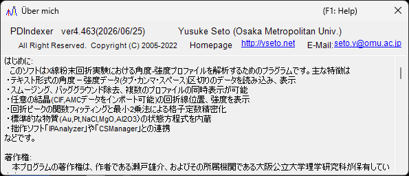

<!-- 260601Cl: migrated from legacy docx + yseto.net web manual -->
# Laufzeitumgebung und Installation

Diese Seite beschreibt, wie PDIndexer installiert wird, und die für einen komfortablen Betrieb empfohlene Umgebung.

## Installation

Laden Sie die neueste Version von der GitHub-Releases-Seite herunter.

- Download: <https://github.com/seto77/PDIndexer/releases/latest>

Die empfohlene Methode ist der MSI-Installer. Laden Sie `PDIndexer-setup.msi` (x64) herunter und doppelklicken Sie darauf, um die Installation zu starten. Unter Windows on Arm (z. B. Snapdragon-PCs) laden Sie stattdessen `PDIndexer-setup_arm64.msi` herunter. <!-- 260625Cl WiX asset names + arm64 -->

Wenn die MSI-Installation auf einem verwalteten Windows-PC blockiert ist, verwenden Sie als Alternative das installationsfreie ZIP-Paket. Laden Sie das portable ZIP (`PDIndexer-v.<ver>.zip` für x64 oder `PDIndexer-v.<ver>_arm64.zip` für Arm) herunter, entpacken Sie den vollständigen Ordner an einen für den Benutzer beschreibbaren Ort und führen Sie `PDIndexer.exe` aus dem entpackten Ordner aus. Führen Sie `PDIndexer.exe` nicht direkt aus dem ZIP-Anzeigeprogramm heraus aus. <!-- 260601Ch / 260625Cl -->

!!! note "Über die Windows-Schutzwarnung"
    Wenn Sie neu heruntergeladene, unsignierte Forschungssoftware ausführen, zeigt Windows möglicherweise eine SmartScreen-Warnung an („Der Computer wurde durch Windows geschützt"). Klicken Sie in diesem Fall auf **Weitere Informationen** und wählen Sie dann **Trotzdem ausführen**, um fortzufahren.

!!! note "Über das installationsfreie ZIP-Paket"
    Das ZIP-Paket ist als Alternative für Umgebungen gedacht, in denen die MSI-Installation, eine Administratorgenehmigung oder die separate Installation der .NET Desktop Runtime schwierig ist. Es ist kein vollständig in sich geschlossener Einstellungsordner: PDIndexer speichert Benutzereinstellungen und kopierte Standarddaten weiterhin im AppData-Ordner des aktuellen Benutzers und kann benutzerspezifische Optionen unter `HKEY_CURRENT_USER\Software\Crystallography\PDIndexer` ablegen.

## Erforderliche Laufzeitumgebung

Wenn PDIndexer über den MSI-Installer installiert wird, ist die folgende Laufzeitumgebung erforderlich.

| Element | Anforderung |
| --- | --- |
| Betriebssystem | Windows (64-Bit, x64 oder Arm64) |
| Laufzeitumgebung | `.NET Desktop Runtime 10.0` (die **Desktop Runtime**, nicht die einfache **.NET Runtime**; unter Windows on Arm die **Arm64**-Variante) |

!!! warning "Wählen Sie die Desktop Runtime"
    Die Download-Seite bietet zwei Produkte an: die „.NET Runtime" und die „.NET Desktop Runtime". Da PDIndexer eine WinForms-Anwendung ist, installieren Sie unbedingt die **.NET Desktop Runtime**. Die einfache „.NET Runtime" allein startet das Programm nicht.

- Laufzeitumgebung herunterladen: <https://dotnet.microsoft.com/download/dotnet/10.0>

Das installationsfreie ZIP-Paket ist für die passende Architektur (x64 oder Arm64) self-contained und erfordert keine separate Installation der .NET Desktop Runtime. <!-- 260601Ch / 260625Cl arm64 -->

!!! note "Über die in älteren Dokumenten genannte Version"
    Das alte Handbuch (docx) erwähnt „.NET Desktop Runtime 6.0 oder höher", das aktuelle PDIndexer benötigt jedoch **.NET 10.0**. Folgen Sie der Anforderung der neuesten Version.

## Empfohlene Umgebung

Einige Funktionen von PDIndexer benötigen erhebliche Rechenressourcen. Zur Verbesserung der Geschwindigkeit wird die Berechnung wo immer möglich auf mehrere Threads verteilt. Für eine komfortable Nutzung wird ein Computer mit den folgenden leistungsstarken Spezifikationen empfohlen.

| Element | Empfohlen |
| --- | --- |
| Betriebssystem | Windows 11 (Windows 10 oder höher, 64-Bit, funktioniert ebenfalls) |
| RAM | 16 GB oder mehr |
| CPU | 8 Kerne oder mehr (wirksam für Multithread-Berechnungen) |

!!! tip "Vorteil des Multithreadings"
    Berechnungen von Beugungsmustern anhand von Kristallstrukturen, sequentielle Analyse und ähnliche Aufgaben laufen mit mehr CPU-Kernen schneller. Je mehr Kerne Ihre CPU hat, desto kürzer ist die Wartezeit für die Berechnung.

## Updates (Prüfen auf neue Versionen)

Über das Menü **Hilfe** des Hauptfensters können Sie mit PDIndexer auf die neueste Version aktualisieren und Autoreninformationen anzeigen.

| Menü | Funktion |
| --- | --- |
| **Hilfe** ▸ **Auf Updates prüfen** | Prüft, ob eine neuere Version veröffentlicht wurde, und aktualisiert das Programm. |
| **Hilfe** ▸ **Über PDIndexer** | Zeigt Versions- und Autoreninformationen an. |

Wenn Sie **Hilfe** ▸ **Über PDIndexer** wählen, öffnet sich ein Fenster wie das untenstehende, in dem Sie die aktuelle Versionsnummer und die Autoreninformationen prüfen können.

!!! tip "Regelmäßig aktualisieren"
    Fehlerbehebungen und neue Funktionen werden laufend hinzugefügt. Führen Sie von Zeit zu Zeit **Hilfe** ▸ **Auf Updates prüfen** aus, um PDIndexer auf dem neuesten Stand zu halten.

## Lizenz

PDIndexer wird unter der **MIT License** vertrieben. Nutzung, Änderung, Verbreitung und kommerzielle Nutzung sind frei gestattet, sofern der Copyright-Hinweis und der Lizenztext jeder Weiterverbreitung beigefügt werden. Die Software wird ohne Gewährleistung bereitgestellt.
