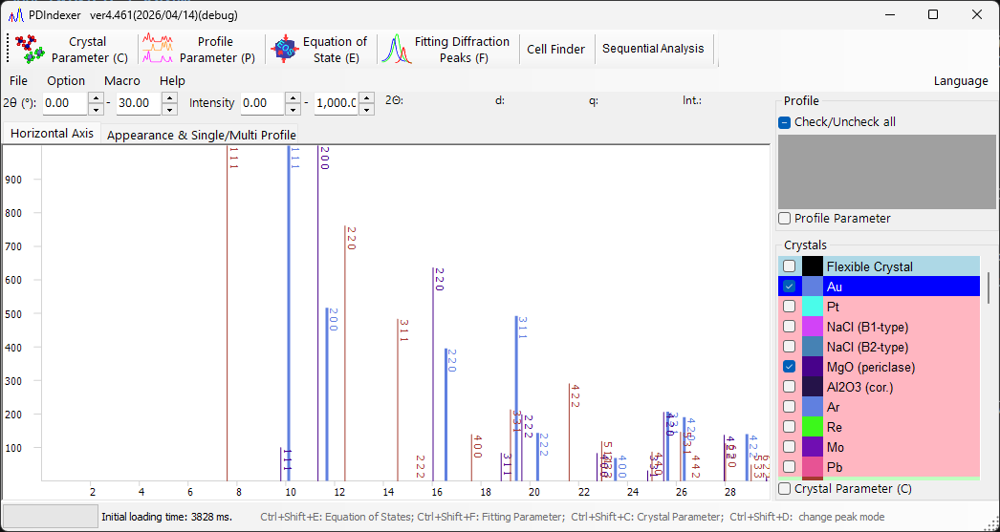

<!-- 260601Cl: migrated from legacy docx + yseto.net web manual -->
# Main window

When you launch the software, the screen shown below appears. The main window consists of the central **profile drawing area**, the **menu bar** and **toolbar (function list)** at the top, the tab menu near the top (`Horizontal Axis` / `Appearance & Single/Multi Profile`), the **profile list** at the upper right, and the **crystal list** at the lower right.

## Profile drawing area

This area occupies most of the window and displays the profiles checked in the profile list. When a crystal is selected in the crystal list, diffraction lines are also drawn at the positions of the diffraction peaks.

### Mouse operations

| Operation | Action |
| --- | --- |
| Left drag | Move diffraction lines (change the lattice constants of the crystal) |
| Right drag | Zoom in |
| Right click | Zoom out |
| Middle drag | Pan the view |

The drawing ranges of the horizontal and vertical axes can be changed by typing values directly into the numeric boxes above the drawing area (`2θ:`, `d:`, `Int.:`, `q:`, etc., whose labels depend on the selected horizontal-axis mode).

!!! tip
    The horizontal-axis display mode (angle, energy, d-spacing, etc.) is switched on the [`Horizontal Axis` tab](#horizontal-axis-tab). This is a display-only setting and does not modify the profile's own horizontal-axis data.

## Toolbar (function list)

Each button on the toolbar toggles a dedicated analysis window.

| Button | Function | See |
| --- | --- | --- |
| `Crystal Parameter (C)` | Toggle the Crystal Parameter window. | [Crystal parameter](3-crystal-parameter.md) |
| `Profile Parameter (P)` | Toggle the Profile Parameter window. | [Profile parameter](4-profile-parameter.md) |
| `Equation of State (E)` | Toggle the Equation of State window to estimate pressure from the cell volume of a standard material. | [Equation of states](5-equation-of-states.md) |
| `Fitting Diffraction Peaks (F)` | Toggle the Peak Fitting window to fit diffraction peaks (position, FWHM, intensity). | [Fitting diffraction peaks](6-fitting-diffraction-peaks.md) |
| `Cell Finder` | Toggle the Cell Finder window to search lattice constants from peak positions. | — |
| `Sequential Analysis` | Toggle the Sequential Analysis window for batch processing of a file series. | [Sequential analysis](7-sequential-analysis.md) |
| `Atomic Position Finder` | Toggle the Atomic Position Finder window to search atomic positions from diffraction intensities. | — |
| `LPO Analysis` | Toggle the LPO (lattice-preferred orientation) Analysis window. | — |

!!! note
    The main windows can also be toggled with keyboard shortcuts: `Ctrl+Shift+C` (Crystal Parameter), `Ctrl+Shift+E` (Equation of States), `Ctrl+Shift+F` (Fitting Parameter), and `Ctrl+Shift+D` (change peak mode).

## Menu bar

### File

| Item | Description |
| --- | --- |
| `Read profile(s)` | Read profile data. In addition to this software's own `pdi` / `pdi2` format, you can read the WinPIP output `csv`, the Fit2D output `chi`, and so on. Most files stored as angle-intensity text can also be read. |
| `Save profile(s)` | Save all loaded profiles in this software's `pdi2` format. |
| `Export the selected profile(s)` | Export the selected profile(s) as a comma-separated (CSV), tab-separated (TSV), or GSAS (Rietveld) data file. |
| `Load crystals (as a new list)` | Load a crystal list file (extension `xml`). The current crystal list is discarded. |
| `Load crystals (and add to the present list)` | Load a crystal list file (extension `xml`) and append it to the end of the current crystal list. |
| `Save crystals` | Save the current crystal list to a file (extension `xml`). |
| `Import CIF, AMC...` | Import a structure data file in `cif` or `amc` format and add it to the current crystal list. |
| `Export the selected crystal to CIF` | Save the selected crystal as a `cif`-format structure data file. |
| `Revert crystals to the initial state` | Revert the crystal list to the initial (default) state. |
| `Page Setup` | Open the page setup dialog for printing. |
| `Print Preview` | Show a print preview of the profile viewer. |
| `Print` | Print. The print range is the current angle and intensity range. |
| `Copy to Clipboard` | Copy the currently drawn profile to the clipboard as bitmap data or metafile (vector) data. |
| `Save as Metafile` | Save the currently drawn profile in metafile format. The EMF (Enhanced Meta File) format is supported, and the saved `*.emf` files can be opened in PowerPoint and Word. |
| `Close` | Close PDIndexer. |

### Option

| Item | Description |
| --- | --- |
| `Tool Tip` | When checked, displays the tooltips on the main window. |
| `Watch Clipboard` | Watch the clipboard and automatically import profile/crystal data copied from other apps (e.g. IPAnalyzer). |
| `Watch File` | Watch a specified folder and automatically read newly created `.pdi` profile files. Choose the folder to watch from the selection dialog or by typing the path directly. |
| `Clear Registry (check and restart)` | When checked, clear all saved settings from the registry on exit (restart to reset). |
| `Save the crystal list when closing` | When checked, automatically save the crystal list on exit and reload it on startup. |

### Macro

`Editor` opens the macro editor window. For details of the PDIndexer macro feature, see [Macro](8-macro.md).

### Help

| Item | Description |
| --- | --- |
| `About Me` | Show the copyright, version and author information, and the version history. |
| `Program Updates` | Check online for a newer version and, if available, download/install it. |
| `Hint` | Show usage hints (deprecated). |
| `Help (web)` | Show this manual. |

### Language

Switch the UI language. Currently English (`English (need restart)`) and Japanese (`Japanese (need restart)`) are supported. A restart is required after switching.

## Horizontal Axis tab

The `Horizontal Axis` tab sets the display mode of the axis. The settings here are display-only and are unrelated to the actual horizontal-axis data (the actual horizontal-axis information can be changed from the [Profile parameter](4-profile-parameter.md)). Because of this, you can align the horizontal axis for comparison even when different X-ray sources were used. For example, even if the loaded profile was acquired with the Cu Kα line, it can be displayed as if it had been acquired at the wavelength of the Mo Kα line.

| Item | Description |
| --- | --- |
| `After reading profile, change horizontal axis` | When checked, automatically aligns the horizontal-axis settings to those of the newly loaded profile. |
| 2θ (degree) | Set the horizontal axis to angle. Choosing the `X-ray` radio button gives the scattering angle for X-rays; select a characteristic X-ray source or `Custom` from the drop-down list and specify the wavelength. Choosing the `Electron` radio button gives the scattering angle for electrons; specifying the accelerating voltage computes the relativistically corrected wavelength. |
| Energy (eV) | Set the horizontal axis to energy (unit eV). This corresponds to an X-ray diffraction experiment using an EDX detector. Set the EDX take-off angle appropriately. |
| d-spacing (Å) | Set the horizontal axis to d-spacing (lattice-plane spacing). |
| q | Set the horizontal axis to the magnitude of the scattering vector \( q \). |

The relationship between the scattering angle and the d-spacing is given by Bragg's law, with \( \lambda \) the wavelength:

$$ 2 d \sin\theta = n \lambda $$

## Appearance & Single/Multi Profile tab

The `Appearance & Single/Multi Profile` tab configures the drawing appearance and the single/multi profile display.

### Scale and color settings

| Item | Description |
| --- | --- |
| `Scale Line` | Select whether to display the scale (grid) lines. |
| `Error bar` | Display error bars when the data contain error information. |
| `Color` | Set the display colors, such as `Back Color`, `Scale Line`, and `Scale Text`. |

### Single/Multi Profile

The mode that is checked is the current mode.

| Item | Description |
| --- | --- |
| `Single Profile` | Single-profile mode. When a profile is loaded, or sent from IPAnalyzer via the clipboard, the old profile is deleted and the new profile is drawn. |
| `Multi Profiles` | Multi-profile mode. New profiles are loaded and overlaid on top of the existing ones. |
| `Increasing intensity by a profile` | Sets the intensity offset between data when overlaying multiple data sets. This is only to keep the display legible; the actual data are not modified. |
| `Change automatically color` | When checked, automatically changes the drawing color of the profiles. |

### Vertical Axis

Specify whether to display the vertical axis (intensity) as raw counts (`Raw Counts`) or as counts per step (`Count per Step (CPS)`). You can also specify whether to display the vertical axis on a linear (`Linearity`) or logarithmic (`Logarithm`) scale.

## Profile list

Displays and selects the loaded profiles. It is disabled in `Single Profile` mode.

In multi-profile mode, the loaded profiles are shown as a list, and only the checked ones are drawn in the central drawing area. More detailed profile settings are made by checking the `Profile Parameter` checkbox at the bottom of the box (see [Profile parameter](4-profile-parameter.md)).

## Crystal list

Displays and configures the list of crystals. Checking an entry draws diffraction lines at the positions of the diffraction peaks. By default, about 80 crystals are pre-registered.

!!! note "Special rows"
    - The first row (row 0) is the **Flexible Crystal** (cyan background), used for drawing arbitrary diffraction lines.
    - The upper rows (pink background, e.g. `NaCl EOS` and `Pt EOS`) are reserved as standard materials for equation-of-state (EOS) calculations.

More detailed crystal settings are made by checking the `Crystal Parameter (C)` checkbox at the bottom of the box (see [Crystal parameter](3-crystal-parameter.md)). `Check/Uncheck all` checks or unchecks the entire crystal list at once.
