<!-- 260601Cl: migrated from legacy docx + yseto.net web manual -->
# Crystal parameter

Clicking the `Crystal Parameter` icon on the main window's toolbar opens the sub-window shown below. Here you set which crystals' diffraction peaks to display and how those peaks are drawn. A crystal database for searching and importing structures is built into the lower part of the window.

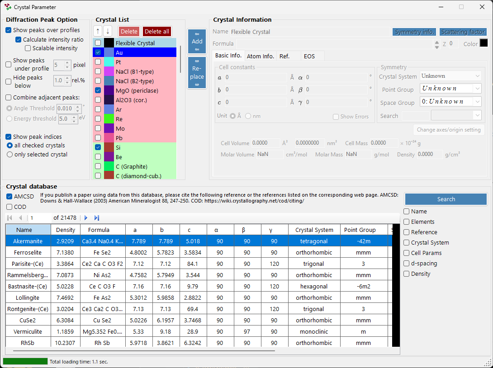

The window is divided into four main areas.

| Area | Purpose |
| --- | --- |
| `Diffraction Peak Option` | How diffraction lines are displayed |
| `Crystal List` | A crystal checklist shared with the main window |
| `Crystal Information` | Detailed parameters for the selected crystal (tabbed) |
| `Crystal database` | AMCSD-based search and import |

---

## Diffraction Peak Option

Configures the display of diffraction lines.

### Show peaks over profiles

Selects whether diffraction lines are drawn overlaid on the profile data.

### Calculate intensity ratio

Selects whether diffraction intensities (their ratios) are computed from the structural data.

!!! note
    If atomic positions have not been entered, intensities are not calculated regardless of the checkbox state. See the [Atom Info. tab](#atom-info-tab) for entering atomic data.

### Scalable intensity

Selects whether all diffraction lines can be scaled globally without changing their relative intensity ratios.

### Show peaks under profile

Selects whether diffraction peaks are drawn below the profile.

#### Peak height

Sets the height, in pixels (`pixel`), of the peaks drawn below the profile.

### Combine adjacent peaks

Selects whether to merge the intensities of peaks that, although crystallographically inequivalent, have nearly identical or exactly identical 2θ values.

For example, in the cubic system the (333) and (115) planes are inequivalent yet have exactly the same d-spacing, so they overlap in the observation. Checking this box lets you display their combined intensity.

| Item | Description |
| --- | --- |
| `Angle threshold` | How close peaks must be to be merged, given in degrees (`°`). |
| `Energy threshold` | For energy-dispersive data, the merging range given in energy (`eV`). |

!!! tip
    The legacy manual stated the threshold in ångströms, but the current version specifies it in degrees (`°`) or energy (`eV`) depending on the horizontal-axis type.

### Hide peaks below

Selects whether to remove peaks that are too weak compared with the strongest reflection. The cutoff is given as a ratio relative to the strongest line (`rel.%`).

### Show peak indices

Selects which crystals have their diffraction-line indices (Miller indices) labeled.

| Option | Target |
| --- | --- |
| `all checked crystals` | Every checked crystal |
| `only selected crystal` | Only the crystal currently selected in the list |

---

## Crystal List

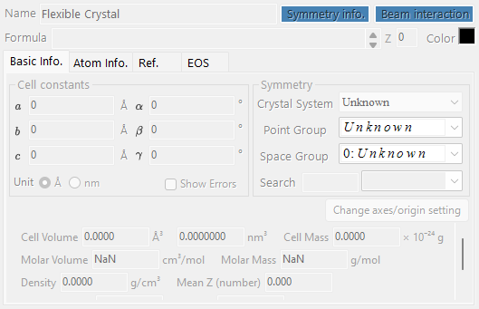

This shows the same information as the Profile checklist on the main window. Checked crystals have their diffraction lines drawn on the main window. Each row shows a checkbox (`Check`), a drawing color (`PeakColor`), and the crystal name (`Crystal`).

### Up/Down arrow buttons (↑ / ↓)

Change the order of the crystals.

!!! note
    Rows 1 through 6 are reserved for the equation of state (EOS) and cannot be reordered. See [Equation of state](5-equation-of-states.md) for details.

### Add

Adds the crystal configured in the Crystal Information area on the right (described below) to the list as a new entry.

### Replace

Replaces the currently selected crystal with the one configured in the Crystal Information area on the right.

### Delete

Removes the currently selected crystal from the list.

### Delete all

Removes every crystal from the list.

---

## Crystal Information

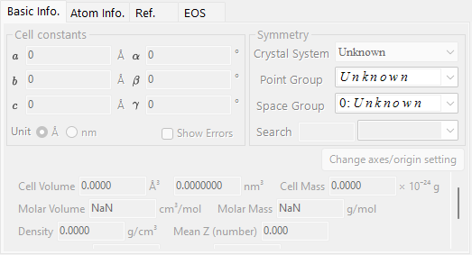

Edits and displays detailed information for the selected crystal across several tabs. The main tabs are:

| Tab | Contents |
| --- | --- |
| `Basic Info.` | Lattice parameters, crystal system, space group, and other basic information |
| `Atom Info.` | Atom types, occupancies, coordinates, and temperature factors |
| `Ref.` | Reference information for the source paper, authors, and so on |
| `EOS` | Equation-of-state settings for compression and thermal expansion |

### Basic Info. tab

Sets basic information such as the lattice parameters (a, b, c, α, β, γ), crystal system, and space group. Choosing a space group automatically constrains the editable lattice parameters and the degrees of freedom of the atomic coordinates.

!!! tip
    Right-clicking a lattice-parameter field shows a menu that restores the lattice parameters to their values at application startup (or at the time the structure was imported from the database). This is handy when you want to return to the original reference values after changing them through fitting.

### Atom Info. tab

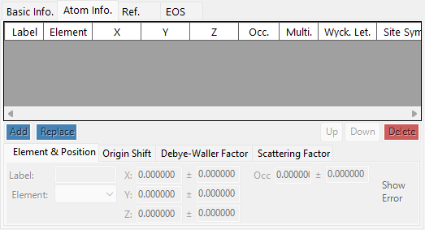

Sets each atom's element, occupancy, fractional coordinates, and isotropic/anisotropic temperature factors. When atomic positions are entered here, diffraction intensities can be computed via [Calculate intensity ratio](#calculate-intensity-ratio).

### Ref. tab

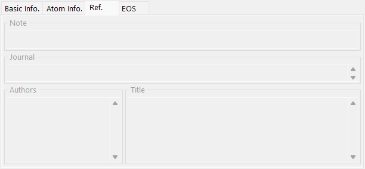

Holds reference information such as the paper title, journal name, and authors that are the source of the crystal structure. Structures imported from the crystal database have this information filled in automatically.

### EOS tab

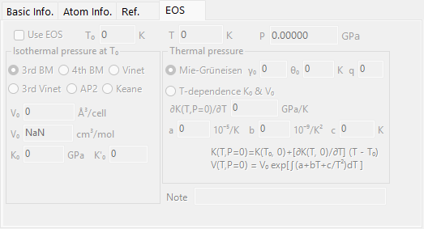

Sets the per-crystal equation of state (EOS), which governs how the lattice parameters change with pressure and temperature. The main input fields are:

| Field | Description |
| --- | --- |
| `Use EOS` | Enable EOS pressure calculation for this crystal. |
| `T0` / `Temperature` | Reference / measured temperature. |
| `V0` | Reference unit-cell volume. |
| `K0`, `K'0` | Isothermal bulk modulus and its pressure derivative. |
| Isothermal form | `BM3` (third-order Birch-Murnaghan, default) / `BM4` / `Vinet` / `AP2` / `Keane`. |
| Thermal pressure | `Mie-Grüneisen` (default; parameters \( \gamma_0, \theta_0, q \)) / `T-dependence K0&V0`. |

See [Equation of state](5-equation-of-states.md) for the formulas and symbol definitions.

---

## Crystal database

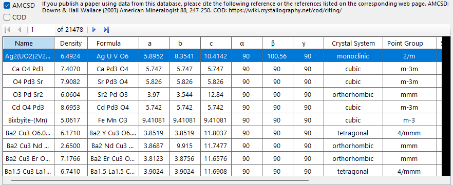

Provides search and import functions for more than 20,000 crystal structures. This database is based on the American Mineralogist Crystal Structure Database (AMCSD).

!!! warning "Citation"
    When you use this crystal data, please read <http://rruff.geo.arizona.edu/AMS/amcsd.php> carefully and be sure to cite the following reference.

    > Downs, R.T. and Hall-Wallace, M. (2003) The American Mineralogist Crystal Structure Database. *American Mineralogist* **88**, 247-250.

### Table

Lists the crystals contained in the database. If search conditions are entered, only the crystals that match them are shown.

Selecting any crystal in the table transfers its information to [Crystal Information](#crystal-information). To add it to the crystal list, press the `Add` or `Replace` button in the Crystal List area.

### Search options

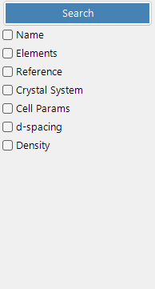

Enter the search conditions. After entering them, press the `Search` button or the Enter key. Each condition can be enabled or disabled with its checkbox.

#### Name

Enter the crystal name.

#### Elements

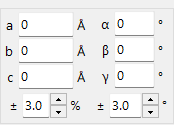

Pressing the `Periodic Table` button opens a separate window where you choose the elements to search for. Each element button toggles its state every time you press it.

The buttons at the top of the window switch the state of all elements at once.

| Button | Meaning |
| --- | --- |
| `may or not include` | The element may or may not be present (clears all element constraints). |
| `must include` | Must include (only crystals containing all of the specified elements are kept). |
| `must exclude` | Must exclude (crystals containing any of the specified elements are removed). |

!!! tip
    Checking `Ignore scattering factor` lets you search without taking scattering factors into account.

#### Reference

Enter the paper title, journal name, or author name.

#### Crystal System

Search by specifying the crystal system.

#### Cell Params

Enter the lattice parameters and the allowed tolerance.

#### d-spacing

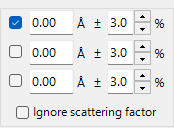

Enter the d-spacing of a strong reflection and the allowed tolerance.

#### Density

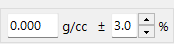

Enter the density and the allowed tolerance.
