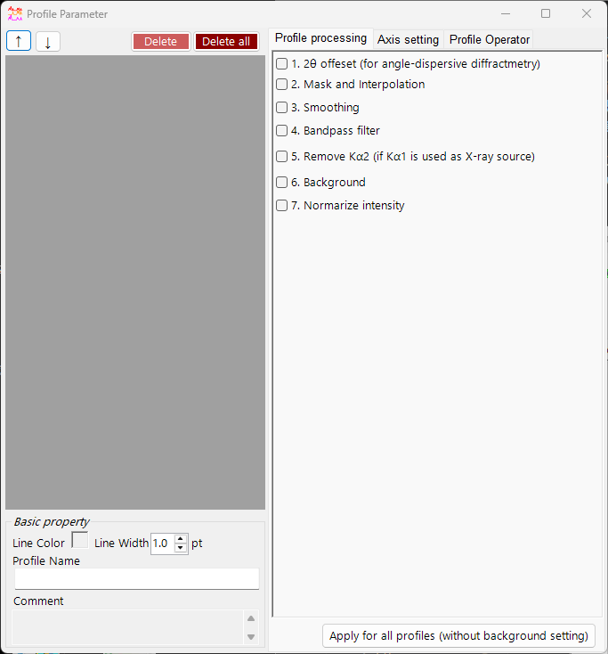
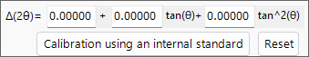
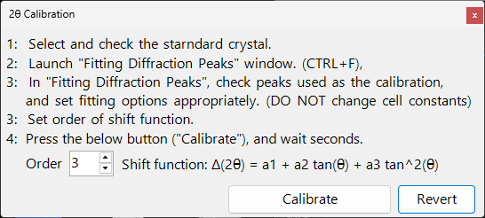
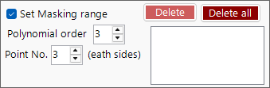
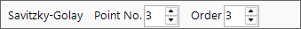
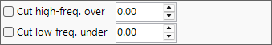
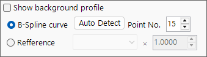
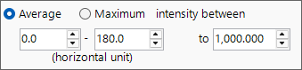

<!-- 260601Cl: migrated from legacy docx + yseto.net web manual -->
# Profile parameter

Clicking the `Profile parameter` icon on the main window opens this sub window. Here you make detailed settings for the loaded profiles and apply various numerical processing.

The left side of the window holds the [Profile checklist](#profile), and the right side is split into three tabbed pages — [Profile processing](#profile-processing), [Axis setting](#axis-setting), and [Profile Operator](#profile-operator). Each processing step can be toggled on/off with a check box and is applied in order from top to bottom.

!!! note
    Settings made in this window are reflected on the profiles in the [main window](1-main-window.md) in real time. For settings on the crystal side, such as the horizontal-axis unit and the index labels of diffraction lines, see [Crystal Parameter](3-crystal-parameter.md).

---

## Profile checklist {#profile}

The list on the left side of the window shows the same information as the Profile checklist on the main window. Selecting a profile in the list makes it the target of the processing and settings on the right side of the window.

| Item | Description |
| --- | --- |
| `↑` `↓` (up/down arrow buttons) | Change the order of the profiles in the list. |
| `Delete` | Deletes the selected profile. |
| `Delete all` | Deletes all profiles. |

In the `Basic property` area below the list, you edit the basic attributes of the selected profile.

| Item | Description |
| --- | --- |
| `Line Color` | Click to change the drawing color of the selected profile. |
| `Line Width` | Sets the line thickness of the profile (`pt`). |
| `Profile Name` | Sets the name of the profile. |
| `Comment` | A free-form comment field. |

---

## Profile processing {#profile-processing}

On the `Profile processing` tab you apply various numerical processing to the selected profile. Steps 1–7 can each be enabled independently with a check box, and the enabled ones are applied in numerical order.

### 1. 2θ offset {#two-theta-offset}

`1. 2θ offeset (for angle-dispersive diffractmetry)` corrects the angle of angle-dispersive data. The correction expression is a quadratic function of \( \tan\theta \).

$$ \Delta(2\theta) = a_0 + a_1 \tan\theta + a_2 \tan^2\theta $$

If the profile contains an internal standard (a sample with known lattice constants), press the `Calibration using an internal standard` button and follow the messages; the coefficients of the quadratic function are then determined automatically. In the calibration dialog, observed peak positions are matched to the theoretical peak positions of the standard, and the coefficients are fitted.

The `Reset` button resets the offset coefficients you have set.

!!! tip
    Internal standards are commonly materials with precisely determined lattice constants, such as Si or LaB₆. After calibration, the corrected 2θ values are used directly in all subsequent analysis.

### 2. Mask and Interpolation {#mask}

`2. Mask and Interpolation` masks a specified angular range (or energy range) and interpolates the profile using the intensities outside the masked range.

| Item | Description |
| --- | --- |
| `Set Masking range` | Specifies the horizontal-axis range to mask. |
| `Point No.` | Specifies the number of end points (each side) used for interpolation. |
| `Polynomial order` | Specifies the order of the polynomial used for interpolation. |
| `Save Masking Ranges` / `Read Masking Ranges` | Save the configured masking ranges to a file, or read them back. |
| `Delete` / `Delete all` | Delete an individual masking range, or all of them. |

### 3. Smoothing {#smoothing}

`3. Smoothing` applies smoothing to the selected profile. The smoothing algorithm is the `Savitzky-Golay` method.

In this method, for each \(x\) position of interest, a least-squares fit with a polynomial of degree `Order` is performed on the data within \(\pm\) `Point No.` of that point, and the value of the resulting function \(F(x)\) is adopted as the new intensity at that \(x\) position.

!!! note
    When `Order` \(= 1\), Savitzky–Golay smoothing is equivalent to a simple moving average. Increasing `Order` better preserves peak shapes, while increasing `Point No.` strengthens the smoothing.

### 4. Bandpass filter {#bandpass}

`4. Bandpass filter` uses a Fourier transform (FFT) to cut components above or below specified frequencies.

| Item | Description |
| --- | --- |
| `Cut high-freq. over` | Removes components with a frequency higher than the specified value (reduces high-frequency noise). |
| `Cut low-freq. under` | Removes components with a frequency lower than the specified value (removes a slowly varying background). |

### 5. Remove Kα2 {#remove-ka2}

`5. Remove Kα2 (if Kα1 is used as X-ray source)`: if the selected profile was measured with X-rays in which Kα1 and Kα2 are not separated, and it was loaded specifying Kα1, checking this removes the diffraction intensity originating from Kα2.

!!! warning
    This processing is effective only when Kα1 is selected as the X-ray source. Check and set the horizontal-axis unit and the radiation type on the [Axis setting](#axis-setting) tab.

### 6. Background {#background}

`6. Background` subtracts the background from the profile. There are two methods.

#### B-Spline curve

Pressing `Auto Detect` automatically calculates and subtracts the background. With `Point No.` you set the maximum number of background control points to search for automatically.

You can also change the control points manually. Drag the round control points drawn on the main window with the mouse to create an appropriate curve.

#### Reference

You can specify another profile as the background for the selected profile. Checking `Show background profile` displays the profile being used as the background.

!!! note
    Background subtraction (step 6) is excluded from the bulk application performed by the `Apply for all profiles` button described below.

### 7. Normalize intensity {#normalize}

`7. Normarize intensity` normalizes the profile so that the `Average` or `Maximum` over a specified horizontal-axis range becomes a specified intensity.

| Item | Description |
| --- | --- |
| `Average` / `Maximum` | Choose whether the average or the maximum within the range is used as the reference. |
| `intensity between` | Specifies the target horizontal-axis range. |
| `to` | Specifies the target intensity value after normalization. |

### Apply for all profiles button {#apply-all}

The `Apply for all profiles (without background setting)` button applies the settings of steps 1–7, **excluding 6. Background**, to all profiles at once.

---

## Axis setting {#axis-setting}

On the `Axis setting` tab you change the horizontal-axis unit, the radiation (incident-beam) type, and the incident-beam energy of the selected profile.

| Item | Description |
| --- | --- |
| `Horizontal axis setting` | Changes the current horizontal-axis unit (`horizontal unit`). With `Shift` you can also offset the whole horizontal axis. |
| `Exposure Time` | Sets the exposure time (`sec.`) used in CPS mode (`(for CPS mode)`). |
| `Vertical axis setting` | Settings related to the vertical axis. |

!!! note
    The axis setting here changes the physical information that the profile itself holds (unit, radiation type, energy). Unlike the display-only axis transformation in the main window, it affects how the data itself is interpreted. Since the radiation type and energy directly influence the calculation of diffraction-line positions, set the correct values.

---

## Profile Operator {#profile-operator}

On the `Profile Operator` tab you perform averaging of multiple profiles and arithmetic operations between profiles.

After specifying the target profiles for the calculation and the operation you want to perform, press the `Calculate` button; the result is added as a new profile.

| Mode | Description |
| --- | --- |
| `Average` | Averages multiple profiles. |
| `Profile and value` | Operates between a profile and a scalar value. |
| `Two profiles` | Performs an arithmetic operation (such as addition) between two profiles. |

With `Output name of the profile` you can specify the name of the generated profile (the default is `Result #01`).

!!! tip
    This can be used, for example, to average multiple measurements to improve the S/N ratio, or to take the difference of two profiles to extract the change between them.
