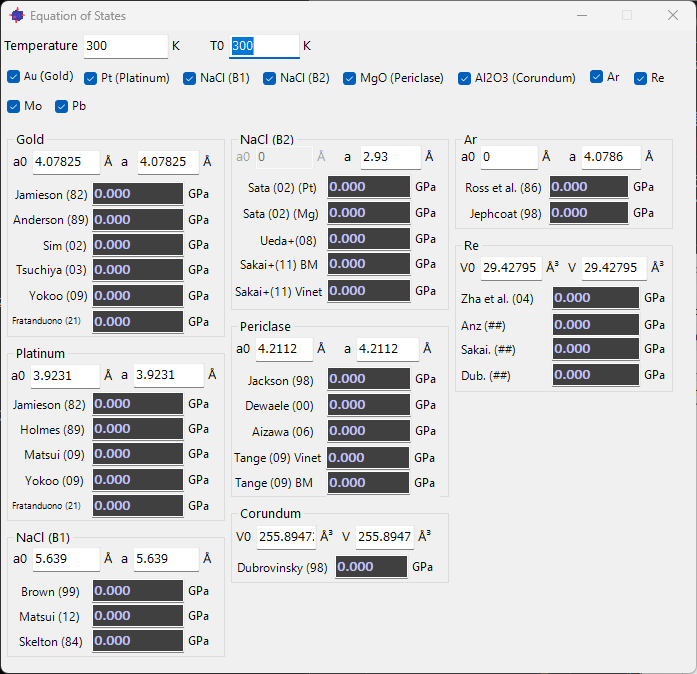
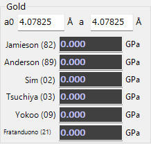
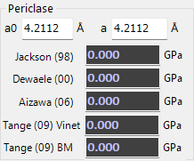

<!-- 260601Cl: migrated from legacy docx + yseto.net web manual -->
# Equation of states

Clicking the `Equation of States` icon on the main window toolbar opens the window shown below. This tool calculates pressure from the equation of state (EOS) of a standard material.

In high-pressure experiments, a standard material (pressure marker) is loaded together with the sample to serve as a pressure reference. The pressure is then derived from the marker's measured lattice constant (volume) and its known equation of state. This tool performs that calculation.

## How to use

1. Use the checkboxes at the top of the window to select the standard material(s) for which you want to determine the pressure.
2. For each selected material, the calculated result (pressure) is displayed in the lower part of the window.
3. You can compute the pressure by entering the lattice constants (`a`, `a0`) or volume (`V`, `V0`) directly.
4. When you drag a diffraction line in the main window, its value is immediately reflected in the EOS calculation.

!!! note "Relationship to the crystal list"
    The standard materials correspond to the crystals shown as pink rows in the crystal list. Roughly 10 materials are provided by default: gold (Au), platinum (Pt), NaCl-B1, NaCl-B2, periclase (MgO), corundum (Al2O3), argon (Ar), rhenium (Re), molybdenum (Mo), lead (Pb), and others.

## Supported standard materials

The standard materials that can be selected with the checkboxes at the top of the window are listed below. Each material provides several equations of state from different researchers (references), and the results for every selected entry are displayed individually.

| Standard material | Description |
| --- | --- |
| `Au (Gold)` | Gold |
| `Pt (Platinum)` | Platinum |
| `NaCl (B1)` | Sodium chloride (B1 structure, rock-salt type) |
| `NaCl (B2)` | Sodium chloride (B2 structure, CsCl type) |
| `MgO (Periclase)` | Magnesium oxide (periclase) |
| `Al2O3 (Corundum)` | Aluminum oxide (corundum) |
| `Ar` | Argon |
| `Re` | Rhenium |
| `Mo` | Molybdenum |
| `Pb` | Lead |
| `hBN` | Hexagonal boron nitride |

## Input parameters

Each material's `groupBox` lets you enter or read the following values.

| Item | Description |
| --- | --- |
| `a` / `V` | Measured lattice constant or volume. Updated automatically when you drag a diffraction line in the main window. |
| `a0` / `V0` | Lattice constant or volume at ambient (reference) conditions. |
| `Temperature` | Sample temperature. Used by equations of state that include thermal pressure (high-temperature EOS). |
| `T0` | Reference temperature. Used together with `Temperature` to apply the thermal-pressure correction. |

!!! tip "Temperature-dependent equations of state"
    Some references support high-temperature equations of state that include thermal pressure. By entering `Temperature` and `T0` to match your experimental conditions, you obtain a pressure that includes the temperature correction. Formulations based on the Mie-Grüneisen(-Debye) model, such as the Vinet/BM forms of `Sakai+(11)`, fall into this category.

## References per material

Each material's `groupBox` lists several equations of state from different references, and the pressure computed by each formula is displayed simultaneously. You can compare them and choose the reference that best suits your study or measurement conditions. Representative examples are shown below.

### Gold

For gold (`Au (Gold)`), equations of state such as `Yokoo (09)`, `Matsui (09)`, `Holmes (89)`, `Jamieson (82)`, and `Fratanduono (21)` are available.

### NaCl (B1 structure)

For `NaCl (B1)`, equations of state such as `Brown (99)`, `Sakai+`, and `Matsui (12)` are available.

### Periclase (MgO)

For `MgO (Periclase)`, equations of state such as `Tange (09) BM`, `Tange (09) Vinet`, `Aizawa (06)`, `Dewaele (00)`, and `Jackson (98)` are available.

!!! note "Other materials"
    Platinum (`Pt (Platinum)`: `Fratanduono (21)`, `Holmes (89)`, etc.), `NaCl (B2)` (`Sakai (02)`, `Ueda+(08)`, etc.), corundum (`Al2O3 (Corundum)`: `Sata (02)`, etc.), `Ar` (`Dubrovinsky (98)`, `Ross et al. (86)`, `Jephcoat (98)`, etc.), `Re` (`Zha et al. (04)`, etc.), `Mo` (`Zhao+(00)`, `Huang+(16) MGD`, etc.), and `Pb` (`Strässle+(14)`, etc.) likewise offer a choice of several references.

## Theory of the equations of state

The formulas and parameters of the equations of state used by this tool (Birch-Murnaghan, Vinet, AP2, Keane, Mie-Grüneisen(-Debye), and others) are summarized on the author's explanatory page.

- [Notes on equations of state (EOS)](https://yseto.net/misc/misc-4/misc-4-1)

The equation of state \( P = P(V, T) \) expresses the relationship between a substance's temperature, pressure, and volume; this tool's role is to obtain the pressure \( P \) from the measured volume \( V \). For the specific functional forms (such as the third-order Birch-Murnaghan equation or the Vinet equation) and each material's parameters, refer to the page above.

## Related pages

- For registering crystals and the crystal list display, see related pages such as [Profile information](4-profile-parameter.md).
