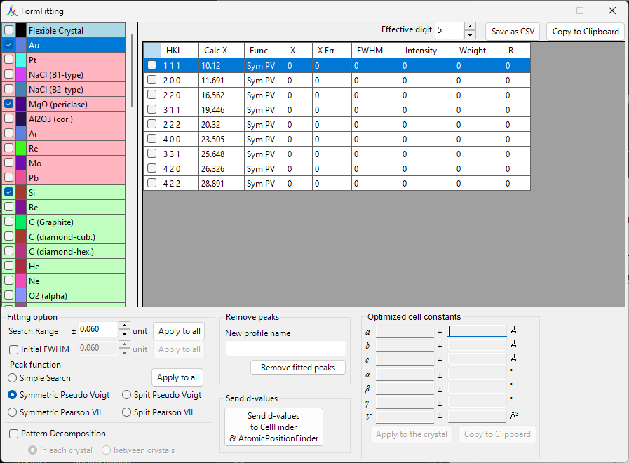
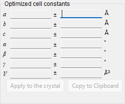
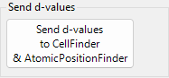
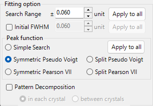
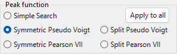
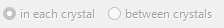
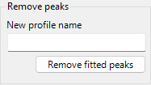
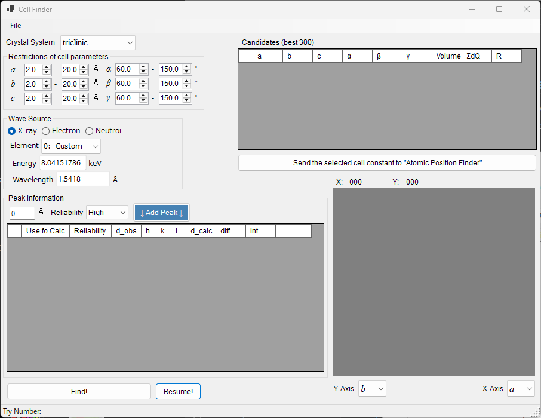
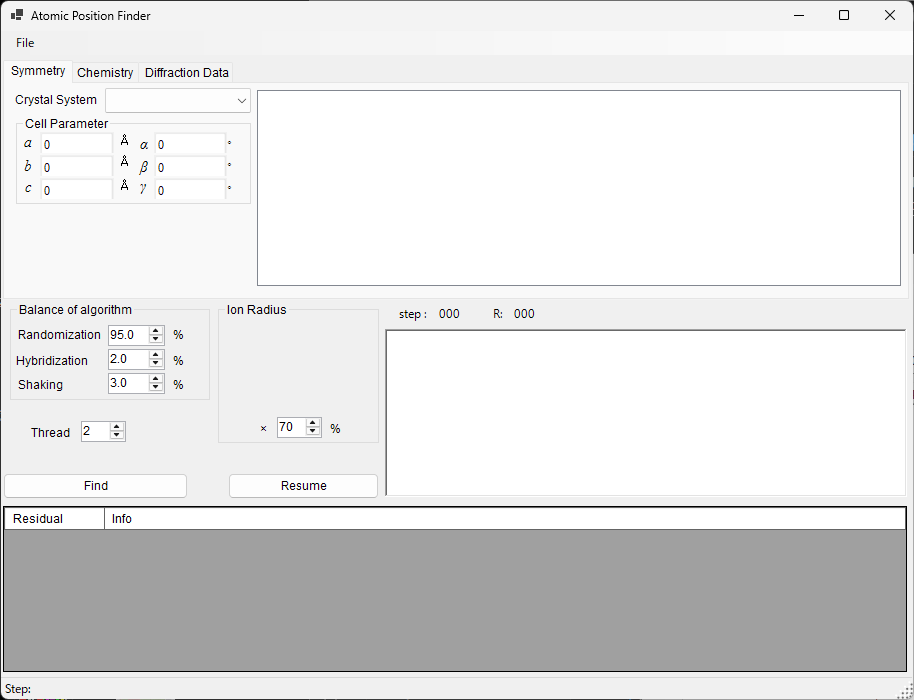

<!-- 260601Cl: migrated from legacy docx + yseto.net web manual -->
# Fitting diffraction peaks

The `Fitting diffraction peaks` tool fits the peaks of a diffraction profile with an appropriate function, derives the d-spacing from each peak position 2θ, and refines the lattice constants by least squares. It is launched from the toolbar of the main window.

## Basic workflow

1. Select the target crystal in the crystal list (in multi-profile mode, also select the profile you want to work on).
2. In the main window, drag the diffraction lines with the mouse so that they overlap the measured peaks as closely as possible.
3. Choose the indices of the diffraction lines you want to fit from the diffraction-peak list (a checked list box).
4. Once enough independent indices are chosen for the least-squares calculation to be solvable, the most-probable lattice constants appear, with their errors, in the `Optimized cell constants` panel at the lower right.
5. Press `Apply to the crystal` to push the refined lattice constants back to the crystal in the main program.

!!! note "Checking and selecting a crystal"
    The crystal list mirrors the one in the main window. For fitting to take effect, the target crystal must be both checked and selected.

## Crystal list

The crystal list at the top left contains the same crystals as the main window. The crystal you check and select here becomes the fitting target. See [Crystal parameters](3-crystal-parameter.md) for details.

## Diffraction-peak list

The diffraction lines of the selected crystal are listed here. Turning on the checkbox of a row makes that diffraction line a fitting target. The list contains columns such as the following.

| Column | Content |
| --- | --- |
| `Check` | Whether to include the line in the fit |
| `PeakColor` | Display color |
| `Crystal` | Crystal name |
| `HKL` | Reflection indices |
| `Calc X` | Calculated diffraction-line position |
| `Func` | Peak function used |
| `X` | Peak position obtained by fitting |
| `X Err` | Error of the peak position |
| `FWHM` | Full width at half maximum |
| `Intensity` | Peak intensity |
| `Weight` | Weight in the least-squares fit |
| `R` | Residual index of the fit |

The buttons below the list export the results.

- `Copy to clipborad`: Copies the table to the clipboard. It can be pasted directly into Excel and similar applications.
- `Save as CSV`: Saves the table as a `.csv` file. `Effective digit` sets the number of decimal places.
- `Clear peaks`: Clears the fitting results.

## Fitting option

Here you make detailed settings used when fitting the peak profiles.

### Search Range / Initial FWHM

- `Search Range`: Sets the range over which fitting is performed. That is, the region within ±Search Range of the calculated diffraction-line position is taken as the fitting target for that peak.
- `Initial FWHM`: Specifies the initial full width at half maximum of the profile function. It is used as the starting value for least-squares convergence.

Pressing `Apply to all` applies the current settings to all diffraction lines at once.

### Peak function

Selects the peak function used for fitting.

| Peak function | Content |
| --- | --- |
| `Simple Search` | Performs no function fitting; it recognizes the strongest point within ±Search Range of the calculated diffraction-line position as the peak position. |
| `Symmetric Pseudo Voigt` | Fits with a left-right symmetric pseudo-Voigt function. |
| `Symmetric Pearson VII` | Fits with a left-right symmetric Pearson VII function. |
| `Split Pseudo Voigt` | Fits with a left-right asymmetric (split) pseudo-Voigt function. |
| `Split Pearson VII` | Fits with a left-right asymmetric (split) Pearson VII function. |

!!! tip "Recommended function"
    Unless there is a particular reason not to, `Symmetric Pseudo Voigt` is recommended because of its superior stability.

The pseudo-Voigt function is a linear combination of a Gaussian \(G(x)\) and a Lorentzian \(L(x)\) with mixing parameter \(\eta\), given by:

$$
\mathrm{pV}(x) = \eta\, L(x) + (1-\eta)\, G(x), \qquad 0 \le \eta \le 1
$$

where \(\eta\) is the fraction of the Lorentzian component. The split form represents an asymmetric profile by taking parameters such as the FWHM independently on the left and right of the peak position.

### Pattern Decomposition

When the Search Ranges of two or more selected diffraction lines overlap, this option selects whether to perform pattern decomposition (simultaneous fitting of the overlapping peaks).

- `in each crystal`: Performs pattern decomposition independently for each crystal.
- `between crystals`: Performs pattern decomposition across all crystals.

## Optimized cell constants

Once enough independent indices are chosen for the least-squares calculation to become solvable, this panel displays the most-probable lattice constants \(a, b, c, \alpha, \beta, \gamma\) and the volume \(V\), each with its error (`±`).

!!! note "About the NA display"
    When there are insufficient degrees of freedom—that is, when the degrees of freedom equal the number of fitted peaks, or when a given lattice constant has no degrees of freedom—`NA` is displayed instead of an error. Choosing enough independent reflections allows the errors to be computed.

- `Apply to the crystal`: Pushes the refined lattice constants back to the selected crystal in the main program.
- `Copy to Clipboard`: Copies the optimized lattice constants to the clipboard.
- `Reset take off angle`: Resets the take-off angle.

## Remove fitted peaks

This subtracts the fitted peaks from the profile and outputs the residual profile as a new profile. Enter the destination name in `New profile name` and press `Remove fitted peaks` to perform the subtraction. It is useful for checking the background or the separation of overlapping peaks.

## Related tools (Send d-values)

Pressing `Send d-values to CellFinder && AtomicPositionFinder` sends the d-values obtained from the fit to the following analysis tools, which can also be launched from the toolbar.

### Cell Finder

`Cell Finder` searches for the unit cell (lattice constants) that explains a set of measured peak positions (a list of d-values), working backward from those positions. It is used to index unknown samples.

### Atomic Position Finder

`Atomic Position Finder` searches for the atomic positions in a crystal structure from quantities such as the intensities of the observed reflections.

!!! tip "Identifying an unknown sample"
    After determining the lattice constants with `Cell Finder`, register that crystal in the crystal list, and you can refine the lattice constants further with the least-squares fitting of this tool.
