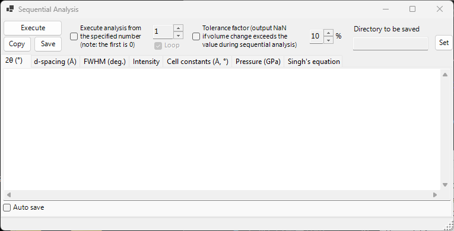
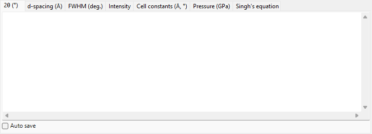
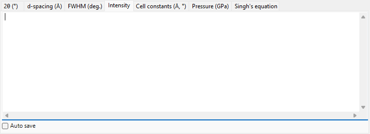

<!-- 260601Cl: migrated from legacy docx + yseto.net web manual -->
# Sequential analysis

`Sequential Analysis` runs the same peak fitting across many loaded profiles in turn and collects the results by quantity. It is designed for a series of profiles acquired while a condition such as temperature, pressure, or time changes: it processes the whole series at once and tabulates, on its own tab, the 2θ, d-spacing, FWHM, intensity, cell constants, pressure, and Singh's equation (uniaxial-stress / lattice-strain analysis) results for each diffraction line.

Use the `Sequential Analysis` button on the main-window toolbar to open and close this window.

!!! note "Shared with [Fitting diffraction peaks](6-fitting-diffraction-peaks.md)"
    Sequential analysis shares its fitting setup with the `Fitting diffraction peaks` window. Open the `Fitting diffraction peaks` window first, select the target crystal, and check the diffraction lines (peaks) you want to fit. If these are not prepared when you press `Execute`, a message tells you to do so.

## Basic workflow

1. Load the entire series of profiles measured under the changing condition (at least four profiles are required).
2. Open the [Fitting diffraction peaks](6-fitting-diffraction-peaks.md) window, choose the target crystal, and check the diffraction lines you want to analyze. The fitting function and search range you set there are reused by sequential analysis.
3. Optionally set the start number, loop, tolerance factor, and auto-save options (see below).
4. Press `Execute`. Each loaded profile is activated in turn, a least-squares fit is run, and the results accumulate on each tab.
5. Review each tab and bring the data into a spreadsheet (Excel, etc.) with `Copy` or `Save`.

Progress and elapsed time are shown in the status bar at the bottom of the window as `... % completed.  Elapsed time: ... sec`. When the analysis finishes, the 2θ, d-spacing, FWHM, and intensity results are copied together to the clipboard.

!!! tip "Two fits per profile"
    To obtain stable convergence, the least-squares fit is run twice for each profile before the result is recorded.

## Analysis options

The controls around the `Execute` button govern the analysis range and the handling of outliers.

| Option | Description |
| --- | --- |
| `Execute analysis from the specified number (note: the first is 0)` | When checked, start the analysis from the profile number set in the box at right instead of from the first profile. The first profile is number 0. |
| `Loop` | When starting from a number, also process the skipped earlier profiles (0 … start − 1) after reaching the end, wrapping around so the whole series is analyzed. Available only when the start number is enabled. |
| `Tolerance factor (output NaN if volume change exceeds the value during sequential analysis)` | When checked, reject a fit (output `NaN` for that row) when the refined cell volume changes from the initial value by more than the value (in %) at right. This automatically discards outliers caused by a broken fit. |

## Output tabs

Each tab is a table for one output quantity. Each row corresponds to one profile (the profile name), and each column corresponds to a selected diffraction line (hkl index, or `Peak No.` for a flexible crystal). The tables are held as tab-separated text and are converted to comma-separated values (CSV) when you `Copy` or `Save` them.

### 2θ (°)

The fitted peak position, in 2θ (degrees), for each profile and each diffraction line.

### d-spacing (Å)

The interplanar spacing d, in Å, computed from each peak position. It is obtained from the wavelength and 2θ by \( d = \dfrac{\lambda}{2\sin\theta} \).

### FWHM (deg.)

The full width at half maximum (FWHM) of each peak, in 2θ degrees, letting you track how peak widths change.

### Intensity

The integrated intensity (area) of each peak, useful for tracking intensity changes that accompany phase transitions or texture changes.

### Cell constants (Å, °)

The refined unit-cell volume `V`, the cell edges `A`, `B`, `C` (Å), the axial angles `Alpha`, `Beta`, `Gamma` (°), and the estimated error of each (the `_err` columns) for every profile.

### Pressure (GPa)

The pressure derived from each profile's cell constants using an [equation of state](5-equation-of-states.md). When a pressure standard such as Gold, Pt, NaCl (B1/B2), MgO, Corundum, Ar, Re, Mo, or Pb is selected in the `Equation of State` window, one column appears per researcher (per reported scale). When no standard is selected, the pressure is computed from the equation of state assigned to the target crystal.

### Singh's equation

The results of Singh's uniaxial-stress / lattice-strain analysis. The trailing number of each profile name is interpreted as the azimuth angle \( \psi \) (degrees), and for each reflection the azimuth-versus-d relation is fitted by least squares (Levenberg–Marquardt). For each reflection it yields the stress-free lattice spacing `d0`, the maximum-strain azimuth `Ψmax`, and a stress-proportional quantity `t/6Ghkl` (the ratio of the differential stress \( t \) to the shear modulus \( G_{hkl} \)). The fitted curves are also drawn in the graph on the tab.

!!! note "When Singh's equation applies"
    This tab operates on a "stress-analysis mode" series whose profile names end in `...-whole`. Each profile name must carry an azimuth angle as its trailing token (for example `...-30`). For an ordinary series this tab is not updated.

The azimuth-dependent lattice spacing expressed by Singh's equation is approximately

$$ d(\psi) = d_0 \left[ 1 + \alpha - 3\,\alpha \left( 1 - \frac{\lambda^2}{4 d^2} \right) \cos^2(\psi - \psi_{\max}) \right] $$

where \( \alpha \) corresponds to `t/6Ghkl` and \( \psi_{\max} \) is the azimuth of maximum strain.

## Exporting the results

| Action | Description |
| --- | --- |
| `Copy` | Copy the currently displayed tab to the clipboard as CSV (comma-separated). |
| `Save` | Save the currently displayed tab as a CSV file (filename chosen in a dialog). |

### Auto save

Each tab has an `Auto save` checkbox so the corresponding quantity is written to a CSV file automatically after `Execute`. The destination is shown in `Directory to be saved` and chosen with the `Set` button. The filename is built from the common part of the profile names, with a suffix per quantity: `_2theta.csv`, `_d.csv`, `_fwhm.csv`, `_intensity.csv`, `_cell.csv`, `_pressure.csv`, or `_Singh.csv`.

!!! tip "Setting the destination folder"
    If auto-save is checked but the destination folder is not set (does not exist), a folder-selection dialog opens when you press `Execute`.

## Using it from a macro

Every sequential-analysis output is also available from a macro (Python script). These correspond to the `PDI.Sequential` class in [Macro](8-macro.md).

| Macro function | Corresponding tab |
| --- | --- |
| `PDI.Sequential.Open()` / `Close()` | Open / close the window |
| `PDI.Sequential.Execute()` | Run the sequential analysis |
| `PDI.Sequential.GetCSV_2theta()` | 2θ |
| `PDI.Sequential.GetCSV_D()` | d-spacing |
| `PDI.Sequential.GetCSV_FWHM()` | FWHM |
| `PDI.Sequential.GetCSV_Intensity()` | Intensity |
| `PDI.Sequential.GetCSV_CellConstants()` | Cell constants |
| `PDI.Sequential.GetCSV_Pressure()` | Pressure |
| `PDI.Sequential.GetCSV_Singh()` | Singh's equation |

Each `GetCSV_...()` returns the corresponding tab as a CSV string. `PDI.Sequential.Directory` gets/sets the destination folder, and combining it with `PDI.File.SaveText(...)` writes the results to files. See [Macro](8-macro.md) for details.
