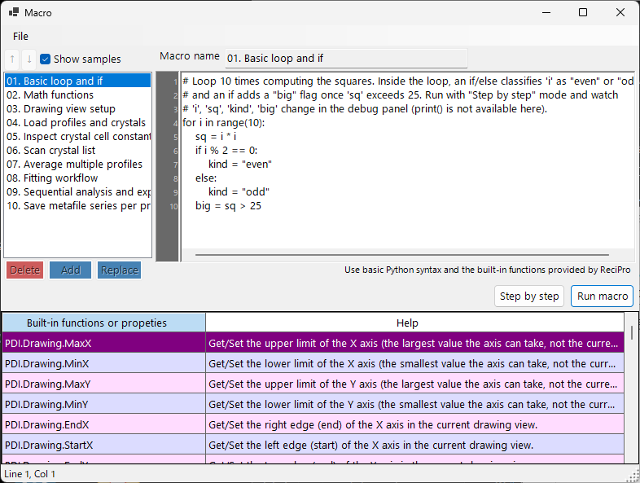

<!-- 260601Cl: migrated from legacy docx + yseto.net web manual -->
# Macro

Most operations in PDIndexer can be automated with the **Macro** feature. Macros are Python scripts written in [IronPython](https://ironpython.net/) (a Python implementation that runs on .NET), edited and executed in a dedicated macro editor window. Use them to automate repetitive tasks, batch-process multiple files, and export results to CSV or image files in bulk.



!!! note "Basic Python knowledge"
    Macros accept standard Python syntax (`for` loops, `if`/`else`, lists, functions, etc.) directly. This page does not explain the Python language itself. PDIndexer-specific functionality is invoked through the `PDI` object described below.

## Opening the macro editor

From the main window menu bar, choose **Macro → Editor** to open the macro editor window (titled `Macro`).

Macros created and saved in the editor are also listed by name under the **Macro** menu, so you can run them directly from the menu. The macro list is saved automatically when PDIndexer exits and restored on the next launch.

## Layout of the editor window

The editor window consists of the following parts.

| Part | Description |
| --- | --- |
| Macro list (left) | A list of saved macro names. Click an entry to load that macro into the editor on the right. |
| Code editor (center) | The area where you type the Python script. It supports a line-number gutter, auto-indent, input completion (auto-complete), and function tooltips. |
| Function reference table | A table of every function available under `PDI`. Double-click a cell to insert that function name into the code at the cursor position. |
| Debug panel (right) | Displays the variable names and values at the current point during step execution. |
| Status bar | Shows the current cursor position (`Line` / `Col`). |

### List operation buttons

Use the following buttons to edit the macro list.

| Button | Action |
| --- | --- |
| `Add` | Adds the current code to the list under the name typed in the name box (prompts to overwrite if the name already exists). |
| `Replace` | Replaces the macro selected in the list with the current code. |
| `Delete` | Removes the selected macro from the list. |
| `↑` / `↓` | Moves the selected macro up or down within the list. |
| `Show samples` | Toggles the display of the built-in sample macros (see below). |

!!! tip "Saving and loading"
    Macros can be saved to and loaded from individual `.mcr` files. Drag and drop a `.mcr` file onto the editor window to load its contents. Pressing `Ctrl+S` after editing overwrites the currently selected macro.

## Running a macro

Run the macro using the buttons at the bottom of the code editor.

| Button | Action |
| --- | --- |
| `Run macro` | Runs the macro normally, all the way through. |
| `Step by step` | Executes the macro one line at a time. It pauses before each line and shows the current variable values in the debug panel on the right. |
| `Next step (F10)` | Advances to the next line during step execution (the `F10` key works too). |
| `Stop` | Aborts execution. Aborting is only effective during `Step by step` execution. |

!!! warning "print() is not available"
    The macro editor has no standard-output console, so `print()` output is not shown. To inspect variable values, run the macro in `Step by step` mode and watch the values change in the debug panel.

### Sample macros

Checking the `Show samples` button displays the built-in sample macros in the list (read-only). The samples are shown in the current UI language (English/Japanese). Use them as a reference when writing your own macros. The built-in samples are:

| Name | Content |
| --- | --- |
| 01. Basic loop and if | Basics of `for` loops and `if`/`else` |
| 02. Math functions | Using the `math` module (`pi`, `sin`, `sqrt`, `exp`, `log`, etc.) |
| 03. Drawing view setup | Setting the view range with `PDI.Drawing.SetBounds` |
| 04. Load profiles and crystals | `PDI.File.ReadProfiles` / `ReadCrystals` |
| 05. Inspect crystal cell constants | Reading cell constants, volume, and pressure via `PDI.Crystal` |
| 06. Scan crystal list | Looping over all of `PDI.CrystalList` |
| 07. Average multiple profiles | `PDI.ProfileOperator.Average` |
| 08. Fitting workflow | A full `PDI.Fitting` sequence |
| 09. Sequential analysis and export | Running `PDI.Sequential` and exporting CSV |
| 10. Save metafile series per profile | Saving one EMF per profile in bulk |

!!! note "The math module is pre-imported"
    `import math` is executed automatically when the editor starts, so you can use the `math` module directly, e.g. `math.sqrt(2)`, without an explicit `import` statement.

---

## Function reference

All PDIndexer-specific functionality is invoked through the classes under the root object `PDI`. `PDI` is already available in the macro scope, so no `import` is needed.

Each table below is transcribed from the `[Help]` attributes in the source code. The same list appears in the function reference table inside the editor window and in [section 6 of the web manual](https://yseto.net/soft/pdi/pdi_06).

!!! note "Notation"
    In the signature column, `(get/set)` denotes a read/write property and `(get)` a read-only property. An argument with `= value` is a default argument and may be omitted.

### PDI (root)

| Member | Signature | Description |
| --- | --- | --- |
| `Sleep` | `Sleep(int millisec)` | Pause the macro execution for the given milliseconds. |
| `Obj` | `Obj (get/set)` | Get/Set objects passed in from another program (inter-process arguments). |

### PDI.File — File I/O

| Member | Signature | Description |
| --- | --- | --- |
| `GetDirectoryPath` | `GetDirectoryPath(string filename = "")` | Get a directory path (with trailing backslash). If `filename` is omitted, a folder selection dialog opens. Otherwise the directory part of `filename` is returned. |
| `GetFileName` | `GetFileName()` | Open a file selection dialog and return the full path of the chosen file. Returns an empty string if the user cancels. |
| `GetFileNames` | `GetFileNames()` | Open a multi-select file dialog and return the full paths of the chosen files. Returns an empty array if the user cancels. |
| `ReadProfiles` | `ReadProfiles(string filename)` | Read profile data from the given file. If `filename` is omitted (or does not exist), a file selection dialog will open. |
| `SaveProfiles` | `SaveProfiles(string filename)` | Save profile data to the given file. If `filename` is omitted, a save dialog will open. |
| `ReadCrystals` | `ReadCrystals(string filename)` | Read crystal data from the given file. If `filename` is omitted (or does not exist), a file selection dialog will open. |
| `SaveCrystals` | `SaveCrystals(string filename)` | Save crystal data to the given file. If `filename` is omitted, a save dialog will open. |
| `SaveMetafile` | `SaveMetafile(string filename)` | Save the current pattern as a Windows Metafile (`.emf`). If `filename` is omitted, a save dialog will open. |
| `SaveText` | `SaveText(string text, string filename)` | Save the given text content to a `.txt` file. If `filename` is omitted, a save dialog will open. |

### PDI.Drawing — Drawing view

| Member | Signature | Description |
| --- | --- | --- |
| `MaxX` | `MaxX (get/set)` | Get/Set the upper limit of the X axis (the largest value the axis can take, not the current view). |
| `MinX` | `MinX (get/set)` | Get/Set the lower limit of the X axis (the smallest value the axis can take, not the current view). |
| `MaxY` | `MaxY (get/set)` | Get/Set the upper limit of the Y axis (the largest value the axis can take, not the current view). |
| `MinY` | `MinY (get/set)` | Get/Set the lower limit of the Y axis (the smallest value the axis can take, not the current view). |
| `EndX` | `EndX (get/set)` | Get/Set the right edge (end) of the X axis in the current drawing view. |
| `StartX` | `StartX (get/set)` | Get/Set the left edge (start) of the X axis in the current drawing view. |
| `EndY` | `EndY (get/set)` | Get/Set the top edge (end) of the Y axis in the current drawing view. |
| `StartY` | `StartY (get/set)` | Get/Set the bottom edge (start) of the Y axis in the current drawing view. |
| `SetBounds` | `SetBounds(double startX, double endX, double startY, double endY)` | Set the drawing view by giving the four edges (StartX, EndX, StartY, EndY). |

### PDI.Crystal — Selected crystal

Cell constants `CellA`–`CellC` are in \( \mathrm{\AA} \), and `CellAlpha`–`CellGamma` are in degrees (deg).

| Member | Signature | Description |
| --- | --- | --- |
| `CellVolume` | `CellVolume (get)` | Get the cell volume (\( \mathrm{\AA}^3 \)) of the selected crystal. Returns 0 if no crystal is selected. |
| `Pressure` | `Pressure(double volume = 0)` | Get the pressure (GPa) of the selected crystal calculated from its EOS. If `volume` is 0 (default), the current cell volume is used. |
| `Name` | `Name (get/set)` | Get/Set the name of the selected crystal. |
| `CellA` | `CellA (get/set)` | Get/Set the cell constant a (\( \mathrm{\AA} \)) of the selected crystal. |
| `CellB` | `CellB (get/set)` | Get/Set the cell constant b (\( \mathrm{\AA} \)) of the selected crystal. |
| `CellC` | `CellC (get/set)` | Get/Set the cell constant c (\( \mathrm{\AA} \)) of the selected crystal. |
| `CellAlpha` | `CellAlpha (get/set)` | Get/Set the cell constant alpha (deg) of the selected crystal. |
| `CellBeta` | `CellBeta (get/set)` | Get/Set the cell constant beta (deg) of the selected crystal. |
| `CellGamma` | `CellGamma (get/set)` | Get/Set the cell constant gamma (deg) of the selected crystal. |

### PDI.CrystalList — Crystal list

| Member | Signature | Description |
| --- | --- | --- |
| `Open` | `Open()` | Open the 'Crystal List' window. |
| `Close` | `Close()` | Close the 'Crystal List' window. |
| `Count` | `Count (get)` | Get the total number of crystals in the list. |
| `SelectedName` | `SelectedName (get)` | Get the name of the currently selected crystal. Returns an empty string if no crystal is selected. |
| `SelectedIndex` | `SelectedIndex (get/set)` | Get/Set the index of the currently selected crystal. |
| `Select` | `Select(int index)` | Select the crystal at the given index. |
| `Check` | `Check(int index = -1, bool state = true)` | Check or uncheck the crystal at the given index. If `index` is -1, the currently selected crystal is targeted. |
| `Uncheck` | `Uncheck(int index = -1)` | Uncheck the crystal at the given index. If `index` is -1, the currently selected crystal will be unchecked. |
| `GetCellVolume` | `GetCellVolume (get)` | Get the cell volume (\( \mathrm{\AA}^3 \)) of the selected crystal. Same as `PDI.Crystal.CellVolume`; kept for backward compatibility. |

### PDI.Profile — Selected profile

| Member | Signature | Description |
| --- | --- | --- |
| `Comment` | `Comment (get/set)` | Get/Set the comment text of the currently selected profile. |
| `Name` | `Name (get/set)` | Get/Set the display name of the currently selected profile. |

### PDI.ProfileOperator — Profile arithmetic

Each profile is specified by its index in the list. `output` is the name given to the resulting profile.

| Member | Signature | Description |
| --- | --- | --- |
| `Average` | `Average(int[] indices, string output)` | Calculate the average of the profiles whose indices are listed in `indices` (e.g. `[1,3,5,9]`). `output` is the name given to the resulting profile. |
| `AddTwoProfiles` | `AddTwoProfiles(int index1, int index2, string output)` | Calculate profile1 + profile2. Each profile is specified by its index. `output` is the name given to the resulting profile. |
| `SubtractTwoProfiles` | `SubtractTwoProfiles(int index1, int index2, string output)` | Calculate profile1 − profile2. Each profile is specified by its index. `output` is the name given to the resulting profile. |
| `MultiplyTwoProfiles` | `MultiplyTwoProfiles(int index1, int index2, string output)` | Calculate profile1 × profile2. Each profile is specified by its index. `output` is the name given to the resulting profile. |
| `DivideTwoProfiles` | `DivideTwoProfiles(int index1, int index2, string output)` | Calculate profile1 ÷ profile2. Each profile is specified by its index. `output` is the name given to the resulting profile. |

### PDI.ProfileList — Profile list

| Member | Signature | Description |
| --- | --- | --- |
| `Open` | `Open()` | Open the 'Profile List' window. |
| `Close` | `Close()` | Close the 'Profile List' window. |
| `DeleteAll` | `DeleteAll()` | Delete all profiles from the list (no confirmation dialog). |
| `Delete` | `Delete(int index)` | Delete the profile at the given index. |
| `Count` | `Count (get)` | Get the total number of profiles in the list. |
| `SelectedName` | `SelectedName (get)` | Get the name of the currently selected profile. Returns an empty string if no profile is selected. |
| `SelectedIndex` | `SelectedIndex (get/set)` | Get/Set the index of the currently selected profile. |
| `Select` | `Select(int index)` | Select the profile at the given index. |
| `Check` | `Check(int index = -1, bool state = true)` | Check or uncheck the profile at the given index. If `index` is -1, the currently selected profile is targeted. |
| `Uncheck` | `Uncheck(int index = -1)` | Uncheck the profile at the given index. If `index` is -1, the currently selected profile will be unchecked. |
| `CheckAll` | `CheckAll()` | Check every profile in the list. |
| `UncheckAll` | `UncheckAll()` | Uncheck every profile in the list. |

### PDI.Fitting — Peak fitting

Operates the [Peak fitting](6-fitting-diffraction-peaks.md) window.

| Member | Signature | Description |
| --- | --- | --- |
| `Open` | `Open()` | Open the 'Fitting peaks' window. |
| `Close` | `Close()` | Close the 'Fitting peaks' window. |
| `Apply` | `Apply()` | Apply the optimized cell constants to the selected crystal (equivalent to clicking the `Confirm` button on the fitting window). |
| `Check` | `Check(int index = -1, bool state = true)` | Check or uncheck the lattice plane at the given index. If `index` is -1, the currently selected plane is targeted. |
| `Uncheck` | `Uncheck(int index = -1)` | Uncheck the lattice plane at the given index. If `index` is -1, the currently selected plane will be unchecked. |
| `Select` | `Select(int index)` | Select the lattice plane at the given index. |
| `SelectedIndex` | `SelectedIndex (get/set)` | Get/Set the index of the currently selected lattice plane. |
| `Range` | `Range(double range)` | Set the peak search range for the currently selected lattice plane (in the same unit as the X axis). |

### PDI.Sequential — Sequential analysis

Operates the [Sequential Analysis](7-sequential-analysis.md) window. The CSV getters return the results of the latest sequential analysis as a CSV string.

| Member | Signature | Description |
| --- | --- | --- |
| `Directory` | `Directory (get/set)` | Get/Set the full directory path where sequential analysis results are saved. |
| `Open` | `Open()` | Open the 'Sequential Analysis' window. |
| `Close` | `Close()` | Close the 'Sequential Analysis' window. |
| `Execute` | `Execute()` | Run the sequential analysis on all checked profiles. |
| `GetCSV_2theta` | `GetCSV_2theta()` | Get the 2-theta results of the latest sequential analysis as a CSV string. |
| `GetCSV_D` | `GetCSV_D()` | Get the d-spacing results of the latest sequential analysis as a CSV string. |
| `GetCSV_FWHM` | `GetCSV_FWHM()` | Get the FWHM results of the latest sequential analysis as a CSV string. |
| `GetCSV_Intensity` | `GetCSV_Intensity()` | Get the peak intensity results of the latest sequential analysis as a CSV string. |
| `GetCSV_CellConstants` | `GetCSV_CellConstants()` | Get the cell constant results of the latest sequential analysis as a CSV string. |
| `GetCSV_Pressure` | `GetCSV_Pressure()` | Get the pressure results of the latest sequential analysis as a CSV string. |
| `GetCSV_Singh` | `GetCSV_Singh()` | Get the Singh-equation results of the latest sequential analysis as a CSV string. |
| `AutoSave2theta` | `AutoSave2theta (get/set)` | Get/Set whether 2-theta results are auto-saved after each sequential analysis run. |
| `AutoSaveDspacing` | `AutoSaveDspacing (get/set)` | Get/Set whether d-spacing results are auto-saved after each sequential analysis run. |
| `AutoSaveFWHM` | `AutoSaveFWHM (get/set)` | Get/Set whether FWHM results are auto-saved after each sequential analysis run. |
| `AutoSaveIntensity` | `AutoSaveIntensity (get/set)` | Get/Set whether peak intensity results are auto-saved after each sequential analysis run. |
| `AutoSaveCellConstants` | `AutoSaveCellConstants (get/set)` | Get/Set whether cell constant results are auto-saved after each sequential analysis run. |
| `AutoSavePressure` | `AutoSavePressure (get/set)` | Get/Set whether pressure results are auto-saved after each sequential analysis run. |
| `AutoSaveSingh` | `AutoSaveSingh (get/set)` | Get/Set whether Singh-equation results are auto-saved after each sequential analysis run. |

## Macro example

As one of the built-in samples, here is a macro that runs the sequential analysis and saves the results to CSV.

```python
# Check all profiles, run sequential analysis, then obtain 2-theta / d-spacing /
# cell-constant / pressure results as CSV strings and save each to a file.
PDI.ProfileList.CheckAll()
PDI.Sequential.Open()
PDI.Sequential.Execute()
dir_path = PDI.File.GetDirectoryPath()
PDI.File.SaveText(PDI.Sequential.GetCSV_2theta(),        dir_path + "seq_2theta.csv")
PDI.File.SaveText(PDI.Sequential.GetCSV_D(),             dir_path + "seq_d.csv")
PDI.File.SaveText(PDI.Sequential.GetCSV_CellConstants(), dir_path + "seq_cell.csv")
PDI.File.SaveText(PDI.Sequential.GetCSV_Pressure(),      dir_path + "seq_pressure.csv")
```

You can browse the other samples from the `Show samples` button in the editor.
