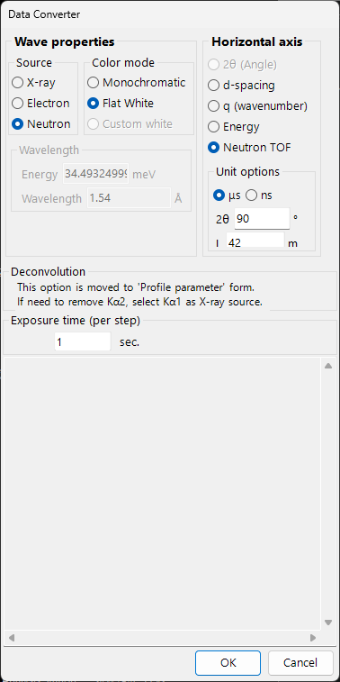
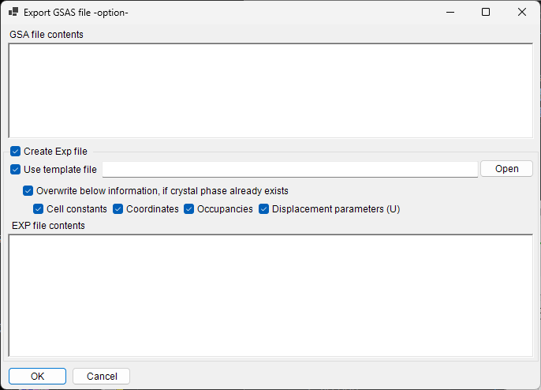

<!-- 260601Cl: migrated from legacy docx + yseto.net web manual -->
# File formats

The files that PDIndexer reads and writes fall into three groups: **profile data**, **crystal lists / crystal structures**, and **drawing output**. All of these I/O operations are accessed from the **File** menu of the [main window](../1-main-window.md).

This page summarizes the supported extensions, the I/O direction, and notes in table form.

---

## Profile data

### Reading (Read profile(s))

**File → Read profile(s)** lets you load several files at once. In addition to PDIndexer's own `pdi` / `pdi2` format, it supports a variety of angle-vs-intensity (or energy-vs-intensity) text and binary formats such as WinPIP's `csv`, Fit2D's `chi`, and Rigaku's `ras`. Even formats not listed below can usually be read: any plain angle-vs-intensity text file falls back to a generic parser.

| Extension | Origin / format | Notes |
| --- | --- | --- |
| `pdi` / `pdi2` | PDIndexer native format | Keeps the profile together with its associated information (wave source, wavelength, exposure time, etc.). `pdi2` is the current version. The Data Converter dialog is not shown when reading these. |
| `csv` | WinPIP output (comma separated: `angle,intensity`) | Imported via the Data Converter dialog, where you specify the meaning of the horizontal axis, the wave source, and the wavelength. |
| `tsv` | Tab separated (`angle` `[TAB]` `intensity`) | Imported as generic text. |
| `chi` | Fit2D output | The leading header lines are skipped; columns 2 and 4 of the four-column data are taken as angle and intensity. |
| `ras` | Rigaku format | Text format that also contains instrument information. |
| `nxs` | NeXus / HDF5 (SSD, multiple detectors) | May contain several channels (histograms); each is energy-calibrated and imported separately. |
| `npd` | EDX profile (SSD) | Reads `EGC0/1/2`, `2Theta`, `Live time`, etc. from the header and converts the channel number to energy. |
| `xbm` | EDX binary format (e.g. SP-8 BL04B2) | Metadata such as sample name, measurement conditions, and EGC calibration coefficients are imported as a comment. |
| `rpt` | Genie format (SSD) | Reads the take-off angle, exposure time, and EGC from the header. |
| `xy` | pyFAI-calibrated two-column text | Reads the wavelength from the header and imports angle vs. intensity. |
| `gsa` | GSAS data (`BANK` block) | Imports the three columns: angle, intensity, error. |
| Other | Generic angle-vs-intensity text | The comma / whitespace / tab delimiter is detected automatically (via the Data Converter dialog). |

!!! note "Loading several files at once"
    When you select and read multiple files, after you confirm the Data Converter settings for the first file a message asks whether to reuse the same settings for the remaining files. Choosing **Yes** processes the rest without showing the dialog, which speeds up loading.

### Data Converter dialog

When you read any file other than `pdi` / `pdi2` (`csv`, `chi`, `ras`, `nxs`, `npd`, `xbm`, `rpt`, `xy`, `gsa`, and generic text), the **Data Converter** dialog opens. It is where you map the imported numeric columns to the correct physical quantities used internally by PDIndexer.

The dialog provides the following settings.

| Setting | Description |
| --- | --- |
| Horizontal Axis | The physical quantity (2θ, energy, d-spacing, wavenumber, TOF, etc.) and unit represented by the first imported column. |
| Wave source / wavelength | X-ray / neutron / electron, and the characteristic X-ray line (Kα, etc.) or the wavelength. This determines the conversion to d-spacing and 2θ. |
| Exposure time (per step) | The exposure time per step in seconds. Used for CPS display and intensity normalization. |
| For SSD data | For SSD (EDX) data such as `rpt` / `npd` / `xbm` / `nxs`, set the coefficients \(a_0, a_1, a_2\) that convert the channel number \(n\) to energy \(E\). When there are multiple detectors, you can enable/disable each one and set its coefficients individually. |
| Low energy cutoff | When checked, data points below the specified energy are excluded on import. |

For SSD data, the channel number \(n\) is converted to energy \(E\) (in eV) by a quadratic calibration:

$$
E = a_0 + a_1\,n + a_2\,n^2
$$

When reading generic text (an "other" format), the dialog shows the actual file contents in a text box so you can set the horizontal axis, wave source, and so on while inspecting the data. The delimiter (comma / whitespace / tab) and the number of leading header lines to skip are detected automatically.

!!! tip "Watching the clipboard / a folder"
    Enabling **Option → Watch Clipboard** lets PDIndexer automatically import profiles copied from other apps such as IPAnalyzer. Enabling **Watch File** automatically reads newly created `pdi` files in a chosen folder.

### Saving and exporting

**File → Save profile(s)** saves all loaded profiles in PDIndexer's native `pdi2` format.

**File → Export the selected profile(s)** writes the selected profile in one of the following formats.

| Extension / format | Direction | Notes |
| --- | --- | --- |
| `pdi2` | Out | PDIndexer native format. Saves all profiles at once. |
| `csv` | Out | Comma separated (angle, intensity). |
| `tsv` | Out | Tab separated (angle and intensity separated by a tab). |
| `gsa` (GSAS) | Out | GSAS format for Rietveld analysis. You can review the contents in the export screen below. |

#### Exporting in GSAS format

When you choose the GSAS format, an export screen appears so you can review what will be written. Line 1 is the profile name, line 2 is a `BANK 1 … CONST … FXYE` header, and the following lines hold three columns: angle, intensity, and error. The error is taken from the profile's own error data when present; otherwise \(\sqrt{\text{intensity}}\) is used.

!!! note "Angle scaling"
    For ordinary angle-dispersive data, the angle values are written multiplied by 100 (the GSAS `CONST` convention). For neutron TOF data, the values are written as-is, without scaling.

---

## Crystal lists and crystal structures

Crystal lists are saved and loaded as XML files (extension `xml`). Individual crystal structures can be imported from CIF / AMC. See [Crystal parameter](../3-crystal-parameter.md) for details.

| Operation (File menu) | Extension | Direction | Notes |
| --- | --- | --- | --- |
| Load crystals (as a new list) | `xml` | In | Loads a crystal list and replaces the current list (the current list is discarded). |
| Load crystals (and add to the present list) | `xml` | In | Loads a crystal list and appends it to the end of the current list. |
| Save crystals | `xml` | Out | Saves the current crystal list to a file. |
| Import CIF, AMC... | `cif` / `amc` | In | Adds structure data in CIF format or AMC (AMCSD) format to the current crystal list. |
| Export the selected crystal to CIF | `cif` | Out | Saves the selected crystal as a CIF structure-data file. |
| Revert crystals to the initial state | — | — | Restores the crystal list to its default state as installed. |

---

## Drawing (profile viewer) output

The profile currently shown in the main window can be copied to the clipboard as an image or saved as a vector metafile.

| Operation (File menu) | Format | Direction | Notes |
| --- | --- | --- | --- |
| Copy to Clipboard (as Bitmap data) | Bitmap | Clipboard | Copies the viewer contents to the clipboard as a bitmap image. |
| Copy to Clipboard (as Metafile data) | Metafile (vector) | Clipboard | Copies the viewer contents to the clipboard in vector form. |
| Save as Metafile | `emf` (EMF) | Out | Saves in EMF (Enhanced Metafile) format. Because it preserves vector and font information, the saved `emf` can be read into PowerPoint and Word. |

In addition, **Page Setup**, **Print Preview**, and **Print** let you print the current angle and intensity range directly.
