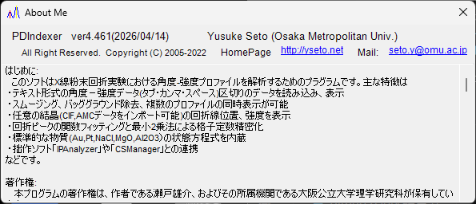

<!-- 260601Cl: migrated from legacy docx + yseto.net web manual -->
# Runtime and installation

This page describes how to install PDIndexer and the environment recommended for comfortable operation.

## Installation

Download the latest release from the GitHub releases page.

- Download: <https://github.com/seto77/PDIndexer/releases/latest>

The recommended method is the MSI installer. Download `PDIndexerSetup.msi` and double-click it to start installation.

If MSI installation is blocked on a managed Windows PC, use the no-install ZIP package as an alternative. Download `PDIndexer-*-win-x64-portable.zip`, extract the full folder to a user-writable location, and run `PDIndexer.exe` from the extracted folder. Do not run `PDIndexer.exe` directly from inside the ZIP viewer. <!-- 260601Ch -->

!!! note "About the Windows protection warning"
    When you run newly downloaded unsigned research software, Windows may display a SmartScreen warning ("Windows protected your PC"). If this happens, click **More info** and then choose **Run anyway** to continue.

!!! note "About the no-install ZIP package"
    The ZIP package is intended as an alternative for environments where MSI installation, administrator approval, or separate .NET Desktop Runtime installation is difficult. It is not a fully self-contained settings folder: PDIndexer still stores user settings and copied default data under the current user's AppData folder, and may store per-user options under `HKEY_CURRENT_USER\Software\Crystallography\PDIndexer`.

## Runtime requirements

The following runtime is required when PDIndexer is installed from the MSI installer.

| Item | Requirement |
| --- | --- |
| OS | Windows (64-bit) |
| Runtime | `.NET Desktop Runtime 10.0` (the **Desktop Runtime**, not the plain **.NET Runtime**) |

!!! warning "Choose the Desktop Runtime"
    The download page offers two products: the ".NET Runtime" and the ".NET Desktop Runtime". Because PDIndexer is a WinForms application, be sure to install the **.NET Desktop Runtime**. The plain ".NET Runtime" alone will not launch the program.

- Download the runtime: <https://dotnet.microsoft.com/download/dotnet/10.0>

The no-install ZIP package is self-contained for Windows x64 and does not require a separate .NET Desktop Runtime installation. <!-- 260601Ch -->

!!! note "About the version stated in older docs"
    The legacy manual (docx) mentions ".NET Desktop Runtime 6.0 or later", but the current PDIndexer requires **.NET 10.0**. Follow the requirement of the latest version.

## Recommended environment

Some PDIndexer features require substantial computational resources. To improve speed, computation is multithreaded wherever possible. For comfortable use, a computer with the following high-performance specifications is recommended.

| Item | Recommended |
| --- | --- |
| OS | Windows 11 (Windows 10 or later, 64-bit, also works) |
| RAM | 16 GB or more |
| CPU | 8 cores or more (effective for multithreaded computation) |

!!! tip "Benefit of multithreading"
    Diffraction-pattern calculations using crystal structures, sequential analysis, and similar tasks run faster with more CPU cores. The more cores your CPU has, the shorter the computation wait time.

## Updates (checking for new versions)

From the **Help** menu of the main window, PDIndexer lets you update to the latest version and view author information.

| Menu | Function |
| --- | --- |
| **Help** ▸ **Program Updates** | Checks whether a newer version has been released and updates the program. |
| **Help** ▸ **About Me** | Displays version and author information. |

Choosing **Help** ▸ **About Me** opens a window like the one below, where you can check the current version number and author information.

!!! tip "Update regularly"
    Bug fixes and new features are added continuously. Run **Help** ▸ **Program Updates** from time to time to keep PDIndexer up to date.

## License

PDIndexer is distributed under the **MIT License**. Use, modification, distribution, and commercial use are freely permitted, provided that the copyright notice and license text are included with any redistribution. The software is provided without warranty.
