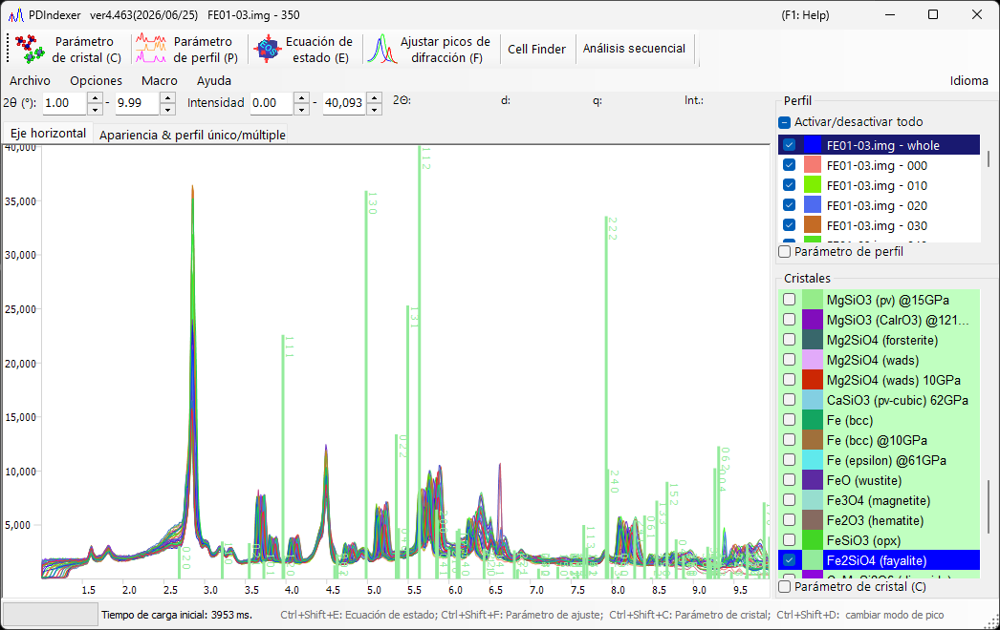

<!-- 260601Cl: migrated from legacy docx + yseto.net web manual -->
# Ventana principal

Cuando inicia el software, aparece la pantalla que se muestra a continuación. La ventana principal consta del **área de dibujo de perfiles** central, la **barra de menús** y la **barra de herramientas (lista de funciones)** en la parte superior, el menú de pestañas cerca de la parte superior (`Eje horizontal` / `Apariencia && perfil único/múltiple`), la **lista de perfiles** en la parte superior derecha y la **lista de cristales** en la parte inferior derecha.

## Área de dibujo de perfiles

Esta área ocupa la mayor parte de la ventana y muestra los perfiles marcados en la lista de perfiles. Cuando se selecciona un cristal en la lista de cristales, también se dibujan líneas de difracción en las posiciones de los picos de difracción.

### Operaciones del ratón

| Operación | Acción |
| --- | --- |
| Arrastrar con el botón izquierdo | Mover las líneas de difracción (cambiar los parámetros de red del cristal) |
| Arrastrar con el botón derecho | Ampliar |
| Clic con el botón derecho | Reducir |
| Arrastrar con el botón central | Trasladar la vista |

Los rangos de dibujo de los ejes horizontal y vertical pueden cambiarse escribiendo valores directamente en los cuadros numéricos situados encima del área de dibujo (`2θ:`, `d:`, `Int.:`, `q:`, etc., cuyas etiquetas dependen del modo de eje horizontal seleccionado).

!!! tip
    El modo de visualización del eje horizontal (ángulo, energía, espaciado d, etc.) se cambia en la [pestaña `Eje horizontal`](#horizontal-axis-tab). Es un ajuste solo de visualización y no modifica los datos del propio eje horizontal del perfil.

## Barra de herramientas (lista de funciones)

Cada botón de la barra de herramientas alterna una ventana de análisis específica.

| Botón | Función | Véase |
| --- | --- | --- |
| `Parámetro de cristal (C)` | Alterna la ventana Parámetro de cristal. | [Parámetros del cristal](3-crystal-parameter.md) |
| `Parámetro de perfil (P)` | Alterna la ventana Parámetro de perfil. | [Parámetros del perfil](4-profile-parameter.md) |
| `Ecuación de estado (E)` | Alterna la ventana Ecuación de estado para estimar la presión a partir del volumen de celda de un material estándar. | [Ecuaciones de estado](5-equation-of-states.md) |
| `Ajustar picos de difracción (F)` | Alterna la ventana Ajuste de picos para ajustar los picos de difracción (posición, FWHM, intensidad). | [Ajuste de picos de difracción](6-fitting-diffraction-peaks.md) |
| `Cell Finder` | Alterna la ventana Cell Finder para buscar parámetros de red a partir de las posiciones de los picos. | — |
| `Análisis secuencial` | Alterna la ventana Análisis secuencial para el procesamiento por lotes de una serie de archivos. | [Análisis secuencial](7-sequential-analysis.md) |
| `Atomic Position Finder` | Alterna la ventana Atomic Position Finder para buscar posiciones atómicas a partir de las intensidades de difracción. | — |
| `Análisis LPO` | Alterna la ventana de análisis LPO (orientación preferente de la red). | — |

!!! note
    Las ventanas principales también pueden alternarse con atajos de teclado: `Ctrl+Shift+C` (Parámetro de cristal), `Ctrl+Shift+E` (Ecuaciones de estado), `Ctrl+Shift+F` (Parámetro de ajuste) y `Ctrl+Shift+D` (cambiar modo de pico).

## Barra de menús

### Archivo

| Elemento | Descripción |
| --- | --- |
| `Leer perfil(es)` | Lee datos de perfil. Además del formato propio de este software `pdi` / `pdi2`, puede leer el `csv` de salida de WinPIP, el `chi` de salida de Fit2D, etc. También pueden leerse la mayoría de los archivos almacenados como texto de ángulo-intensidad. |
| `Guardar perfil(es)` | Guarda todos los perfiles cargados en el formato `pdi2` de este software. |
| `Exportar el/los perfil(es) seleccionado(s)` | Exporta el/los perfil(es) seleccionado(s) como archivo de datos separado por comas (CSV), separado por tabuladores (TSV) o GSAS (Rietveld). |
| `Cargar cristales (como nueva lista)` | Carga un archivo de lista de cristales (extensión `xml`). La lista de cristales actual se descarta. |
| `Cargar cristales (y añadir a la lista actual)` | Carga un archivo de lista de cristales (extensión `xml`) y lo añade al final de la lista de cristales actual. |
| `Guardar cristales` | Guarda la lista de cristales actual en un archivo (extensión `xml`). |
| `Importar CIF, AMC...` | Importa un archivo de datos de estructura en formato `cif` o `amc` y lo añade a la lista de cristales actual. |
| `Exportar el cristal seleccionado a CIF` | Guarda el cristal seleccionado como archivo de datos de estructura en formato `cif`. |
| `Restaurar los cristales al estado inicial` | Restaura la lista de cristales al estado inicial (predeterminado). |
| `Configurar página` | Abre el cuadro de diálogo de configuración de página para imprimir. |
| `Vista previa de impresión` | Muestra una vista previa de impresión del visor de perfiles. |
| `Imprimir` | Imprime. El rango de impresión es el rango actual de ángulo e intensidad. |
| `Copiar al portapapeles` | Copia el perfil dibujado actualmente al portapapeles como datos de mapa de bits o de metarchivo (vectorial). |
| `Guardar como metarchivo` | Guarda el perfil dibujado actualmente en formato de metarchivo. Se admite el formato EMF (Enhanced Meta File), y los archivos `*.emf` guardados pueden abrirse en PowerPoint y Word. |
| `Cerrar` | Cierra PDIndexer. |

### Opciones

| Elemento | Descripción |
| --- | --- |
| `Información sobre herramientas` | Cuando está marcado, muestra la información sobre herramientas en la ventana principal. |
| `Vigilar portapapeles` | Vigila el portapapeles e importa automáticamente los datos de perfil/cristal copiados desde otras aplicaciones (p. ej. IPAnalyzer). |
| `Vigilar archivo` | Vigila una carpeta especificada y lee automáticamente los archivos de perfil `.pdi` recién creados. Elija la carpeta a vigilar en el cuadro de diálogo de selección o escribiendo la ruta directamente. |
| `Borrar el registro (marcar y reiniciar)` | Cuando está marcado, borra al salir toda la configuración guardada del registro (reinicie para restablecer). |
| `Guardar la lista de cristales al cerrar` | Cuando está marcado, guarda automáticamente la lista de cristales al salir y la recarga al iniciar. |

### Macro

`Editor` abre la ventana del editor de macros. Para más detalles de la función de macros de PDIndexer, véase [Macro](8-macro.md).

### Ayuda

| Elemento | Descripción |
| --- | --- |
| `Acerca de PDIndexer` | Muestra la información de copyright, versión y autor, y el historial de versiones. |
| `Buscar actualizaciones` | Comprueba en línea si hay una versión más reciente y, si está disponible, la descarga/instala. |
| `Sugerencia` | Muestra sugerencias de uso (obsoleto). |
| `Ayuda (web)` | Muestra este manual. |

### Idioma

Cambia el idioma de la interfaz. Actualmente se admiten inglés (`Inglés (requiere reinicio)`) y japonés (`Japonés (requiere reinicio)`). Es necesario reiniciar tras el cambio.

## Pestaña Eje horizontal {#horizontal-axis-tab}

La pestaña `Eje horizontal` establece el modo de visualización del eje. Los ajustes aquí son solo de visualización y no están relacionados con los datos reales del eje horizontal (la información real del eje horizontal puede cambiarse desde los [Parámetros del perfil](4-profile-parameter.md)). Gracias a esto, puede alinear el eje horizontal para comparar incluso cuando se utilizaron distintas fuentes de rayos X. Por ejemplo, aunque el perfil cargado se haya adquirido con la línea Kα de Cu, puede mostrarse como si se hubiera adquirido a la longitud de onda de la línea Kα de Mo.

| Elemento | Descripción |
| --- | --- |
| `Tras leer el perfil, cambiar el eje horizontal` | Cuando está marcado, alinea automáticamente los ajustes del eje horizontal con los del perfil recién cargado. |
| 2θ (degree) | Establece el eje horizontal en ángulo. Al elegir el botón de opción `X-ray` se obtiene el ángulo de dispersión para rayos X; seleccione una fuente de rayos X característica o `Custom` de la lista desplegable y especifique la longitud de onda. Al elegir el botón de opción `Electron` se obtiene el ángulo de dispersión para electrones; al especificar el voltaje de aceleración se calcula la longitud de onda corregida relativísticamente. |
| Energy (eV) | Establece el eje horizontal en energía (unidad eV). Esto corresponde a un experimento de difracción de rayos X usando un detector EDX. Ajuste adecuadamente el ángulo de salida (take-off) del EDX. |
| d-spacing (Å) | Establece el eje horizontal en el espaciado d (espaciado de planos de red). |
| q | Establece el eje horizontal en la magnitud del vector de dispersión \( q \). |

La relación entre el ángulo de dispersión y el espaciado d viene dada por la ley de Bragg, siendo \( \lambda \) la longitud de onda:

$$ 2 d \sin\theta = n \lambda $$

## Pestaña Apariencia && perfil único/múltiple

La pestaña `Apariencia && perfil único/múltiple` configura la apariencia del dibujo y la visualización de perfil único/múltiple.

### Ajustes de escala y color

| Elemento | Descripción |
| --- | --- |
| `Línea de escala` | Selecciona si se muestran las líneas de escala (cuadrícula). |
| `Barra de error` | Muestra barras de error cuando los datos contienen información de error. |
| `Color` | Establece los colores de visualización, como `Color de fondo`, `Línea de escala` y `Texto de escala`. |

### Perfil único/múltiple

El modo que está marcado es el modo actual.

| Elemento | Descripción |
| --- | --- |
| `Perfil único` | Modo de perfil único. Cuando se carga un perfil, o se envía desde IPAnalyzer a través del portapapeles, el perfil antiguo se elimina y se dibuja el nuevo perfil. |
| `Múltiples perfiles` | Modo de múltiples perfiles. Los nuevos perfiles se cargan y se superponen sobre los existentes. |
| `Incremento de intensidad por perfil` | Establece el desplazamiento de intensidad entre los datos al superponer varios conjuntos de datos. Esto sirve únicamente para mantener la visualización legible; los datos reales no se modifican. |
| `Cambiar color automáticamente` | Cuando está marcado, cambia automáticamente el color de dibujo de los perfiles. |

### Eje vertical

Especifica si se muestra el eje vertical (intensidad) como cuentas brutas (`Cuentas brutas`) o como cuentas por paso (`Cuentas por paso (CPS)`). También puede especificar si se muestra el eje vertical en escala lineal (`Lineal`) o logarítmica (`Logarítmica`).

## Lista de perfiles

Muestra y selecciona los perfiles cargados. Está deshabilitada en el modo `Perfil único`.

En el modo de múltiples perfiles, los perfiles cargados se muestran como una lista, y solo los marcados se dibujan en el área de dibujo central. Los ajustes de perfil más detallados se realizan marcando la casilla `Parámetro de perfil` en la parte inferior del cuadro (véase [Parámetros del perfil](4-profile-parameter.md)).

## Lista de cristales

Muestra y configura la lista de cristales. Al marcar una entrada se dibujan líneas de difracción en las posiciones de los picos de difracción. De forma predeterminada, hay unos 80 cristales preregistrados.

!!! note "Filas especiales"
    - La primera fila (fila 0) es el **Flexible Crystal** (fondo cian), utilizado para dibujar líneas de difracción arbitrarias.
    - Las filas superiores (fondo rosa, p. ej. `NaCl EOS` y `Pt EOS`) están reservadas como materiales estándar para los cálculos de la ecuación de estado (EOS).

Los ajustes de cristal más detallados se realizan marcando la casilla `Parámetro de cristal (C)` en la parte inferior del cuadro (véase [Parámetros del cristal](3-crystal-parameter.md)). `Activar/desactivar todo` marca o desmarca toda la lista de cristales de una vez.
