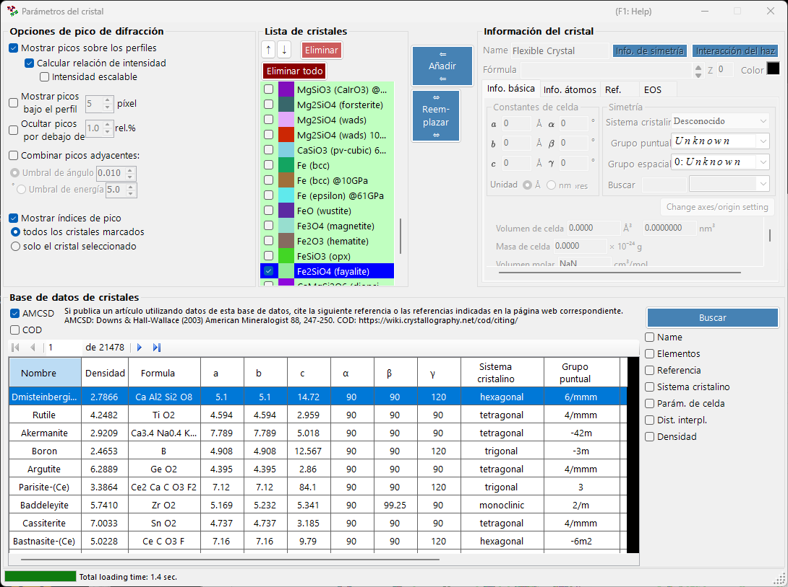
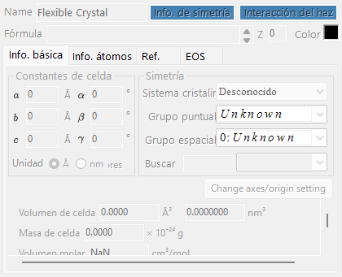
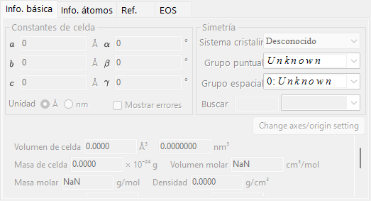
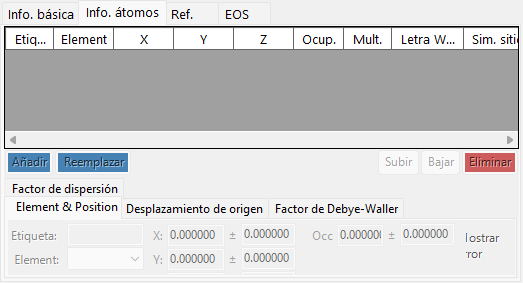
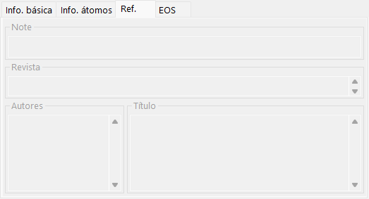
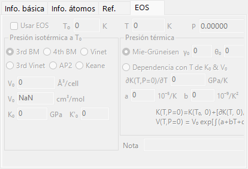
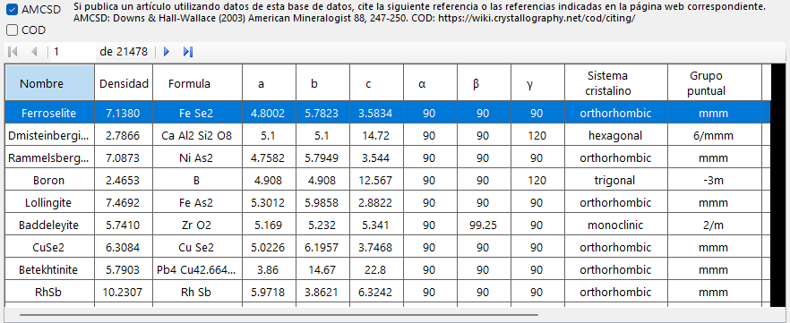
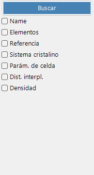
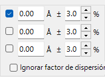

<!-- 260601Cl: migrated from legacy docx + yseto.net web manual -->
# Líneas de difracción e información del cristal

Al hacer clic en el icono `Parámetros del cristal` de la barra de herramientas de la ventana principal se abre la subventana que se muestra a continuación. Aquí se establece de qué cristales se muestran los picos de difracción y cómo se dibujan dichos picos. En la parte inferior de la ventana hay integrada una base de datos de cristales para buscar e importar estructuras.

La ventana se divide en cuatro áreas principales.

| Área | Función |
| --- | --- |
| `Opciones de pico de difracción` | Cómo se muestran las líneas de difracción |
| `Lista de cristales` | Una lista de comprobación de cristales compartida con la ventana principal |
| `Información del cristal` | Parámetros detallados del cristal seleccionado (con pestañas) |
| `Base de datos de cristales` | Búsqueda e importación basadas en AMCSD |

---

## Opciones de pico de difracción

Configura la presentación de las líneas de difracción.

### Mostrar picos sobre los perfiles

Selecciona si las líneas de difracción se dibujan superpuestas sobre los datos del perfil.

### Calcular relación de intensidad {#calculate-intensity-ratio}

Selecciona si las intensidades de difracción (sus relaciones) se calculan a partir de los datos estructurales.

!!! note
    Si no se han introducido posiciones atómicas, las intensidades no se calculan independientemente del estado de la casilla. Consulte la [pestaña Información de átomos](#atom-info-tab) para introducir los datos atómicos.

### Intensidad escalable

Selecciona si todas las líneas de difracción pueden escalarse globalmente sin cambiar su relación de intensidad relativa.

### Mostrar picos bajo el perfil

Selecciona si los picos de difracción se dibujan debajo del perfil.

#### Altura del pico

Establece la altura, en píxeles (`pixel`), de los picos dibujados debajo del perfil.

### Combinar picos adyacentes

Selecciona si se fusionan las intensidades de picos que, aunque cristalográficamente no equivalentes, tienen valores de 2θ casi idénticos o exactamente idénticos.

Por ejemplo, en el sistema cúbico los planos (333) y (115) no son equivalentes pero tienen exactamente el mismo espaciado d, de modo que se solapan en la observación. Al marcar esta casilla se puede mostrar su intensidad combinada.

| Elemento | Descripción |
| --- | --- |
| `Umbral de ángulo` | Cuán próximos deben estar los picos para fusionarse, dado en grados (`°`). |
| `Umbral de energía` | Para datos dispersivos en energía, el rango de fusión dado en energía (`eV`). |

!!! tip
    El manual antiguo expresaba el umbral en ångströms, pero la versión actual lo especifica en grados (`°`) o en energía (`eV`) según el tipo de eje horizontal.

### Ocultar picos por debajo de

Selecciona si se eliminan los picos demasiado débiles en comparación con la reflexión más intensa. El umbral se da como una relación respecto a la línea más intensa (`rel.%`).

### Mostrar índices de pico

Selecciona qué cristales tienen etiquetados los índices (índices de Miller) de sus líneas de difracción.

| Opción | Objetivo |
| --- | --- |
| `todos los cristales marcados` | Todos los cristales marcados |
| `solo el cristal seleccionado` | Solo el cristal actualmente seleccionado en la lista |

---

## Lista de cristales

Muestra la misma información que la lista de comprobación de perfiles de la ventana principal. Los cristales marcados tienen sus líneas de difracción dibujadas en la ventana principal. Cada fila muestra una casilla de verificación (`Check`), un color de dibujo (`PeakColor`) y el nombre del cristal (`Crystal`).

### Botones de flecha arriba/abajo (↑ / ↓)

Cambian el orden de los cristales.

!!! note
    Las filas 1 a 6 están reservadas para la ecuación de estado (EOS) y no se pueden reordenar. Consulte [Ecuación de estado](5-equation-of-states.md) para más detalles.

### Añadir

Añade a la lista, como una nueva entrada, el cristal configurado en el área Información del cristal de la derecha (descrita a continuación).

### Reemplazar

Reemplaza el cristal actualmente seleccionado por el configurado en el área Información del cristal de la derecha.

### Eliminar

Quita de la lista el cristal actualmente seleccionado.

### Eliminar todo

Quita todos los cristales de la lista.

---

## Información del cristal {#crystal-information}

Edita y muestra información detallada del cristal seleccionado a través de varias pestañas. Las pestañas principales son:

| Pestaña | Contenido |
| --- | --- |
| `Info. básica` | Parámetros de red, sistema cristalino, grupo espacial y otra información básica |
| `Info. átomos` | Tipos de átomos, ocupaciones, coordenadas y factores de temperatura |
| `Ref.` | Información de referencia del artículo fuente, autores, etc. |
| `EOS` | Ajustes de la ecuación de estado para compresión y expansión térmica |

### Pestaña Información básica

Establece información básica como los parámetros de red (a, b, c, α, β, γ), el sistema cristalino y el grupo espacial. Al elegir un grupo espacial se restringen automáticamente los parámetros de red editables y los grados de libertad de las coordenadas atómicas.

!!! tip
    Al hacer clic con el botón derecho en un campo de parámetro de red se muestra un menú que restaura los parámetros de red a sus valores al iniciar la aplicación (o en el momento en que se importó la estructura desde la base de datos). Esto resulta útil cuando se desea volver a los valores de referencia originales tras haberlos cambiado mediante el ajuste.

### Pestaña Información atómica {#atom-info-tab}

Establece el elemento, la ocupación, las coordenadas fraccionarias y los factores de temperatura isotrópicos/anisotrópicos de cada átomo. Cuando aquí se introducen las posiciones atómicas, las intensidades de difracción pueden calcularse mediante [Calcular relación de intensidad](#calculate-intensity-ratio).

### Pestaña Ref.

Contiene información de referencia como el título del artículo, el nombre de la revista y los autores que son la fuente de la estructura cristalina. Las estructuras importadas desde la base de datos de cristales tienen esta información rellenada automáticamente.

### Pestaña EOS

Establece la ecuación de estado (EOS) por cristal, que rige cómo cambian los parámetros de red con la presión y la temperatura. Los campos de entrada principales son:

| Campo | Descripción |
| --- | --- |
| `Use EOS` | Habilita el cálculo de presión por EOS para este cristal. |
| `T0` / `Temperature` | Temperatura de referencia / medida. |
| `V0` | Volumen de celda unidad de referencia. |
| `K0`, `K'0` | Módulo de compresibilidad isotérmico y su derivada respecto a la presión. |
| Forma isotérmica | `BM3` (Birch-Murnaghan de tercer orden, predeterminado) / `BM4` / `Vinet` / `AP2` / `Keane`. |
| Presión térmica | `Mie-Grüneisen` (predeterminado; parámetros \( \gamma_0, \theta_0, q \)) / `T-dependence K0&V0`. |

Consulte [Ecuación de estado](5-equation-of-states.md) para las fórmulas y las definiciones de los símbolos.

---

## Base de datos de cristales

Proporciona funciones de búsqueda e importación para más de 20.000 estructuras cristalinas. Esta base de datos se basa en la American Mineralogist Crystal Structure Database (AMCSD).

!!! warning "Citation"
    Cuando utilice estos datos cristalinos, lea atentamente <http://rruff.geo.arizona.edu/AMS/amcsd.php> y asegúrese de citar la siguiente referencia.

    > Downs, R.T. and Hall-Wallace, M. (2003) The American Mineralogist Crystal Structure Database. *American Mineralogist* **88**, 247-250.

### Tabla

Enumera los cristales contenidos en la base de datos. Si se introducen condiciones de búsqueda, solo se muestran los cristales que las cumplen.

Al seleccionar cualquier cristal de la tabla se transfiere su información a [Información del cristal](#crystal-information). Para añadirlo a la lista de cristales, pulse el botón `Añadir` o `Reemplazar` del área Lista de cristales.

### Opciones de búsqueda

Introduzca las condiciones de búsqueda. Tras introducirlas, pulse el botón `Buscar` o la tecla Enter. Cada condición se puede habilitar o deshabilitar con su casilla de verificación.

#### Nombre

Introduzca el nombre del cristal.

#### Elementos

Al pulsar el botón `Tabla periódica` se abre una ventana aparte donde se eligen los elementos a buscar. Cada botón de elemento alterna su estado cada vez que se pulsa.

Los botones de la parte superior de la ventana cambian el estado de todos los elementos a la vez.

| Botón | Significado |
| --- | --- |
| `may or not include` | El elemento puede estar presente o no (borra todas las restricciones de elementos). |
| `must include` | Debe incluir (solo se conservan los cristales que contienen todos los elementos especificados). |
| `must exclude` | Debe excluir (se eliminan los cristales que contienen alguno de los elementos especificados). |

!!! tip
    Al marcar `Ignorar factor de dispersión` se puede buscar sin tener en cuenta los factores de dispersión.

#### Referencia

Introduzca el título del artículo, el nombre de la revista o el nombre del autor.

#### Sistema cristalino

Busque especificando el sistema cristalino.

#### Parámetros de celda

Introduzca los parámetros de red y la tolerancia permitida.

#### Espaciado d

Introduzca el espaciado d de una reflexión intensa y la tolerancia permitida.

#### Densidad

Introduzca la densidad y la tolerancia permitida.
