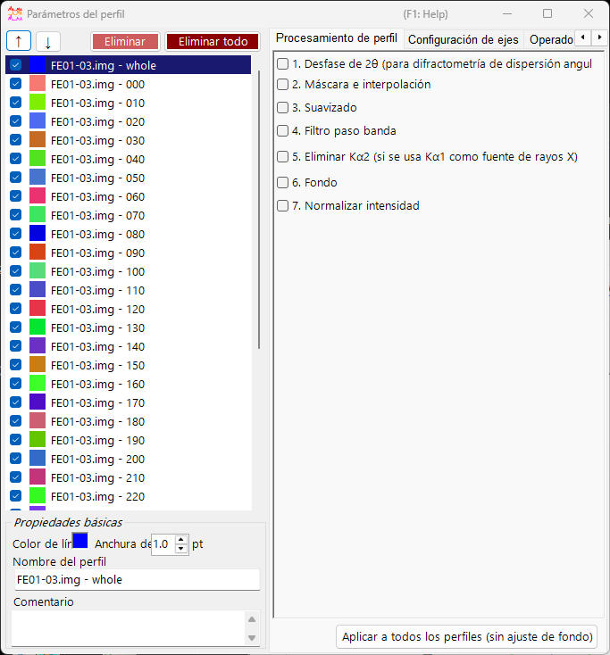
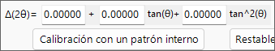
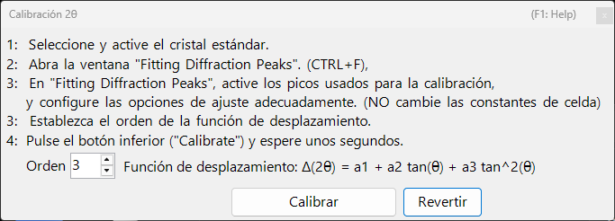
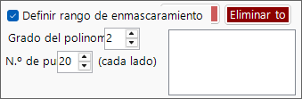
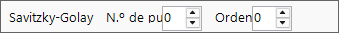
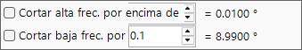
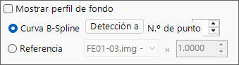
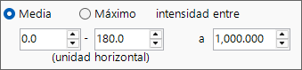

<!-- 260601Cl: migrated from legacy docx + yseto.net web manual -->
# Parámetros del perfil

Al hacer clic en el icono `Profile parameter` de la ventana principal se abre esta subventana. Aquí se realizan los ajustes detallados de los perfiles cargados y se aplican diversos procesamientos numéricos.

El lado izquierdo de la ventana contiene la [lista de comprobación de perfiles](#profile), y el lado derecho se divide en tres páginas con pestañas — [Procesamiento del perfil](#profile-processing), [Configuración de ejes](#axis-setting) y [Operador de perfiles](#profile-operator). Cada paso de procesamiento se puede activar/desactivar con una casilla de verificación y se aplica en orden de arriba abajo.

!!! note
    Los ajustes realizados en esta ventana se reflejan en tiempo real sobre los perfiles de la [ventana principal](1-main-window.md). Para los ajustes del lado del cristal, como la unidad del eje horizontal y las etiquetas de índices de las líneas de difracción, consulte [Parámetros del cristal](3-crystal-parameter.md).

---

## Lista de comprobación de perfiles {#profile}

La lista del lado izquierdo de la ventana muestra la misma información que la lista de comprobación de perfiles de la ventana principal. Al seleccionar un perfil en la lista, este se convierte en el objetivo del procesamiento y los ajustes del lado derecho de la ventana.

| Elemento | Descripción |
| --- | --- |
| `↑` `↓` (botones de flecha arriba/abajo) | Cambian el orden de los perfiles en la lista. |
| `Delete` | Elimina el perfil seleccionado. |
| `Delete all` | Elimina todos los perfiles. |

En el área `Basic property` situada debajo de la lista se editan los atributos básicos del perfil seleccionado.

| Elemento | Descripción |
| --- | --- |
| `Line Color` | Haga clic para cambiar el color de dibujo del perfil seleccionado. |
| `Line Width` | Establece el grosor de línea del perfil (`pt`). |
| `Profile Name` | Establece el nombre del perfil. |
| `Comment` | Campo de comentario de formato libre. |

---

## Procesamiento del perfil {#profile-processing}

En la pestaña `Profile processing` se aplican diversos procesamientos numéricos al perfil seleccionado. Los pasos 1–7 se pueden habilitar de forma independiente cada uno con una casilla de verificación, y los habilitados se aplican en orden numérico.

### 1. Desplazamiento de 2θ {#two-theta-offset}

`1. 2θ offeset (for angle-dispersive diffractmetry)` corrige el ángulo de los datos dispersivos en ángulo. La expresión de corrección es una función cuadrática de \( \tan\theta \).

$$ \Delta(2\theta) = a_0 + a_1 \tan\theta + a_2 \tan^2\theta $$

Si el perfil contiene un estándar interno (una muestra con parámetros de red conocidos), pulse el botón `Calibration using an internal standard` y siga los mensajes; los coeficientes de la función cuadrática se determinan entonces automáticamente. En el cuadro de diálogo de calibración, las posiciones de pico observadas se hacen corresponder con las posiciones de pico teóricas del estándar, y los coeficientes se ajustan.

El botón `Reset` restablece los coeficientes de desplazamiento que haya configurado.

!!! tip
    Como estándares internos se utilizan habitualmente materiales con parámetros de red determinados con precisión, como Si o LaB₆. Después de la calibración, los valores de 2θ corregidos se utilizan directamente en todos los análisis posteriores.

### 2. Máscara e interpolación {#mask}

`2. Mask and Interpolation` enmascara un rango angular especificado (o un rango de energía) e interpola el perfil utilizando las intensidades fuera del rango enmascarado.

| Elemento | Descripción |
| --- | --- |
| `Set Masking range` | Especifica el rango del eje horizontal que se va a enmascarar. |
| `Point No.` | Especifica el número de puntos extremos (a cada lado) usados para la interpolación. |
| `Polynomial order` | Especifica el orden del polinomio usado para la interpolación. |
| `Save Masking Ranges` / `Read Masking Ranges` | Guarda los rangos de enmascaramiento configurados en un archivo, o los vuelve a leer. |
| `Delete` / `Delete all` | Elimina un rango de enmascaramiento individual, o todos ellos. |

### 3. Suavizado {#smoothing}

`3. Smoothing` aplica suavizado al perfil seleccionado. El algoritmo de suavizado es el método `Savitzky-Golay`.

En este método, para cada posición \(x\) de interés, se realiza un ajuste por mínimos cuadrados con un polinomio de grado `Order` sobre los datos situados dentro de \(\pm\) `Point No.` de ese punto, y el valor de la función resultante \(F(x)\) se adopta como la nueva intensidad en esa posición \(x\).

!!! note
    Cuando `Order` \(= 1\), el suavizado de Savitzky–Golay equivale a una media móvil simple. Aumentar `Order` preserva mejor las formas de los picos, mientras que aumentar `Point No.` refuerza el suavizado.

### 4. Filtro de paso de banda {#bandpass}

`4. Bandpass filter` utiliza una transformada de Fourier (FFT) para cortar las componentes por encima o por debajo de frecuencias especificadas.

| Elemento | Descripción |
| --- | --- |
| `Cut high-freq. over` | Elimina las componentes con una frecuencia superior al valor especificado (reduce el ruido de alta frecuencia). |
| `Cut low-freq. under` | Elimina las componentes con una frecuencia inferior al valor especificado (elimina un fondo de variación lenta). |

### 5. Eliminar Kα2 {#remove-ka2}

`5. Remove Kα2 (if Kα1 is used as X-ray source)`: si el perfil seleccionado se midió con rayos X en los que Kα1 y Kα2 no están separadas, y se cargó especificando Kα1, al marcar esta opción se elimina la intensidad de difracción originada por Kα2.

!!! warning
    Este procesamiento solo es efectivo cuando Kα1 está seleccionada como fuente de rayos X. Compruebe y configure la unidad del eje horizontal y el tipo de radiación en la pestaña [Configuración de ejes](#axis-setting).

### 6. Fondo {#background}

`6. Background` sustrae el fondo del perfil. Hay dos métodos.

#### B-Spline curve

Al pulsar `Auto Detect` se calcula y se sustrae automáticamente el fondo. Con `Point No.` se establece el número máximo de puntos de control del fondo que se buscan automáticamente.

También puede cambiar los puntos de control manualmente. Arrastre con el ratón los puntos de control redondos dibujados en la ventana principal para crear una curva apropiada.

#### Reference

Puede especificar otro perfil como fondo del perfil seleccionado. Al marcar `Show background profile` se muestra el perfil que se está utilizando como fondo.

!!! note
    La sustracción de fondo (paso 6) queda excluida de la aplicación en bloque que realiza el botón `Apply for all profiles` descrito más abajo.

### 7. Normalizar intensidad {#normalize}

`7. Normarize intensity` normaliza el perfil de modo que el `Average` (promedio) o el `Maximum` (máximo) sobre un rango especificado del eje horizontal alcance una intensidad especificada.

| Elemento | Descripción |
| --- | --- |
| `Average` / `Maximum` | Elige si se usa como referencia el promedio o el máximo dentro del rango. |
| `intensity between` | Especifica el rango objetivo del eje horizontal. |
| `to` | Especifica el valor de intensidad objetivo tras la normalización. |

### Botón Apply for all profiles {#apply-all}

El botón `Apply for all profiles (without background setting)` aplica los ajustes de los pasos 1–7, **excluyendo 6. Background**, a todos los perfiles a la vez.

---

## Configuración de ejes {#axis-setting}

En la pestaña `Axis setting` se cambian la unidad del eje horizontal, el tipo de radiación (haz incidente) y la energía del haz incidente del perfil seleccionado.

| Elemento | Descripción |
| --- | --- |
| `Horizontal axis setting` | Cambia la unidad actual del eje horizontal (`horizontal unit`). Con `Shift` también puede desplazar todo el eje horizontal. |
| `Exposure Time` | Establece el tiempo de exposición (`sec.`) usado en el modo CPS (`(for CPS mode)`). |
| `Vertical axis setting` | Ajustes relacionados con el eje vertical. |

!!! note
    El ajuste de ejes que se hace aquí cambia la información física que el propio perfil contiene (unidad, tipo de radiación, energía). A diferencia de la transformación de ejes de solo visualización de la ventana principal, afecta a cómo se interpretan los datos en sí. Dado que el tipo de radiación y la energía influyen directamente en el cálculo de las posiciones de las líneas de difracción, establezca los valores correctos.

---

## Operador de perfiles {#profile-operator}

En la pestaña `Profile Operator` se realiza el promediado de varios perfiles y operaciones aritméticas entre perfiles.

Tras especificar los perfiles objetivo del cálculo y la operación que desea realizar, pulse el botón `Calculate`; el resultado se añade como un nuevo perfil.

| Modo | Descripción |
| --- | --- |
| `Average` | Promedia varios perfiles. |
| `Profile and value` | Opera entre un perfil y un valor escalar. |
| `Two profiles` | Realiza una operación aritmética (como una suma) entre dos perfiles. |

Con `Output name of the profile` puede especificar el nombre del perfil generado (el valor predeterminado es `Result #01`).

!!! tip
    Esto se puede usar, por ejemplo, para promediar varias mediciones y mejorar la relación S/N, o para tomar la diferencia de dos perfiles y extraer el cambio entre ellos.
