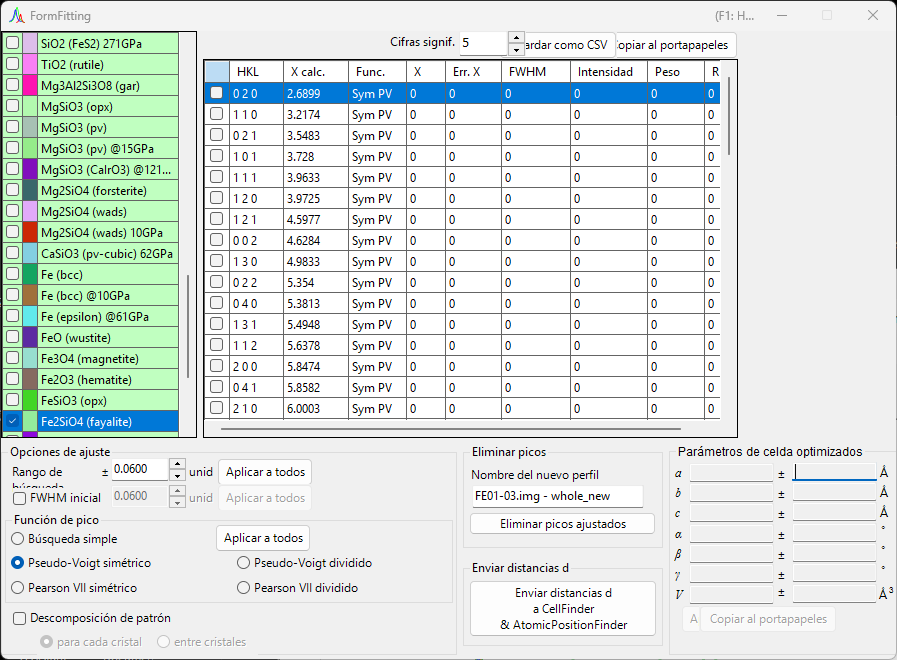
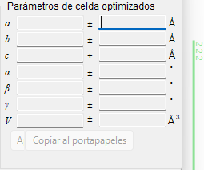
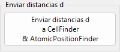
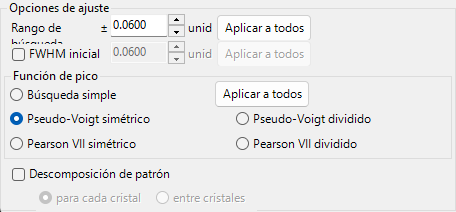
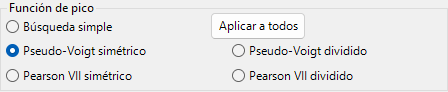
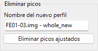
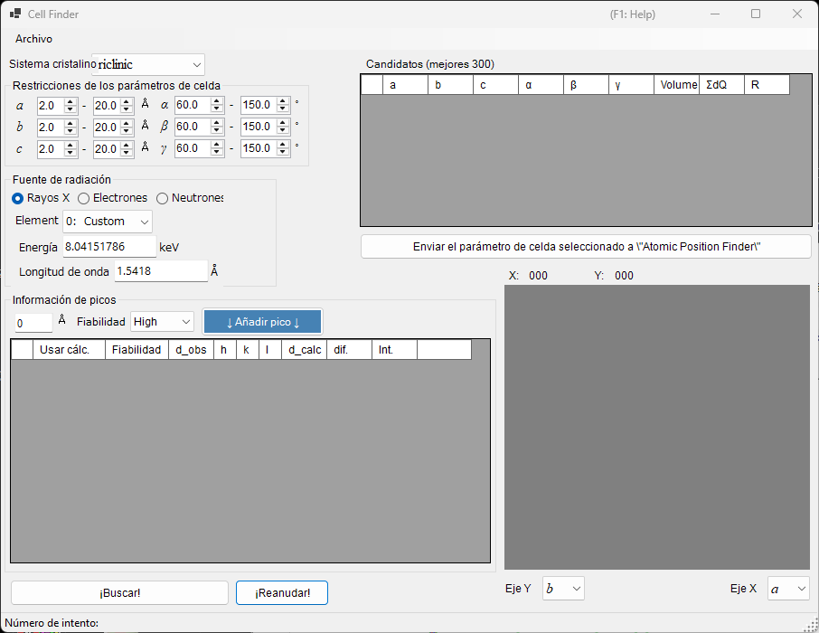
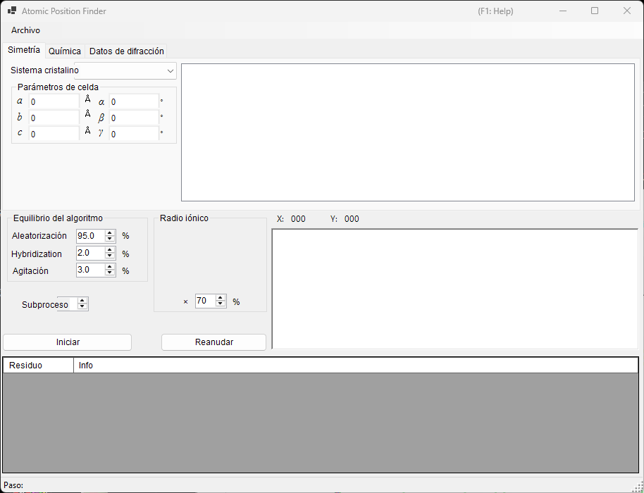

<!-- 260601Cl: migrated from legacy docx + yseto.net web manual -->
# Ajuste de picos de difracción

La herramienta `Fitting diffraction peaks` ajusta los picos de un perfil de difracción con una función adecuada, deduce el espaciado d a partir de la posición 2θ de cada pico y refina los parámetros de red por mínimos cuadrados. Se inicia desde la barra de herramientas de la ventana principal.

## Flujo de trabajo básico

1. Seleccione el cristal de destino en la lista de cristales (en el modo multiperfil, seleccione también el perfil con el que desea trabajar).
2. En la ventana principal, arrastre las líneas de difracción con el ratón para que se superpongan lo más posible a los picos medidos.
3. Elija los índices de las líneas de difracción que desea ajustar en la lista de líneas de difracción (un cuadro de lista con casillas de verificación).
4. Una vez elegidos suficientes índices independientes para que el cálculo de mínimos cuadrados sea resoluble, los parámetros de red más probables aparecen, con sus errores, en el panel `Optimized cell constants` (Parámetros de celda optimizados) en la parte inferior derecha.
5. Pulse `Apply to the crystal` (Aplicar al cristal) para enviar los parámetros de red refinados de vuelta al cristal en el programa principal.

!!! note "Marcar y seleccionar un cristal"
    La lista de cristales refleja la de la ventana principal. Para que el ajuste surta efecto, el cristal de destino debe estar marcado y seleccionado al mismo tiempo.

## Lista de cristales

La lista de cristales en la parte superior izquierda contiene los mismos cristales que la ventana principal. El cristal que marque y seleccione aquí se convierte en el destino del ajuste. Consulte [Parámetros del cristal](3-crystal-parameter.md) para más detalles.

## Lista de líneas de difracción

Aquí se enumeran las líneas de difracción del cristal seleccionado. Al activar la casilla de verificación de una fila, esa línea de difracción se convierte en un destino del ajuste. La lista contiene columnas como las siguientes.

| Columna | Contenido |
| --- | --- |
| `Check` | Si se incluye la línea en el ajuste |
| `PeakColor` | Color de visualización |
| `Crystal` | Nombre del cristal |
| `HKL` | Índices de reflexión |
| `Calc X` | Posición calculada de la línea de difracción |
| `Func` | Función de pico utilizada |
| `X` | Posición del pico obtenida por el ajuste |
| `X Err` | Error de la posición del pico |
| `FWHM` | Anchura total a media altura |
| `Intensity` | Intensidad del pico |
| `Weight` | Peso en el ajuste por mínimos cuadrados |
| `R` | Índice de residuo del ajuste |

Los botones debajo de la lista exportan los resultados.

- `Copy to clipborad`: Copia la tabla al portapapeles. Puede pegarse directamente en Excel y aplicaciones similares.
- `Save as CSV`: Guarda la tabla como un archivo `.csv`. `Effective digit` establece el número de decimales.
- `Clear peaks`: Borra los resultados del ajuste.

## Fitting option (Opciones de ajuste)

Aquí se realizan los ajustes detallados utilizados al ajustar los perfiles de los picos.

### Search Range / Initial FWHM

- `Search Range` (Rango de búsqueda): Establece el rango sobre el cual se realiza el ajuste. Es decir, la región dentro de ±Search Range de la posición calculada de la línea de difracción se toma como destino del ajuste para ese pico.
- `Initial FWHM` (FWHM inicial): Especifica la anchura total a media altura inicial de la función de perfil. Se utiliza como valor de partida para la convergencia por mínimos cuadrados.

Al pulsar `Apply to all` (Aplicar a todos) se aplican los ajustes actuales a todas las líneas de difracción a la vez.

### Peak function (Función de pico)

Selecciona la función de pico utilizada para el ajuste.

| Función de pico | Contenido |
| --- | --- |
| `Simple Search` | No realiza ningún ajuste de función; reconoce el punto de mayor intensidad dentro de ±Search Range de la posición calculada de la línea de difracción como posición del pico. |
| `Symmetric Pseudo Voigt` | Ajusta con una función pseudo-Voigt simétrica a izquierda y derecha. |
| `Symmetric Pearson VII` | Ajusta con una función Pearson VII simétrica a izquierda y derecha. |
| `Split Pseudo Voigt` | Ajusta con una función pseudo-Voigt asimétrica (dividida) a izquierda y derecha. |
| `Split Pearson VII` | Ajusta con una función Pearson VII asimétrica (dividida) a izquierda y derecha. |

!!! tip "Función recomendada"
    A menos que haya una razón particular para no hacerlo, se recomienda `Symmetric Pseudo Voigt` por su estabilidad superior.

La función pseudo-Voigt es una combinación lineal de una gaussiana \(G(x)\) y una lorentziana \(L(x)\) con parámetro de mezcla \(\eta\), dada por:

$$
\mathrm{pV}(x) = \eta\, L(x) + (1-\eta)\, G(x), \qquad 0 \le \eta \le 1
$$

donde \(\eta\) es la fracción de la componente lorentziana. La forma dividida representa un perfil asimétrico tomando parámetros como la FWHM de forma independiente a la izquierda y a la derecha de la posición del pico.

### Pattern Decomposition (Descomposición de patrón)

Cuando los Search Range de dos o más líneas de difracción seleccionadas se solapan, esta opción selecciona si se realiza la descomposición de patrón (ajuste simultáneo de los picos solapados).

- `in each crystal` (para cada cristal): Realiza la descomposición de patrón de forma independiente para cada cristal.
- `between crystals` (entre cristales): Realiza la descomposición de patrón a través de todos los cristales.

## Optimized cell constants (Parámetros de celda optimizados)

Una vez elegidos suficientes índices independientes para que el cálculo de mínimos cuadrados sea resoluble, este panel muestra los parámetros de red más probables \(a, b, c, \alpha, \beta, \gamma\) y el volumen \(V\), cada uno con su error (`±`).

!!! note "Acerca de la indicación NA"
    Cuando los grados de libertad son insuficientes —es decir, cuando los grados de libertad igualan el número de picos ajustados, o cuando un parámetro de red dado no tiene grados de libertad— se muestra `NA` en lugar de un error. Elegir suficientes reflexiones independientes permite calcular los errores.

- `Apply to the crystal` (Aplicar al cristal): Envía los parámetros de red refinados de vuelta al cristal seleccionado en el programa principal.
- `Copy to Clipboard` (Copiar al portapapeles): Copia los parámetros de red optimizados al portapapeles.
- `Reset take off angle` (Restablecer ángulo de salida): Restablece el ángulo de salida.

## Remove fitted peaks (Eliminar picos ajustados)

Esto resta los picos ajustados del perfil y genera el perfil residual como un nuevo perfil. Introduzca el nombre de destino en `New profile name` (Nombre del nuevo perfil) y pulse `Remove fitted peaks` (Eliminar picos ajustados) para realizar la resta. Es útil para comprobar el fondo o la separación de picos solapados.

## Herramientas relacionadas (Send d-values)

Al pulsar `Send d-values to CellFinder && AtomicPositionFinder` se envían los valores d obtenidos del ajuste a las siguientes herramientas de análisis, que también pueden iniciarse desde la barra de herramientas.

### Cell Finder

`Cell Finder` busca la celda unidad (parámetros de red) que explica un conjunto de posiciones de picos medidas (una lista de valores d), trabajando hacia atrás a partir de esas posiciones. Se utiliza para indexar muestras desconocidas.

### Atomic Position Finder

`Atomic Position Finder` busca las posiciones atómicas en una estructura cristalina a partir de magnitudes como las intensidades de las reflexiones observadas.

!!! tip "Identificar una muestra desconocida"
    Tras determinar los parámetros de red con `Cell Finder`, registre ese cristal en la lista de cristales, y podrá refinar los parámetros de red aún más con el ajuste por mínimos cuadrados de esta herramienta.
