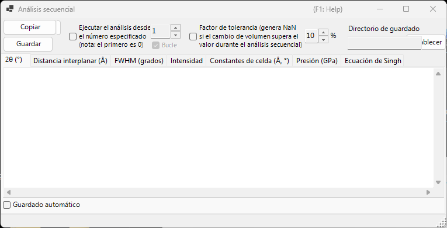
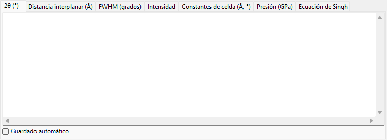
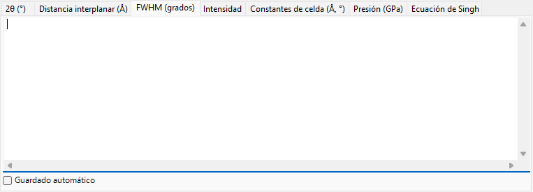
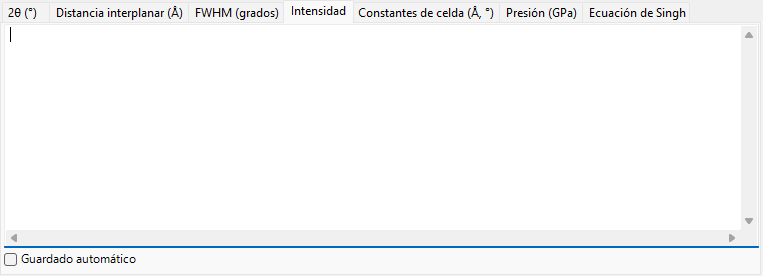
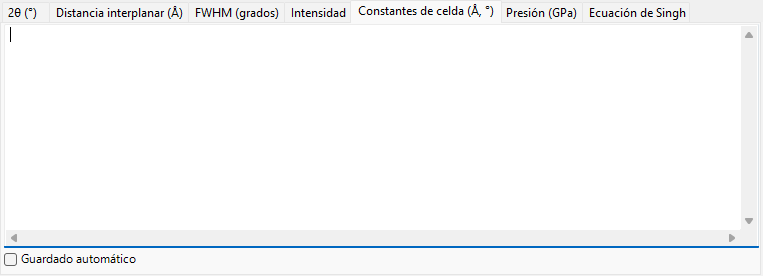
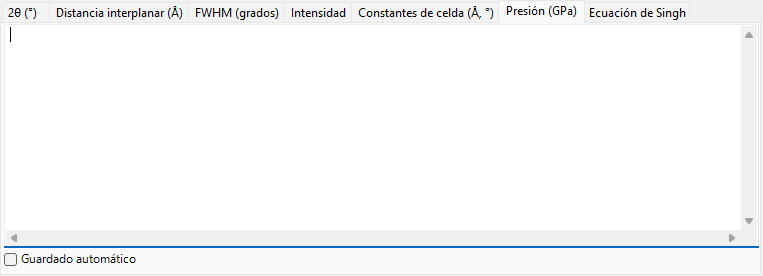
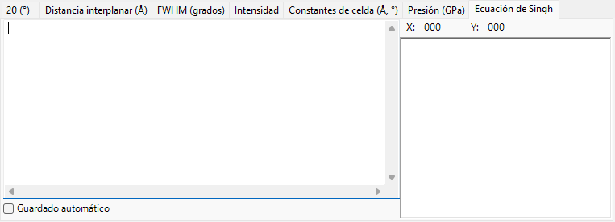

<!-- 260601Cl: migrated from legacy docx + yseto.net web manual -->
# Análisis secuencial

`Análisis secuencial` ejecuta el mismo ajuste de picos sobre muchos perfiles cargados, uno tras otro, y recopila los resultados por magnitud. Está pensado para una serie de perfiles adquiridos mientras varía una condición como la temperatura, la presión o el tiempo: procesa la serie completa de una sola vez y tabula, en su propia pestaña, los resultados de 2θ, espaciado d, FWHM, intensidad, constantes de celda, presión y la ecuación de Singh (análisis de esfuerzo uniaxial / deformación de la red) para cada línea de difracción.

Use el botón `Análisis secuencial` de la barra de herramientas de la ventana principal para abrir y cerrar esta ventana.

!!! note "Compartido con [Ajuste de picos de difracción](6-fitting-diffraction-peaks.md)"
    El análisis secuencial comparte su configuración de ajuste con la ventana `Ajuste de picos de difracción`. Abra primero la ventana `Ajuste de picos de difracción`, seleccione el cristal de destino y marque las líneas de difracción (picos) que desea ajustar. Si no están preparadas cuando pulse `Ejecutar`, un mensaje le pedirá que lo haga.

## Flujo de trabajo básico

1. Cargue la serie completa de perfiles medidos bajo la condición variable (se requieren al menos cuatro perfiles).
2. Abra la ventana [Ajuste de picos de difracción](6-fitting-diffraction-peaks.md), elija el cristal de destino y marque las líneas de difracción que desea analizar. La función de ajuste y el rango de búsqueda que establezca allí los reutiliza el análisis secuencial.
3. Opcionalmente, configure el número de inicio, el bucle, el factor de tolerancia y las opciones de guardado automático (véase más abajo).
4. Pulse `Ejecutar`. Cada perfil cargado se activa por turno, se ejecuta un ajuste por mínimos cuadrados y los resultados se acumulan en cada pestaña.
5. Revise cada pestaña y lleve los datos a una hoja de cálculo (Excel, etc.) con `Copiar` o `Guardar`.

El progreso y el tiempo transcurrido se muestran en la barra de estado, en la parte inferior de la ventana, como `... % completed.  Elapsed time: ... sec`. Cuando termina el análisis, los resultados de 2θ, espaciado d, FWHM e intensidad se copian juntos al portapapeles.

!!! tip "Dos ajustes por perfil"
    Para obtener una convergencia estable, el ajuste por mínimos cuadrados se ejecuta dos veces para cada perfil antes de registrar el resultado.

## Opciones de análisis

Los controles que rodean el botón `Ejecutar` rigen el rango de análisis y el tratamiento de los valores atípicos.

| Opción | Descripción |
| --- | --- |
| `Ejecutar el análisis desde el número especificado (nota: el primero es 0)` | Cuando está marcada, inicia el análisis desde el número de perfil establecido en el cuadro de la derecha, en lugar de desde el primer perfil. El primer perfil es el número 0. |
| `Bucle` | Al iniciar desde un número, procesa también los perfiles anteriores omitidos (0 … inicio − 1) después de llegar al final, dando la vuelta para que se analice la serie completa. Disponible solo cuando el número de inicio está habilitado. |
| `Factor de tolerancia (genera NaN si el cambio de volumen supera el valor durante el análisis secuencial)` | Cuando está marcada, rechaza un ajuste (genera `NaN` para esa fila) cuando el volumen de celda refinado cambia respecto al valor inicial en más del valor (en %) de la derecha. Esto descarta automáticamente los valores atípicos causados por un ajuste fallido. |

## Pestañas de salida

Cada pestaña es una tabla para una magnitud de salida. Cada fila corresponde a un perfil (el nombre del perfil) y cada columna corresponde a una línea de difracción seleccionada (índice hkl, o `Peak No.` para un cristal flexible). Las tablas se mantienen como texto separado por tabuladores y se convierten en valores separados por comas (CSV) cuando las `Copiar` o las `Guardar`.

### 2θ (°)

La posición ajustada del pico, en 2θ (grados), para cada perfil y cada línea de difracción.

### Espaciado d (Å)

El espaciado interplanar d, en Å, calculado a partir de cada posición de pico. Se obtiene de la longitud de onda y de 2θ mediante \( d = \dfrac{\lambda}{2\sin\theta} \).

### FWHM (grados)

La anchura a media altura (FWHM) de cada pico, en grados 2θ, lo que le permite seguir cómo cambian las anchuras de los picos.

### Intensidad

La intensidad integrada (área) de cada pico, útil para seguir los cambios de intensidad que acompañan a las transiciones de fase o a los cambios de textura.

### Constantes de celda (Å, °)

El volumen de celda unidad refinado `V`, las aristas de celda `A`, `B`, `C` (Å), los ángulos axiales `Alpha`, `Beta`, `Gamma` (°) y el error estimado de cada uno (las columnas `_err`) para cada perfil.

### Presión (GPa)

La presión derivada de las constantes de celda de cada perfil mediante una [ecuación de estado](5-equation-of-states.md). Cuando se selecciona un estándar de presión como Gold, Pt, NaCl (B1/B2), MgO, Corundum, Ar, Re, Mo o Pb en la ventana `Equation of State`, aparece una columna por investigador (por escala publicada). Cuando no se selecciona ningún estándar, la presión se calcula a partir de la ecuación de estado asignada al cristal de destino.

### Ecuación de Singh

Los resultados del análisis de esfuerzo uniaxial / deformación de la red de Singh. El número final de cada nombre de perfil se interpreta como el ángulo azimutal \( \psi \) (grados), y para cada reflexión la relación azimut-versus-d se ajusta por mínimos cuadrados (Levenberg–Marquardt). Para cada reflexión proporciona el espaciado de red libre de esfuerzo `d0`, el azimut de deformación máxima `Ψmax` y una magnitud proporcional al esfuerzo `t/6Ghkl` (la razón entre el esfuerzo diferencial \( t \) y el módulo de corte \( G_{hkl} \)). Las curvas ajustadas también se dibujan en el gráfico de la pestaña.

!!! note "Cuándo se aplica la ecuación de Singh"
    Esta pestaña opera sobre una serie en "modo de análisis de esfuerzo" cuyos nombres de perfil terminan en `...-whole`. Cada nombre de perfil debe llevar un ángulo azimutal como su token final (por ejemplo `...-30`). Para una serie ordinaria, esta pestaña no se actualiza.

El espaciado de red dependiente del azimut expresado por la ecuación de Singh es aproximadamente

$$ d(\psi) = d_0 \left[ 1 + \alpha - 3\,\alpha \left( 1 - \frac{\lambda^2}{4 d^2} \right) \cos^2(\psi - \psi_{\max}) \right] $$

donde \( \alpha \) corresponde a `t/6Ghkl` y \( \psi_{\max} \) es el azimut de máxima deformación.

## Exportación de los resultados

| Acción | Descripción |
| --- | --- |
| `Copiar` | Copia la pestaña mostrada actualmente al portapapeles como CSV (separado por comas). |
| `Guardar` | Guarda la pestaña mostrada actualmente como un archivo CSV (el nombre de archivo se elige en un cuadro de diálogo). |

### Guardado automático

Cada pestaña tiene una casilla `Guardado automático` para que la magnitud correspondiente se escriba en un archivo CSV automáticamente después de `Ejecutar`. El destino se muestra en `Directorio de guardado` y se elige con el botón `Establecer`. El nombre de archivo se construye a partir de la parte común de los nombres de perfil, con un sufijo por magnitud: `_2theta.csv`, `_d.csv`, `_fwhm.csv`, `_intensity.csv`, `_cell.csv`, `_pressure.csv` o `_Singh.csv`.

!!! tip "Configurar la carpeta de destino"
    Si el guardado automático está marcado pero la carpeta de destino no está establecida (no existe), se abre un cuadro de diálogo de selección de carpeta al pulsar `Ejecutar`.

## Uso desde una macro

Cada salida del análisis secuencial también está disponible desde una macro (script de Python). Estas corresponden a la clase `PDI.Sequential` en [Macro](8-macro.md).

| Función de macro | Pestaña correspondiente |
| --- | --- |
| `PDI.Sequential.Open()` / `Close()` | Abrir / cerrar la ventana |
| `PDI.Sequential.Execute()` | Ejecutar el análisis secuencial |
| `PDI.Sequential.GetCSV_2theta()` | 2θ |
| `PDI.Sequential.GetCSV_D()` | Espaciado d |
| `PDI.Sequential.GetCSV_FWHM()` | FWHM |
| `PDI.Sequential.GetCSV_Intensity()` | Intensidad |
| `PDI.Sequential.GetCSV_CellConstants()` | Constantes de celda |
| `PDI.Sequential.GetCSV_Pressure()` | Presión |
| `PDI.Sequential.GetCSV_Singh()` | Ecuación de Singh |

Cada `GetCSV_...()` devuelve la pestaña correspondiente como una cadena CSV. `PDI.Sequential.Directory` obtiene/establece la carpeta de destino, y combinándola con `PDI.File.SaveText(...)` se escriben los resultados en archivos. Consulte [Macro](8-macro.md) para más detalles.
