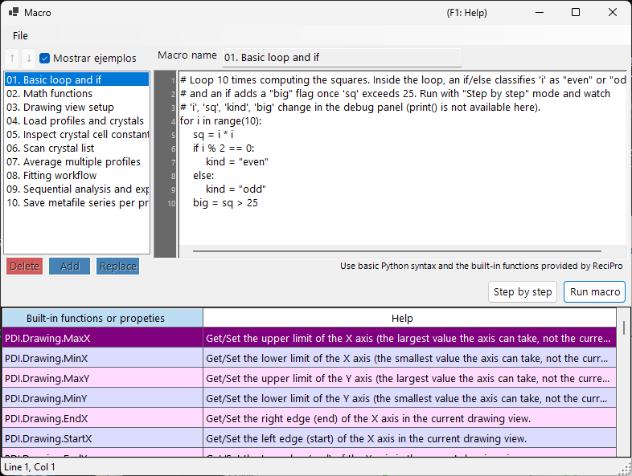

<!-- 260601Cl: migrated from legacy docx + yseto.net web manual -->
# Macro

La mayoría de las operaciones de PDIndexer se pueden automatizar con la función **Macro**. Las macros son scripts de Python escritos en [IronPython](https://ironpython.net/) (una implementación de Python que se ejecuta sobre .NET), que se editan y ejecutan en una ventana de editor de macros dedicada. Úselas para automatizar tareas repetitivas, procesar varios archivos por lotes y exportar resultados a archivos CSV o de imagen de forma masiva.



!!! note "Conocimientos básicos de Python"
    Las macros aceptan directamente la sintaxis estándar de Python (bucles `for`, `if`/`else`, listas, funciones, etc.). Esta página no explica el lenguaje Python en sí. La funcionalidad específica de PDIndexer se invoca a través del objeto `PDI` que se describe más abajo.

## Abrir el editor de macros

En la barra de menú de la ventana principal, elija **Macro → Editor** para abrir la ventana del editor de macros (con el título `Macro`).

Las macros creadas y guardadas en el editor también aparecen por nombre en el menú **Macro**, de modo que puede ejecutarlas directamente desde el menú. La lista de macros se guarda automáticamente al cerrar PDIndexer y se restaura en el siguiente inicio.

## Disposición de la ventana del editor

La ventana del editor consta de las siguientes partes.

| Parte | Descripción |
| --- | --- |
| Lista de macros (izquierda) | Una lista con los nombres de las macros guardadas. Haga clic en una entrada para cargar esa macro en el editor de la derecha. |
| Editor de código (centro) | El área donde se escribe el script de Python. Admite un margen con números de línea, sangría automática, autocompletado de entrada (auto-complete) y descripciones emergentes de funciones. |
| Tabla de referencia de funciones | Una tabla con todas las funciones disponibles bajo `PDI`. Haga doble clic en una celda para insertar el nombre de esa función en el código en la posición del cursor. |
| Panel de depuración (derecha) | Muestra los nombres y valores de las variables en el punto actual durante la ejecución paso a paso. |
| Barra de estado | Muestra la posición actual del cursor (`Line` / `Col`). |

### Botones de operación de la lista

Use los siguientes botones para editar la lista de macros.

| Botón | Acción |
| --- | --- |
| `Add` | Añade el código actual a la lista con el nombre escrito en el cuadro de nombre (pide confirmación de sobrescritura si el nombre ya existe). |
| `Replace` | Reemplaza la macro seleccionada en la lista por el código actual. |
| `Delete` | Elimina la macro seleccionada de la lista. |
| `↑` / `↓` | Mueve la macro seleccionada hacia arriba o hacia abajo dentro de la lista. |
| `Show samples` | Alterna la visualización de las macros de ejemplo integradas (véase más abajo). |

!!! tip "Guardar y cargar"
    Las macros se pueden guardar y cargar como archivos `.mcr` individuales. Arrastre y suelte un archivo `.mcr` sobre la ventana del editor para cargar su contenido. Al pulsar `Ctrl+S` después de editar se sobrescribe la macro seleccionada actualmente.

## Ejecutar una macro

Ejecute la macro con los botones situados en la parte inferior del editor de código.

| Botón | Acción |
| --- | --- |
| `Run macro` | Ejecuta la macro de forma normal, hasta el final. |
| `Step by step` | Ejecuta la macro línea por línea. Se detiene antes de cada línea y muestra los valores actuales de las variables en el panel de depuración de la derecha. |
| `Next step (F10)` | Avanza a la siguiente línea durante la ejecución paso a paso (la tecla `F10` también funciona). |
| `Stop` | Aborta la ejecución. El aborto solo surte efecto durante la ejecución en modo `Step by step`. |

!!! warning "print() no está disponible"
    El editor de macros no tiene una consola de salida estándar, por lo que la salida de `print()` no se muestra. Para inspeccionar los valores de las variables, ejecute la macro en modo `Step by step` y observe cómo cambian los valores en el panel de depuración.

### Macros de ejemplo

Al marcar el botón `Show samples` se muestran en la lista las macros de ejemplo integradas (de solo lectura). Los ejemplos se muestran en el idioma actual de la interfaz (inglés/japonés). Úselos como referencia al escribir sus propias macros. Los ejemplos integrados son:

| Nombre | Contenido |
| --- | --- |
| 01. Basic loop and if | Conceptos básicos de los bucles `for` y `if`/`else` |
| 02. Math functions | Uso del módulo `math` (`pi`, `sin`, `sqrt`, `exp`, `log`, etc.) |
| 03. Drawing view setup | Definir el rango de vista con `PDI.Drawing.SetBounds` |
| 04. Load profiles and crystals | `PDI.File.ReadProfiles` / `ReadCrystals` |
| 05. Inspect crystal cell constants | Lectura de los parámetros de red, el volumen y la presión mediante `PDI.Crystal` |
| 06. Scan crystal list | Recorrer todo `PDI.CrystalList` |
| 07. Average multiple profiles | `PDI.ProfileOperator.Average` |
| 08. Fitting workflow | Una secuencia completa de `PDI.Fitting` |
| 09. Sequential analysis and export | Ejecutar `PDI.Sequential` y exportar CSV |
| 10. Save metafile series per profile | Guardar un EMF por perfil de forma masiva |

!!! note "El módulo math ya está importado"
    `import math` se ejecuta automáticamente al iniciar el editor, por lo que puede usar el módulo `math` directamente, p. ej. `math.sqrt(2)`, sin una sentencia `import` explícita.

---

## Referencia de funciones

Toda la funcionalidad específica de PDIndexer se invoca a través de las clases bajo el objeto raíz `PDI`. `PDI` ya está disponible en el ámbito de la macro, por lo que no se necesita ningún `import`.

Cada una de las tablas siguientes se transcribe de los atributos `[Help]` del código fuente. La misma lista aparece en la tabla de referencia de funciones dentro de la ventana del editor y en [la sección 6 del manual web](https://yseto.net/soft/pdi/pdi_06).

!!! note "Notación"
    En la columna de la firma, `(get/set)` indica una propiedad de lectura/escritura y `(get)` una propiedad de solo lectura. Un argumento con `= value` es un argumento por defecto y puede omitirse.

### PDI (raíz)

| Miembro | Firma | Descripción |
| --- | --- | --- |
| `Sleep` | `Sleep(int millisec)` | Pausa la ejecución de la macro durante los milisegundos indicados. |
| `Obj` | `Obj (get/set)` | Obtiene/Establece objetos pasados desde otro programa (argumentos entre procesos). |

### PDI.File — Entrada/salida de archivos

| Miembro | Firma | Descripción |
| --- | --- | --- |
| `GetDirectoryPath` | `GetDirectoryPath(string filename = "")` | Obtiene una ruta de directorio (con barra invertida final). Si se omite `filename`, se abre un cuadro de diálogo de selección de carpeta. De lo contrario, se devuelve la parte del directorio de `filename`. |
| `GetFileName` | `GetFileName()` | Abre un cuadro de diálogo de selección de archivo y devuelve la ruta completa del archivo elegido. Devuelve una cadena vacía si el usuario cancela. |
| `GetFileNames` | `GetFileNames()` | Abre un cuadro de diálogo de archivos de selección múltiple y devuelve las rutas completas de los archivos elegidos. Devuelve un array vacío si el usuario cancela. |
| `ReadProfiles` | `ReadProfiles(string filename)` | Lee los datos de perfil del archivo indicado. Si se omite `filename` (o no existe), se abre un cuadro de diálogo de selección de archivo. |
| `SaveProfiles` | `SaveProfiles(string filename)` | Guarda los datos de perfil en el archivo indicado. Si se omite `filename`, se abre un cuadro de diálogo de guardado. |
| `ReadCrystals` | `ReadCrystals(string filename)` | Lee los datos de cristal del archivo indicado. Si se omite `filename` (o no existe), se abre un cuadro de diálogo de selección de archivo. |
| `SaveCrystals` | `SaveCrystals(string filename)` | Guarda los datos de cristal en el archivo indicado. Si se omite `filename`, se abre un cuadro de diálogo de guardado. |
| `SaveMetafile` | `SaveMetafile(string filename)` | Guarda el patrón actual como un metarchivo de Windows (`.emf`). Si se omite `filename`, se abre un cuadro de diálogo de guardado. |
| `SaveText` | `SaveText(string text, string filename)` | Guarda el contenido de texto indicado en un archivo `.txt`. Si se omite `filename`, se abre un cuadro de diálogo de guardado. |

### PDI.Drawing — Vista de dibujo

| Miembro | Firma | Descripción |
| --- | --- | --- |
| `MaxX` | `MaxX (get/set)` | Obtiene/Establece el límite superior del eje X (el valor máximo que puede tomar el eje, no la vista actual). |
| `MinX` | `MinX (get/set)` | Obtiene/Establece el límite inferior del eje X (el valor mínimo que puede tomar el eje, no la vista actual). |
| `MaxY` | `MaxY (get/set)` | Obtiene/Establece el límite superior del eje Y (el valor máximo que puede tomar el eje, no la vista actual). |
| `MinY` | `MinY (get/set)` | Obtiene/Establece el límite inferior del eje Y (el valor mínimo que puede tomar el eje, no la vista actual). |
| `EndX` | `EndX (get/set)` | Obtiene/Establece el borde derecho (final) del eje X en la vista de dibujo actual. |
| `StartX` | `StartX (get/set)` | Obtiene/Establece el borde izquierdo (inicio) del eje X en la vista de dibujo actual. |
| `EndY` | `EndY (get/set)` | Obtiene/Establece el borde superior (final) del eje Y en la vista de dibujo actual. |
| `StartY` | `StartY (get/set)` | Obtiene/Establece el borde inferior (inicio) del eje Y en la vista de dibujo actual. |
| `SetBounds` | `SetBounds(double startX, double endX, double startY, double endY)` | Define la vista de dibujo indicando los cuatro bordes (StartX, EndX, StartY, EndY). |

### PDI.Crystal — Cristal seleccionado

Los parámetros de red `CellA`–`CellC` se expresan en \( \mathrm{\AA} \), y `CellAlpha`–`CellGamma` en grados (deg).

| Miembro | Firma | Descripción |
| --- | --- | --- |
| `CellVolume` | `CellVolume (get)` | Obtiene el volumen de la celda (\( \mathrm{\AA}^3 \)) del cristal seleccionado. Devuelve 0 si no hay ningún cristal seleccionado. |
| `Pressure` | `Pressure(double volume = 0)` | Obtiene la presión (GPa) del cristal seleccionado calculada a partir de su EOS. Si `volume` es 0 (por defecto), se usa el volumen de celda actual. |
| `Name` | `Name (get/set)` | Obtiene/Establece el nombre del cristal seleccionado. |
| `CellA` | `CellA (get/set)` | Obtiene/Establece el parámetro de red a (\( \mathrm{\AA} \)) del cristal seleccionado. |
| `CellB` | `CellB (get/set)` | Obtiene/Establece el parámetro de red b (\( \mathrm{\AA} \)) del cristal seleccionado. |
| `CellC` | `CellC (get/set)` | Obtiene/Establece el parámetro de red c (\( \mathrm{\AA} \)) del cristal seleccionado. |
| `CellAlpha` | `CellAlpha (get/set)` | Obtiene/Establece el parámetro de red alfa (deg) del cristal seleccionado. |
| `CellBeta` | `CellBeta (get/set)` | Obtiene/Establece el parámetro de red beta (deg) del cristal seleccionado. |
| `CellGamma` | `CellGamma (get/set)` | Obtiene/Establece el parámetro de red gamma (deg) del cristal seleccionado. |

### PDI.CrystalList — Lista de cristales

| Miembro | Firma | Descripción |
| --- | --- | --- |
| `Open` | `Open()` | Abre la ventana 'Lista de cristales'. |
| `Close` | `Close()` | Cierra la ventana 'Lista de cristales'. |
| `Count` | `Count (get)` | Obtiene el número total de cristales de la lista. |
| `SelectedName` | `SelectedName (get)` | Obtiene el nombre del cristal seleccionado actualmente. Devuelve una cadena vacía si no hay ningún cristal seleccionado. |
| `SelectedIndex` | `SelectedIndex (get/set)` | Obtiene/Establece el índice del cristal seleccionado actualmente. |
| `Select` | `Select(int index)` | Selecciona el cristal en el índice indicado. |
| `Check` | `Check(int index = -1, bool state = true)` | Marca o desmarca el cristal en el índice indicado. Si `index` es -1, se aplica al cristal seleccionado actualmente. |
| `Uncheck` | `Uncheck(int index = -1)` | Desmarca el cristal en el índice indicado. Si `index` es -1, se desmarca el cristal seleccionado actualmente. |
| `GetCellVolume` | `GetCellVolume (get)` | Obtiene el volumen de la celda (\( \mathrm{\AA}^3 \)) del cristal seleccionado. Igual que `PDI.Crystal.CellVolume`; se conserva por compatibilidad con versiones anteriores. |

### PDI.Profile — Perfil seleccionado

| Miembro | Firma | Descripción |
| --- | --- | --- |
| `Comment` | `Comment (get/set)` | Obtiene/Establece el texto del comentario del perfil seleccionado actualmente. |
| `Name` | `Name (get/set)` | Obtiene/Establece el nombre visible del perfil seleccionado actualmente. |

### PDI.ProfileOperator — Aritmética de perfiles

Cada perfil se especifica por su índice en la lista. `output` es el nombre que se da al perfil resultante.

| Miembro | Firma | Descripción |
| --- | --- | --- |
| `Average` | `Average(int[] indices, string output)` | Calcula el promedio de los perfiles cuyos índices se enumeran en `indices` (p. ej. `[1,3,5,9]`). `output` es el nombre que se da al perfil resultante. |
| `AddTwoProfiles` | `AddTwoProfiles(int index1, int index2, string output)` | Calcula profile1 + profile2. Cada perfil se especifica por su índice. `output` es el nombre que se da al perfil resultante. |
| `SubtractTwoProfiles` | `SubtractTwoProfiles(int index1, int index2, string output)` | Calcula profile1 − profile2. Cada perfil se especifica por su índice. `output` es el nombre que se da al perfil resultante. |
| `MultiplyTwoProfiles` | `MultiplyTwoProfiles(int index1, int index2, string output)` | Calcula profile1 × profile2. Cada perfil se especifica por su índice. `output` es el nombre que se da al perfil resultante. |
| `DivideTwoProfiles` | `DivideTwoProfiles(int index1, int index2, string output)` | Calcula profile1 ÷ profile2. Cada perfil se especifica por su índice. `output` es el nombre que se da al perfil resultante. |

### PDI.ProfileList — Lista de perfiles

| Miembro | Firma | Descripción |
| --- | --- | --- |
| `Open` | `Open()` | Abre la ventana 'Lista de perfiles'. |
| `Close` | `Close()` | Cierra la ventana 'Lista de perfiles'. |
| `DeleteAll` | `DeleteAll()` | Elimina todos los perfiles de la lista (sin cuadro de diálogo de confirmación). |
| `Delete` | `Delete(int index)` | Elimina el perfil en el índice indicado. |
| `Count` | `Count (get)` | Obtiene el número total de perfiles de la lista. |
| `SelectedName` | `SelectedName (get)` | Obtiene el nombre del perfil seleccionado actualmente. Devuelve una cadena vacía si no hay ningún perfil seleccionado. |
| `SelectedIndex` | `SelectedIndex (get/set)` | Obtiene/Establece el índice del perfil seleccionado actualmente. |
| `Select` | `Select(int index)` | Selecciona el perfil en el índice indicado. |
| `Check` | `Check(int index = -1, bool state = true)` | Marca o desmarca el perfil en el índice indicado. Si `index` es -1, se aplica al perfil seleccionado actualmente. |
| `Uncheck` | `Uncheck(int index = -1)` | Desmarca el perfil en el índice indicado. Si `index` es -1, se desmarca el perfil seleccionado actualmente. |
| `CheckAll` | `CheckAll()` | Marca todos los perfiles de la lista. |
| `UncheckAll` | `UncheckAll()` | Desmarca todos los perfiles de la lista. |

### PDI.Fitting — Ajuste de picos

Opera la ventana de [Ajuste de picos](6-fitting-diffraction-peaks.md).

| Miembro | Firma | Descripción |
| --- | --- | --- |
| `Open` | `Open()` | Abre la ventana 'Ajuste de picos'. |
| `Close` | `Close()` | Cierra la ventana 'Ajuste de picos'. |
| `Apply` | `Apply()` | Aplica los parámetros de red optimizados al cristal seleccionado (equivale a hacer clic en el botón `Confirm` de la ventana de ajuste). |
| `Check` | `Check(int index = -1, bool state = true)` | Marca o desmarca el plano reticular en el índice indicado. Si `index` es -1, se aplica al plano seleccionado actualmente. |
| `Uncheck` | `Uncheck(int index = -1)` | Desmarca el plano reticular en el índice indicado. Si `index` es -1, se desmarca el plano seleccionado actualmente. |
| `Select` | `Select(int index)` | Selecciona el plano reticular en el índice indicado. |
| `SelectedIndex` | `SelectedIndex (get/set)` | Obtiene/Establece el índice del plano reticular seleccionado actualmente. |
| `Range` | `Range(double range)` | Define el rango de búsqueda de picos para el plano reticular seleccionado actualmente (en la misma unidad que el eje X). |

### PDI.Sequential — Análisis secuencial

Opera la ventana de [Análisis secuencial](7-sequential-analysis.md). Los métodos de obtención de CSV devuelven los resultados del último análisis secuencial como una cadena CSV.

| Miembro | Firma | Descripción |
| --- | --- | --- |
| `Directory` | `Directory (get/set)` | Obtiene/Establece la ruta completa del directorio donde se guardan los resultados del análisis secuencial. |
| `Open` | `Open()` | Abre la ventana 'Análisis secuencial'. |
| `Close` | `Close()` | Cierra la ventana 'Análisis secuencial'. |
| `Execute` | `Execute()` | Ejecuta el análisis secuencial sobre todos los perfiles marcados. |
| `GetCSV_2theta` | `GetCSV_2theta()` | Obtiene los resultados de 2-theta del último análisis secuencial como una cadena CSV. |
| `GetCSV_D` | `GetCSV_D()` | Obtiene los resultados de espaciado d del último análisis secuencial como una cadena CSV. |
| `GetCSV_FWHM` | `GetCSV_FWHM()` | Obtiene los resultados de FWHM del último análisis secuencial como una cadena CSV. |
| `GetCSV_Intensity` | `GetCSV_Intensity()` | Obtiene los resultados de intensidad de pico del último análisis secuencial como una cadena CSV. |
| `GetCSV_CellConstants` | `GetCSV_CellConstants()` | Obtiene los resultados de parámetros de red del último análisis secuencial como una cadena CSV. |
| `GetCSV_Pressure` | `GetCSV_Pressure()` | Obtiene los resultados de presión del último análisis secuencial como una cadena CSV. |
| `GetCSV_Singh` | `GetCSV_Singh()` | Obtiene los resultados de la ecuación de Singh del último análisis secuencial como una cadena CSV. |
| `AutoSave2theta` | `AutoSave2theta (get/set)` | Obtiene/Establece si los resultados de 2-theta se guardan automáticamente tras cada ejecución del análisis secuencial. |
| `AutoSaveDspacing` | `AutoSaveDspacing (get/set)` | Obtiene/Establece si los resultados de espaciado d se guardan automáticamente tras cada ejecución del análisis secuencial. |
| `AutoSaveFWHM` | `AutoSaveFWHM (get/set)` | Obtiene/Establece si los resultados de FWHM se guardan automáticamente tras cada ejecución del análisis secuencial. |
| `AutoSaveIntensity` | `AutoSaveIntensity (get/set)` | Obtiene/Establece si los resultados de intensidad de pico se guardan automáticamente tras cada ejecución del análisis secuencial. |
| `AutoSaveCellConstants` | `AutoSaveCellConstants (get/set)` | Obtiene/Establece si los resultados de parámetros de red se guardan automáticamente tras cada ejecución del análisis secuencial. |
| `AutoSavePressure` | `AutoSavePressure (get/set)` | Obtiene/Establece si los resultados de presión se guardan automáticamente tras cada ejecución del análisis secuencial. |
| `AutoSaveSingh` | `AutoSaveSingh (get/set)` | Obtiene/Establece si los resultados de la ecuación de Singh se guardan automáticamente tras cada ejecución del análisis secuencial. |

## Ejemplo de macro

Como uno de los ejemplos integrados, a continuación se muestra una macro que ejecuta el análisis secuencial y guarda los resultados en CSV.

```python
# Check all profiles, run sequential analysis, then obtain 2-theta / d-spacing /
# cell-constant / pressure results as CSV strings and save each to a file.
PDI.ProfileList.CheckAll()
PDI.Sequential.Open()
PDI.Sequential.Execute()
dir_path = PDI.File.GetDirectoryPath()
PDI.File.SaveText(PDI.Sequential.GetCSV_2theta(),        dir_path + "seq_2theta.csv")
PDI.File.SaveText(PDI.Sequential.GetCSV_D(),             dir_path + "seq_d.csv")
PDI.File.SaveText(PDI.Sequential.GetCSV_CellConstants(), dir_path + "seq_cell.csv")
PDI.File.SaveText(PDI.Sequential.GetCSV_Pressure(),      dir_path + "seq_pressure.csv")
```

Puede consultar los demás ejemplos desde el botón `Show samples` del editor.
