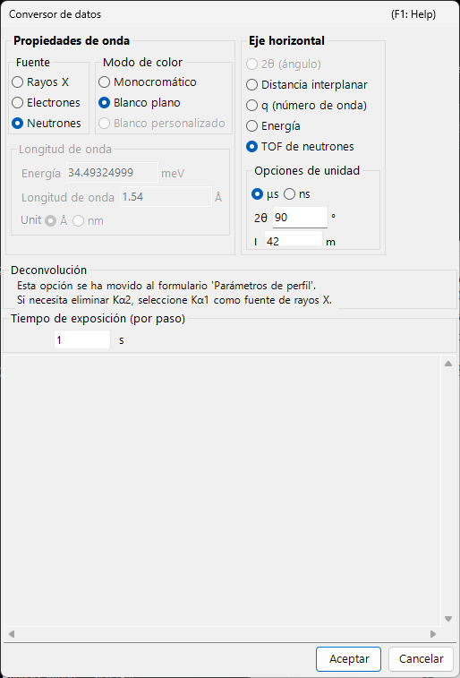
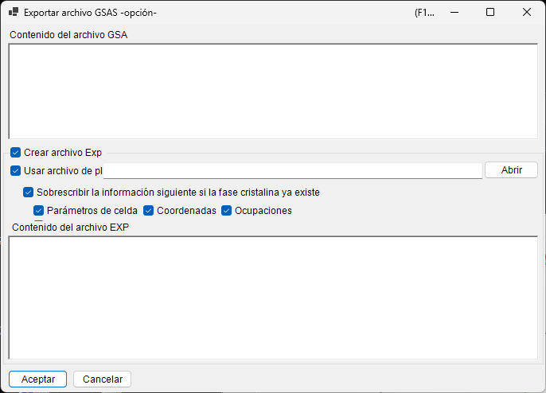

<!-- 260601Cl: migrated from legacy docx + yseto.net web manual -->
# Formatos de archivo

Los archivos que PDIndexer lee y escribe se dividen en tres grupos: **datos de perfil**, **listas de cristales / estructuras cristalinas** y **salida de dibujo**. Todas estas operaciones de E/S se realizan desde el menú **Archivo (File)** de la [ventana principal](../1-main-window.md).

Esta página resume en forma de tabla las extensiones admitidas, la dirección de E/S y las notas.

---

## Datos de perfil

### Lectura (Leer perfil(es))

**Archivo → Leer perfil(es) (Read profile(s))** permite cargar varios archivos a la vez. Además del formato propio de PDIndexer `pdi` / `pdi2`, admite diversos formatos de texto y binarios de ángulo frente a intensidad (o energía frente a intensidad), como el `csv` de WinPIP, el `chi` de Fit2D y el `ras` de Rigaku. Incluso los formatos no listados a continuación se pueden leer normalmente: cualquier archivo de texto sencillo de ángulo frente a intensidad recurre a un analizador genérico.

| Extensión | Origen / formato | Notas |
| --- | --- | --- |
| `pdi` / `pdi2` | Formato nativo de PDIndexer | Conserva el perfil junto con su información asociada (fuente de radiación, longitud de onda, tiempo de exposición, etc.). `pdi2` es la versión actual. El cuadro de diálogo Data Converter no se muestra al leer estos. |
| `csv` | Salida de WinPIP (separado por comas: `angle,intensity`) | Se importa mediante el cuadro de diálogo Data Converter, donde se especifica el significado del eje horizontal, la fuente de radiación y la longitud de onda. |
| `tsv` | Separado por tabuladores (`angle` `[TAB]` `intensity`) | Se importa como texto genérico. |
| `chi` | Salida de Fit2D | Las líneas de encabezado iniciales se omiten; las columnas 2 y 4 de los datos de cuatro columnas se toman como ángulo e intensidad. |
| `ras` | Formato de Rigaku | Formato de texto que también contiene información del instrumento. |
| `nxs` | NeXus / HDF5 (SSD, varios detectores) | Puede contener varios canales (histogramas); cada uno se calibra en energía y se importa por separado. |
| `npd` | Perfil EDX (SSD) | Lee `EGC0/1/2`, `2Theta`, `Live time`, etc. del encabezado y convierte el número de canal en energía. |
| `xbm` | Formato binario EDX (p. ej. SP-8 BL04B2) | Los metadatos como el nombre de la muestra, las condiciones de medición y los coeficientes de calibración EGC se importan como comentario. |
| `rpt` | Formato Genie (SSD) | Lee el ángulo de salida (take-off), el tiempo de exposición y el EGC del encabezado. |
| `xy` | Texto de dos columnas calibrado con pyFAI | Lee la longitud de onda del encabezado e importa ángulo frente a intensidad. |
| `gsa` | Datos GSAS (bloque `BANK`) | Importa las tres columnas: ángulo, intensidad y error. |
| Otro | Texto genérico de ángulo frente a intensidad | El delimitador (coma / espacio en blanco / tabulador) se detecta automáticamente (mediante el cuadro de diálogo Data Converter). |

!!! note "Cargar varios archivos a la vez"
    Al seleccionar y leer varios archivos, después de confirmar la configuración del Data Converter para el primer archivo aparece un mensaje que pregunta si se desea reutilizar la misma configuración para los archivos restantes. Al elegir **Sí (Yes)** el resto se procesa sin mostrar el cuadro de diálogo, lo que acelera la carga.

### Cuadro de diálogo Data Converter

Al leer cualquier archivo distinto de `pdi` / `pdi2` (`csv`, `chi`, `ras`, `nxs`, `npd`, `xbm`, `rpt`, `xy`, `gsa` y texto genérico), se abre el cuadro de diálogo **Data Converter**. Es donde se asignan las columnas numéricas importadas a las magnitudes físicas correctas que PDIndexer utiliza internamente.

El cuadro de diálogo ofrece la siguiente configuración.

| Ajuste | Descripción |
| --- | --- |
| Eje horizontal (Horizontal Axis) | La magnitud física (2θ, energía, espaciado d, número de onda, TOF, etc.) y la unidad representadas por la primera columna importada. |
| Fuente de radiación / longitud de onda | Rayos X / neutrones / electrones, y la línea característica de rayos X (Kα, etc.) o la longitud de onda. Esto determina la conversión a espaciado d y 2θ. |
| Tiempo de exposición (por paso) | El tiempo de exposición por paso en segundos. Se usa para la visualización en CPS y la normalización de intensidad. |
| Para datos SSD | Para datos SSD (EDX) como `rpt` / `npd` / `xbm` / `nxs`, defina los coeficientes \(a_0, a_1, a_2\) que convierten el número de canal \(n\) en energía \(E\). Cuando hay varios detectores, puede activar/desactivar cada uno y definir sus coeficientes de forma individual. |
| Corte de baja energía | Cuando está marcado, los puntos de datos por debajo de la energía especificada se excluyen al importar. |

Para los datos SSD, el número de canal \(n\) se convierte en energía \(E\) (en eV) mediante una calibración cuadrática:

$$
E = a_0 + a_1\,n + a_2\,n^2
$$

Al leer texto genérico (un formato "otro"), el cuadro de diálogo muestra el contenido real del archivo en un cuadro de texto para que pueda definir el eje horizontal, la fuente de radiación, etc. mientras inspecciona los datos. El delimitador (coma / espacio en blanco / tabulador) y el número de líneas de encabezado iniciales que se omiten se detectan automáticamente.

!!! tip "Vigilancia del portapapeles / de una carpeta"
    Activar **Opciones → Vigilar portapapeles (Watch Clipboard)** permite que PDIndexer importe automáticamente perfiles copiados desde otras aplicaciones como IPAnalyzer. Activar **Vigilar archivo (Watch File)** lee automáticamente los archivos `pdi` recién creados en una carpeta elegida.

### Guardado y exportación

**Archivo → Guardar perfil(es) (Save profile(s))** guarda todos los perfiles cargados en el formato nativo `pdi2` de PDIndexer.

**Archivo → Exportar el/los perfil(es) seleccionado(s) (Export the selected profile(s))** escribe el perfil seleccionado en uno de los siguientes formatos.

| Extensión / formato | Dirección | Notas |
| --- | --- | --- |
| `pdi2` | Salida | Formato nativo de PDIndexer. Guarda todos los perfiles a la vez. |
| `csv` | Salida | Separado por comas (ángulo, intensidad). |
| `tsv` | Salida | Separado por tabuladores (ángulo e intensidad separados por un tabulador). |
| `gsa` (GSAS) | Salida | Formato GSAS para análisis Rietveld. Puede revisar el contenido en la pantalla de exportación que se muestra a continuación. |

#### Exportación en formato GSAS

Al elegir el formato GSAS, aparece una pantalla de exportación para que pueda revisar lo que se escribirá. La línea 1 es el nombre del perfil, la línea 2 es un encabezado `BANK 1 … CONST … FXYE` y las líneas siguientes contienen tres columnas: ángulo, intensidad y error. El error se toma de los propios datos de error del perfil cuando están presentes; de lo contrario, se usa \(\sqrt{\text{intensity}}\).

!!! note "Escalado del ángulo"
    Para datos ordinarios dispersivos en ángulo, los valores de ángulo se escriben multiplicados por 100 (la convención `CONST` de GSAS). Para datos de neutrones TOF, los valores se escriben tal cual, sin escalado.

---

## Listas de cristales y estructuras cristalinas

Las listas de cristales se guardan y cargan como archivos XML (extensión `xml`). Las estructuras cristalinas individuales se pueden importar desde CIF / AMC. Consulte [Parámetros del cristal](../3-crystal-parameter.md) para más detalles.

| Operación (menú Archivo) | Extensión | Dirección | Notas |
| --- | --- | --- | --- |
| Cargar cristales (como nueva lista) | `xml` | Entrada | Carga una lista de cristales y reemplaza la lista actual (la lista actual se descarta). |
| Cargar cristales (y añadir a la lista actual) | `xml` | Entrada | Carga una lista de cristales y la añade al final de la lista actual. |
| Guardar cristales | `xml` | Salida | Guarda la lista de cristales actual en un archivo. |
| Importar CIF, AMC... | `cif` / `amc` | Entrada | Añade datos de estructura en formato CIF o formato AMC (AMCSD) a la lista de cristales actual. |
| Exportar el cristal seleccionado a CIF | `cif` | Salida | Guarda el cristal seleccionado como un archivo de datos de estructura CIF. |
| Restaurar los cristales al estado inicial | — | — | Restaura la lista de cristales a su estado predeterminado tal como se instaló. |

---

## Salida de dibujo (visor de perfiles)

El perfil que se muestra actualmente en la ventana principal se puede copiar al portapapeles como imagen o guardar como metarchivo vectorial.

| Operación (menú Archivo) | Formato | Dirección | Notas |
| --- | --- | --- | --- |
| Copiar al portapapeles (como datos de mapa de bits) | Mapa de bits | Portapapeles | Copia el contenido del visor al portapapeles como imagen de mapa de bits. |
| Copiar al portapapeles (como datos de metarchivo) | Metarchivo (vectorial) | Portapapeles | Copia el contenido del visor al portapapeles en forma vectorial. |
| Guardar como metarchivo | `emf` (EMF) | Salida | Guarda en formato EMF (Enhanced Metafile). Como conserva la información vectorial y de fuentes, el `emf` guardado se puede leer en PowerPoint y Word. |

Además, **Configurar página (Page Setup)**, **Vista previa de impresión (Print Preview)** e **Imprimir (Print)** permiten imprimir directamente el rango de ángulo e intensidad actual.
