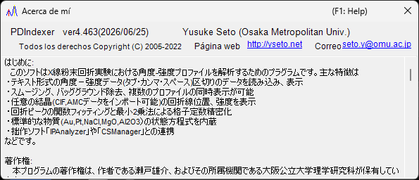

<!-- 260601Cl: migrated from legacy docx + yseto.net web manual -->
# Entorno de ejecución e instalación

Esta página describe cómo instalar PDIndexer y el entorno recomendado para un funcionamiento cómodo.

## Instalación

Descargue la versión más reciente desde la página de releases de GitHub.

- Descarga: <https://github.com/seto77/PDIndexer/releases/latest>

El método recomendado es el instalador MSI. Descargue `PDIndexer-setup.msi` (x64) y haga doble clic para iniciar la instalación. En Windows on Arm (por ejemplo, PCs con Snapdragon), descargue en su lugar `PDIndexer-setup_arm64.msi`. <!-- 260625Cl WiX asset names + arm64 -->

Si la instalación MSI está bloqueada en un PC con Windows administrado, utilice el paquete ZIP sin instalación como alternativa. Descargue el ZIP portátil (`PDIndexer-v.<ver>.zip` para x64, o `PDIndexer-v.<ver>_arm64.zip` para Arm), extraiga la carpeta completa en una ubicación con permiso de escritura para el usuario y ejecute `PDIndexer.exe` desde la carpeta extraída. No ejecute `PDIndexer.exe` directamente desde el visor del ZIP. <!-- 260601Ch / 260625Cl -->

!!! note "Acerca de la advertencia de protección de Windows"
    Al ejecutar software de investigación sin firmar recién descargado, Windows puede mostrar una advertencia de SmartScreen ("Windows protegió su PC"). Si esto ocurre, haga clic en **Más información** y luego elija **Ejecutar de todas formas** para continuar.

!!! note "Acerca del paquete ZIP sin instalación"
    El paquete ZIP está pensado como alternativa para entornos en los que la instalación MSI, la aprobación del administrador o la instalación por separado del .NET Desktop Runtime resultan difíciles. No es una carpeta de configuración totalmente autocontenida: PDIndexer sigue almacenando la configuración del usuario y los datos predeterminados copiados en la carpeta AppData del usuario actual, y puede almacenar opciones por usuario en `HKEY_CURRENT_USER\Software\Crystallography\PDIndexer`.

## Requisitos de ejecución

Cuando PDIndexer se instala desde el instalador MSI, se requiere el siguiente runtime.

| Elemento | Requisito |
| --- | --- |
| SO | Windows (64 bits, x64 o Arm64) |
| Runtime | `.NET Desktop Runtime 10.0` (el **Desktop Runtime**, no el **.NET Runtime** simple; en Windows on Arm, la versión **Arm64**) |

!!! warning "Elija el Desktop Runtime"
    La página de descarga ofrece dos productos: el ".NET Runtime" y el ".NET Desktop Runtime". Como PDIndexer es una aplicación WinForms, asegúrese de instalar el **.NET Desktop Runtime**. El ".NET Runtime" simple por sí solo no iniciará el programa.

- Descargue el runtime: <https://dotnet.microsoft.com/download/dotnet/10.0>

El paquete ZIP sin instalación es autocontenido para la arquitectura correspondiente (x64 o Arm64) y no requiere una instalación por separado del .NET Desktop Runtime. <!-- 260601Ch / 260625Cl arm64 -->

!!! note "Acerca de la versión indicada en documentos antiguos"
    El manual heredado (docx) menciona ".NET Desktop Runtime 6.0 o posterior", pero el PDIndexer actual requiere **.NET 10.0**. Siga el requisito de la versión más reciente.

## Entorno recomendado

Algunas funciones de PDIndexer requieren recursos de cálculo considerables. Para mejorar la velocidad, el cálculo se ejecuta en múltiples hilos siempre que es posible. Para un uso cómodo, se recomienda un equipo con las siguientes especificaciones de alto rendimiento.

| Elemento | Recomendado |
| --- | --- |
| SO | Windows 11 (también funciona con Windows 10 o posterior, 64 bits) |
| RAM | 16 GB o más |
| CPU | 8 núcleos o más (eficaz para el cálculo multihilo) |

!!! tip "Ventaja del multihilo"
    Los cálculos de patrones de difracción que usan estructuras cristalinas, el análisis secuencial y tareas similares se ejecutan más rápido con más núcleos de CPU. Cuantos más núcleos tenga su CPU, menor será el tiempo de espera del cálculo.

## Actualizaciones (comprobación de nuevas versiones)

Desde el menú **Ayuda** de la ventana principal, PDIndexer le permite actualizar a la versión más reciente y consultar la información del autor.

| Menú | Función |
| --- | --- |
| **Ayuda** ▸ **Buscar actualizaciones** | Comprueba si se ha publicado una versión más reciente y actualiza el programa. |
| **Ayuda** ▸ **Acerca de PDIndexer** | Muestra la versión y la información del autor. |

Al elegir **Ayuda** ▸ **Acerca de PDIndexer** se abre una ventana como la de abajo, donde puede comprobar el número de versión actual y la información del autor.

!!! tip "Actualice con regularidad"
    Se añaden correcciones de errores y nuevas funciones de forma continua. Ejecute **Ayuda** ▸ **Buscar actualizaciones** de vez en cuando para mantener PDIndexer actualizado.

## Licencia

PDIndexer se distribuye bajo la **Licencia MIT**. Se permiten libremente el uso, la modificación, la distribución y el uso comercial, siempre que se incluya el aviso de copyright y el texto de la licencia en cualquier redistribución. El software se proporciona sin garantía.
