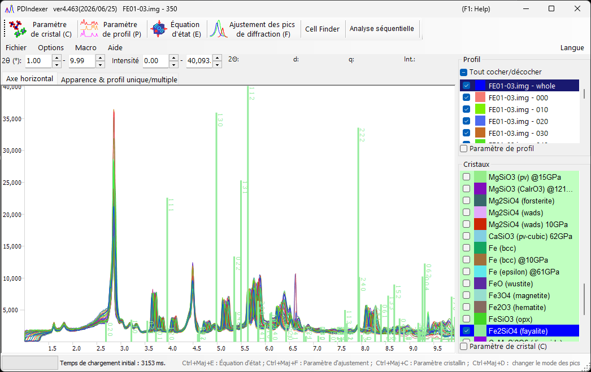

<!-- 260601Cl: migrated from legacy docx + yseto.net web manual -->
# Fenêtre principale

Au lancement du logiciel, l'écran ci-dessous apparaît. La fenêtre principale se compose de la **zone de tracé des profils** au centre, de la **barre de menus** et de la **barre d'outils (liste des fonctions)** en haut, du menu d'onglets situé près du haut (`Axe horizontal` / `Apparence & profil unique/multiple`), de la **liste des profils** en haut à droite et de la **liste des cristaux** en bas à droite.

## Zone de tracé des profils

Cette zone occupe la majeure partie de la fenêtre et affiche les profils cochés dans la liste des profils. Lorsqu'un cristal est sélectionné dans la liste des cristaux, des raies de diffraction sont également tracées aux positions des pics de diffraction.

### Opérations à la souris

| Opération | Action |
| --- | --- |
| Glisser bouton gauche | Déplacer les raies de diffraction (modifier les paramètres de maille du cristal) |
| Glisser bouton droit | Zoomer |
| Clic bouton droit | Dézoomer |
| Glisser bouton central | Translater la vue (panoramique) |

Les plages de tracé des axes horizontal et vertical peuvent être modifiées en saisissant directement des valeurs dans les zones numériques situées au-dessus de la zone de tracé (`2θ:`, `d:`, `Int.:`, `q:`, etc., dont les libellés dépendent du mode d'axe horizontal sélectionné).

!!! tip
    Le mode d'affichage de l'axe horizontal (angle, énergie, distance interréticulaire, etc.) se change dans l'[onglet `Axe horizontal`](#horizontal-axis-tab). Il s'agit d'un réglage purement d'affichage qui ne modifie pas les données d'axe horizontal propres au profil.

## Barre d'outils (liste des fonctions)

Chaque bouton de la barre d'outils ouvre ou ferme une fenêtre d'analyse dédiée.

| Bouton | Fonction | Voir |
| --- | --- | --- |
| `Paramètre de cristal (C)` | Ouvrir/fermer la fenêtre Paramètre de cristal. | [Paramètres du cristal](3-crystal-parameter.md) |
| `Paramètre de profil (P)` | Ouvrir/fermer la fenêtre Paramètre de profil. | [Paramètres du profil](4-profile-parameter.md) |
| `Équation d'état (E)` | Ouvrir/fermer la fenêtre Équation d'état pour estimer la pression à partir du volume de maille d'un matériau étalon. | [Équations d'état](5-equation-of-states.md) |
| `Ajustement des pics de diffraction (F)` | Ouvrir/fermer la fenêtre Ajustement des pics pour ajuster les pics de diffraction (position, FWHM, intensité). | [Ajustement des pics de diffraction](6-fitting-diffraction-peaks.md) |
| `Cell Finder` | Ouvrir/fermer la fenêtre Cell Finder pour rechercher les paramètres de maille à partir des positions des pics. | — |
| `Analyse séquentielle` | Ouvrir/fermer la fenêtre Analyse séquentielle pour le traitement par lots d'une série de fichiers. | [Analyse séquentielle](7-sequential-analysis.md) |
| `Atomic Position Finder` | Ouvrir/fermer la fenêtre Atomic Position Finder pour rechercher les positions atomiques à partir des intensités de diffraction. | — |
| `Analyse LPO` | Ouvrir/fermer la fenêtre d'analyse LPO (orientation préférentielle du réseau). | — |

!!! note
    Les fenêtres principales peuvent aussi être ouvertes/fermées par des raccourcis clavier : `Ctrl+Shift+C` (Paramètre de cristal), `Ctrl+Shift+E` (Équation d'état), `Ctrl+Shift+F` (Paramètre d'ajustement) et `Ctrl+Shift+D` (changer le mode des pics).

## Barre de menus

### Fichier

| Élément | Description |
| --- | --- |
| `Lire le(s) profil(s)` | Lire des données de profil. Outre les formats propres au logiciel `pdi` / `pdi2`, vous pouvez lire le `csv` produit par WinPIP, le `chi` produit par Fit2D, etc. La plupart des fichiers stockés en texte angle-intensité peuvent également être lus. |
| `Enregistrer le(s) profil(s)` | Enregistrer tous les profils chargés au format `pdi2` du logiciel. |
| `Exporter le(s) profil(s) sélectionné(s)` | Exporter le(s) profil(s) sélectionné(s) sous forme de fichier de données séparé par des virgules (CSV), séparé par des tabulations (TSV) ou GSAS (Rietveld). |
| `Charger les cristaux (comme nouvelle liste)` | Charger un fichier de liste de cristaux (extension `xml`). La liste de cristaux actuelle est abandonnée. |
| `Charger les cristaux (et ajouter à la liste actuelle)` | Charger un fichier de liste de cristaux (extension `xml`) et l'ajouter à la fin de la liste de cristaux actuelle. |
| `Enregistrer les cristaux` | Enregistrer la liste de cristaux actuelle dans un fichier (extension `xml`). |
| `Importer CIF, AMC...` | Importer un fichier de données de structure au format `cif` ou `amc` et l'ajouter à la liste de cristaux actuelle. |
| `Exporter le cristal sélectionné en CIF` | Enregistrer le cristal sélectionné sous forme de fichier de données de structure au format `cif`. |
| `Rétablir les cristaux à l'état initial` | Rétablir la liste de cristaux à l'état initial (par défaut). |
| `Mise en page` | Ouvrir la boîte de dialogue de mise en page pour l'impression. |
| `Aperçu avant impression` | Afficher un aperçu avant impression du visualiseur de profils. |
| `Imprimer` | Imprimer. La plage d'impression correspond à la plage d'angle et d'intensité actuelle. |
| `Copier dans le presse-papiers` | Copier le profil actuellement tracé dans le presse-papiers sous forme de données bitmap ou de métafichier (vectoriel). |
| `Enregistrer comme métafichier` | Enregistrer le profil actuellement tracé au format métafichier. Le format EMF (Enhanced Meta File) est pris en charge, et les fichiers `*.emf` enregistrés peuvent être ouverts dans PowerPoint et Word. |
| `Fermer` | Fermer PDIndexer. |

### Options

| Élément | Description |
| --- | --- |
| `Info-bulle` | Lorsque coché, affiche les info-bulles dans la fenêtre principale. |
| `Surveiller le presse-papiers` | Surveiller le presse-papiers et importer automatiquement les données de profil/cristal copiées depuis d'autres applications (par ex. IPAnalyzer). |
| `Surveiller le fichier` | Surveiller un dossier spécifié et lire automatiquement les nouveaux fichiers de profil `.pdi` créés. Choisissez le dossier à surveiller via la boîte de dialogue de sélection ou en saisissant directement le chemin. |
| `Effacer le registre (cocher et redémarrer)` | Lorsque coché, efface à la fermeture tous les paramètres enregistrés dans le registre (redémarrer pour réinitialiser). |
| `Enregistrer la liste des cristaux à la fermeture` | Lorsque coché, enregistre automatiquement la liste des cristaux à la fermeture et la recharge au démarrage. |

### Macro

`Éditeur` ouvre la fenêtre de l'éditeur de macros. Pour le détail de la fonction macro de PDIndexer, voir [Macro](8-macro.md).

### Aide

| Élément | Description |
| --- | --- |
| `À propos de PDIndexer` | Afficher le copyright, la version et les informations sur l'auteur, ainsi que l'historique des versions. |
| `Rechercher des mises à jour` | Rechercher en ligne une version plus récente et, le cas échéant, la télécharger/installer. |
| `Astuce` | Afficher des astuces d'utilisation (obsolète). |
| `Aide (web)` | Afficher ce manuel. |

### Langue

Changer la langue de l'interface. Actuellement, l'anglais (`English (need restart)`) et le japonais (`Japanese (need restart)`) sont pris en charge. Un redémarrage est nécessaire après le changement.

## Onglet Axe horizontal {#horizontal-axis-tab}

L'onglet `Axe horizontal` définit le mode d'affichage de l'axe. Les réglages effectués ici sont purement d'affichage et sont sans rapport avec les données réelles de l'axe horizontal (les informations réelles de l'axe horizontal peuvent être modifiées depuis les [Paramètres du profil](4-profile-parameter.md)). Grâce à cela, vous pouvez aligner l'axe horizontal pour comparer même lorsque des sources de rayons X différentes ont été utilisées. Par exemple, même si le profil chargé a été acquis avec la raie Cu Kα, il peut être affiché comme s'il avait été acquis à la longueur d'onde de la raie Mo Kα.

| Élément | Description |
| --- | --- |
| `Après lecture du profil, changer l'axe horizontal` | Lorsque coché, aligne automatiquement les réglages de l'axe horizontal sur ceux du profil nouvellement chargé. |
| 2θ (degree) | Régler l'axe horizontal sur l'angle. Le choix du bouton radio `X-ray` donne l'angle de diffusion pour les rayons X ; sélectionnez une source de rayons X caractéristique ou `Custom` dans la liste déroulante et spécifiez la longueur d'onde. Le choix du bouton radio `Electron` donne l'angle de diffusion pour les électrons ; spécifier la tension d'accélération calcule la longueur d'onde corrigée relativistiquement. |
| Energy (eV) | Régler l'axe horizontal sur l'énergie (unité eV). Cela correspond à une expérience de diffraction des rayons X utilisant un détecteur EDX. Réglez correctement l'angle de sortie EDX. |
| d-spacing (Å) | Régler l'axe horizontal sur la distance interréticulaire (espacement des plans réticulaires). |
| q | Régler l'axe horizontal sur la norme du vecteur de diffusion \( q \). |

La relation entre l'angle de diffusion et la distance interréticulaire est donnée par la loi de Bragg, avec \( \lambda \) la longueur d'onde :

$$ 2 d \sin\theta = n \lambda $$

## Onglet Apparence & profil unique/multiple

L'onglet `Apparence & profil unique/multiple` configure l'apparence du tracé et l'affichage en profil unique/multiple.

### Réglages d'échelle et de couleur

| Élément | Description |
| --- | --- |
| `Ligne de graduation` | Choisir d'afficher ou non les lignes de graduation (grille). |
| `Barre d'erreur` | Afficher des barres d'erreur lorsque les données contiennent des informations d'erreur. |
| `Couleur` | Régler les couleurs d'affichage, telles que `Couleur de fond`, `Ligne de graduation` et `Texte de graduation`. |

### Profil unique/multiple

Le mode coché est le mode actuel.

| Élément | Description |
| --- | --- |
| `Profil unique` | Mode profil unique. Lorsqu'un profil est chargé, ou envoyé depuis IPAnalyzer via le presse-papiers, l'ancien profil est supprimé et le nouveau profil est tracé. |
| `Profils multiples` | Mode multi-profils. Les nouveaux profils sont chargés et superposés aux profils existants. |
| `Décalage d'intensité par profil` | Définit le décalage d'intensité entre les données lors de la superposition de plusieurs jeux de données. Cela sert uniquement à conserver un affichage lisible ; les données réelles ne sont pas modifiées. |
| `Changer la couleur automatiquement` | Lorsque coché, change automatiquement la couleur de tracé des profils. |

### Axe vertical

Indiquez si l'axe vertical (intensité) doit être affiché en coups bruts (`Coups bruts`) ou en coups par pas (`Coups par pas (CPS)`). Vous pouvez aussi indiquer si l'axe vertical doit être affiché sur une échelle linéaire (`Linéaire`) ou logarithmique (`Logarithmique`).

## Liste des profils

Affiche et sélectionne les profils chargés. Elle est désactivée en mode `Profil unique`.

En mode multi-profils, les profils chargés sont présentés sous forme de liste, et seuls ceux qui sont cochés sont tracés dans la zone de tracé centrale. Les réglages plus détaillés du profil se font en cochant la case `Paramètre de profil` au bas de la boîte (voir [Paramètres du profil](4-profile-parameter.md)).

## Liste des cristaux

Affiche et configure la liste des cristaux. Cocher une entrée trace des raies de diffraction aux positions des pics de diffraction. Par défaut, environ 80 cristaux sont préenregistrés.

!!! note "Lignes spéciales"
    - La première ligne (ligne 0) est le **Flexible Crystal** (fond cyan), utilisé pour tracer des raies de diffraction arbitraires.
    - Les lignes supérieures (fond rose, par ex. `NaCl EOS` et `Pt EOS`) sont réservées comme matériaux étalons pour les calculs d'équation d'état (EOS).

Les réglages plus détaillés du cristal se font en cochant la case `Paramètre de cristal (C)` au bas de la boîte (voir [Paramètres du cristal](3-crystal-parameter.md)). `Tout cocher/décocher` coche ou décoche l'ensemble de la liste des cristaux en une seule fois.
