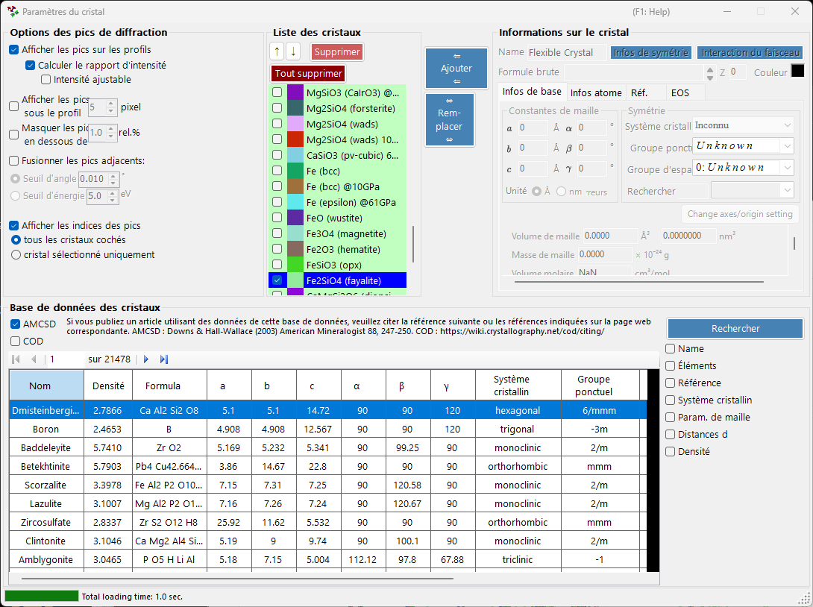
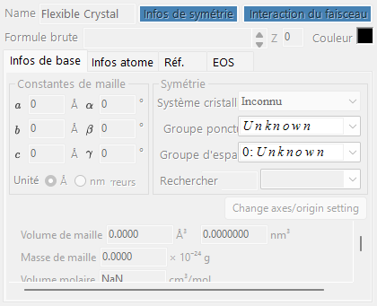
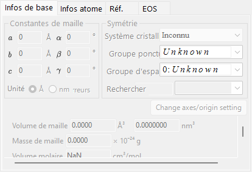
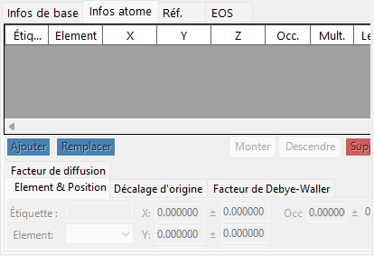
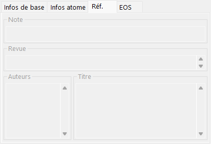
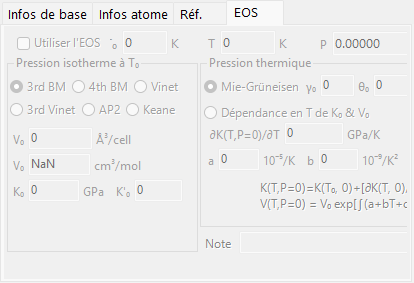
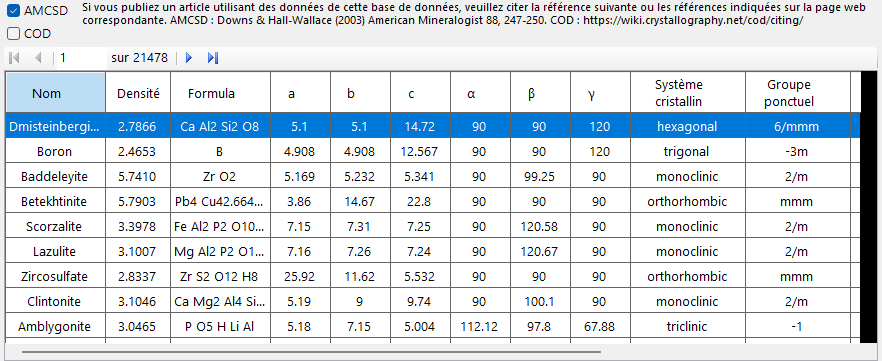
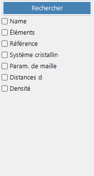
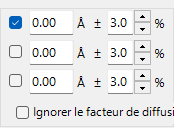

<!-- 260601Cl: migrated from legacy docx + yseto.net web manual -->
# Paramètres du cristal

Cliquer sur l'icône `Paramètres du cristal` dans la barre d'outils de la fenêtre principale ouvre la sous-fenêtre représentée ci-dessous. Vous y choisissez les cristaux dont les pics de diffraction doivent être affichés ainsi que la façon dont ces pics sont tracés. Une base de données de cristaux permettant de rechercher et d'importer des structures est intégrée dans la partie inférieure de la fenêtre.

La fenêtre se divise en quatre zones principales.

| Zone | Rôle |
| --- | --- |
| `Options des pics de diffraction` | Façon dont les raies de diffraction sont affichées |
| `Liste des cristaux` | Une liste de cristaux à cocher partagée avec la fenêtre principale |
| `Informations sur le cristal` | Paramètres détaillés du cristal sélectionné (par onglets) |
| `Base de données des cristaux` | Recherche et import basés sur AMCSD |

---

## Options des pics de diffraction

Configure l'affichage des raies de diffraction.

### Afficher les pics sur les profils

Indique si les raies de diffraction sont tracées en superposition aux données de profil.

### Calculer le rapport d'intensité {#calculate-intensity-ratio}

Indique si les intensités de diffraction (leurs rapports) sont calculées à partir des données structurales.

!!! note
    Si les positions atomiques n'ont pas été saisies, les intensités ne sont pas calculées quel que soit l'état de la case à cocher. Voir l'[onglet Infos atome](#atom-info-tab) pour la saisie des données atomiques.

### Intensité ajustable

Indique si toutes les raies de diffraction peuvent être mises à l'échelle globalement sans modifier leurs rapports d'intensité relative.

### Afficher les pics sous le profil

Indique si les pics de diffraction sont tracés sous le profil.

#### Hauteur des pics

Définit la hauteur, en pixels (`pixel`), des pics tracés sous le profil.

### Fusionner les pics adjacents

Indique s'il faut fusionner les intensités des pics qui, bien que cristallographiquement non équivalents, présentent des valeurs de 2θ presque identiques ou exactement identiques.

Par exemple, dans le système cubique, les plans (333) et (115) sont non équivalents mais possèdent exactement la même distance interréticulaire (valeur d), de sorte qu'ils se recouvrent à l'observation. Cocher cette case permet d'afficher leur intensité combinée.

| Élément | Description |
| --- | --- |
| `Seuil d'angle` | Distance maximale entre des pics pour qu'ils soient fusionnés, donnée en degrés (`°`). |
| `Seuil d'énergie` | Pour les données à dispersion d'énergie, la plage de fusion donnée en énergie (`eV`). |

!!! tip
    L'ancien manuel exprimait le seuil en ångströms, mais la version actuelle le spécifie en degrés (`°`) ou en énergie (`eV`) selon le type d'axe horizontal.

### Masquer les pics en dessous de

Indique s'il faut supprimer les pics trop faibles par rapport à la réflexion la plus intense. Le seuil est donné sous forme de rapport relatif à la raie la plus intense (`rel.%`).

### Afficher les indices des pics

Indique pour quels cristaux les indices des raies de diffraction (indices de Miller) sont étiquetés.

| Option | Cible |
| --- | --- |
| `tous les cristaux cochés` | Chaque cristal coché |
| `cristal sélectionné uniquement` | Uniquement le cristal actuellement sélectionné dans la liste |

---

## Liste des cristaux

Affiche les mêmes informations que la liste de profils à cocher de la fenêtre principale. Les cristaux cochés ont leurs raies de diffraction tracées dans la fenêtre principale. Chaque ligne affiche une case à cocher (`Cocher`), une couleur de tracé (`Couleur du pic`) et le nom du cristal (`Cristal`).

### Boutons fléchés Haut/Bas (↑ / ↓)

Modifient l'ordre des cristaux.

!!! note
    Les lignes 1 à 6 sont réservées à l'équation d'état (EOS) et ne peuvent pas être réordonnées. Voir [Équation d'état](5-equation-of-states.md) pour plus de détails.

### Ajouter

Ajoute le cristal configuré dans la zone Informations sur le cristal à droite (décrite ci-dessous) à la liste en tant que nouvelle entrée.

### Remplacer

Remplace le cristal actuellement sélectionné par celui configuré dans la zone Informations sur le cristal à droite.

### Supprimer

Retire de la liste le cristal actuellement sélectionné.

### Tout supprimer

Retire tous les cristaux de la liste.

---

## Informations sur le cristal {#crystal-information}

Modifie et affiche les informations détaillées du cristal sélectionné réparties sur plusieurs onglets. Les principaux onglets sont :

| Onglet | Contenu |
| --- | --- |
| `Infos de base` | Paramètres de maille, système cristallin, groupe d'espace et autres informations de base |
| `Infos atome` | Types d'atomes, occupations, coordonnées et facteurs de température |
| `Réf.` | Informations de référence sur l'article source, les auteurs, etc. |
| `EOS` | Réglages de l'équation d'état pour la compression et la dilatation thermique |

### Onglet Infos de base

Définit les informations de base telles que les paramètres de maille (a, b, c, α, β, γ), le système cristallin et le groupe d'espace. Choisir un groupe d'espace contraint automatiquement les paramètres de maille modifiables et les degrés de liberté des coordonnées atomiques.

!!! tip
    Un clic droit sur un champ de paramètre de maille affiche un menu qui rétablit les paramètres de maille à leurs valeurs au démarrage de l'application (ou au moment où la structure a été importée depuis la base de données). C'est pratique lorsque vous souhaitez revenir aux valeurs de référence d'origine après les avoir modifiées par affinement.

### Onglet Infos atome {#atom-info-tab}

Définit pour chaque atome l'élément, l'occupation, les coordonnées fractionnaires et les facteurs de température isotropes/anisotropes. Lorsque les positions atomiques sont saisies ici, les intensités de diffraction peuvent être calculées via [Calculer le rapport d'intensité](#calculate-intensity-ratio).

### Onglet Réf.

Conserve les informations de référence telles que le titre de l'article, le nom de la revue et les auteurs qui sont à l'origine de la structure cristalline. Les structures importées depuis la base de données de cristaux ont ces informations renseignées automatiquement.

### Onglet EOS

Définit l'équation d'état (EOS) propre à chaque cristal, qui régit la façon dont les paramètres de maille varient avec la pression et la température. Les principaux champs de saisie sont :

| Champ | Description |
| --- | --- |
| `Use EOS` | Active le calcul de pression par EOS pour ce cristal. |
| `T0` / `Temperature` | Température de référence / mesurée. |
| `V0` | Volume de la maille élémentaire de référence. |
| `K0`, `K'0` | Module d'incompressibilité isotherme et sa dérivée par rapport à la pression. |
| Forme isotherme | `BM3` (Birch-Murnaghan du troisième ordre, par défaut) / `BM4` / `Vinet` / `AP2` / `Keane`. |
| Pression thermique | `Mie-Grüneisen` (par défaut ; paramètres \( \gamma_0, \theta_0, q \)) / `T-dependence K0&V0`. |

Voir [Équation d'état](5-equation-of-states.md) pour les formules et les définitions des symboles.

---

## Base de données des cristaux

Fournit des fonctions de recherche et d'import pour plus de 20 000 structures cristallines. Cette base de données repose sur l'American Mineralogist Crystal Structure Database (AMCSD).

!!! warning "Citation"
    Lorsque vous utilisez ces données cristallines, veuillez lire attentivement <http://rruff.geo.arizona.edu/AMS/amcsd.php> et veillez à citer la référence suivante.

    > Downs, R.T. and Hall-Wallace, M. (2003) The American Mineralogist Crystal Structure Database. *American Mineralogist* **88**, 247-250.

### Tableau

Liste les cristaux contenus dans la base de données. Si des conditions de recherche sont saisies, seuls les cristaux qui y correspondent sont affichés.

Sélectionner un cristal quelconque dans le tableau transfère ses informations vers [Informations sur le cristal](#crystal-information). Pour l'ajouter à la liste des cristaux, appuyez sur le bouton `Ajouter` ou `Remplacer` dans la zone Liste des cristaux.

### Options de recherche

Saisissez les conditions de recherche. Après les avoir saisies, appuyez sur le bouton `Rechercher` ou sur la touche Entrée. Chaque condition peut être activée ou désactivée à l'aide de sa case à cocher.

#### Nom

Saisissez le nom du cristal.

#### Éléments

Appuyer sur le bouton `Tableau périodique` ouvre une fenêtre distincte où vous choisissez les éléments à rechercher. Chaque bouton d'élément bascule son état à chaque pression.

Les boutons en haut de la fenêtre changent l'état de tous les éléments à la fois.

| Bouton | Signification |
| --- | --- |
| `may or not include` | L'élément peut être présent ou non (efface toutes les contraintes d'éléments). |
| `must include` | Doit être inclus (seuls les cristaux contenant tous les éléments spécifiés sont conservés). |
| `must exclude` | Doit être exclu (les cristaux contenant l'un quelconque des éléments spécifiés sont retirés). |

!!! tip
    Cocher `Ignorer le facteur de diffusion` permet de rechercher sans tenir compte des facteurs de diffusion.

#### Référence

Saisissez le titre de l'article, le nom de la revue ou le nom de l'auteur.

#### Système cristallin

Recherche en spécifiant le système cristallin.

#### Paramètres de maille

Saisissez les paramètres de maille et la tolérance admise.

#### Distance interréticulaire (valeur d)

Saisissez la distance interréticulaire (valeur d) d'une réflexion intense et la tolérance admise.

#### Densité

Saisissez la densité et la tolérance admise.
