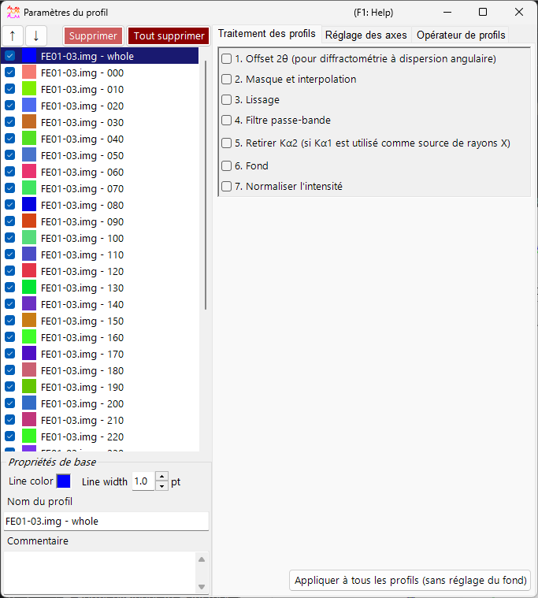
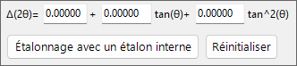
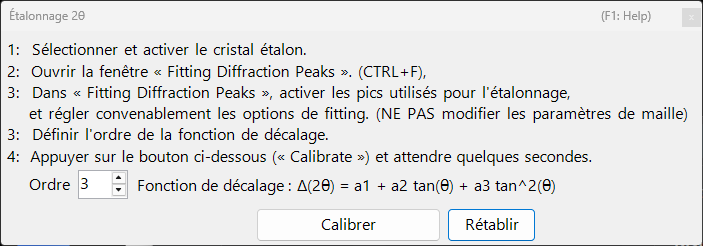
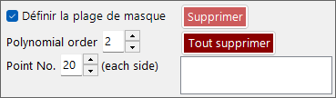
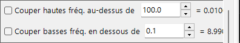
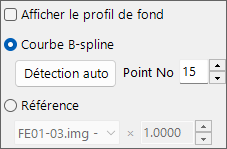
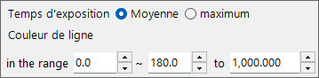

<!-- 260601Cl: migrated from legacy docx + yseto.net web manual -->
# Paramètres du profil

Cliquer sur l'icône `Profile parameter` (Paramètres du profil) dans la fenêtre principale ouvre cette sous-fenêtre. Vous y effectuez les réglages détaillés des profils chargés et appliquez divers traitements numériques.

La partie gauche de la fenêtre contient la [liste de contrôle des profils](#profile), et la partie droite est divisée en trois pages à onglets — [Traitement du profil](#profile-processing), [Réglage des axes](#axis-setting) et [Opérateur de profil](#profile-operator). Chaque étape de traitement peut être activée/désactivée par une case à cocher et est appliquée de haut en bas dans l'ordre.

!!! note
    Les réglages effectués dans cette fenêtre sont répercutés en temps réel sur les profils de la [fenêtre principale](1-main-window.md). Pour les réglages côté cristal, tels que l'unité de l'axe horizontal et les indices des raies de diffraction, voir [Crystal Parameter](3-crystal-parameter.md).

---

## Liste de contrôle des profils {#profile}

La liste située à gauche de la fenêtre affiche les mêmes informations que la liste de contrôle des profils de la fenêtre principale. Sélectionner un profil dans la liste en fait la cible des traitements et des réglages de la partie droite de la fenêtre.

| Élément | Description |
| --- | --- |
| `↑` `↓` (boutons flèches haut/bas) | Modifient l'ordre des profils dans la liste. |
| `Delete` | Supprime le profil sélectionné. |
| `Delete all` | Supprime tous les profils. |

Dans la zone `Basic property` sous la liste, vous modifiez les attributs de base du profil sélectionné.

| Élément | Description |
| --- | --- |
| `Line Color` | Cliquez pour changer la couleur de tracé du profil sélectionné. |
| `Line Width` | Définit l'épaisseur de trait du profil (`pt`). |
| `Profile Name` | Définit le nom du profil. |
| `Comment` | Un champ de commentaire libre. |

---

## Traitement du profil {#profile-processing}

Dans l'onglet `Profile processing`, vous appliquez divers traitements numériques au profil sélectionné. Les étapes 1 à 7 peuvent chacune être activées indépendamment par une case à cocher, et celles qui sont activées sont appliquées dans l'ordre numérique.

### 1. Décalage 2θ {#two-theta-offset}

`1. 2θ offeset (for angle-dispersive diffractmetry)` corrige l'angle des données à dispersion angulaire. L'expression de correction est une fonction quadratique de \( \tan\theta \).

$$ \Delta(2\theta) = a_0 + a_1 \tan\theta + a_2 \tan^2\theta $$

Si le profil contient un étalon interne (un échantillon dont les paramètres de maille sont connus), appuyez sur le bouton `Calibration using an internal standard` et suivez les messages ; les coefficients de la fonction quadratique sont alors déterminés automatiquement. Dans la boîte de dialogue de calibration, les positions de pic observées sont mises en correspondance avec les positions de pic théoriques de l'étalon, et les coefficients sont ajustés.

Le bouton `Reset` réinitialise les coefficients de décalage que vous avez définis.

!!! tip
    Les étalons internes sont généralement des matériaux dont les paramètres de maille sont déterminés avec précision, tels que Si ou LaB₆. Après calibration, les valeurs 2θ corrigées sont utilisées directement dans toutes les analyses ultérieures.

### 2. Masquage et interpolation {#mask}

`2. Mask and Interpolation` masque une plage angulaire (ou une plage d'énergie) spécifiée et interpole le profil à l'aide des intensités situées en dehors de la plage masquée.

| Élément | Description |
| --- | --- |
| `Set Masking range` | Spécifie la plage de l'axe horizontal à masquer. |
| `Point No.` | Spécifie le nombre de points d'extrémité (de chaque côté) utilisés pour l'interpolation. |
| `Polynomial order` | Spécifie le degré du polynôme utilisé pour l'interpolation. |
| `Save Masking Ranges` / `Read Masking Ranges` | Enregistrent les plages de masquage configurées dans un fichier, ou les relisent. |
| `Delete` / `Delete all` | Suppriment une plage de masquage individuelle, ou toutes. |

### 3. Lissage {#smoothing}

`3. Smoothing` applique un lissage au profil sélectionné. L'algorithme de lissage est la méthode `Savitzky-Golay`.

Dans cette méthode, pour chaque position \(x\) considérée, un ajustement par moindres carrés avec un polynôme de degré `Order` est effectué sur les données comprises dans \(\pm\) `Point No.` de ce point, et la valeur de la fonction résultante \(F(x)\) est adoptée comme nouvelle intensité à cette position \(x\).

!!! note
    Lorsque `Order` \(= 1\), le lissage de Savitzky–Golay équivaut à une simple moyenne mobile. Augmenter `Order` préserve mieux la forme des pics, tandis qu'augmenter `Point No.` renforce le lissage.

### 4. Filtre passe-bande {#bandpass}

`4. Bandpass filter` utilise une transformée de Fourier (FFT) pour couper les composantes au-dessus ou en dessous de fréquences spécifiées.

| Élément | Description |
| --- | --- |
| `Cut high-freq. over` | Supprime les composantes dont la fréquence est supérieure à la valeur spécifiée (réduit le bruit haute fréquence). |
| `Cut low-freq. under` | Supprime les composantes dont la fréquence est inférieure à la valeur spécifiée (élimine un fond continu à variation lente). |

### 5. Supprimer Kα2 {#remove-ka2}

`5. Remove Kα2 (if Kα1 is used as X-ray source)` : si le profil sélectionné a été mesuré avec des rayons X dans lesquels Kα1 et Kα2 ne sont pas séparés, et qu'il a été chargé en spécifiant Kα1, cocher cette option supprime l'intensité de diffraction provenant de Kα2.

!!! warning
    Ce traitement n'est efficace que lorsque Kα1 est sélectionné comme source de rayons X. Vérifiez et réglez l'unité de l'axe horizontal et le type de rayonnement dans l'onglet [Réglage des axes](#axis-setting).

### 6. Fond continu {#background}

`6. Background` soustrait le fond continu du profil. Il existe deux méthodes.

#### B-Spline curve

Appuyer sur `Auto Detect` calcule et soustrait automatiquement le fond continu. Avec `Point No.`, vous définissez le nombre maximal de points de contrôle du fond continu à rechercher automatiquement.

Vous pouvez aussi modifier les points de contrôle manuellement. Faites glisser à la souris les points de contrôle ronds tracés dans la fenêtre principale pour créer une courbe appropriée.

#### Reference

Vous pouvez spécifier un autre profil comme fond continu du profil sélectionné. Cocher `Show background profile` affiche le profil utilisé comme fond continu.

!!! note
    La soustraction du fond continu (étape 6) est exclue de l'application groupée effectuée par le bouton `Apply for all profiles` décrit ci-dessous.

### 7. Normaliser l'intensité {#normalize}

`7. Normarize intensity` normalise le profil de sorte que la valeur `Average` (moyenne) ou `Maximum` sur une plage de l'axe horizontal spécifiée devienne une intensité spécifiée.

| Élément | Description |
| --- | --- |
| `Average` / `Maximum` | Choisit si la moyenne ou le maximum dans la plage est utilisé comme référence. |
| `intensity between` | Spécifie la plage cible de l'axe horizontal. |
| `to` | Spécifie la valeur d'intensité cible après normalisation. |

### Bouton Apply for all profiles {#apply-all}

Le bouton `Apply for all profiles (without background setting)` applique les réglages des étapes 1 à 7, **à l'exception de 6. Background**, à tous les profils en une seule fois.

---

## Réglage des axes {#axis-setting}

Dans l'onglet `Axis setting`, vous modifiez l'unité de l'axe horizontal, le type de rayonnement (faisceau incident) et l'énergie du faisceau incident du profil sélectionné.

| Élément | Description |
| --- | --- |
| `Horizontal axis setting` | Change l'unité actuelle de l'axe horizontal (`horizontal unit`). Avec `Shift`, vous pouvez aussi décaler l'ensemble de l'axe horizontal. |
| `Exposure Time` | Définit le temps d'exposition (`sec.`) utilisé en mode CPS (`(for CPS mode)`). |
| `Vertical axis setting` | Réglages relatifs à l'axe vertical. |

!!! note
    Le réglage des axes effectué ici modifie les informations physiques que le profil lui-même contient (unité, type de rayonnement, énergie). Contrairement à la transformation d'axe purement visuelle de la fenêtre principale, il affecte la façon dont les données elles-mêmes sont interprétées. Comme le type de rayonnement et l'énergie influencent directement le calcul des positions des raies de diffraction, réglez les valeurs correctes.

---

## Opérateur de profil {#profile-operator}

Dans l'onglet `Profile Operator`, vous effectuez le moyennage de plusieurs profils et des opérations arithmétiques entre profils.

Après avoir spécifié les profils cibles du calcul et l'opération que vous souhaitez effectuer, appuyez sur le bouton `Calculate` ; le résultat est ajouté comme nouveau profil.

| Mode | Description |
| --- | --- |
| `Average` | Moyenne plusieurs profils. |
| `Profile and value` | Opère entre un profil et une valeur scalaire. |
| `Two profiles` | Effectue une opération arithmétique (telle que l'addition) entre deux profils. |

Avec `Output name of the profile`, vous pouvez spécifier le nom du profil généré (la valeur par défaut est `Result #01`).

!!! tip
    Cela peut servir, par exemple, à moyenner plusieurs mesures pour améliorer le rapport S/N, ou à prendre la différence de deux profils pour en extraire la variation.
