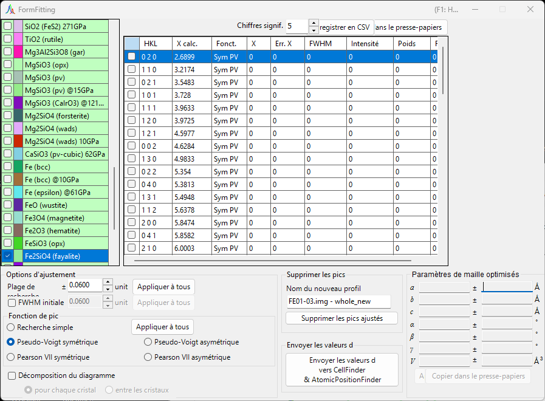
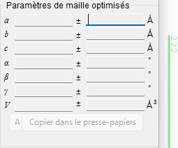
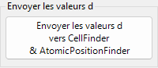
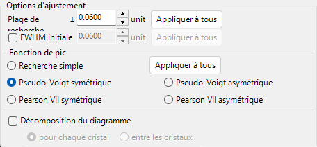
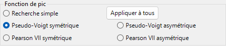
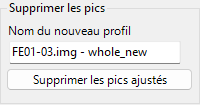
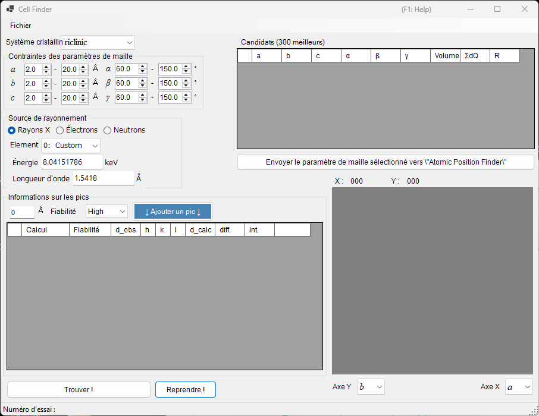
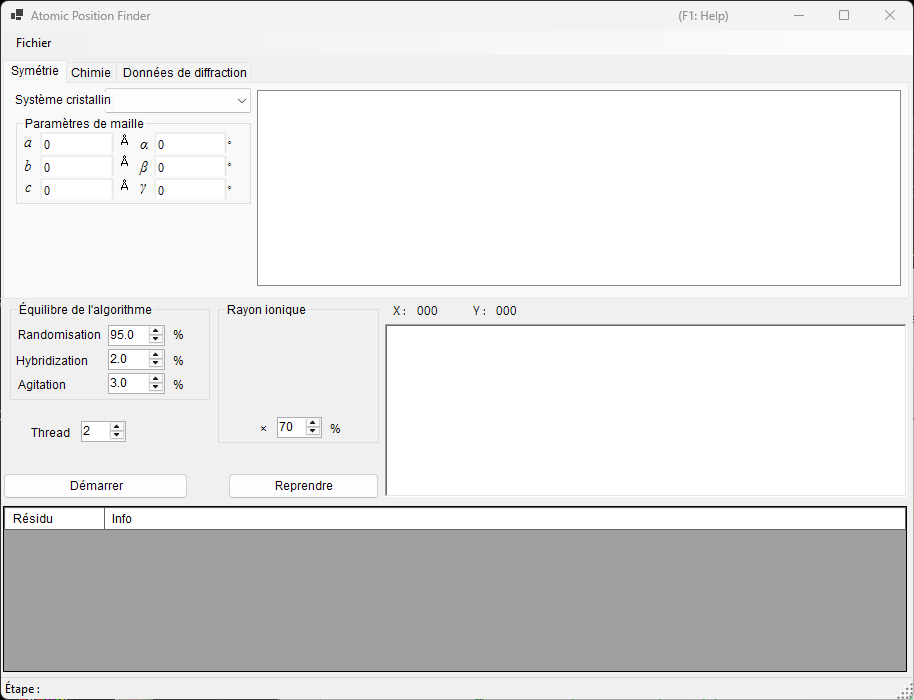

<!-- 260601Cl: migrated from legacy docx + yseto.net web manual -->
# Ajustement des pics de diffraction

L'outil `Fitting diffraction peaks` ajuste les pics d'un profil de diffraction avec une fonction appropriée, déduit la distance interréticulaire (valeur d) à partir de la position 2θ de chaque pic, puis affine les paramètres de maille par moindres carrés. Il se lance depuis la barre d'outils de la fenêtre principale.

## Déroulement de base

1. Sélectionnez le cristal cible dans la liste des cristaux (en mode multi-profils, sélectionnez aussi le profil sur lequel vous voulez travailler).
2. Dans la fenêtre principale, faites glisser les raies de diffraction avec la souris pour qu'elles recouvrent les pics mesurés aussi précisément que possible.
3. Choisissez les indices des raies de diffraction que vous souhaitez ajuster dans la liste des pics de diffraction (une liste à cases à cocher).
4. Dès qu'un nombre suffisant d'indices indépendants est choisi pour que le calcul par moindres carrés soit résoluble, les paramètres de maille les plus probables apparaissent, avec leurs erreurs, dans le panneau `Optimized cell constants` (paramètres de maille optimisés) en bas à droite.
5. Appuyez sur `Apply to the crystal` (appliquer au cristal) pour répercuter les paramètres de maille affinés sur le cristal dans le programme principal.

!!! note "Vérification et sélection d'un cristal"
    La liste des cristaux reflète celle de la fenêtre principale. Pour que l'ajustement prenne effet, le cristal cible doit être à la fois coché et sélectionné.

## Liste des cristaux

La liste des cristaux en haut à gauche contient les mêmes cristaux que la fenêtre principale. Le cristal que vous cochez et sélectionnez ici devient la cible de l'ajustement. Voir [Paramètres du cristal](3-crystal-parameter.md) pour plus de détails.

## Liste des pics de diffraction

Les raies de diffraction du cristal sélectionné sont listées ici. Cocher la case d'une ligne fait de cette raie de diffraction une cible d'ajustement. La liste contient les colonnes suivantes.

| Colonne | Contenu |
| --- | --- |
| `Check` | Inclure ou non la raie dans l'ajustement |
| `PeakColor` | Couleur d'affichage |
| `Crystal` | Nom du cristal |
| `HKL` | Indices de réflexion |
| `Calc X` | Position calculée de la raie de diffraction |
| `Func` | Fonction de pic utilisée |
| `X` | Position du pic obtenue par ajustement |
| `X Err` | Erreur de la position du pic |
| `FWHM` | Largeur à mi-hauteur |
| `Intensity` | Intensité du pic |
| `Weight` | Poids dans l'ajustement par moindres carrés |
| `R` | Indice de résidu de l'ajustement |

Les boutons situés sous la liste exportent les résultats.

- `Copy to clipborad`: Copie le tableau dans le presse-papiers. Il peut être collé directement dans Excel et les applications similaires.
- `Save as CSV`: Enregistre le tableau sous forme de fichier `.csv`. `Effective digit` règle le nombre de décimales.
- `Clear peaks`: Efface les résultats de l'ajustement.

## Fitting option (options d'ajustement)

Vous effectuez ici les réglages détaillés utilisés lors de l'ajustement des profils de pic.

### Search Range / Initial FWHM

- `Search Range` (plage de recherche): Définit la plage sur laquelle l'ajustement est effectué. Autrement dit, la région située dans ±Search Range autour de la position calculée de la raie de diffraction est prise comme cible d'ajustement pour ce pic.
- `Initial FWHM` (FWHM initiale): Spécifie la largeur à mi-hauteur initiale de la fonction de profil. Elle sert de valeur de départ pour la convergence des moindres carrés.

Appuyer sur `Apply to all` (appliquer à tous) applique les réglages actuels à toutes les raies de diffraction en une seule fois.

### Peak function (fonction de pic)

Sélectionne la fonction de pic utilisée pour l'ajustement.

| Fonction de pic | Contenu |
| --- | --- |
| `Simple Search` | N'effectue aucun ajustement de fonction ; reconnaît le point le plus intense dans ±Search Range autour de la position calculée de la raie de diffraction comme la position du pic. |
| `Symmetric Pseudo Voigt` | Ajuste avec une fonction pseudo-Voigt symétrique gauche-droite. |
| `Symmetric Pearson VII` | Ajuste avec une fonction Pearson VII symétrique gauche-droite. |
| `Split Pseudo Voigt` | Ajuste avec une fonction pseudo-Voigt asymétrique (split) gauche-droite. |
| `Split Pearson VII` | Ajuste avec une fonction Pearson VII asymétrique (split) gauche-droite. |

!!! tip "Fonction recommandée"
    Sauf raison particulière, `Symmetric Pseudo Voigt` est recommandée en raison de sa stabilité supérieure.

La fonction pseudo-Voigt est une combinaison linéaire d'une gaussienne \(G(x)\) et d'une lorentzienne \(L(x)\) avec un paramètre de mélange \(\eta\), donnée par :

$$
\mathrm{pV}(x) = \eta\, L(x) + (1-\eta)\, G(x), \qquad 0 \le \eta \le 1
$$

où \(\eta\) est la fraction de la composante lorentzienne. La forme split représente un profil asymétrique en prenant des paramètres tels que la FWHM indépendamment à gauche et à droite de la position du pic.

### Pattern Decomposition (décomposition du diagramme)

Lorsque les Search Range de deux raies de diffraction sélectionnées ou plus se chevauchent, cette option choisit s'il faut effectuer une décomposition du diagramme (ajustement simultané des pics qui se chevauchent).

- `in each crystal` (pour chaque cristal): Effectue la décomposition du diagramme indépendamment pour chaque cristal.
- `between crystals` (entre les cristaux): Effectue la décomposition du diagramme sur l'ensemble des cristaux.

## Optimized cell constants (paramètres de maille optimisés)

Dès qu'un nombre suffisant d'indices indépendants est choisi pour que le calcul par moindres carrés devienne résoluble, ce panneau affiche les paramètres de maille les plus probables \(a, b, c, \alpha, \beta, \gamma\) et le volume \(V\), chacun avec son erreur (`±`).

!!! note "À propos de l'affichage NA"
    Lorsque les degrés de liberté sont insuffisants — c'est-à-dire lorsque les degrés de liberté sont égaux au nombre de pics ajustés, ou lorsqu'un paramètre de maille donné n'a aucun degré de liberté — `NA` est affiché à la place d'une erreur. Choisir suffisamment de réflexions indépendantes permet de calculer les erreurs.

- `Apply to the crystal` (appliquer au cristal): Répercute les paramètres de maille affinés sur le cristal sélectionné dans le programme principal.
- `Copy to Clipboard` (copier dans le presse-papiers): Copie les paramètres de maille optimisés dans le presse-papiers.
- `Reset take off angle`: Réinitialise l'angle de take-off.

## Remove fitted peaks (suppression des pics ajustés)

Ceci soustrait les pics ajustés du profil et produit le profil résiduel sous forme de nouveau profil. Saisissez le nom de destination dans `New profile name` (nom du nouveau profil) et appuyez sur `Remove fitted peaks` (supprimer les pics) pour effectuer la soustraction. C'est utile pour vérifier le fond continu ou la séparation des pics qui se chevauchent.

## Outils associés (Send d-values)

Appuyer sur `Send d-values to CellFinder && AtomicPositionFinder` envoie les valeurs d obtenues par l'ajustement vers les outils d'analyse suivants, qui peuvent eux aussi être lancés depuis la barre d'outils.

### Cell Finder

`Cell Finder` recherche la maille élémentaire (paramètres de maille) qui explique un ensemble de positions de pics mesurées (une liste de valeurs d), en remontant à partir de ces positions. Il sert à indexer des échantillons inconnus.

### Atomic Position Finder

`Atomic Position Finder` recherche les positions atomiques dans une structure cristalline à partir de grandeurs telles que les intensités des réflexions observées.

!!! tip "Identification d'un échantillon inconnu"
    Après avoir déterminé les paramètres de maille avec `Cell Finder`, enregistrez ce cristal dans la liste des cristaux, et vous pourrez affiner davantage les paramètres de maille avec l'ajustement par moindres carrés de cet outil.
