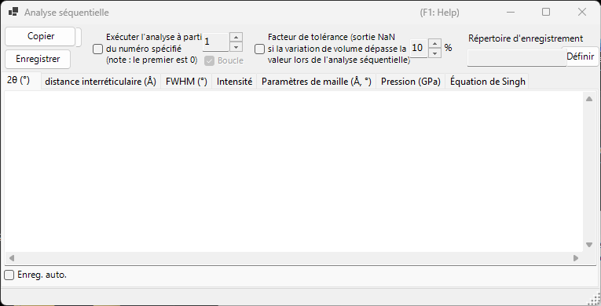
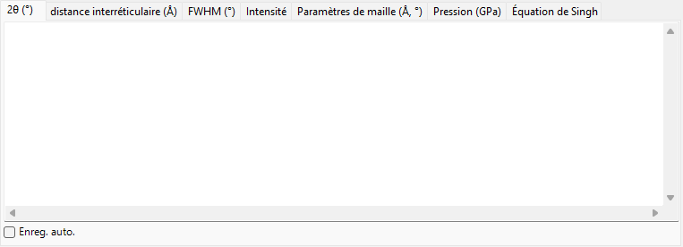
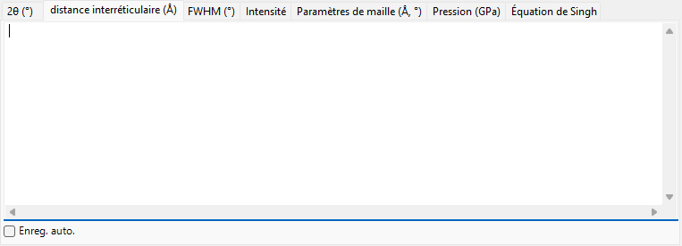
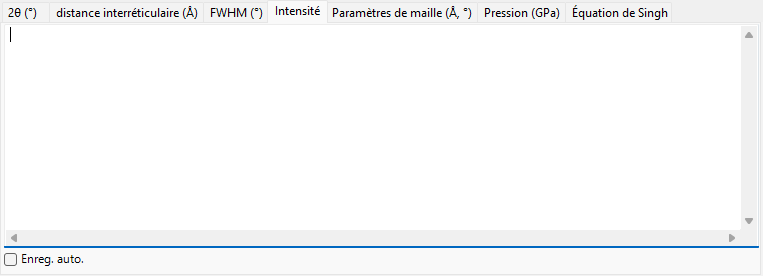
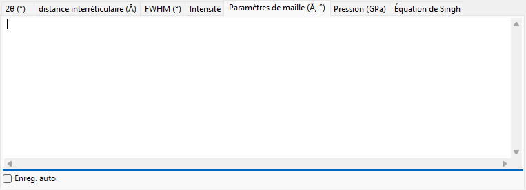
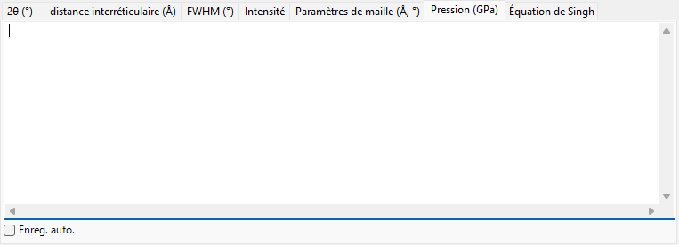
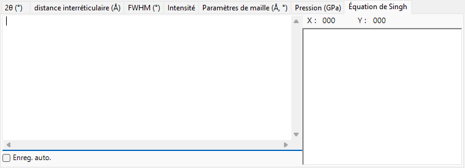

<!-- 260601Cl: migrated from legacy docx + yseto.net web manual -->
# Analyse séquentielle

`Analyse séquentielle` exécute le même ajustement de pics, tour à tour, sur de nombreux profils chargés, puis rassemble les résultats par grandeur. Elle est conçue pour une série de profils acquis pendant qu'une condition telle que la température, la pression ou le temps évolue : elle traite l'ensemble de la série en une seule fois et tabule, dans son propre onglet, les résultats de 2θ, de distance interréticulaire (valeur d), de FWHM, d'intensité, de paramètres de maille, de pression et de l'équation de Singh (analyse de contrainte uniaxiale / de déformation du réseau) pour chaque raie de diffraction.

Utilisez le bouton `Analyse séquentielle` de la barre d'outils de la fenêtre principale pour ouvrir et fermer cette fenêtre.

!!! note "Partagé avec [Ajustement des pics de diffraction](6-fitting-diffraction-peaks.md)"
    L'analyse séquentielle partage sa configuration d'ajustement avec la fenêtre `Ajustement des pics de diffraction`. Ouvrez d'abord la fenêtre `Ajustement des pics de diffraction`, sélectionnez le cristal cible et cochez les raies de diffraction (pics) que vous souhaitez ajuster. Si ces éléments ne sont pas préparés lorsque vous appuyez sur `Exécuter`, un message vous invite à le faire.

## Procédure de base

1. Chargez l'ensemble de la série de profils mesurés sous la condition variable (au moins quatre profils sont requis).
2. Ouvrez la fenêtre [Ajustement des pics de diffraction](6-fitting-diffraction-peaks.md), choisissez le cristal cible et cochez les raies de diffraction que vous voulez analyser. La fonction d'ajustement et la plage de recherche que vous y définissez sont réutilisées par l'analyse séquentielle.
3. Réglez éventuellement le numéro de départ, la boucle, le facteur de tolérance et les options d'enregistrement automatique (voir ci-dessous).
4. Appuyez sur `Exécuter`. Chaque profil chargé est activé tour à tour, un ajustement par moindres carrés est exécuté et les résultats s'accumulent dans chaque onglet.
5. Examinez chaque onglet et importez les données dans un tableur (Excel, etc.) à l'aide de `Copier` ou `Enregistrer`.

La progression et le temps écoulé sont affichés dans la barre d'état en bas de la fenêtre, sous la forme `... % completed.  Elapsed time: ... sec`. Lorsque l'analyse se termine, les résultats de 2θ, de distance interréticulaire (valeur d), de FWHM et d'intensité sont copiés ensemble dans le presse-papiers.

!!! tip "Deux ajustements par profil"
    Pour obtenir une convergence stable, l'ajustement par moindres carrés est exécuté deux fois pour chaque profil avant que le résultat ne soit enregistré.

## Options d'analyse

Les commandes autour du bouton `Exécuter` régissent la plage d'analyse et le traitement des valeurs aberrantes.

| Option | Description |
| --- | --- |
| `Exécuter l'analyse à partir du numéro spécifié (note : le premier est 0)` | Lorsqu'elle est cochée, l'analyse démarre à partir du numéro de profil défini dans la case de droite au lieu du premier profil. Le premier profil porte le numéro 0. |
| `Boucle` | En démarrant à partir d'un numéro, traite également les profils antérieurs ignorés (0 … départ − 1) après avoir atteint la fin, en bouclant de sorte que toute la série soit analysée. Disponible uniquement lorsque le numéro de départ est activé. |
| `Facteur de tolérance (sortie NaN si la variation de volume dépasse la valeur lors de l'analyse séquentielle)` | Lorsqu'il est coché, rejette un ajustement (sortie `NaN` pour cette ligne) lorsque le volume de maille affiné varie de plus que la valeur (en %) à droite par rapport à la valeur initiale. Cela élimine automatiquement les valeurs aberrantes causées par un ajustement défaillant. |

## Onglets de sortie

Chaque onglet est une table pour une grandeur de sortie. Chaque ligne correspond à un profil (le nom du profil), et chaque colonne correspond à une raie de diffraction sélectionnée (indice hkl, ou `Peak No.` pour un flexible crystal). Les tables sont conservées sous forme de texte séparé par des tabulations et sont converties en valeurs séparées par des virgules (CSV) lorsque vous les `Copier` ou les `Enregistrer`.

### 2θ (°)

La position de pic ajustée, en 2θ (degrés), pour chaque profil et chaque raie de diffraction.

### distance interréticulaire (Å)

La distance interréticulaire d, en Å, calculée à partir de chaque position de pic. Elle est obtenue à partir de la longueur d'onde et de 2θ par \( d = \dfrac{\lambda}{2\sin\theta} \).

### FWHM (°)

La largeur à mi-hauteur (FWHM) de chaque pic, en degrés 2θ, ce qui permet de suivre l'évolution de la largeur des pics.

### Intensité

L'intensité intégrée (aire) de chaque pic, utile pour suivre les variations d'intensité qui accompagnent les transitions de phase ou les changements de texture.

### Paramètres de maille (Å, °)

Le volume de maille élémentaire affiné `V`, les arêtes de maille `A`, `B`, `C` (Å), les angles axiaux `Alpha`, `Beta`, `Gamma` (°) et l'erreur estimée de chacun (les colonnes `_err`) pour chaque profil.

### Pression (GPa)

La pression dérivée des paramètres de maille de chaque profil à l'aide d'une [équation d'état](5-equation-of-states.md). Lorsqu'un étalon de pression tel que Gold, Pt, NaCl (B1/B2), MgO, Corundum, Ar, Re, Mo ou Pb est sélectionné dans la fenêtre `Equation of State`, une colonne apparaît par chercheur (par échelle publiée). Lorsqu'aucun étalon n'est sélectionné, la pression est calculée à partir de l'équation d'état attribuée au cristal cible.

### Équation de Singh

Les résultats de l'analyse de contrainte uniaxiale / de déformation du réseau de Singh. Le nombre final de chaque nom de profil est interprété comme l'angle d'azimut \( \psi \) (degrés), et pour chaque réflexion la relation azimut-d est ajustée par moindres carrés (Levenberg–Marquardt). Pour chaque réflexion, elle fournit la distance interréticulaire sans contrainte `d0`, l'azimut de déformation maximale `Ψmax` et une grandeur proportionnelle à la contrainte `t/6Ghkl` (le rapport de la contrainte différentielle \( t \) au module de cisaillement \( G_{hkl} \)). Les courbes ajustées sont également tracées dans le graphique de l'onglet.

!!! note "Quand l'équation de Singh s'applique"
    Cet onglet fonctionne sur une série en « mode analyse de contrainte » dont les noms de profil se terminent par `...-whole`. Chaque nom de profil doit porter un angle d'azimut comme jeton final (par exemple `...-30`). Pour une série ordinaire, cet onglet n'est pas mis à jour.

La distance interréticulaire dépendante de l'azimut exprimée par l'équation de Singh est approximativement

$$ d(\psi) = d_0 \left[ 1 + \alpha - 3\,\alpha \left( 1 - \frac{\lambda^2}{4 d^2} \right) \cos^2(\psi - \psi_{\max}) \right] $$

où \( \alpha \) correspond à `t/6Ghkl` et \( \psi_{\max} \) est l'azimut de déformation maximale.

## Exportation des résultats

| Action | Description |
| --- | --- |
| `Copier` | Copie l'onglet actuellement affiché dans le presse-papiers au format CSV (séparé par des virgules). |
| `Enregistrer` | Enregistre l'onglet actuellement affiché sous forme de fichier CSV (nom de fichier choisi dans une boîte de dialogue). |

### Enregistrement automatique

Chaque onglet possède une case à cocher `Enreg. auto.` afin que la grandeur correspondante soit écrite automatiquement dans un fichier CSV après `Exécuter`. La destination est affichée dans `Répertoire d'enregistrement` et choisie avec le bouton `Définir`. Le nom de fichier est construit à partir de la partie commune des noms de profil, avec un suffixe par grandeur : `_2theta.csv`, `_d.csv`, `_fwhm.csv`, `_intensity.csv`, `_cell.csv`, `_pressure.csv` ou `_Singh.csv`.

!!! tip "Définir le dossier de destination"
    Si l'enregistrement automatique est coché mais que le dossier de destination n'est pas défini (n'existe pas), une boîte de dialogue de sélection de dossier s'ouvre lorsque vous appuyez sur `Exécuter`.

## Utilisation depuis une macro

Chaque sortie de l'analyse séquentielle est également accessible depuis une macro (script Python). Celles-ci correspondent à la classe `PDI.Sequential` dans [Macro](8-macro.md).

| Fonction de macro | Onglet correspondant |
| --- | --- |
| `PDI.Sequential.Open()` / `Close()` | Ouvrir / fermer la fenêtre |
| `PDI.Sequential.Execute()` | Lancer l'analyse séquentielle |
| `PDI.Sequential.GetCSV_2theta()` | 2θ |
| `PDI.Sequential.GetCSV_D()` | distance interréticulaire (valeur d) |
| `PDI.Sequential.GetCSV_FWHM()` | FWHM |
| `PDI.Sequential.GetCSV_Intensity()` | Intensité |
| `PDI.Sequential.GetCSV_CellConstants()` | Paramètres de maille |
| `PDI.Sequential.GetCSV_Pressure()` | Pression |
| `PDI.Sequential.GetCSV_Singh()` | Équation de Singh |

Chaque `GetCSV_...()` renvoie l'onglet correspondant sous forme de chaîne CSV. `PDI.Sequential.Directory` lit/définit le dossier de destination, et en le combinant avec `PDI.File.SaveText(...)` vous écrivez les résultats dans des fichiers. Voir [Macro](8-macro.md) pour plus de détails.
