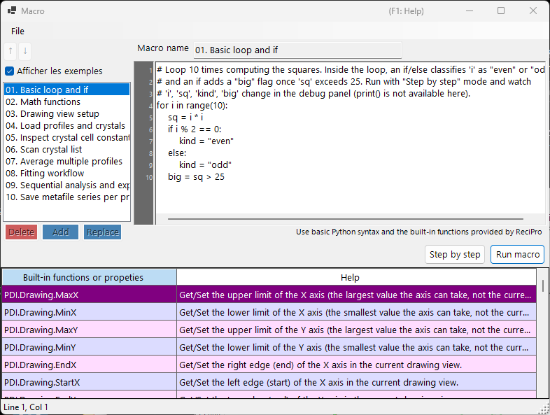

<!-- 260601Cl: migrated from legacy docx + yseto.net web manual -->
# Macro

La plupart des opérations de PDIndexer peuvent être automatisées grâce à la fonction **Macro**. Les macros sont des scripts Python écrits en [IronPython](https://ironpython.net/) (une implémentation de Python qui s'exécute sur .NET), édités et exécutés dans une fenêtre d'éditeur de macros dédiée. Utilisez-les pour automatiser des tâches répétitives, traiter par lots plusieurs fichiers et exporter en masse des résultats vers des fichiers CSV ou image.



!!! note "Connaissances de base en Python"
    Les macros acceptent directement la syntaxe Python standard (boucles `for`, `if`/`else`, listes, fonctions, etc.). Cette page n'explique pas le langage Python lui-même. Les fonctionnalités propres à PDIndexer sont appelées via l'objet `PDI` décrit ci-dessous.

## Ouvrir l'éditeur de macros

Dans la barre de menus de la fenêtre principale, choisissez **Macro → Éditeur** pour ouvrir la fenêtre de l'éditeur de macros (intitulée `Macro`).

Les macros créées et enregistrées dans l'éditeur sont également listées par leur nom sous le menu **Macro**, ce qui vous permet de les exécuter directement depuis le menu. La liste des macros est enregistrée automatiquement à la fermeture de PDIndexer et restaurée au lancement suivant.

## Disposition de la fenêtre de l'éditeur

La fenêtre de l'éditeur se compose des parties suivantes.

| Partie | Description |
| --- | --- |
| Liste des macros (à gauche) | Une liste des noms de macros enregistrées. Cliquez sur une entrée pour charger cette macro dans l'éditeur à droite. |
| Éditeur de code (au centre) | La zone où vous saisissez le script Python. Il prend en charge une gouttière de numéros de ligne, l'indentation automatique, la complétion de saisie (auto-complétion) et les info-bulles de fonctions. |
| Tableau de référence des fonctions | Un tableau de toutes les fonctions disponibles sous `PDI`. Double-cliquez sur une cellule pour insérer le nom de cette fonction dans le code à la position du curseur. |
| Panneau de débogage (à droite) | Affiche les noms et les valeurs des variables au point courant pendant l'exécution pas à pas. |
| Barre d'état | Affiche la position actuelle du curseur (`Line` / `Col`). |

### Boutons d'opération de la liste

Utilisez les boutons suivants pour modifier la liste des macros.

| Bouton | Action |
| --- | --- |
| `Add` | Ajoute le code actuel à la liste sous le nom saisi dans le champ de nom (demande confirmation d'écrasement si le nom existe déjà). |
| `Replace` | Remplace la macro sélectionnée dans la liste par le code actuel. |
| `Delete` | Supprime de la liste la macro sélectionnée. |
| `↑` / `↓` | Déplace la macro sélectionnée vers le haut ou vers le bas dans la liste. |
| `Show samples` | Bascule l'affichage des macros d'exemple intégrées (voir ci-dessous). |

!!! tip "Enregistrement et chargement"
    Les macros peuvent être enregistrées dans des fichiers `.mcr` individuels et chargées depuis ceux-ci. Faites glisser et déposez un fichier `.mcr` sur la fenêtre de l'éditeur pour en charger le contenu. Appuyer sur `Ctrl+S` après l'édition écrase la macro actuellement sélectionnée.

## Exécuter une macro

Exécutez la macro à l'aide des boutons situés en bas de l'éditeur de code.

| Bouton | Action |
| --- | --- |
| `Run macro` | Exécute la macro normalement, jusqu'au bout. |
| `Step by step` | Exécute la macro une ligne à la fois. Elle s'arrête avant chaque ligne et affiche les valeurs des variables courantes dans le panneau de débogage à droite. |
| `Next step (F10)` | Passe à la ligne suivante pendant l'exécution pas à pas (la touche `F10` fonctionne aussi). |
| `Stop` | Interrompt l'exécution. L'interruption n'est effective que pendant l'exécution en mode `Step by step`. |

!!! warning "print() n'est pas disponible"
    L'éditeur de macros n'a pas de console de sortie standard, donc la sortie de `print()` n'est pas affichée. Pour inspecter les valeurs des variables, exécutez la macro en mode `Step by step` et observez l'évolution des valeurs dans le panneau de débogage.

### Macros d'exemple

Cocher le bouton `Show samples` affiche dans la liste les macros d'exemple intégrées (en lecture seule). Les exemples sont affichés dans la langue d'interface actuelle (anglais/japonais). Utilisez-les comme référence lorsque vous écrivez vos propres macros. Les exemples intégrés sont :

| Nom | Contenu |
| --- | --- |
| 01. Basic loop and if | Bases des boucles `for` et de `if`/`else` |
| 02. Math functions | Utilisation du module `math` (`pi`, `sin`, `sqrt`, `exp`, `log`, etc.) |
| 03. Drawing view setup | Réglage de la plage d'affichage avec `PDI.Drawing.SetBounds` |
| 04. Load profiles and crystals | `PDI.File.ReadProfiles` / `ReadCrystals` |
| 05. Inspect crystal cell constants | Lecture des constantes de maille, du volume et de la pression via `PDI.Crystal` |
| 06. Scan crystal list | Parcours de l'ensemble de `PDI.CrystalList` |
| 07. Average multiple profiles | `PDI.ProfileOperator.Average` |
| 08. Fitting workflow | Une séquence complète de `PDI.Fitting` |
| 09. Sequential analysis and export | Exécution de `PDI.Sequential` et export CSV |
| 10. Save metafile series per profile | Enregistrement en masse d'un EMF par profil |

!!! note "Le module math est pré-importé"
    `import math` est exécuté automatiquement au démarrage de l'éditeur, vous pouvez donc utiliser directement le module `math`, par exemple `math.sqrt(2)`, sans instruction `import` explicite.

---

## Référence des fonctions

Toutes les fonctionnalités propres à PDIndexer sont appelées via les classes situées sous l'objet racine `PDI`. `PDI` est déjà disponible dans la portée de la macro, aucun `import` n'est donc nécessaire.

Chaque tableau ci-dessous est transcrit à partir des attributs `[Help]` du code source. La même liste apparaît dans le tableau de référence des fonctions à l'intérieur de la fenêtre de l'éditeur ainsi que dans [la section 6 du manuel web](https://yseto.net/soft/pdi/pdi_06).

!!! note "Notation"
    Dans la colonne signature, `(get/set)` désigne une propriété en lecture/écriture et `(get)` une propriété en lecture seule. Un argument avec `= value` est un argument par défaut et peut être omis.

### PDI (racine)

| Membre | Signature | Description |
| --- | --- | --- |
| `Sleep` | `Sleep(int millisec)` | Met en pause l'exécution de la macro pendant le nombre de millisecondes indiqué. |
| `Obj` | `Obj (get/set)` | Obtient/Définit les objets transmis depuis un autre programme (arguments inter-processus). |

### PDI.File — Entrées/sorties de fichiers

| Membre | Signature | Description |
| --- | --- | --- |
| `GetDirectoryPath` | `GetDirectoryPath(string filename = "")` | Obtient un chemin de répertoire (avec une barre oblique inverse finale). Si `filename` est omis, une boîte de dialogue de sélection de dossier s'ouvre. Sinon, la partie répertoire de `filename` est renvoyée. |
| `GetFileName` | `GetFileName()` | Ouvre une boîte de dialogue de sélection de fichier et renvoie le chemin complet du fichier choisi. Renvoie une chaîne vide si l'utilisateur annule. |
| `GetFileNames` | `GetFileNames()` | Ouvre une boîte de dialogue de fichiers à sélection multiple et renvoie les chemins complets des fichiers choisis. Renvoie un tableau vide si l'utilisateur annule. |
| `ReadProfiles` | `ReadProfiles(string filename)` | Lit les données de profil depuis le fichier indiqué. Si `filename` est omis (ou n'existe pas), une boîte de dialogue de sélection de fichier s'ouvre. |
| `SaveProfiles` | `SaveProfiles(string filename)` | Enregistre les données de profil dans le fichier indiqué. Si `filename` est omis, une boîte de dialogue d'enregistrement s'ouvre. |
| `ReadCrystals` | `ReadCrystals(string filename)` | Lit les données de cristal depuis le fichier indiqué. Si `filename` est omis (ou n'existe pas), une boîte de dialogue de sélection de fichier s'ouvre. |
| `SaveCrystals` | `SaveCrystals(string filename)` | Enregistre les données de cristal dans le fichier indiqué. Si `filename` est omis, une boîte de dialogue d'enregistrement s'ouvre. |
| `SaveMetafile` | `SaveMetafile(string filename)` | Enregistre le motif actuel sous forme de métafichier Windows (`.emf`). Si `filename` est omis, une boîte de dialogue d'enregistrement s'ouvre. |
| `SaveText` | `SaveText(string text, string filename)` | Enregistre le contenu textuel indiqué dans un fichier `.txt`. Si `filename` est omis, une boîte de dialogue d'enregistrement s'ouvre. |

### PDI.Drawing — Vue de dessin

| Membre | Signature | Description |
| --- | --- | --- |
| `MaxX` | `MaxX (get/set)` | Obtient/Définit la limite supérieure de l'axe X (la plus grande valeur que l'axe peut prendre, pas la vue actuelle). |
| `MinX` | `MinX (get/set)` | Obtient/Définit la limite inférieure de l'axe X (la plus petite valeur que l'axe peut prendre, pas la vue actuelle). |
| `MaxY` | `MaxY (get/set)` | Obtient/Définit la limite supérieure de l'axe Y (la plus grande valeur que l'axe peut prendre, pas la vue actuelle). |
| `MinY` | `MinY (get/set)` | Obtient/Définit la limite inférieure de l'axe Y (la plus petite valeur que l'axe peut prendre, pas la vue actuelle). |
| `EndX` | `EndX (get/set)` | Obtient/Définit le bord droit (fin) de l'axe X dans la vue de dessin actuelle. |
| `StartX` | `StartX (get/set)` | Obtient/Définit le bord gauche (début) de l'axe X dans la vue de dessin actuelle. |
| `EndY` | `EndY (get/set)` | Obtient/Définit le bord supérieur (fin) de l'axe Y dans la vue de dessin actuelle. |
| `StartY` | `StartY (get/set)` | Obtient/Définit le bord inférieur (début) de l'axe Y dans la vue de dessin actuelle. |
| `SetBounds` | `SetBounds(double startX, double endX, double startY, double endY)` | Définit la vue de dessin en donnant les quatre bords (StartX, EndX, StartY, EndY). |

### PDI.Crystal — Cristal sélectionné

Les constantes de maille `CellA`–`CellC` sont en \( \mathrm{\AA} \), et `CellAlpha`–`CellGamma` sont en degrés (deg).

| Membre | Signature | Description |
| --- | --- | --- |
| `CellVolume` | `CellVolume (get)` | Obtient le volume de maille (\( \mathrm{\AA}^3 \)) du cristal sélectionné. Renvoie 0 si aucun cristal n'est sélectionné. |
| `Pressure` | `Pressure(double volume = 0)` | Obtient la pression (GPa) du cristal sélectionné calculée à partir de son EOS. Si `volume` vaut 0 (par défaut), le volume de maille actuel est utilisé. |
| `Name` | `Name (get/set)` | Obtient/Définit le nom du cristal sélectionné. |
| `CellA` | `CellA (get/set)` | Obtient/Définit la constante de maille a (\( \mathrm{\AA} \)) du cristal sélectionné. |
| `CellB` | `CellB (get/set)` | Obtient/Définit la constante de maille b (\( \mathrm{\AA} \)) du cristal sélectionné. |
| `CellC` | `CellC (get/set)` | Obtient/Définit la constante de maille c (\( \mathrm{\AA} \)) du cristal sélectionné. |
| `CellAlpha` | `CellAlpha (get/set)` | Obtient/Définit la constante de maille alpha (deg) du cristal sélectionné. |
| `CellBeta` | `CellBeta (get/set)` | Obtient/Définit la constante de maille beta (deg) du cristal sélectionné. |
| `CellGamma` | `CellGamma (get/set)` | Obtient/Définit la constante de maille gamma (deg) du cristal sélectionné. |

### PDI.CrystalList — Liste des cristaux

| Membre | Signature | Description |
| --- | --- | --- |
| `Open` | `Open()` | Ouvre la fenêtre 'Crystal List'. |
| `Close` | `Close()` | Ferme la fenêtre 'Crystal List'. |
| `Count` | `Count (get)` | Obtient le nombre total de cristaux dans la liste. |
| `SelectedName` | `SelectedName (get)` | Obtient le nom du cristal actuellement sélectionné. Renvoie une chaîne vide si aucun cristal n'est sélectionné. |
| `SelectedIndex` | `SelectedIndex (get/set)` | Obtient/Définit l'index du cristal actuellement sélectionné. |
| `Select` | `Select(int index)` | Sélectionne le cristal à l'index indiqué. |
| `Check` | `Check(int index = -1, bool state = true)` | Coche ou décoche le cristal à l'index indiqué. Si `index` vaut -1, le cristal actuellement sélectionné est ciblé. |
| `Uncheck` | `Uncheck(int index = -1)` | Décoche le cristal à l'index indiqué. Si `index` vaut -1, le cristal actuellement sélectionné est décoché. |
| `GetCellVolume` | `GetCellVolume (get)` | Obtient le volume de maille (\( \mathrm{\AA}^3 \)) du cristal sélectionné. Identique à `PDI.Crystal.CellVolume` ; conservé pour la compatibilité ascendante. |

### PDI.Profile — Profil sélectionné

| Membre | Signature | Description |
| --- | --- | --- |
| `Comment` | `Comment (get/set)` | Obtient/Définit le texte de commentaire du profil actuellement sélectionné. |
| `Name` | `Name (get/set)` | Obtient/Définit le nom d'affichage du profil actuellement sélectionné. |

### PDI.ProfileOperator — Arithmétique des profils

Chaque profil est spécifié par son index dans la liste. `output` est le nom donné au profil résultant.

| Membre | Signature | Description |
| --- | --- | --- |
| `Average` | `Average(int[] indices, string output)` | Calcule la moyenne des profils dont les index sont listés dans `indices` (par ex. `[1,3,5,9]`). `output` est le nom donné au profil résultant. |
| `AddTwoProfiles` | `AddTwoProfiles(int index1, int index2, string output)` | Calcule profile1 + profile2. Chaque profil est spécifié par son index. `output` est le nom donné au profil résultant. |
| `SubtractTwoProfiles` | `SubtractTwoProfiles(int index1, int index2, string output)` | Calcule profile1 − profile2. Chaque profil est spécifié par son index. `output` est le nom donné au profil résultant. |
| `MultiplyTwoProfiles` | `MultiplyTwoProfiles(int index1, int index2, string output)` | Calcule profile1 × profile2. Chaque profil est spécifié par son index. `output` est le nom donné au profil résultant. |
| `DivideTwoProfiles` | `DivideTwoProfiles(int index1, int index2, string output)` | Calcule profile1 ÷ profile2. Chaque profil est spécifié par son index. `output` est le nom donné au profil résultant. |

### PDI.ProfileList — Liste des profils

| Membre | Signature | Description |
| --- | --- | --- |
| `Open` | `Open()` | Ouvre la fenêtre 'Profile List'. |
| `Close` | `Close()` | Ferme la fenêtre 'Profile List'. |
| `DeleteAll` | `DeleteAll()` | Supprime tous les profils de la liste (sans boîte de dialogue de confirmation). |
| `Delete` | `Delete(int index)` | Supprime le profil à l'index indiqué. |
| `Count` | `Count (get)` | Obtient le nombre total de profils dans la liste. |
| `SelectedName` | `SelectedName (get)` | Obtient le nom du profil actuellement sélectionné. Renvoie une chaîne vide si aucun profil n'est sélectionné. |
| `SelectedIndex` | `SelectedIndex (get/set)` | Obtient/Définit l'index du profil actuellement sélectionné. |
| `Select` | `Select(int index)` | Sélectionne le profil à l'index indiqué. |
| `Check` | `Check(int index = -1, bool state = true)` | Coche ou décoche le profil à l'index indiqué. Si `index` vaut -1, le profil actuellement sélectionné est ciblé. |
| `Uncheck` | `Uncheck(int index = -1)` | Décoche le profil à l'index indiqué. Si `index` vaut -1, le profil actuellement sélectionné est décoché. |
| `CheckAll` | `CheckAll()` | Coche tous les profils de la liste. |
| `UncheckAll` | `UncheckAll()` | Décoche tous les profils de la liste. |

### PDI.Fitting — Ajustement des pics

Pilote la fenêtre [Ajustement des pics de diffraction](6-fitting-diffraction-peaks.md).

| Membre | Signature | Description |
| --- | --- | --- |
| `Open` | `Open()` | Ouvre la fenêtre 'Fitting peaks'. |
| `Close` | `Close()` | Ferme la fenêtre 'Fitting peaks'. |
| `Apply` | `Apply()` | Applique les constantes de maille optimisées au cristal sélectionné (équivalent à cliquer sur le bouton `Confirm` de la fenêtre d'ajustement). |
| `Check` | `Check(int index = -1, bool state = true)` | Coche ou décoche le plan réticulaire à l'index indiqué. Si `index` vaut -1, le plan actuellement sélectionné est ciblé. |
| `Uncheck` | `Uncheck(int index = -1)` | Décoche le plan réticulaire à l'index indiqué. Si `index` vaut -1, le plan actuellement sélectionné est décoché. |
| `Select` | `Select(int index)` | Sélectionne le plan réticulaire à l'index indiqué. |
| `SelectedIndex` | `SelectedIndex (get/set)` | Obtient/Définit l'index du plan réticulaire actuellement sélectionné. |
| `Range` | `Range(double range)` | Définit la plage de recherche de pic pour le plan réticulaire actuellement sélectionné (dans la même unité que l'axe X). |

### PDI.Sequential — Analyse séquentielle

Pilote la fenêtre [Analyse séquentielle](7-sequential-analysis.md). Les accesseurs CSV renvoient les résultats de la dernière analyse séquentielle sous forme de chaîne CSV.

| Membre | Signature | Description |
| --- | --- | --- |
| `Directory` | `Directory (get/set)` | Obtient/Définit le chemin de répertoire complet où les résultats de l'analyse séquentielle sont enregistrés. |
| `Open` | `Open()` | Ouvre la fenêtre 'Sequential Analysis'. |
| `Close` | `Close()` | Ferme la fenêtre 'Sequential Analysis'. |
| `Execute` | `Execute()` | Exécute l'analyse séquentielle sur tous les profils cochés. |
| `GetCSV_2theta` | `GetCSV_2theta()` | Obtient les résultats en 2-theta de la dernière analyse séquentielle sous forme de chaîne CSV. |
| `GetCSV_D` | `GetCSV_D()` | Obtient les résultats de distance interréticulaire (valeur d) de la dernière analyse séquentielle sous forme de chaîne CSV. |
| `GetCSV_FWHM` | `GetCSV_FWHM()` | Obtient les résultats de FWHM de la dernière analyse séquentielle sous forme de chaîne CSV. |
| `GetCSV_Intensity` | `GetCSV_Intensity()` | Obtient les résultats d'intensité des pics de la dernière analyse séquentielle sous forme de chaîne CSV. |
| `GetCSV_CellConstants` | `GetCSV_CellConstants()` | Obtient les résultats de constantes de maille de la dernière analyse séquentielle sous forme de chaîne CSV. |
| `GetCSV_Pressure` | `GetCSV_Pressure()` | Obtient les résultats de pression de la dernière analyse séquentielle sous forme de chaîne CSV. |
| `GetCSV_Singh` | `GetCSV_Singh()` | Obtient les résultats de l'équation de Singh de la dernière analyse séquentielle sous forme de chaîne CSV. |
| `AutoSave2theta` | `AutoSave2theta (get/set)` | Obtient/Définit si les résultats en 2-theta sont enregistrés automatiquement après chaque exécution d'analyse séquentielle. |
| `AutoSaveDspacing` | `AutoSaveDspacing (get/set)` | Obtient/Définit si les résultats de distance interréticulaire (valeur d) sont enregistrés automatiquement après chaque exécution d'analyse séquentielle. |
| `AutoSaveFWHM` | `AutoSaveFWHM (get/set)` | Obtient/Définit si les résultats de FWHM sont enregistrés automatiquement après chaque exécution d'analyse séquentielle. |
| `AutoSaveIntensity` | `AutoSaveIntensity (get/set)` | Obtient/Définit si les résultats d'intensité des pics sont enregistrés automatiquement après chaque exécution d'analyse séquentielle. |
| `AutoSaveCellConstants` | `AutoSaveCellConstants (get/set)` | Obtient/Définit si les résultats de constantes de maille sont enregistrés automatiquement après chaque exécution d'analyse séquentielle. |
| `AutoSavePressure` | `AutoSavePressure (get/set)` | Obtient/Définit si les résultats de pression sont enregistrés automatiquement après chaque exécution d'analyse séquentielle. |
| `AutoSaveSingh` | `AutoSaveSingh (get/set)` | Obtient/Définit si les résultats de l'équation de Singh sont enregistrés automatiquement après chaque exécution d'analyse séquentielle. |

## Exemple de macro

À titre d'exemple intégré, voici une macro qui exécute l'analyse séquentielle et enregistre les résultats au format CSV.

```python
# Check all profiles, run sequential analysis, then obtain 2-theta / d-spacing /
# cell-constant / pressure results as CSV strings and save each to a file.
PDI.ProfileList.CheckAll()
PDI.Sequential.Open()
PDI.Sequential.Execute()
dir_path = PDI.File.GetDirectoryPath()
PDI.File.SaveText(PDI.Sequential.GetCSV_2theta(),        dir_path + "seq_2theta.csv")
PDI.File.SaveText(PDI.Sequential.GetCSV_D(),             dir_path + "seq_d.csv")
PDI.File.SaveText(PDI.Sequential.GetCSV_CellConstants(), dir_path + "seq_cell.csv")
PDI.File.SaveText(PDI.Sequential.GetCSV_Pressure(),      dir_path + "seq_pressure.csv")
```

Vous pouvez parcourir les autres exemples à partir du bouton `Show samples` de l'éditeur.
