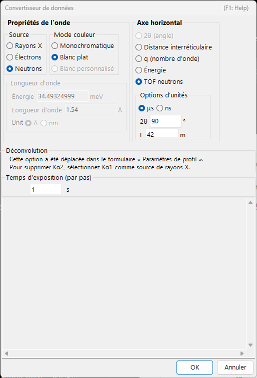
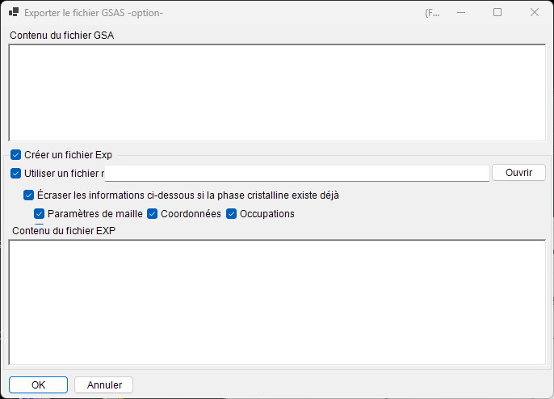

<!-- 260601Cl: migrated from legacy docx + yseto.net web manual -->
# Formats de fichiers

Les fichiers que PDIndexer lit et écrit se répartissent en trois groupes : **données de profil**, **listes de cristaux / structures cristallines** et **sortie graphique**. Toutes ces opérations d'entrée/sortie sont accessibles depuis le menu **Fichier** de la [fenêtre principale](../1-main-window.md).

Cette page récapitule sous forme de tableau les extensions prises en charge, le sens des entrées/sorties et les remarques.

---

## Données de profil

### Lecture (Lire le(s) profil(s))

**Fichier → Lire le(s) profil(s)** permet de charger plusieurs fichiers à la fois. En plus du format propre à PDIndexer `pdi` / `pdi2`, il prend en charge divers formats texte et binaires d'angle/intensité (ou énergie/intensité) tels que le `csv` de WinPIP, le `chi` de Fit2D et le `ras` de Rigaku. Même les formats non listés ci-dessous peuvent généralement être lus : tout fichier texte ordinaire d'angle/intensité est traité par un analyseur générique de repli.

| Extension | Origine / format | Remarques |
| --- | --- | --- |
| `pdi` / `pdi2` | Format natif de PDIndexer | Conserve le profil avec les informations qui lui sont associées (source du rayonnement, longueur d'onde, temps d'exposition, etc.). `pdi2` est la version actuelle. La boîte de dialogue Convertisseur de données n'est pas affichée lors de la lecture de ces fichiers. |
| `csv` | Sortie de WinPIP (séparé par des virgules : `angle,intensité`) | Importé via la boîte de dialogue Convertisseur de données, où vous précisez la signification de l'axe horizontal, la source du rayonnement et la longueur d'onde. |
| `tsv` | Séparé par des tabulations (`angle` `[TAB]` `intensité`) | Importé comme texte générique. |
| `chi` | Sortie de Fit2D | Les premières lignes d'en-tête sont ignorées ; les colonnes 2 et 4 des données à quatre colonnes sont prises comme angle et intensité. |
| `ras` | Format Rigaku | Format texte contenant également des informations sur l'instrument. |
| `nxs` | NeXus / HDF5 (SSD, détecteurs multiples) | Peut contenir plusieurs canaux (histogrammes) ; chacun est calibré en énergie et importé séparément. |
| `npd` | Profil EDX (SSD) | Lit `EGC0/1/2`, `2Theta`, `Live time`, etc. dans l'en-tête et convertit le numéro de canal en énergie. |
| `xbm` | Format binaire EDX (par ex. SP-8 BL04B2) | Les métadonnées telles que le nom de l'échantillon, les conditions de mesure et les coefficients de calibration EGC sont importées sous forme de commentaire. |
| `rpt` | Format Genie (SSD) | Lit l'angle de prise de vue, le temps d'exposition et l'EGC dans l'en-tête. |
| `xy` | Texte à deux colonnes calibré par pyFAI | Lit la longueur d'onde dans l'en-tête et importe l'angle et l'intensité. |
| `gsa` | Données GSAS (bloc `BANK`) | Importe les trois colonnes : angle, intensité, erreur. |
| Autre | Texte générique angle/intensité | Le délimiteur virgule / espace / tabulation est détecté automatiquement (via la boîte de dialogue Convertisseur de données). |

!!! note "Charger plusieurs fichiers à la fois"
    Lorsque vous sélectionnez et lisez plusieurs fichiers, après avoir confirmé les réglages du Convertisseur de données pour le premier fichier, un message vous demande si vous souhaitez réutiliser les mêmes réglages pour les fichiers restants. Choisir **Oui** traite le reste sans afficher la boîte de dialogue, ce qui accélère le chargement.

### Boîte de dialogue Convertisseur de données

Lorsque vous lisez un fichier autre que `pdi` / `pdi2` (`csv`, `chi`, `ras`, `nxs`, `npd`, `xbm`, `rpt`, `xy`, `gsa` et texte générique), la boîte de dialogue **Convertisseur de données** s'ouvre. C'est là que vous faites correspondre les colonnes numériques importées aux grandeurs physiques correctes utilisées en interne par PDIndexer.

La boîte de dialogue propose les réglages suivants.

| Réglage | Description |
| --- | --- |
| Axe horizontal | La grandeur physique (2θ, énergie, distance interréticulaire, nombre d'onde, TOF, etc.) et l'unité représentées par la première colonne importée. |
| Source / longueur d'onde | Rayons X / neutrons / électrons, et la raie de rayons X caractéristique (Kα, etc.) ou la longueur d'onde. Cela détermine la conversion en distance interréticulaire et en 2θ. |
| Temps d'exposition (par pas) | Le temps d'exposition par pas en secondes. Utilisé pour l'affichage en CPS et la normalisation de l'intensité. |
| Pour les données SSD | Pour les données SSD (EDX) telles que `rpt` / `npd` / `xbm` / `nxs`, réglez les coefficients \(a_0, a_1, a_2\) qui convertissent le numéro de canal \(n\) en énergie \(E\). Lorsqu'il y a plusieurs détecteurs, vous pouvez activer/désactiver chacun d'eux et régler ses coefficients individuellement. |
| Seuil de basse énergie | Lorsque cette case est cochée, les points de données situés sous l'énergie spécifiée sont exclus à l'import. |

Pour les données SSD, le numéro de canal \(n\) est converti en énergie \(E\) (en eV) par une calibration quadratique :

$$
E = a_0 + a_1\,n + a_2\,n^2
$$

Lors de la lecture d'un texte générique (un format « autre »), la boîte de dialogue affiche le contenu réel du fichier dans une zone de texte afin que vous puissiez régler l'axe horizontal, la source du rayonnement, etc. tout en inspectant les données. Le délimiteur (virgule / espace / tabulation) et le nombre de lignes d'en-tête à ignorer au début sont détectés automatiquement.

!!! tip "Surveiller le presse-papiers / un dossier"
    Activer **Options → Surveiller le presse-papiers** permet à PDIndexer d'importer automatiquement les profils copiés depuis d'autres applications telles qu'IPAnalyzer. Activer **Surveiller le fichier** lit automatiquement les nouveaux fichiers `pdi` créés dans un dossier choisi.

### Enregistrement et exportation

**Fichier → Enregistrer le(s) profil(s)** enregistre tous les profils chargés au format natif `pdi2` de PDIndexer.

**Fichier → Exporter le(s) profil(s) sélectionné(s)** écrit le profil sélectionné dans l'un des formats suivants.

| Extension / format | Sens | Remarques |
| --- | --- | --- |
| `pdi2` | Sortie | Format natif de PDIndexer. Enregistre tous les profils en une seule fois. |
| `csv` | Sortie | Séparé par des virgules (angle, intensité). |
| `tsv` | Sortie | Séparé par des tabulations (angle et intensité séparés par une tabulation). |
| `gsa` (GSAS) | Sortie | Format GSAS pour l'analyse Rietveld. Vous pouvez en vérifier le contenu dans l'écran d'exportation ci-dessous. |

#### Exportation au format GSAS

Lorsque vous choisissez le format GSAS, un écran d'exportation apparaît pour vous permettre de vérifier ce qui sera écrit. La ligne 1 est le nom du profil, la ligne 2 est un en-tête `BANK 1 … CONST … FXYE`, et les lignes suivantes contiennent trois colonnes : angle, intensité et erreur. L'erreur est tirée des données d'erreur propres au profil lorsqu'elles sont présentes ; sinon, \(\sqrt{\text{intensity}}\) est utilisé.

!!! note "Mise à l'échelle de l'angle"
    Pour les données ordinaires à dispersion angulaire, les valeurs d'angle sont écrites multipliées par 100 (la convention `CONST` de GSAS). Pour les données neutrons TOF, les valeurs sont écrites telles quelles, sans mise à l'échelle.

---

## Listes de cristaux et structures cristallines

Les listes de cristaux sont enregistrées et chargées sous forme de fichiers XML (extension `xml`). Les structures cristallines individuelles peuvent être importées depuis CIF / AMC. Voir [Paramètres du cristal](../3-crystal-parameter.md) pour plus de détails.

| Opération (menu Fichier) | Extension | Sens | Remarques |
| --- | --- | --- | --- |
| Charger les cristaux (comme nouvelle liste) | `xml` | Entrée | Charge une liste de cristaux et remplace la liste actuelle (la liste actuelle est supprimée). |
| Charger les cristaux (et ajouter à la liste actuelle) | `xml` | Entrée | Charge une liste de cristaux et l'ajoute à la fin de la liste actuelle. |
| Enregistrer les cristaux | `xml` | Sortie | Enregistre la liste de cristaux actuelle dans un fichier. |
| Importer CIF, AMC... | `cif` / `amc` | Entrée | Ajoute des données de structure au format CIF ou AMC (AMCSD) à la liste de cristaux actuelle. |
| Exporter le cristal sélectionné en CIF | `cif` | Sortie | Enregistre le cristal sélectionné sous forme de fichier de données de structure CIF. |
| Rétablir les cristaux à l'état initial | — | — | Rétablit la liste de cristaux à son état par défaut tel qu'installé. |

---

## Sortie du graphique (visualiseur de profils)

Le profil actuellement affiché dans la fenêtre principale peut être copié dans le presse-papiers sous forme d'image ou enregistré sous forme de métafichier vectoriel.

| Opération (menu Fichier) | Format | Sens | Remarques |
| --- | --- | --- | --- |
| Copier dans le presse-papiers (comme données Bitmap) | Bitmap | Presse-papiers | Copie le contenu du visualiseur dans le presse-papiers sous forme d'image bitmap. |
| Copier dans le presse-papiers (comme données Metafile) | Métafichier (vectoriel) | Presse-papiers | Copie le contenu du visualiseur dans le presse-papiers sous forme vectorielle. |
| Enregistrer comme métafichier | `emf` (EMF) | Sortie | Enregistre au format EMF (Enhanced Metafile). Comme il conserve les informations vectorielles et de police, le fichier `emf` enregistré peut être lu dans PowerPoint et Word. |

En outre, **Mise en page**, **Aperçu avant impression** et **Imprimer** permettent d'imprimer directement la plage actuelle d'angles et d'intensités.
