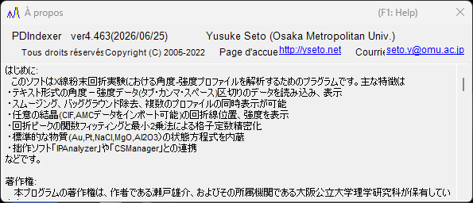

<!-- 260601Cl: migrated from legacy docx + yseto.net web manual -->
# Environnement d'exécution et installation

Cette page décrit comment installer PDIndexer ainsi que l'environnement recommandé pour un fonctionnement confortable.

## Installation

Téléchargez la dernière version depuis la page des releases GitHub.

- Téléchargement : <https://github.com/seto77/PDIndexer/releases/latest>

La méthode recommandée est l'installateur MSI. Téléchargez `PDIndexer-setup.msi` (x64) et double-cliquez dessus pour démarrer l'installation. Sous Windows on Arm (par exemple les PC Snapdragon), téléchargez plutôt `PDIndexer-setup_arm64.msi`. <!-- 260625Cl WiX asset names + arm64 -->

Si l'installation MSI est bloquée sur un PC Windows administré, utilisez comme solution de rechange le paquet ZIP sans installation. Téléchargez le ZIP portable (`PDIndexer-v.<ver>.zip` pour x64, ou `PDIndexer-v.<ver>_arm64.zip` pour Arm), extrayez le dossier complet vers un emplacement accessible en écriture par l'utilisateur, puis exécutez `PDIndexer.exe` depuis le dossier extrait. N'exécutez pas `PDIndexer.exe` directement depuis l'afficheur du ZIP. <!-- 260601Ch / 260625Cl -->

!!! note "À propos de l'avertissement de protection de Windows"
    Lorsque vous exécutez un logiciel de recherche non signé fraîchement téléchargé, Windows peut afficher un avertissement SmartScreen (« Windows a protégé votre ordinateur »). Si cela se produit, cliquez sur **Informations complémentaires**, puis choisissez **Exécuter quand même** pour continuer.

!!! note "À propos du paquet ZIP sans installation"
    Le paquet ZIP est conçu comme une solution de rechange pour les environnements où l'installation MSI, l'approbation d'un administrateur ou l'installation séparée du .NET Desktop Runtime sont difficiles. Il ne s'agit pas d'un dossier de paramètres entièrement autonome : PDIndexer continue de stocker les paramètres utilisateur et les données par défaut copiées dans le dossier AppData de l'utilisateur courant, et peut stocker des options propres à chaque utilisateur sous `HKEY_CURRENT_USER\Software\Crystallography\PDIndexer`.

## Configuration d'exécution requise

Le runtime suivant est requis lorsque PDIndexer est installé à partir de l'installateur MSI.

| Élément | Exigence |
| --- | --- |
| OS | Windows (64 bits, x64 ou Arm64) |
| Runtime | `.NET Desktop Runtime 10.0` (le **Desktop Runtime**, pas le simple **.NET Runtime** ; sous Windows on Arm, la version **Arm64**) |

!!! warning "Choisissez le Desktop Runtime"
    La page de téléchargement propose deux produits : le « .NET Runtime » et le « .NET Desktop Runtime ». Comme PDIndexer est une application WinForms, veillez à installer le **.NET Desktop Runtime**. Le simple « .NET Runtime » seul ne permettra pas de lancer le programme.

- Télécharger le runtime : <https://dotnet.microsoft.com/download/dotnet/10.0>

Le paquet ZIP sans installation est autonome (self-contained) pour l'architecture correspondante (x64 ou Arm64) et ne nécessite pas d'installation séparée du .NET Desktop Runtime. <!-- 260601Ch / 260625Cl arm64 -->

!!! note "À propos de la version indiquée dans les anciens documents"
    L'ancien manuel (docx) mentionne « .NET Desktop Runtime 6.0 ou ultérieur », mais la version actuelle de PDIndexer requiert **.NET 10.0**. Suivez l'exigence de la dernière version.

## Environnement recommandé

Certaines fonctionnalités de PDIndexer nécessitent des ressources de calcul importantes. Pour améliorer la vitesse, les calculs sont multithreadés autant que possible. Pour une utilisation confortable, un ordinateur présentant les caractéristiques hautes performances suivantes est recommandé.

| Élément | Recommandé |
| --- | --- |
| OS | Windows 11 (Windows 10 ou ultérieur, 64 bits, fonctionne aussi) |
| RAM | 16 Go ou plus |
| CPU | 8 cœurs ou plus (efficace pour le calcul multithreadé) |

!!! tip "Avantage du multithreading"
    Les calculs de diagrammes de diffraction utilisant des structures cristallines, l'analyse séquentielle et les tâches similaires s'exécutent plus rapidement avec davantage de cœurs CPU. Plus votre CPU compte de cœurs, plus le temps d'attente de calcul est court.

## Mises à jour (recherche de nouvelles versions)

Depuis le menu **Aide** de la fenêtre principale, PDIndexer vous permet de mettre à jour vers la dernière version et de consulter les informations sur l'auteur.

| Menu | Fonction |
| --- | --- |
| **Aide** ▸ **Rechercher des mises à jour** | Vérifie si une version plus récente a été publiée et met à jour le programme. |
| **Aide** ▸ **À propos de PDIndexer** | Affiche les informations de version et sur l'auteur. |

Choisir **Aide** ▸ **À propos de PDIndexer** ouvre une fenêtre semblable à celle ci-dessous, où vous pouvez vérifier le numéro de version actuel et les informations sur l'auteur.

!!! tip "Mettez à jour régulièrement"
    Des corrections de bogues et de nouvelles fonctionnalités sont ajoutées en continu. Exécutez **Aide** ▸ **Rechercher des mises à jour** de temps en temps pour garder PDIndexer à jour.

## Licence

PDIndexer est distribué sous la **licence MIT**. L'utilisation, la modification, la distribution et l'usage commercial sont librement autorisés, à condition que la mention de copyright et le texte de la licence soient inclus avec toute redistribution. Le logiciel est fourni sans garantie.
