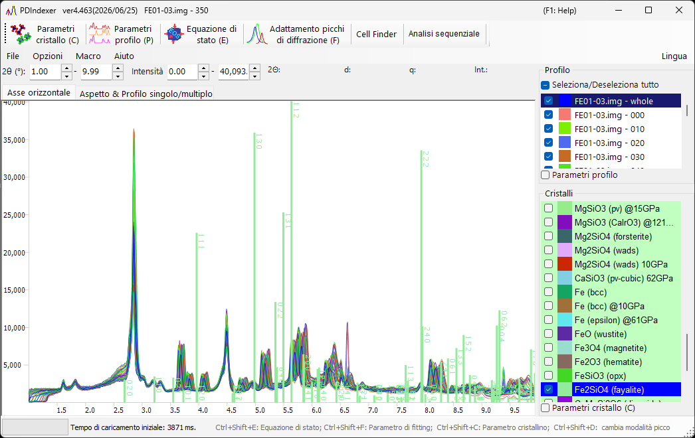

<!-- 260601Cl: migrated from legacy docx + yseto.net web manual -->
# Profili di diffrazione

Questa pagina descrive i "dati di profilo" stessi (il set di dati misurato) che PDIndexer gestisce, e come caricarli, visualizzarli ed esportarli. Le elaborazioni applicate dopo il caricamento — smoothing, sottrazione del fondo e così via — vengono eseguite nella finestra [Parametri del profilo](4-profile-parameter.md). Per l'elenco completo delle estensioni di file supportate, vedere [Formati di file](appendix/file-formats.md).

## Che cos'è un profilo

Un profilo è un set di dati unidimensionale di tipo "asse orizzontale vs. intensità" ottenuto da una misura di diffrazione da polveri. L'asse orizzontale è espresso in uno dei modi seguenti, a seconda della geometria di misura:

- \( 2\theta \) (angolo di diffrazione) per la diffrazione a dispersione angolare (diffrazione di raggi X ordinaria)
- Energia per le misure a dispersione di energia (raggi X bianchi, rivelazione SSD)
- Tempo di volo per il metodo dei neutroni a tempo di volo (TOF)
- In ogni caso, i dati possono anche essere gestiti internamente dopo la conversione nella distanza interplanare (valore d) \( d \) o nel vettore di scattering \( q \)

L'asse verticale è l'intensità di diffrazione, che può essere mostrata come `Raw Counts` o `Count per Step (CPS)`, su scala lineare o logaritmica (vedere `Vertical Axis` nella pagina [Finestra principale](1-main-window.md)).

## Formati di input supportati

`File ▸ Read profile(s)` carica il formato nativo di PDIndexer, così come l'output di altri programmi e i formati di testo generici.

| Estensione | Contenuto |
| --- | --- |
| `pdi` / `pdi2` | Formato di profilo nativo di PDIndexer (include le impostazioni degli assi e le informazioni di elaborazione) |
| `csv` | Output di WinPIP (separato da virgole) |
| `chi` | Output di Fit2D |
| `tsv` | Testo separato da tabulazioni |
| `ras` | Formato Rigaku (RAS) |
| `nxs` | Formato NeXus |
| `npd` / `xbm` / `rpt` (`rpf`) | Dati grezzi SSD (rivelatore a stato solido) |
| Altro testo | Qualsiasi testo a due colonne angolo (o valore d)–intensità è generalmente leggibile |

!!! note "Lettura di testo generico"
    I file memorizzati come testo angolo–intensità possono di solito essere letti anche se non appartengono a uno dei formati standard sopra elencati. Se il tipo di asse orizzontale o la lunghezza d'onda/energia non possono essere determinati, specificarli nella finestra di dialogo `Data Converter` descritta di seguito.

La specifica dettagliata di ciascun formato è raccolta in [Formati di file](appendix/file-formats.md).

## Come caricare

I profili possono essere caricati in diversi modi.

- **Menu** — `File ▸ Read profile(s)`. È possibile selezionare più file contemporaneamente.
- **Trascinamento (drag and drop)** — Trascinare i file da Esplora file sulla finestra principale.
- **Watch Clipboard** — Quando `Option ▸ Watch Clipboard` è abilitato, i profili/cristalli copiati da altre applicazioni (ad es. IPAnalyzer o CSManager) vengono importati automaticamente.
- **Watch File** — Quando `Option ▸ Watch File` è abilitato e una cartella viene scelta con `Set Directory to the watch`, i file di profilo `pdi` appena creati in quella cartella vengono letti automaticamente. Questo è comodo per la visualizzazione in tempo reale durante una misura continua.

!!! tip "Allineare automaticamente l'asse orizzontale"
    Selezionando `After reading profile, change horizontal axis` la visualizzazione dell'asse orizzontale viene commutata per corrispondere al profilo appena caricato immediatamente dopo la sua lettura.

## Modalità Single Profile e Multi Profiles

Cambiare la modalità di visualizzazione con `Single/Multi Profile` sul lato destro della finestra principale.

- **`Single Profile`** — Il caricamento di un nuovo profilo sostituisce i dati precedenti; viene mostrato un solo profilo alla volta.
- **`Multi Profiles`** — I profili caricati vengono sovrapposti. Usare `Increasing intensity by a profile` per sfalsare leggermente l'intensità di ciascun profilo, così da rendere più facile distinguere le diverse curve. Abilitando `Change automatically color` viene assegnato automaticamente un colore di disegno a ciascun profilo.

## Elenco di controllo dei profili

L'elenco `Profile` sul lato sinistro della finestra principale mostra tutti i profili caricati.

- Solo i profili selezionati vengono disegnati nel visualizzatore centrale. Usare `Check/Uncheck all` per commutarli tutti insieme.
- Fare clic sulla colonna `Color` per cambiare il colore di disegno di ciascun profilo.
- Riordinare le voci nell'elenco per regolare l'ordine di disegno della sovrapposizione.
- L'elenco è disabilitato nella modalità Single Profile e mostra più profili nella modalità Multi Profiles.

Le impostazioni più dettagliate del profilo (nome, stile della linea, smoothing, sottrazione del fondo, correzione degli assi, operazioni sui profili e così via) vengono effettuate nella finestra [Parametri del profilo](4-profile-parameter.md), aperta selezionando la casella `Profile Parameter` sotto l'elenco.

## Finestra di dialogo Data Converter

Quando si carica un file di testo generico il cui tipo di asse orizzontale non può essere determinato, oppure dati grezzi SSD (a dispersione di energia), si apre la finestra di dialogo `Data Converter` così da poter specificare l'asse orizzontale dei dati letti e i relativi parametri.

La finestra di dialogo imposta i seguenti elementi.

| Elemento | Contenuto |
| --- | --- |
| Impostazione dell'asse orizzontale | Specifica il tipo di asse orizzontale dei dati (lunghezza d'onda/energia dei raggi X, 2θ, lunghezza/angolo TOF dei neutroni, ecc.) e i parametri della sorgente corrispondenti. |
| `Tempo di esposizione (per passo)` | Tempo di esposizione (misura) per passo di dati, in secondi. Viene usato per la conversione in CPS; i valori ≤ 0 sono trattati come 1. |
| `Deconvoluzione` | La rimozione di Kα2 è stata spostata nel modulo [Parametri del profilo](4-profile-parameter.md). Per rimuoverla, selezionare Kα1 come sorgente di raggi X. |
| `Taglio a bassa energia` sotto `Per dati SSD` | Scarta il lato a bassa energia dello spettro EDX al di sotto della soglia (eV) indicata a destra. |

Quando il tipo di asse orizzontale è a dispersione di energia (raggi X bianchi, EDX), inserire i coefficienti di calibrazione dell'energia di `E = a₀ + a₁ n + a₂ n²` (E: energia in eV, n: numero di canale) per convertire i numeri di canale in energia. Fare clic su `OK` per applicare le impostazioni e convertire i dati, oppure su `Cancel` per interrompere l'importazione.

## Esportazione dei profili

- **`File ▸ Save profile(s)`** — Salva tutti i profili caricati nel formato nativo `pdi2` di PDIndexer. Le impostazioni degli assi e le informazioni di elaborazione vengono conservate.
- **`File ▸ Export the selected profile(s)`** — Esporta i profili selezionati in uno dei formati seguenti:
  - `as CSV (comma separated values) file` — separato da virgole (angolo, intensità)
  - `as TSV (tab separated values) file` — separato da tabulazioni
  - `as GSAS file` — formato di dati GSAS (Rietveld)

!!! note "Salvataggio della figura"
    Per salvare la figura visualizzata invece dei dati di profilo, usare `File ▸ Copy to Clipboard` o `File ▸ Save as Metafile` (EMF). EMF è un formato vettoriale che può essere importato in PowerPoint e Word.
