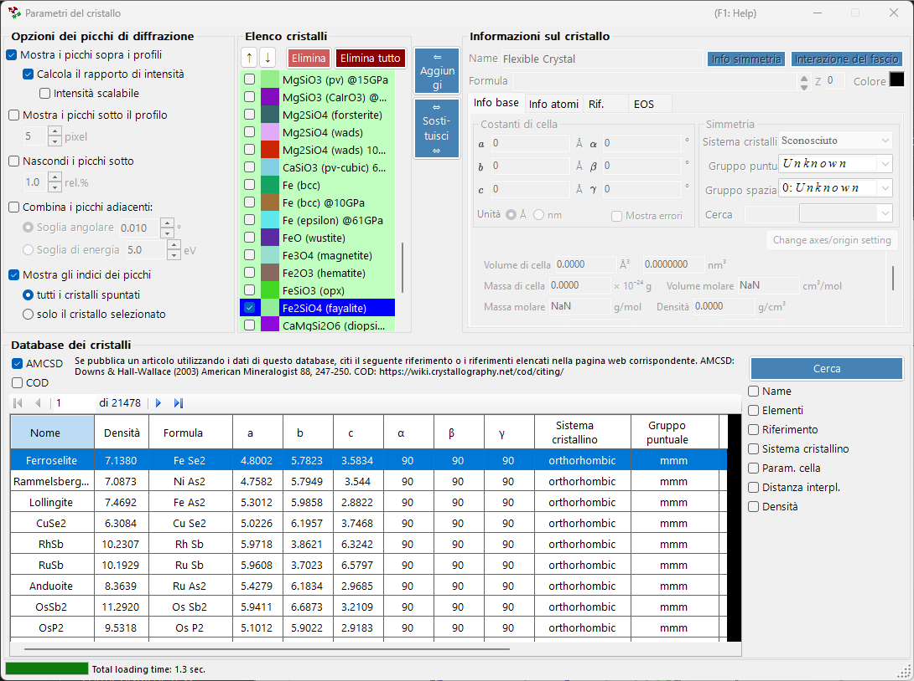
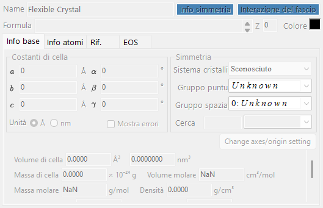
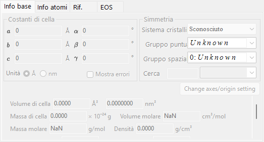
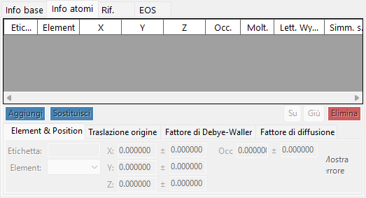
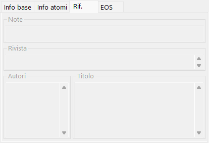
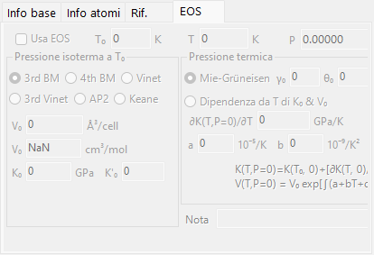
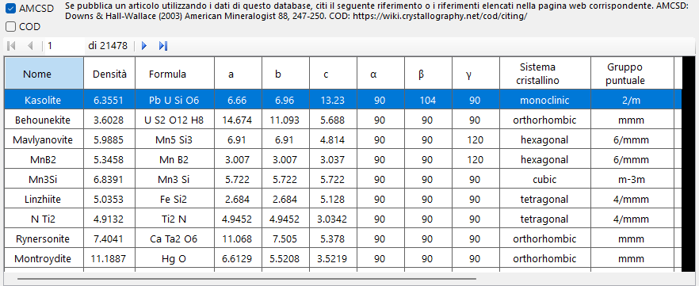
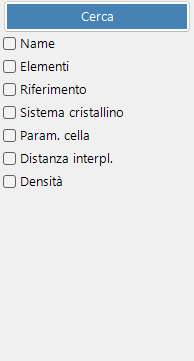
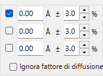

<!-- 260601Cl: migrated from legacy docx + yseto.net web manual -->
# Parametri del cristallo

Facendo clic sull'icona `Crystal Parameter` nella barra degli strumenti della finestra principale si apre la sotto-finestra mostrata di seguito. Qui si imposta di quali cristalli visualizzare i picchi di diffrazione e come tali picchi vengono disegnati. Nella parte inferiore della finestra è integrato un database di cristalli per cercare e importare strutture.

La finestra è divisa in quattro aree principali.

| Area | Scopo |
| --- | --- |
| `Diffraction Peak Option` | Come vengono visualizzate le linee di diffrazione |
| `Crystal List` | Una checklist di cristalli condivisa con la finestra principale |
| `Crystal Information` | Parametri dettagliati per il cristallo selezionato (a schede) |
| `Crystal database` | Ricerca e importazione basate su AMCSD |

---

## Diffraction Peak Option

Configura la visualizzazione delle linee di diffrazione.

### Show peaks over profiles

Seleziona se le linee di diffrazione vengono disegnate sovrapposte ai dati del profilo.

### Calculate intensity ratio {#calculate-intensity-ratio}

Seleziona se le intensità di diffrazione (i loro rapporti) vengono calcolate a partire dai dati strutturali.

!!! note
    Se le posizioni atomiche non sono state inserite, le intensità non vengono calcolate indipendentemente dallo stato della casella. Vedi la [scheda Atom Info.](#atom-info-tab) per l'inserimento dei dati atomici.

### Scalable intensity

Seleziona se tutte le linee di diffrazione possono essere scalate globalmente senza modificare i loro rapporti di intensità relativi.

### Show peaks under profile

Seleziona se i picchi di diffrazione vengono disegnati sotto il profilo.

#### Peak height

Imposta l'altezza, in pixel (`pixel`), dei picchi disegnati sotto il profilo.

### Combine adjacent peaks

Seleziona se unire le intensità dei picchi che, pur essendo cristallograficamente non equivalenti, hanno valori di 2θ quasi identici o esattamente identici.

Ad esempio, nel sistema cubico i piani (333) e (115) sono non equivalenti ma hanno esattamente la stessa distanza interplanare (valore d), quindi si sovrappongono nell'osservazione. Selezionando questa casella è possibile visualizzarne l'intensità combinata.

| Elemento | Descrizione |
| --- | --- |
| `Angle threshold` | Quanto devono essere vicini i picchi per essere uniti, espresso in gradi (`°`). |
| `Energy threshold` | Per i dati a dispersione di energia, l'intervallo di unione espresso in energia (`eV`). |

!!! tip
    Il vecchio manuale indicava la soglia in ångström, ma la versione attuale la specifica in gradi (`°`) o in energia (`eV`) a seconda del tipo di asse orizzontale.

### Hide peaks below

Seleziona se rimuovere i picchi troppo deboli rispetto alla riflessione più intensa. Il valore di taglio è espresso come rapporto rispetto alla linea più intensa (`rel.%`).

### Show peak indices

Seleziona per quali cristalli etichettare gli indici delle linee di diffrazione (indici di Miller).

| Opzione | Destinazione |
| --- | --- |
| `all checked crystals` | Ogni cristallo selezionato |
| `only selected crystal` | Solo il cristallo attualmente selezionato nell'elenco |

---

## Crystal List

Mostra le stesse informazioni della checklist Profile nella finestra principale. I cristalli selezionati hanno le loro linee di diffrazione disegnate nella finestra principale. Ogni riga mostra una casella di controllo (`Check`), un colore di disegno (`PeakColor`) e il nome del cristallo (`Crystal`).

### Pulsanti freccia su/giù (↑ / ↓)

Cambiano l'ordine dei cristalli.

!!! note
    Le righe da 1 a 6 sono riservate all'equazione di stato (EOS) e non possono essere riordinate. Vedi [Equazione di stato](5-equation-of-states.md) per i dettagli.

### Add

Aggiunge all'elenco, come nuova voce, il cristallo configurato nell'area Crystal Information a destra (descritta di seguito).

### Replace

Sostituisce il cristallo attualmente selezionato con quello configurato nell'area Crystal Information a destra.

### Delete

Rimuove dall'elenco il cristallo attualmente selezionato.

### Delete all

Rimuove dall'elenco tutti i cristalli.

---

## Crystal Information {#crystal-information}

Modifica e visualizza le informazioni dettagliate del cristallo selezionato su diverse schede. Le schede principali sono:

| Scheda | Contenuto |
| --- | --- |
| `Basic Info.` | Parametri reticolari, sistema cristallino, gruppo spaziale e altre informazioni di base |
| `Atom Info.` | Tipi di atomo, occupazioni, coordinate e fattori di temperatura |
| `Ref.` | Informazioni di riferimento sull'articolo di origine, sugli autori e così via |
| `EOS` | Impostazioni dell'equazione di stato per la compressione e l'espansione termica |

### Scheda Basic Info.

Imposta informazioni di base come i parametri reticolari (a, b, c, α, β, γ), il sistema cristallino e il gruppo spaziale. La scelta di un gruppo spaziale vincola automaticamente i parametri reticolari modificabili e i gradi di libertà delle coordinate atomiche.

!!! tip
    Facendo clic con il tasto destro su un campo di parametro reticolare si apre un menu che ripristina i parametri reticolari ai valori all'avvio dell'applicazione (o al momento in cui la struttura è stata importata dal database). Ciò è utile quando si desidera tornare ai valori di riferimento originali dopo averli modificati tramite il fitting.

### Scheda Atom Info. {#atom-info-tab}

Imposta per ciascun atomo l'elemento, l'occupazione, le coordinate frazionarie e i fattori di temperatura isotropi/anisotropi. Quando qui vengono inserite le posizioni atomiche, le intensità di diffrazione possono essere calcolate tramite [Calculate intensity ratio](#calculate-intensity-ratio).

### Scheda Ref.

Contiene le informazioni di riferimento, come il titolo dell'articolo, il nome della rivista e gli autori che sono la fonte della struttura cristallina. Le strutture importate dal database dei cristalli hanno queste informazioni compilate automaticamente.

### Scheda EOS

Imposta l'equazione di stato (EOS) per ciascun cristallo, che governa il modo in cui i parametri reticolari cambiano con la pressione e la temperatura. I principali campi di input sono:

| Campo | Descrizione |
| --- | --- |
| `Use EOS` | Abilita il calcolo della pressione EOS per questo cristallo. |
| `T0` / `Temperature` | Temperatura di riferimento / misurata. |
| `V0` | Volume di riferimento della cella elementare. |
| `K0`, `K'0` | Modulo di compressibilità isotermo e la sua derivata rispetto alla pressione. |
| Forma isoterma | `BM3` (Birch-Murnaghan del terzo ordine, predefinito) / `BM4` / `Vinet` / `AP2` / `Keane`. |
| Pressione termica | `Mie-Grüneisen` (predefinito; parametri \( \gamma_0, \theta_0, q \)) / `T-dependence K0&V0`. |

Vedi [Equazione di stato](5-equation-of-states.md) per le formule e le definizioni dei simboli.

---

## Crystal database

Fornisce funzioni di ricerca e importazione per più di 20.000 strutture cristalline. Questo database è basato sull'American Mineralogist Crystal Structure Database (AMCSD).

!!! warning "Citation"
    Quando utilizzi questi dati cristallografici, leggi attentamente <http://rruff.geo.arizona.edu/AMS/amcsd.php> e assicurati di citare il seguente riferimento.

    > Downs, R.T. and Hall-Wallace, M. (2003) The American Mineralogist Crystal Structure Database. *American Mineralogist* **88**, 247-250.

### Tabella

Elenca i cristalli contenuti nel database. Se vengono inserite condizioni di ricerca, vengono mostrati solo i cristalli che le soddisfano.

Selezionando un qualsiasi cristallo nella tabella si trasferiscono le sue informazioni a [Crystal Information](#crystal-information). Per aggiungerlo all'elenco dei cristalli, premi il pulsante `Add` o `Replace` nell'area Crystal List.

### Opzioni di ricerca

Inserisci le condizioni di ricerca. Dopo averle inserite, premi il pulsante `Search` o il tasto Invio. Ogni condizione può essere abilitata o disabilitata con la sua casella di controllo.

#### Name

Inserisci il nome del cristallo.

#### Elements

Premendo il pulsante `Periodic Table` si apre una finestra separata in cui scegliere gli elementi da cercare. Ogni pulsante di elemento cambia il proprio stato ogni volta che lo si preme.

I pulsanti nella parte superiore della finestra cambiano lo stato di tutti gli elementi contemporaneamente.

| Pulsante | Significato |
| --- | --- |
| `may or not include` | L'elemento può essere presente o meno (rimuove tutti i vincoli sugli elementi). |
| `must include` | Deve includere (vengono mantenuti solo i cristalli che contengono tutti gli elementi specificati). |
| `must exclude` | Deve escludere (vengono rimossi i cristalli che contengono uno qualsiasi degli elementi specificati). |

!!! tip
    Selezionando `Ignore scattering factor` è possibile eseguire la ricerca senza tenere conto dei fattori di scattering.

#### Reference

Inserisci il titolo dell'articolo, il nome della rivista o il nome dell'autore.

#### Crystal System

Cerca specificando il sistema cristallino.

#### Cell Params

Inserisci i parametri reticolari e la tolleranza consentita.

#### d-spacing

Inserisci la distanza interplanare (valore d) di una riflessione intensa e la tolleranza consentita.

#### Density

Inserisci la densità e la tolleranza consentita.
