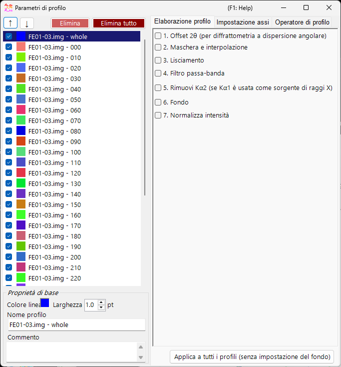
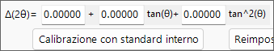
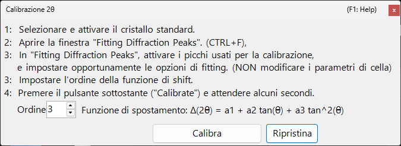
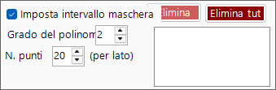
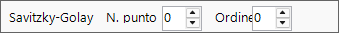
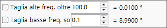
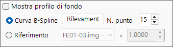
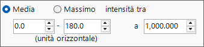

<!-- 260601Cl: migrated from legacy docx + yseto.net web manual -->
# Parametri del profilo

Facendo clic sull'icona `Profile parameter` nella finestra principale si apre questa sottofinestra. Qui si effettuano le impostazioni dettagliate per i profili caricati e si applicano vari trattamenti numerici.

Il lato sinistro della finestra contiene la [Lista di controllo dei profili](#profile), mentre il lato destro è suddiviso in tre pagine a schede — [Elaborazione del profilo](#profile-processing), [Impostazione degli assi](#axis-setting) e [Operatore di profilo](#profile-operator). Ciascuna fase di elaborazione può essere attivata/disattivata con una casella di spunta e viene applicata in ordine dall'alto verso il basso.

!!! note
    Le impostazioni effettuate in questa finestra si riflettono in tempo reale sui profili nella [finestra principale](1-main-window.md). Per le impostazioni sul lato del cristallo, come l'unità dell'asse orizzontale e le etichette degli indici delle linee di diffrazione, vedere [Crystal Parameter](3-crystal-parameter.md).

---

## Lista di controllo dei profili {#profile}

La lista sul lato sinistro della finestra mostra le stesse informazioni della Lista di controllo dei profili nella finestra principale. Selezionando un profilo nella lista, questo diventa l'oggetto delle elaborazioni e delle impostazioni sul lato destro della finestra.

| Voce | Descrizione |
| --- | --- |
| `↑` `↓` (pulsanti freccia su/giù) | Cambiano l'ordine dei profili nella lista. |
| `Delete` | Elimina il profilo selezionato. |
| `Delete all` | Elimina tutti i profili. |

Nell'area `Basic property` sotto la lista si modificano gli attributi di base del profilo selezionato.

| Voce | Descrizione |
| --- | --- |
| `Line Color` | Fare clic per cambiare il colore di tracciamento del profilo selezionato. |
| `Line Width` | Imposta lo spessore della linea del profilo (`pt`). |
| `Profile Name` | Imposta il nome del profilo. |
| `Comment` | Un campo di commento a testo libero. |

---

## Elaborazione del profilo {#profile-processing}

Nella scheda `Profile processing` si applicano vari trattamenti numerici al profilo selezionato. Le fasi 1–7 possono essere abilitate indipendentemente con una casella di spunta, e quelle abilitate vengono applicate in ordine numerico.

### 1. Offset 2θ {#two-theta-offset}

`1. 2θ offeset (for angle-dispersive diffractmetry)` corregge l'angolo dei dati a dispersione angolare. L'espressione di correzione è una funzione quadratica di \( \tan\theta \).

$$ \Delta(2\theta) = a_0 + a_1 \tan\theta + a_2 \tan^2\theta $$

Se il profilo contiene uno standard interno (un campione con parametri reticolari noti), premere il pulsante `Calibration using an internal standard` e seguire i messaggi; i coefficienti della funzione quadratica vengono quindi determinati automaticamente. Nella finestra di dialogo di calibrazione, le posizioni dei picchi osservati vengono associate alle posizioni teoriche dei picchi dello standard e i coefficienti vengono adattati.

Il pulsante `Reset` ripristina i coefficienti di offset impostati.

!!! tip
    Come standard interni si usano comunemente materiali con parametri reticolari determinati con precisione, come Si o LaB₆. Dopo la calibrazione, i valori 2θ corretti vengono utilizzati direttamente in tutte le analisi successive.

### 2. Maschera e interpolazione {#mask}

`2. Mask and Interpolation` maschera un intervallo angolare specificato (o un intervallo di energia) e interpola il profilo utilizzando le intensità esterne all'intervallo mascherato.

| Voce | Descrizione |
| --- | --- |
| `Set Masking range` | Specifica l'intervallo dell'asse orizzontale da mascherare. |
| `Point No.` | Specifica il numero di punti finali (per ciascun lato) usati per l'interpolazione. |
| `Polynomial order` | Specifica il grado del polinomio usato per l'interpolazione. |
| `Save Masking Ranges` / `Read Masking Ranges` | Salva gli intervalli di mascheramento configurati in un file, oppure li rilegge. |
| `Delete` / `Delete all` | Elimina un singolo intervallo di mascheramento, oppure tutti. |

### 3. Smoothing {#smoothing}

`3. Smoothing` applica lo smoothing al profilo selezionato. L'algoritmo di smoothing è il metodo `Savitzky-Golay`.

In questo metodo, per ciascuna posizione \(x\) di interesse, viene eseguito un adattamento ai minimi quadrati con un polinomio di grado `Order` sui dati entro \(\pm\) `Point No.` da quel punto, e il valore della funzione risultante \(F(x)\) viene adottato come nuova intensità in quella posizione \(x\).

!!! note
    Quando `Order` \(= 1\), lo smoothing di Savitzky–Golay è equivalente a una semplice media mobile. Aumentando `Order` si preservano meglio le forme dei picchi, mentre aumentando `Point No.` si rafforza lo smoothing.

### 4. Filtro passa-banda {#bandpass}

`4. Bandpass filter` usa una trasformata di Fourier (FFT) per tagliare le componenti al di sopra o al di sotto di frequenze specificate.

| Voce | Descrizione |
| --- | --- |
| `Cut high-freq. over` | Rimuove le componenti con frequenza superiore al valore specificato (riduce il rumore ad alta frequenza). |
| `Cut low-freq. under` | Rimuove le componenti con frequenza inferiore al valore specificato (rimuove un fondo che varia lentamente). |

### 5. Rimuovi Kα2 {#remove-ka2}

`5. Remove Kα2 (if Kα1 is used as X-ray source)`: se il profilo selezionato è stato misurato con raggi X in cui Kα1 e Kα2 non sono separati, ed è stato caricato specificando Kα1, spuntando questa opzione si rimuove l'intensità di diffrazione originata da Kα2.

!!! warning
    Questa elaborazione è efficace solo quando Kα1 è selezionato come sorgente di raggi X. Verificare e impostare l'unità dell'asse orizzontale e il tipo di radiazione nella scheda [Impostazione degli assi](#axis-setting).

### 6. Fondo {#background}

`6. Background` sottrae il fondo dal profilo. Esistono due metodi.

#### B-Spline curve

Premendo `Auto Detect` si calcola e si sottrae automaticamente il fondo. Con `Point No.` si imposta il numero massimo di punti di controllo del fondo da ricercare automaticamente.

È inoltre possibile cambiare manualmente i punti di controllo. Trascinare con il mouse i punti di controllo tondi disegnati sulla finestra principale per creare una curva appropriata.

#### Reference

È possibile specificare un altro profilo come fondo per il profilo selezionato. Spuntando `Show background profile` si visualizza il profilo utilizzato come fondo.

!!! note
    La sottrazione del fondo (fase 6) è esclusa dall'applicazione in blocco eseguita dal pulsante `Apply for all profiles` descritto di seguito.

### 7. Normalizza intensità {#normalize}

`7. Normarize intensity` normalizza il profilo in modo che l'`Average` o il `Maximum` su un intervallo dell'asse orizzontale specificato assuma un'intensità specificata.

| Voce | Descrizione |
| --- | --- |
| `Average` / `Maximum` | Sceglie se usare come riferimento la media o il massimo all'interno dell'intervallo. |
| `intensity between` | Specifica l'intervallo dell'asse orizzontale di destinazione. |
| `to` | Specifica il valore di intensità di destinazione dopo la normalizzazione. |

### Pulsante Apply for all profiles {#apply-all}

Il pulsante `Apply for all profiles (without background setting)` applica in una sola volta le impostazioni delle fasi 1–7, **escludendo 6. Fondo**, a tutti i profili.

---

## Impostazione degli assi {#axis-setting}

Nella scheda `Axis setting` si modificano l'unità dell'asse orizzontale, il tipo di radiazione (fascio incidente) e l'energia del fascio incidente del profilo selezionato.

| Voce | Descrizione |
| --- | --- |
| `Horizontal axis setting` | Cambia l'unità corrente dell'asse orizzontale (`horizontal unit`). Con `Shift` è anche possibile traslare l'intero asse orizzontale. |
| `Exposure Time` | Imposta il tempo di esposizione (`sec.`) usato in modalità CPS (`(for CPS mode)`). |
| `Vertical axis setting` | Impostazioni relative all'asse verticale. |

!!! note
    L'impostazione degli assi qui modifica le informazioni fisiche che il profilo stesso possiede (unità, tipo di radiazione, energia). A differenza della trasformazione degli assi solo per la visualizzazione nella finestra principale, influisce sul modo in cui i dati stessi vengono interpretati. Poiché il tipo di radiazione e l'energia influenzano direttamente il calcolo delle posizioni delle linee di diffrazione, impostare i valori corretti.

---

## Operatore di profilo {#profile-operator}

Nella scheda `Profile Operator` si esegue la media di più profili e operazioni aritmetiche tra profili.

Dopo aver specificato i profili di destinazione per il calcolo e l'operazione che si desidera eseguire, premere il pulsante `Calculate`; il risultato viene aggiunto come nuovo profilo.

| Modalità | Descrizione |
| --- | --- |
| `Average` | Esegue la media di più profili. |
| `Profile and value` | Opera tra un profilo e un valore scalare. |
| `Two profiles` | Esegue un'operazione aritmetica (come l'addizione) tra due profili. |

Con `Output name of the profile` è possibile specificare il nome del profilo generato (il valore predefinito è `Result #01`).

!!! tip
    Questo può essere usato, ad esempio, per mediare più misurazioni al fine di migliorare il rapporto S/N, oppure per calcolare la differenza di due profili al fine di estrarre la variazione tra essi.
