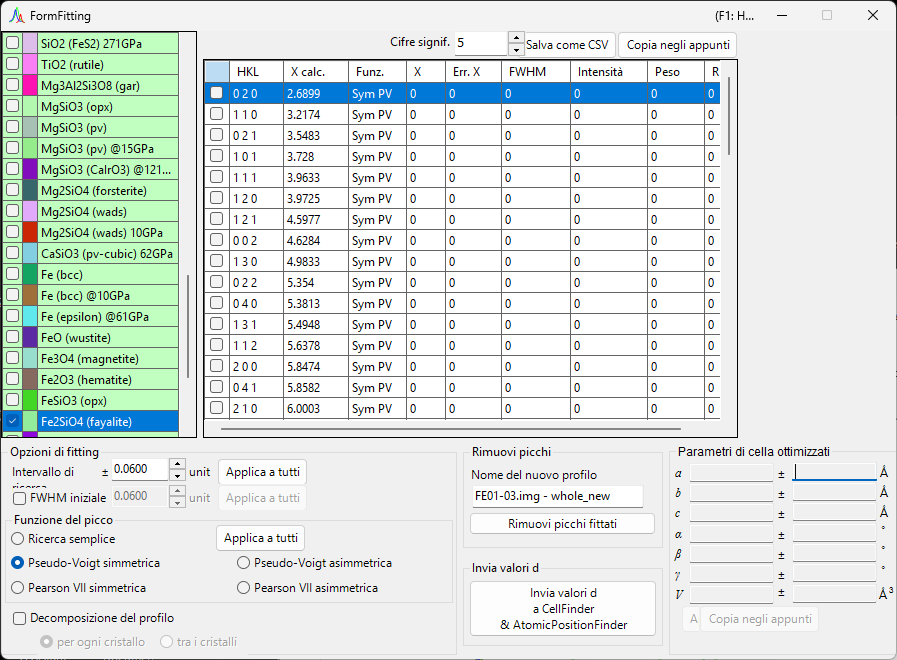
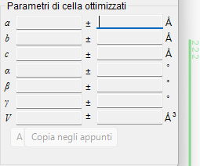
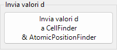
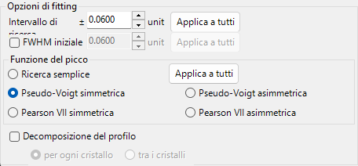
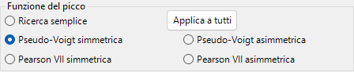
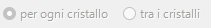
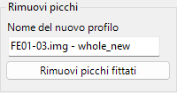
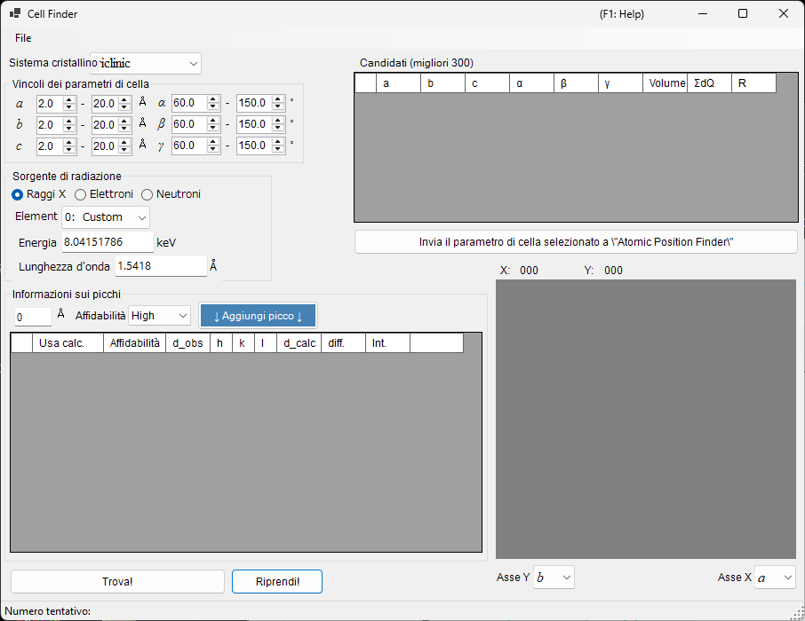
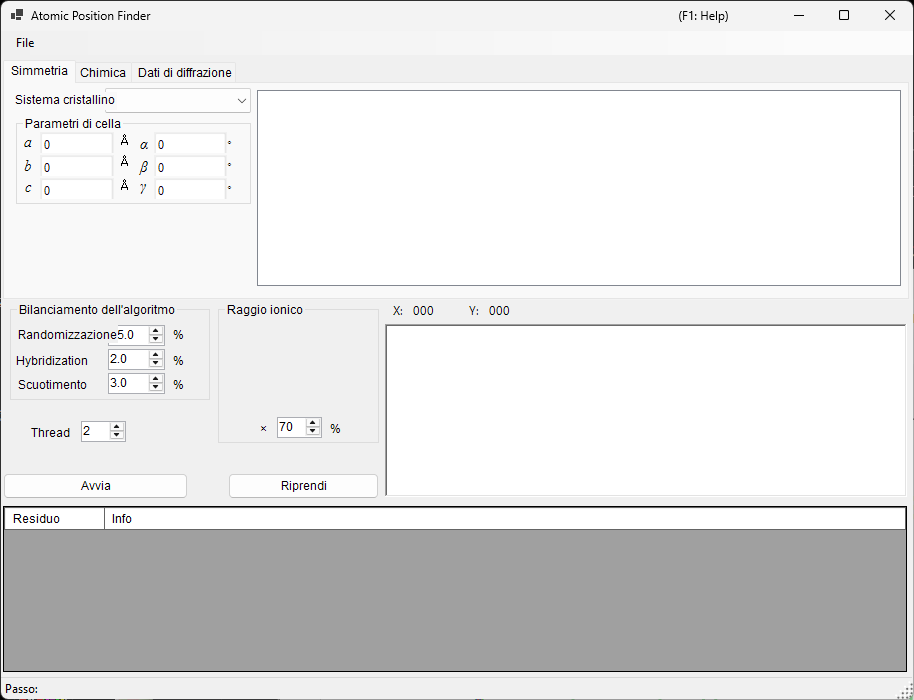

<!-- 260601Cl: migrated from legacy docx + yseto.net web manual -->
# Fitting dei picchi di diffrazione

Lo strumento `Fitting diffraction peaks` esegue il fitting dei picchi di un profilo di diffrazione con una funzione appropriata, ricava la distanza interplanare (valore d) dalla posizione 2θ di ciascun picco e raffina i parametri reticolari con il metodo dei minimi quadrati. Viene avviato dalla barra degli strumenti della finestra principale.

## Flusso di lavoro di base

1. Seleziona il cristallo di interesse nell'elenco dei cristalli (in modalità multi-profilo, seleziona anche il profilo su cui vuoi lavorare).
2. Nella finestra principale, trascina con il mouse le linee di diffrazione in modo che si sovrappongano il più possibile ai picchi misurati.
3. Scegli gli indici delle linee di diffrazione di cui vuoi eseguire il fitting dall'elenco dei picchi di diffrazione (una casella di elenco con caselle di controllo).
4. Una volta scelti indici indipendenti in numero sufficiente affinché il calcolo dei minimi quadrati sia risolvibile, i parametri reticolari più probabili compaiono, con i relativi errori, nel pannello `Optimized cell constants` (Parametri di cella ottimizzati) in basso a destra.
5. Premi `Apply to the crystal` (Applica al cristallo) per riportare i parametri reticolari raffinati sul cristallo nel programma principale.

!!! note "Verifica e selezione di un cristallo"
    L'elenco dei cristalli rispecchia quello della finestra principale. Perché il fitting abbia effetto, il cristallo di interesse deve essere sia spuntato sia selezionato.

## Elenco dei cristalli

L'elenco dei cristalli in alto a sinistra contiene gli stessi cristalli della finestra principale. Il cristallo che spunti e selezioni qui diventa l'obiettivo del fitting. Vedi [Parametri del cristallo](3-crystal-parameter.md) per i dettagli.

## Elenco dei picchi di diffrazione

Qui vengono elencate le linee di diffrazione del cristallo selezionato. Attivando la casella di controllo di una riga, quella linea di diffrazione diventa un obiettivo del fitting. L'elenco contiene colonne come le seguenti.

| Colonna | Contenuto |
| --- | --- |
| `Check` | Se includere o meno la linea nel fitting |
| `PeakColor` | Colore di visualizzazione |
| `Crystal` | Nome del cristallo |
| `HKL` | Indici di riflessione |
| `Calc X` | Posizione calcolata della linea di diffrazione |
| `Func` | Funzione di picco usata |
| `X` | Posizione del picco ottenuta dal fitting |
| `X Err` | Errore della posizione del picco |
| `FWHM` | Larghezza a metà altezza |
| `Intensity` | Intensità del picco |
| `Weight` | Peso nel fitting ai minimi quadrati |
| `R` | Indice di residuo del fitting |

I pulsanti sotto l'elenco esportano i risultati.

- `Copy to clipborad`: Copia la tabella negli appunti. Può essere incollata direttamente in Excel e applicazioni simili.
- `Save as CSV`: Salva la tabella come file `.csv`. `Effective digit` (Cifre significative) imposta il numero di cifre decimali.
- `Clear peaks`: Cancella i risultati del fitting.

## Fitting option

Qui si effettuano le impostazioni dettagliate usate durante il fitting dei profili dei picchi.

### Search Range / Initial FWHM

- `Search Range` (Intervallo di ricerca): Imposta l'intervallo entro cui viene eseguito il fitting. Cioè, la regione entro ±Search Range dalla posizione calcolata della linea di diffrazione viene assunta come obiettivo del fitting per quel picco.
- `Initial FWHM` (FWHM iniziale): Specifica la larghezza a metà altezza iniziale della funzione di profilo. Viene usata come valore di partenza per la convergenza ai minimi quadrati.

Premendo `Apply to all` (Applica a tutti) si applicano le impostazioni correnti a tutte le linee di diffrazione in una sola volta.

### Peak function

Seleziona la funzione di picco usata per il fitting.

| Funzione di picco | Contenuto |
| --- | --- |
| `Simple Search` | Non esegue alcun fitting di funzione; riconosce come posizione del picco il punto di intensità più elevata entro ±Search Range dalla posizione calcolata della linea di diffrazione. |
| `Symmetric Pseudo Voigt` | Esegue il fitting con una funzione pseudo-Voigt simmetrica destra-sinistra. |
| `Symmetric Pearson VII` | Esegue il fitting con una funzione Pearson VII simmetrica destra-sinistra. |
| `Split Pseudo Voigt` | Esegue il fitting con una funzione pseudo-Voigt asimmetrica (split) destra-sinistra. |
| `Split Pearson VII` | Esegue il fitting con una funzione Pearson VII asimmetrica (split) destra-sinistra. |

!!! tip "Funzione consigliata"
    Se non c'è un motivo particolare, si consiglia `Symmetric Pseudo Voigt` per la sua stabilità superiore.

La funzione pseudo-Voigt è una combinazione lineare di una gaussiana \(G(x)\) e una lorentziana \(L(x)\) con parametro di mescolamento \(\eta\), data da:

$$
\mathrm{pV}(x) = \eta\, L(x) + (1-\eta)\, G(x), \qquad 0 \le \eta \le 1
$$

dove \(\eta\) è la frazione della componente lorentziana. La forma split rappresenta un profilo asimmetrico assumendo parametri come la FWHM in modo indipendente a sinistra e a destra della posizione del picco.

### Pattern Decomposition

Quando i Search Range di due o più linee di diffrazione selezionate si sovrappongono, questa opzione permette di scegliere se eseguire la decomposizione del profilo (fitting simultaneo dei picchi sovrapposti).

- `in each crystal` (per ogni cristallo): Esegue la decomposizione del profilo in modo indipendente per ciascun cristallo.
- `between crystals` (tra i cristalli): Esegue la decomposizione del profilo attraverso tutti i cristalli.

## Optimized cell constants

Una volta scelti indici indipendenti in numero sufficiente affinché il calcolo dei minimi quadrati diventi risolvibile, questo pannello visualizza i parametri reticolari più probabili \(a, b, c, \alpha, \beta, \gamma\) e il volume \(V\), ciascuno con il proprio errore (`±`).

!!! note "Informazioni sulla visualizzazione NA"
    Quando i gradi di libertà sono insufficienti — cioè quando i gradi di libertà sono uguali al numero di picchi fittati, oppure quando un dato parametro reticolare non ha gradi di libertà — viene visualizzato `NA` al posto dell'errore. Scegliere un numero sufficiente di riflessioni indipendenti consente di calcolare gli errori.

- `Apply to the crystal` (Applica al cristallo): Riporta i parametri reticolari raffinati sul cristallo selezionato nel programma principale.
- `Copy to Clipboard` (Copia negli appunti): Copia i parametri reticolari ottimizzati negli appunti.
- `Reset take off angle` (Reimposta angolo di take-off): Reimposta l'angolo di take-off.

## Remove fitted peaks

Sottrae i picchi fittati dal profilo e restituisce il profilo residuo come nuovo profilo. Inserisci il nome di destinazione in `New profile name` (Nome del nuovo profilo) e premi `Remove fitted peaks` (Rimuovi picchi) per eseguire la sottrazione. È utile per verificare il fondo o la separazione di picchi sovrapposti.

## Strumenti correlati (Send d-values)

Premendo `Send d-values to CellFinder && AtomicPositionFinder` si inviano i valori d ottenuti dal fitting ai seguenti strumenti di analisi, anch'essi avviabili dalla barra degli strumenti.

### Cell Finder

`Cell Finder` cerca la cella elementare (i parametri reticolari) che spiega un insieme di posizioni di picco misurate (un elenco di valori d), lavorando a ritroso a partire da tali posizioni. Viene usato per indicizzare campioni sconosciuti.

### Atomic Position Finder

`Atomic Position Finder` cerca le posizioni atomiche in una struttura cristallina a partire da grandezze come le intensità delle riflessioni osservate.

!!! tip "Identificazione di un campione sconosciuto"
    Dopo aver determinato i parametri reticolari con `Cell Finder`, registra quel cristallo nell'elenco dei cristalli e potrai raffinare ulteriormente i parametri reticolari con il fitting ai minimi quadrati di questo strumento.
