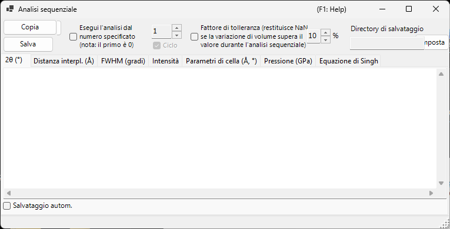
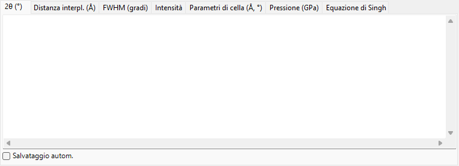
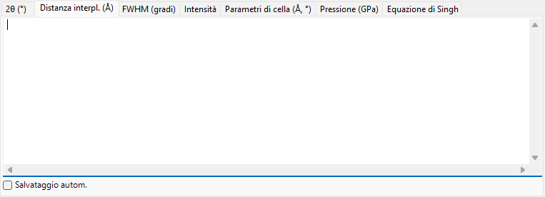
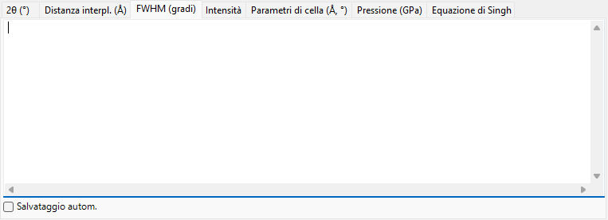
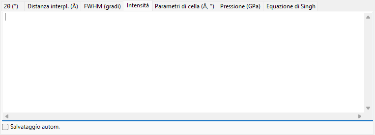
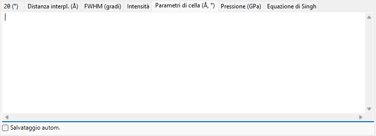
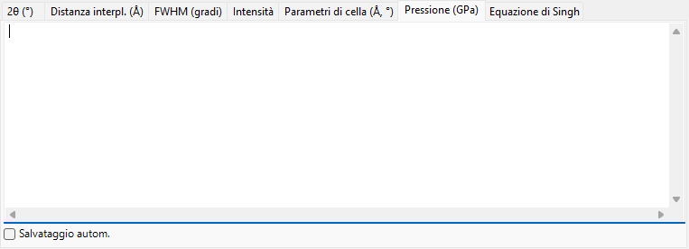
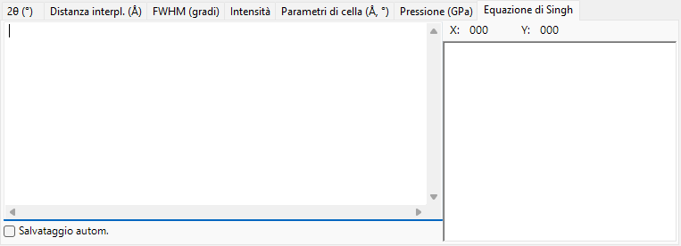

<!-- 260601Cl: migrated from legacy docx + yseto.net web manual -->
# Analisi sequenziale

`Analisi sequenziale` esegue in successione lo stesso fitting dei picchi su molti profili caricati e raccoglie i risultati per grandezza. È pensata per una serie di profili acquisiti mentre varia una condizione come temperatura, pressione o tempo: elabora l'intera serie in una volta sola e tabula, in schede distinte, i risultati di 2θ, distanza interplanare (valore d), FWHM, intensità, parametri di cella, pressione ed equazione di Singh (analisi dello sforzo uniassiale / della deformazione reticolare) per ciascuna linea di diffrazione.

Usa il pulsante `Analisi sequenziale` nella barra degli strumenti della finestra principale per aprire e chiudere questa finestra.

!!! note "Condiviso con [Fitting dei picchi di diffrazione](6-fitting-diffraction-peaks.md)"
    L'analisi sequenziale condivide la configurazione del fitting con la finestra `Fitting diffraction peaks`. Apri prima la finestra `Fitting diffraction peaks`, seleziona il cristallo di interesse e spunta le linee di diffrazione (picchi) da adattare. Se questi non sono preparati quando premi `Esegui`, un messaggio ti invita a farlo.

## Flusso di lavoro di base

1. Carica l'intera serie di profili misurati sotto la condizione variabile (sono necessari almeno quattro profili).
2. Apri la finestra [Fitting dei picchi di diffrazione](6-fitting-diffraction-peaks.md), scegli il cristallo di interesse e spunta le linee di diffrazione da analizzare. La funzione di fitting e l'intervallo di ricerca impostati lì vengono riutilizzati dall'analisi sequenziale.
3. Facoltativamente imposta il numero di partenza, il ciclo, il fattore di tolleranza e le opzioni di salvataggio automatico (vedi sotto).
4. Premi `Esegui`. Ogni profilo caricato viene attivato a turno, viene eseguito un fitting ai minimi quadrati e i risultati si accumulano in ciascuna scheda.
5. Esamina ogni scheda e porta i dati in un foglio di calcolo (Excel, ecc.) con `Copia` o `Salva`.

Lo stato di avanzamento e il tempo trascorso sono mostrati nella barra di stato in basso nella finestra come `... % completed.  Elapsed time: ... sec`. Al termine dell'analisi, i risultati di 2θ, distanza interplanare (valore d), FWHM e intensità vengono copiati insieme negli appunti.

!!! tip "Due fitting per profilo"
    Per ottenere una convergenza stabile, il fitting ai minimi quadrati viene eseguito due volte per ogni profilo prima di registrare il risultato.

## Opzioni di analisi

I controlli attorno al pulsante `Esegui` governano l'intervallo di analisi e la gestione dei valori anomali.

| Opzione | Descrizione |
| --- | --- |
| `Esegui l'analisi dal numero specificato (nota: il primo è 0)` | Se selezionato, avvia l'analisi dal numero di profilo impostato nella casella a destra anziché dal primo profilo. Il primo profilo è il numero 0. |
| `Ciclo` | Quando si parte da un numero, elabora anche i profili precedenti saltati (0 … partenza − 1) dopo aver raggiunto la fine, ripartendo ciclicamente in modo da analizzare l'intera serie. Disponibile solo quando il numero di partenza è abilitato. |
| `Fattore di tolleranza (restituisce NaN se la variazione di volume supera il valore durante l'analisi sequenziale)` | Se selezionato, rifiuta un fitting (restituendo `NaN` per quella riga) quando il volume di cella raffinato varia rispetto al valore iniziale di più del valore (in %) indicato a destra. Questo scarta automaticamente i valori anomali causati da un fitting fallito. |

## Schede di output

Ogni scheda è una tabella per una grandezza di output. Ogni riga corrisponde a un profilo (il nome del profilo) e ogni colonna corrisponde a una linea di diffrazione selezionata (indice hkl, oppure `Peak No.` per un flexible crystal). Le tabelle sono conservate come testo separato da tabulazioni e vengono convertite in valori separati da virgole (CSV) quando esegui `Copia` o `Salva`.

### 2θ (°)

La posizione del picco adattata, in 2θ (gradi), per ogni profilo e ogni linea di diffrazione.

### Distanza interplanare (Å)

La distanza interplanare d, in Å, calcolata da ciascuna posizione del picco. Si ottiene dalla lunghezza d'onda e da 2θ tramite \( d = \dfrac{\lambda}{2\sin\theta} \).

### FWHM (gradi)

La larghezza a metà altezza (FWHM) di ciascun picco, in gradi 2θ, che ti permette di seguire come variano le larghezze dei picchi.

### Intensità

L'intensità integrata (area) di ciascun picco, utile per seguire le variazioni di intensità che accompagnano transizioni di fase o cambiamenti di tessitura.

### Parametri di cella (Å, °)

Il volume di cella elementare raffinato `V`, gli spigoli di cella `A`, `B`, `C` (Å), gli angoli assiali `Alpha`, `Beta`, `Gamma` (°) e l'errore stimato di ciascuno (le colonne `_err`) per ogni profilo.

### Pressione (GPa)

La pressione ricavata dai parametri di cella di ciascun profilo tramite un'[equazione di stato](5-equation-of-states.md). Quando nella finestra `Equation of State` è selezionato uno standard di pressione come Gold, Pt, NaCl (B1/B2), MgO, Corundum, Ar, Re, Mo o Pb, compare una colonna per ciascun ricercatore (per ciascuna scala riportata). Quando non è selezionato alcuno standard, la pressione è calcolata dall'equazione di stato assegnata al cristallo di interesse.

### Equazione di Singh

I risultati dell'analisi dello sforzo uniassiale / della deformazione reticolare di Singh. Il numero finale di ciascun nome di profilo è interpretato come l'angolo di azimut \( \psi \) (gradi) e, per ogni riflessione, la relazione azimut-d viene adattata ai minimi quadrati (Levenberg–Marquardt). Per ogni riflessione fornisce la distanza reticolare priva di sforzo `d0`, l'azimut di massima deformazione `Ψmax` e una grandezza proporzionale allo sforzo `t/6Ghkl` (il rapporto tra lo sforzo differenziale \( t \) e il modulo di taglio \( G_{hkl} \)). Le curve adattate sono inoltre disegnate nel grafico della scheda.

!!! note "Quando si applica l'equazione di Singh"
    Questa scheda opera su una serie in "modalità analisi degli sforzi" i cui nomi di profilo terminano con `...-whole`. Ogni nome di profilo deve riportare un angolo di azimut come token finale (ad esempio `...-30`). Per una serie ordinaria questa scheda non viene aggiornata.

La distanza reticolare dipendente dall'azimut espressa dall'equazione di Singh è approssimativamente

$$ d(\psi) = d_0 \left[ 1 + \alpha - 3\,\alpha \left( 1 - \frac{\lambda^2}{4 d^2} \right) \cos^2(\psi - \psi_{\max}) \right] $$

dove \( \alpha \) corrisponde a `t/6Ghkl` e \( \psi_{\max} \) è l'azimut di massima deformazione.

## Esportazione dei risultati

| Azione | Descrizione |
| --- | --- |
| `Copia` | Copia la scheda attualmente visualizzata negli appunti come CSV (separato da virgole). |
| `Salva` | Salva la scheda attualmente visualizzata come file CSV (nome del file scelto in una finestra di dialogo). |

### Salvataggio automatico

Ogni scheda ha una casella `Salvataggio autom.` in modo che la grandezza corrispondente venga scritta automaticamente in un file CSV dopo `Esegui`. La destinazione è mostrata in `Directory di salvataggio` e viene scelta con il pulsante `Imposta`. Il nome del file è costruito dalla parte comune dei nomi di profilo, con un suffisso per grandezza: `_2theta.csv`, `_d.csv`, `_fwhm.csv`, `_intensity.csv`, `_cell.csv`, `_pressure.csv` oppure `_Singh.csv`.

!!! tip "Impostazione della cartella di destinazione"
    Se il salvataggio automatico è selezionato ma la cartella di destinazione non è impostata (non esiste), quando premi `Esegui` si apre una finestra di selezione della cartella.

## Utilizzo da una macro

Ogni output dell'analisi sequenziale è disponibile anche da una macro (script Python). Questi corrispondono alla classe `PDI.Sequential` in [Macro](8-macro.md).

| Funzione macro | Scheda corrispondente |
| --- | --- |
| `PDI.Sequential.Open()` / `Close()` | Apri / chiudi la finestra |
| `PDI.Sequential.Execute()` | Esegui l'analisi sequenziale |
| `PDI.Sequential.GetCSV_2theta()` | 2θ |
| `PDI.Sequential.GetCSV_D()` | Distanza interplanare |
| `PDI.Sequential.GetCSV_FWHM()` | FWHM |
| `PDI.Sequential.GetCSV_Intensity()` | Intensità |
| `PDI.Sequential.GetCSV_CellConstants()` | Parametri di cella |
| `PDI.Sequential.GetCSV_Pressure()` | Pressione |
| `PDI.Sequential.GetCSV_Singh()` | Equazione di Singh |

Ogni `GetCSV_...()` restituisce la scheda corrispondente come stringa CSV. `PDI.Sequential.Directory` legge/imposta la cartella di destinazione e, combinandola con `PDI.File.SaveText(...)`, scrive i risultati su file. Vedi [Macro](8-macro.md) per i dettagli.
