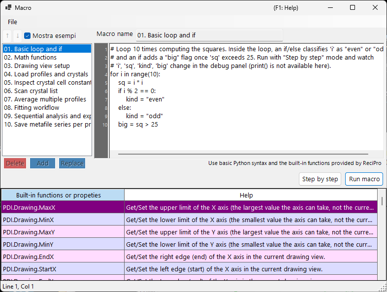

<!-- 260601Cl: migrated from legacy docx + yseto.net web manual -->
# Macro

La maggior parte delle operazioni di PDIndexer può essere automatizzata con la funzione **Macro**. Le macro sono script Python scritti in [IronPython](https://ironpython.net/) (un'implementazione di Python che gira su .NET), modificati ed eseguiti in una finestra dedicata dell'editor delle macro. Usale per automatizzare operazioni ripetitive, elaborare in blocco più file ed esportare i risultati in file CSV o immagine in modo massivo.



!!! note "Conoscenze di base di Python"
    Le macro accettano direttamente la sintassi standard di Python (cicli `for`, `if`/`else`, liste, funzioni, ecc.). Questa pagina non spiega il linguaggio Python in sé. Le funzionalità specifiche di PDIndexer si richiamano attraverso l'oggetto `PDI` descritto di seguito.

## Aprire l'editor delle macro

Dalla barra dei menu della finestra principale, scegli **Macro → Editor** per aprire la finestra dell'editor delle macro (con titolo `Macro`).

Le macro create e salvate nell'editor vengono anche elencate per nome sotto il menu **Macro**, così puoi eseguirle direttamente dal menu. L'elenco delle macro viene salvato automaticamente alla chiusura di PDIndexer e ripristinato all'avvio successivo.

## Struttura della finestra dell'editor

La finestra dell'editor è composta dalle seguenti parti.

| Parte | Descrizione |
| --- | --- |
| Elenco delle macro (a sinistra) | Un elenco dei nomi delle macro salvate. Clicca su una voce per caricare quella macro nell'editor a destra. |
| Editor di codice (al centro) | L'area in cui digiti lo script Python. Supporta una colonna con i numeri di riga, l'auto-indentazione, il completamento dell'input (auto-completamento) e i tooltip delle funzioni. |
| Tabella di riferimento delle funzioni | Una tabella di tutte le funzioni disponibili sotto `PDI`. Fai doppio clic su una cella per inserire il nome di quella funzione nel codice alla posizione del cursore. |
| Pannello di debug (a destra) | Mostra i nomi e i valori delle variabili nel punto corrente durante l'esecuzione passo-passo. |
| Barra di stato | Mostra la posizione corrente del cursore (`Line` / `Col`). |

### Pulsanti di gestione dell'elenco

Usa i seguenti pulsanti per modificare l'elenco delle macro.

| Pulsante | Azione |
| --- | --- |
| `Add` | Aggiunge il codice corrente all'elenco con il nome digitato nella casella del nome (chiede conferma di sovrascrittura se il nome esiste già). |
| `Replace` | Sostituisce la macro selezionata nell'elenco con il codice corrente. |
| `Delete` | Rimuove la macro selezionata dall'elenco. |
| `↑` / `↓` | Sposta la macro selezionata verso l'alto o verso il basso nell'elenco. |
| `Mostra esempi` | Attiva/disattiva la visualizzazione delle macro di esempio incorporate (vedi sotto). |

!!! tip "Salvataggio e caricamento"
    Le macro possono essere salvate e caricate come singoli file `.mcr`. Trascina e rilascia un file `.mcr` sulla finestra dell'editor per caricarne il contenuto. Premendo `Ctrl+S` dopo la modifica si sovrascrive la macro attualmente selezionata.

## Eseguire una macro

Esegui la macro con i pulsanti nella parte inferiore dell'editor di codice.

| Pulsante | Azione |
| --- | --- |
| `Run macro` | Esegue la macro normalmente, dall'inizio alla fine. |
| `Step by step` | Esegue la macro una riga alla volta. Si mette in pausa prima di ogni riga e mostra i valori correnti delle variabili nel pannello di debug a destra. |
| `Next step (F10)` | Avanza alla riga successiva durante l'esecuzione passo-passo (funziona anche il tasto `F10`). |
| `Stop` | Interrompe l'esecuzione. L'interruzione è efficace solo durante l'esecuzione `Step by step`. |

!!! warning "print() non è disponibile"
    L'editor delle macro non ha una console per l'output standard, quindi l'output di `print()` non viene mostrato. Per ispezionare i valori delle variabili, esegui la macro in modalità `Step by step` e osserva la variazione dei valori nel pannello di debug.

### Macro di esempio

Selezionando il pulsante `Mostra esempi` si visualizzano nell'elenco le macro di esempio incorporate (in sola lettura). Gli esempi sono mostrati nella lingua corrente dell'interfaccia (inglese/giapponese). Usali come riferimento quando scrivi le tue macro. Gli esempi incorporati sono:

| Nome | Contenuto |
| --- | --- |
| 01. Basic loop and if | Nozioni di base sui cicli `for` e su `if`/`else` |
| 02. Math functions | Uso del modulo `math` (`pi`, `sin`, `sqrt`, `exp`, `log`, ecc.) |
| 03. Drawing view setup | Impostazione dell'intervallo di visualizzazione con `PDI.Drawing.SetBounds` |
| 04. Load profiles and crystals | `PDI.File.ReadProfiles` / `ReadCrystals` |
| 05. Inspect crystal cell constants | Lettura dei parametri di cella, del volume e della pressione tramite `PDI.Crystal` |
| 06. Scan crystal list | Ciclo su tutta la `PDI.CrystalList` |
| 07. Average multiple profiles | `PDI.ProfileOperator.Average` |
| 08. Fitting workflow | Una sequenza completa di `PDI.Fitting` |
| 09. Sequential analysis and export | Esecuzione di `PDI.Sequential` ed esportazione in CSV |
| 10. Save metafile series per profile | Salvataggio di un EMF per profilo in blocco |

!!! note "Il modulo math è già importato"
    `import math` viene eseguito automaticamente all'avvio dell'editor, quindi puoi usare il modulo `math` direttamente, ad esempio `math.sqrt(2)`, senza un'istruzione `import` esplicita.

---

## Riferimento delle funzioni

Tutte le funzionalità specifiche di PDIndexer si richiamano attraverso le classi sotto l'oggetto radice `PDI`. `PDI` è già disponibile nello scope della macro, quindi non serve alcun `import`.

Ogni tabella qui sotto è trascritta dagli attributi `[Help]` nel codice sorgente. Lo stesso elenco compare nella tabella di riferimento delle funzioni all'interno della finestra dell'editor e nella [sezione 6 del manuale web](https://yseto.net/soft/pdi/pdi_06).

!!! note "Notazione"
    Nella colonna della firma, `(get/set)` indica una proprietà di lettura/scrittura e `(get)` una proprietà di sola lettura. Un argomento con `= value` è un argomento predefinito e può essere omesso.

### PDI (radice)

| Membro | Firma | Descrizione |
| --- | --- | --- |
| `Sleep` | `Sleep(int millisec)` | Mette in pausa l'esecuzione della macro per il numero di millisecondi indicato. |
| `Obj` | `Obj (get/set)` | Ottiene/Imposta gli oggetti passati da un altro programma (argomenti tra processi). |

### PDI.File — Input/output di file

| Membro | Firma | Descrizione |
| --- | --- | --- |
| `GetDirectoryPath` | `GetDirectoryPath(string filename = "")` | Ottiene un percorso di directory (con backslash finale). Se `filename` è omesso, si apre una finestra di selezione della cartella. Altrimenti viene restituita la parte di directory di `filename`. |
| `GetFileName` | `GetFileName()` | Apre una finestra di selezione file e restituisce il percorso completo del file scelto. Restituisce una stringa vuota se l'utente annulla. |
| `GetFileNames` | `GetFileNames()` | Apre una finestra di selezione file multipla e restituisce i percorsi completi dei file scelti. Restituisce un array vuoto se l'utente annulla. |
| `ReadProfiles` | `ReadProfiles(string filename)` | Legge i dati di profilo dal file indicato. Se `filename` è omesso (o non esiste), si apre una finestra di selezione file. |
| `SaveProfiles` | `SaveProfiles(string filename)` | Salva i dati di profilo nel file indicato. Se `filename` è omesso, si apre una finestra di salvataggio. |
| `ReadCrystals` | `ReadCrystals(string filename)` | Legge i dati di cristallo dal file indicato. Se `filename` è omesso (o non esiste), si apre una finestra di selezione file. |
| `SaveCrystals` | `SaveCrystals(string filename)` | Salva i dati di cristallo nel file indicato. Se `filename` è omesso, si apre una finestra di salvataggio. |
| `SaveMetafile` | `SaveMetafile(string filename)` | Salva il pattern corrente come Windows Metafile (`.emf`). Se `filename` è omesso, si apre una finestra di salvataggio. |
| `SaveText` | `SaveText(string text, string filename)` | Salva il contenuto di testo indicato in un file `.txt`. Se `filename` è omesso, si apre una finestra di salvataggio. |

### PDI.Drawing — Vista di disegno

| Membro | Firma | Descrizione |
| --- | --- | --- |
| `MaxX` | `MaxX (get/set)` | Ottiene/Imposta il limite superiore dell'asse X (il valore massimo che l'asse può assumere, non la vista corrente). |
| `MinX` | `MinX (get/set)` | Ottiene/Imposta il limite inferiore dell'asse X (il valore minimo che l'asse può assumere, non la vista corrente). |
| `MaxY` | `MaxY (get/set)` | Ottiene/Imposta il limite superiore dell'asse Y (il valore massimo che l'asse può assumere, non la vista corrente). |
| `MinY` | `MinY (get/set)` | Ottiene/Imposta il limite inferiore dell'asse Y (il valore minimo che l'asse può assumere, non la vista corrente). |
| `EndX` | `EndX (get/set)` | Ottiene/Imposta il bordo destro (fine) dell'asse X nella vista di disegno corrente. |
| `StartX` | `StartX (get/set)` | Ottiene/Imposta il bordo sinistro (inizio) dell'asse X nella vista di disegno corrente. |
| `EndY` | `EndY (get/set)` | Ottiene/Imposta il bordo superiore (fine) dell'asse Y nella vista di disegno corrente. |
| `StartY` | `StartY (get/set)` | Ottiene/Imposta il bordo inferiore (inizio) dell'asse Y nella vista di disegno corrente. |
| `SetBounds` | `SetBounds(double startX, double endX, double startY, double endY)` | Imposta la vista di disegno indicando i quattro bordi (StartX, EndX, StartY, EndY). |

### PDI.Crystal — Cristallo selezionato

I parametri di cella `CellA`–`CellC` sono in \( \mathrm{\AA} \), e `CellAlpha`–`CellGamma` sono in gradi (deg).

| Membro | Firma | Descrizione |
| --- | --- | --- |
| `CellVolume` | `CellVolume (get)` | Ottiene il volume di cella (\( \mathrm{\AA}^3 \)) del cristallo selezionato. Restituisce 0 se nessun cristallo è selezionato. |
| `Pressure` | `Pressure(double volume = 0)` | Ottiene la pressione (GPa) del cristallo selezionato calcolata dalla sua EOS. Se `volume` è 0 (predefinito), viene usato il volume di cella corrente. |
| `Name` | `Name (get/set)` | Ottiene/Imposta il nome del cristallo selezionato. |
| `CellA` | `CellA (get/set)` | Ottiene/Imposta il parametro di cella a (\( \mathrm{\AA} \)) del cristallo selezionato. |
| `CellB` | `CellB (get/set)` | Ottiene/Imposta il parametro di cella b (\( \mathrm{\AA} \)) del cristallo selezionato. |
| `CellC` | `CellC (get/set)` | Ottiene/Imposta il parametro di cella c (\( \mathrm{\AA} \)) del cristallo selezionato. |
| `CellAlpha` | `CellAlpha (get/set)` | Ottiene/Imposta il parametro di cella alpha (deg) del cristallo selezionato. |
| `CellBeta` | `CellBeta (get/set)` | Ottiene/Imposta il parametro di cella beta (deg) del cristallo selezionato. |
| `CellGamma` | `CellGamma (get/set)` | Ottiene/Imposta il parametro di cella gamma (deg) del cristallo selezionato. |

### PDI.CrystalList — Elenco dei cristalli

| Membro | Firma | Descrizione |
| --- | --- | --- |
| `Open` | `Open()` | Apre la finestra 'Crystal List'. |
| `Close` | `Close()` | Chiude la finestra 'Crystal List'. |
| `Count` | `Count (get)` | Ottiene il numero totale di cristalli nell'elenco. |
| `SelectedName` | `SelectedName (get)` | Ottiene il nome del cristallo attualmente selezionato. Restituisce una stringa vuota se nessun cristallo è selezionato. |
| `SelectedIndex` | `SelectedIndex (get/set)` | Ottiene/Imposta l'indice del cristallo attualmente selezionato. |
| `Select` | `Select(int index)` | Seleziona il cristallo all'indice indicato. |
| `Check` | `Check(int index = -1, bool state = true)` | Seleziona o deseleziona la casella del cristallo all'indice indicato. Se `index` è -1, viene preso il cristallo attualmente selezionato. |
| `Uncheck` | `Uncheck(int index = -1)` | Deseleziona la casella del cristallo all'indice indicato. Se `index` è -1, viene deselezionato il cristallo attualmente selezionato. |
| `GetCellVolume` | `GetCellVolume (get)` | Ottiene il volume di cella (\( \mathrm{\AA}^3 \)) del cristallo selezionato. Uguale a `PDI.Crystal.CellVolume`; mantenuto per retrocompatibilità. |

### PDI.Profile — Profilo selezionato

| Membro | Firma | Descrizione |
| --- | --- | --- |
| `Comment` | `Comment (get/set)` | Ottiene/Imposta il testo del commento del profilo attualmente selezionato. |
| `Name` | `Name (get/set)` | Ottiene/Imposta il nome visualizzato del profilo attualmente selezionato. |

### PDI.ProfileOperator — Aritmetica sui profili

Ogni profilo è specificato dal suo indice nell'elenco. `output` è il nome dato al profilo risultante.

| Membro | Firma | Descrizione |
| --- | --- | --- |
| `Average` | `Average(int[] indices, string output)` | Calcola la media dei profili i cui indici sono elencati in `indices` (ad es. `[1,3,5,9]`). `output` è il nome dato al profilo risultante. |
| `AddTwoProfiles` | `AddTwoProfiles(int index1, int index2, string output)` | Calcola profile1 + profile2. Ogni profilo è specificato dal suo indice. `output` è il nome dato al profilo risultante. |
| `SubtractTwoProfiles` | `SubtractTwoProfiles(int index1, int index2, string output)` | Calcola profile1 − profile2. Ogni profilo è specificato dal suo indice. `output` è il nome dato al profilo risultante. |
| `MultiplyTwoProfiles` | `MultiplyTwoProfiles(int index1, int index2, string output)` | Calcola profile1 × profile2. Ogni profilo è specificato dal suo indice. `output` è il nome dato al profilo risultante. |
| `DivideTwoProfiles` | `DivideTwoProfiles(int index1, int index2, string output)` | Calcola profile1 ÷ profile2. Ogni profilo è specificato dal suo indice. `output` è il nome dato al profilo risultante. |

### PDI.ProfileList — Elenco dei profili

| Membro | Firma | Descrizione |
| --- | --- | --- |
| `Open` | `Open()` | Apre la finestra 'Profile List'. |
| `Close` | `Close()` | Chiude la finestra 'Profile List'. |
| `DeleteAll` | `DeleteAll()` | Elimina tutti i profili dall'elenco (senza finestra di conferma). |
| `Delete` | `Delete(int index)` | Elimina il profilo all'indice indicato. |
| `Count` | `Count (get)` | Ottiene il numero totale di profili nell'elenco. |
| `SelectedName` | `SelectedName (get)` | Ottiene il nome del profilo attualmente selezionato. Restituisce una stringa vuota se nessun profilo è selezionato. |
| `SelectedIndex` | `SelectedIndex (get/set)` | Ottiene/Imposta l'indice del profilo attualmente selezionato. |
| `Select` | `Select(int index)` | Seleziona il profilo all'indice indicato. |
| `Check` | `Check(int index = -1, bool state = true)` | Seleziona o deseleziona la casella del profilo all'indice indicato. Se `index` è -1, viene preso il profilo attualmente selezionato. |
| `Uncheck` | `Uncheck(int index = -1)` | Deseleziona la casella del profilo all'indice indicato. Se `index` è -1, viene deselezionato il profilo attualmente selezionato. |
| `CheckAll` | `CheckAll()` | Seleziona la casella di ogni profilo nell'elenco. |
| `UncheckAll` | `UncheckAll()` | Deseleziona la casella di ogni profilo nell'elenco. |

### PDI.Fitting — Fitting dei picchi

Opera sulla finestra [Fitting dei picchi di diffrazione](6-fitting-diffraction-peaks.md).

| Membro | Firma | Descrizione |
| --- | --- | --- |
| `Open` | `Open()` | Apre la finestra 'Fitting peaks'. |
| `Close` | `Close()` | Chiude la finestra 'Fitting peaks'. |
| `Apply` | `Apply()` | Applica i parametri di cella ottimizzati al cristallo selezionato (equivalente a cliccare il pulsante `Confirm` nella finestra di fitting). |
| `Check` | `Check(int index = -1, bool state = true)` | Seleziona o deseleziona la casella del piano reticolare all'indice indicato. Se `index` è -1, viene preso il piano attualmente selezionato. |
| `Uncheck` | `Uncheck(int index = -1)` | Deseleziona la casella del piano reticolare all'indice indicato. Se `index` è -1, viene deselezionato il piano attualmente selezionato. |
| `Select` | `Select(int index)` | Seleziona il piano reticolare all'indice indicato. |
| `SelectedIndex` | `SelectedIndex (get/set)` | Ottiene/Imposta l'indice del piano reticolare attualmente selezionato. |
| `Range` | `Range(double range)` | Imposta l'intervallo di ricerca del picco per il piano reticolare attualmente selezionato (nella stessa unità dell'asse X). |

### PDI.Sequential — Analisi sequenziale

Opera sulla finestra [Analisi sequenziale](7-sequential-analysis.md). I getter CSV restituiscono i risultati dell'ultima analisi sequenziale come stringa CSV.

| Membro | Firma | Descrizione |
| --- | --- | --- |
| `Directory` | `Directory (get/set)` | Ottiene/Imposta il percorso completo della directory in cui vengono salvati i risultati dell'analisi sequenziale. |
| `Open` | `Open()` | Apre la finestra 'Sequential Analysis'. |
| `Close` | `Close()` | Chiude la finestra 'Sequential Analysis'. |
| `Execute` | `Execute()` | Esegue l'analisi sequenziale su tutti i profili selezionati. |
| `GetCSV_2theta` | `GetCSV_2theta()` | Ottiene i risultati 2-theta dell'ultima analisi sequenziale come stringa CSV. |
| `GetCSV_D` | `GetCSV_D()` | Ottiene i risultati di distanza interplanare (valore d) dell'ultima analisi sequenziale come stringa CSV. |
| `GetCSV_FWHM` | `GetCSV_FWHM()` | Ottiene i risultati FWHM dell'ultima analisi sequenziale come stringa CSV. |
| `GetCSV_Intensity` | `GetCSV_Intensity()` | Ottiene i risultati di intensità dei picchi dell'ultima analisi sequenziale come stringa CSV. |
| `GetCSV_CellConstants` | `GetCSV_CellConstants()` | Ottiene i risultati dei parametri di cella dell'ultima analisi sequenziale come stringa CSV. |
| `GetCSV_Pressure` | `GetCSV_Pressure()` | Ottiene i risultati di pressione dell'ultima analisi sequenziale come stringa CSV. |
| `GetCSV_Singh` | `GetCSV_Singh()` | Ottiene i risultati dell'equazione di Singh dell'ultima analisi sequenziale come stringa CSV. |
| `AutoSave2theta` | `AutoSave2theta (get/set)` | Ottiene/Imposta se i risultati 2-theta vengono salvati automaticamente dopo ogni esecuzione dell'analisi sequenziale. |
| `AutoSaveDspacing` | `AutoSaveDspacing (get/set)` | Ottiene/Imposta se i risultati di distanza interplanare (valore d) vengono salvati automaticamente dopo ogni esecuzione dell'analisi sequenziale. |
| `AutoSaveFWHM` | `AutoSaveFWHM (get/set)` | Ottiene/Imposta se i risultati FWHM vengono salvati automaticamente dopo ogni esecuzione dell'analisi sequenziale. |
| `AutoSaveIntensity` | `AutoSaveIntensity (get/set)` | Ottiene/Imposta se i risultati di intensità dei picchi vengono salvati automaticamente dopo ogni esecuzione dell'analisi sequenziale. |
| `AutoSaveCellConstants` | `AutoSaveCellConstants (get/set)` | Ottiene/Imposta se i risultati dei parametri di cella vengono salvati automaticamente dopo ogni esecuzione dell'analisi sequenziale. |
| `AutoSavePressure` | `AutoSavePressure (get/set)` | Ottiene/Imposta se i risultati di pressione vengono salvati automaticamente dopo ogni esecuzione dell'analisi sequenziale. |
| `AutoSaveSingh` | `AutoSaveSingh (get/set)` | Ottiene/Imposta se i risultati dell'equazione di Singh vengono salvati automaticamente dopo ogni esecuzione dell'analisi sequenziale. |

## Esempio di macro

Come uno degli esempi incorporati, ecco una macro che esegue l'analisi sequenziale e salva i risultati in CSV.

```python
# Check all profiles, run sequential analysis, then obtain 2-theta / d-spacing /
# cell-constant / pressure results as CSV strings and save each to a file.
PDI.ProfileList.CheckAll()
PDI.Sequential.Open()
PDI.Sequential.Execute()
dir_path = PDI.File.GetDirectoryPath()
PDI.File.SaveText(PDI.Sequential.GetCSV_2theta(),        dir_path + "seq_2theta.csv")
PDI.File.SaveText(PDI.Sequential.GetCSV_D(),             dir_path + "seq_d.csv")
PDI.File.SaveText(PDI.Sequential.GetCSV_CellConstants(), dir_path + "seq_cell.csv")
PDI.File.SaveText(PDI.Sequential.GetCSV_Pressure(),      dir_path + "seq_pressure.csv")
```

Puoi consultare gli altri esempi dal pulsante `Mostra esempi` nell'editor.
