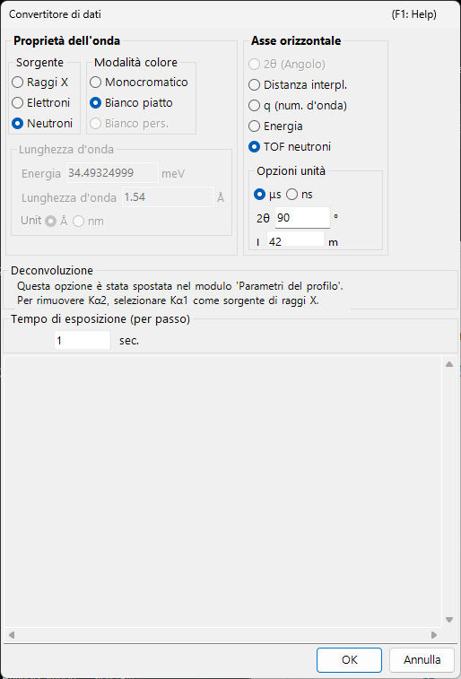
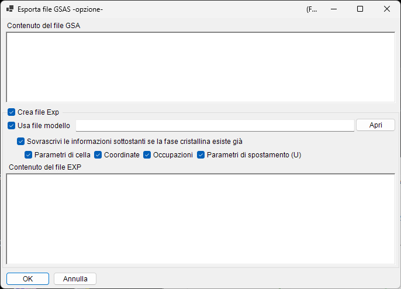

<!-- 260601Cl: migrated from legacy docx + yseto.net web manual -->
# Formati di file

I file che PDIndexer legge e scrive si dividono in tre gruppi: **dati di profilo**, **liste di cristalli / strutture cristalline** e **output grafico**. Tutte queste operazioni di I/O si eseguono dal menu **File** della [finestra principale](../1-main-window.md).

Questa pagina riassume in forma tabellare le estensioni supportate, la direzione di I/O e le note.

---

## Dati di profilo

### Lettura (Read profile(s))

**File → Read profile(s)** consente di caricare più file contemporaneamente. Oltre al formato nativo di PDIndexer `pdi` / `pdi2`, supporta una varietà di formati testuali e binari angolo-intensità (o energia-intensità), come il `csv` di WinPIP, il `chi` di Fit2D e il `ras` di Rigaku. Anche i formati non elencati qui sotto possono di solito essere letti: qualsiasi file di testo angolo-intensità semplice ricade su un parser generico.

| Estensione | Origine / formato | Note |
| --- | --- | --- |
| `pdi` / `pdi2` | Formato nativo di PDIndexer | Conserva il profilo insieme alle informazioni associate (sorgente d'onda, lunghezza d'onda, tempo di esposizione, ecc.). `pdi2` è la versione attuale. La finestra di dialogo Data Converter non viene mostrata durante la lettura di questi. |
| `csv` | Output di WinPIP (separato da virgole: `angle,intensity`) | Importato tramite la finestra di dialogo Data Converter, dove si specifica il significato dell'asse orizzontale, la sorgente d'onda e la lunghezza d'onda. |
| `tsv` | Separato da tabulazioni (`angle` `[TAB]` `intensity`) | Importato come testo generico. |
| `chi` | Output di Fit2D | Le righe di intestazione iniziali vengono saltate; le colonne 2 e 4 dei dati a quattro colonne sono prese come angolo e intensità. |
| `ras` | Formato Rigaku | Formato testuale che contiene anche informazioni sullo strumento. |
| `nxs` | NeXus / HDF5 (SSD, rivelatori multipli) | Può contenere diversi canali (istogrammi); ciascuno viene calibrato in energia e importato separatamente. |
| `npd` | Profilo EDX (SSD) | Legge `EGC0/1/2`, `2Theta`, `Live time`, ecc. dall'intestazione e converte il numero di canale in energia. |
| `xbm` | Formato binario EDX (ad es. SP-8 BL04B2) | I metadati come nome del campione, condizioni di misura e coefficienti di calibrazione EGC vengono importati come commento. |
| `rpt` | Formato Genie (SSD) | Legge l'angolo di uscita, il tempo di esposizione e l'EGC dall'intestazione. |
| `xy` | Testo a due colonne calibrato con pyFAI | Legge la lunghezza d'onda dall'intestazione e importa angolo e intensità. |
| `gsa` | Dati GSAS (blocco `BANK`) | Importa le tre colonne: angolo, intensità, errore. |
| Altro | Testo generico angolo-intensità | Il delimitatore virgola / spazio / tabulazione viene rilevato automaticamente (tramite la finestra di dialogo Data Converter). |

!!! note "Caricamento di più file contemporaneamente"
    Quando selezioni e leggi più file, dopo aver confermato le impostazioni del Data Converter per il primo file un messaggio chiede se riutilizzare le stesse impostazioni per i file rimanenti. Scegliendo **Yes** i restanti vengono elaborati senza mostrare la finestra di dialogo, il che velocizza il caricamento.

### Finestra di dialogo Data Converter

Quando leggi un file diverso da `pdi` / `pdi2` (`csv`, `chi`, `ras`, `nxs`, `npd`, `xbm`, `rpt`, `xy`, `gsa` e testo generico), si apre la finestra di dialogo **Data Converter**. È qui che mappi le colonne numeriche importate alle grandezze fisiche corrette usate internamente da PDIndexer.

La finestra di dialogo offre le seguenti impostazioni.

| Impostazione | Descrizione |
| --- | --- |
| Horizontal Axis | La grandezza fisica (2θ, energia, distanza interplanare (valore d), numero d'onda, TOF, ecc.) e l'unità rappresentate dalla prima colonna importata. |
| Sorgente d'onda / lunghezza d'onda | Raggi X / neutroni / elettroni, e la linea caratteristica dei raggi X (Kα, ecc.) o la lunghezza d'onda. Questo determina la conversione in distanza interplanare (valore d) e 2θ. |
| Exposure time (per step) | Il tempo di esposizione per passo in secondi. Usato per la visualizzazione in CPS e la normalizzazione dell'intensità. |
| For SSD data | Per dati SSD (EDX) come `rpt` / `npd` / `xbm` / `nxs`, imposta i coefficienti \(a_0, a_1, a_2\) che convertono il numero di canale \(n\) in energia \(E\). Quando ci sono più rivelatori, puoi abilitare/disabilitare ciascuno e impostarne i coefficienti individualmente. |
| Low energy cutoff | Se selezionato, i punti dati al di sotto dell'energia specificata vengono esclusi durante l'importazione. |

Per i dati SSD, il numero di canale \(n\) viene convertito in energia \(E\) (in eV) mediante una calibrazione quadratica:

$$
E = a_0 + a_1\,n + a_2\,n^2
$$

Quando si legge testo generico (un formato "altro"), la finestra di dialogo mostra il contenuto effettivo del file in una casella di testo, così puoi impostare l'asse orizzontale, la sorgente d'onda e così via mentre ispezioni i dati. Il delimitatore (virgola / spazio / tabulazione) e il numero di righe di intestazione iniziali da saltare vengono rilevati automaticamente.

!!! tip "Monitoraggio degli appunti / di una cartella"
    Abilitando **Option → Watch Clipboard** PDIndexer importa automaticamente i profili copiati da altre app come IPAnalyzer. Abilitando **Watch File** legge automaticamente i file `pdi` appena creati in una cartella scelta.

### Salvataggio ed esportazione

**File → Save profile(s)** salva tutti i profili caricati nel formato nativo di PDIndexer `pdi2`.

**File → Export the selected profile(s)** scrive il profilo selezionato in uno dei formati seguenti.

| Estensione / formato | Direzione | Note |
| --- | --- | --- |
| `pdi2` | Out | Formato nativo di PDIndexer. Salva tutti i profili in una volta. |
| `csv` | Out | Separato da virgole (angolo, intensità). |
| `tsv` | Out | Separato da tabulazioni (angolo e intensità separati da una tabulazione). |
| `gsa` (GSAS) | Out | Formato GSAS per l'analisi Rietveld. Puoi rivedere il contenuto nella schermata di esportazione qui sotto. |

#### Esportazione in formato GSAS

Quando scegli il formato GSAS, appare una schermata di esportazione così puoi rivedere ciò che verrà scritto. La riga 1 è il nome del profilo, la riga 2 è un'intestazione `BANK 1 … CONST … FXYE`, e le righe successive contengono tre colonne: angolo, intensità ed errore. L'errore è preso dai dati di errore propri del profilo quando presenti; altrimenti si usa \(\sqrt{\text{intensity}}\).

!!! note "Scalatura dell'angolo"
    Per i normali dati a dispersione angolare, i valori di angolo vengono scritti moltiplicati per 100 (la convenzione `CONST` di GSAS). Per i dati neutronici TOF, i valori vengono scritti così come sono, senza scalatura.

---

## Liste di cristalli e strutture cristalline

Le liste di cristalli vengono salvate e caricate come file XML (estensione `xml`). Le singole strutture cristalline possono essere importate da CIF / AMC. Vedi [Parametri del cristallo](../3-crystal-parameter.md) per i dettagli.

| Operazione (menu File) | Estensione | Direzione | Note |
| --- | --- | --- | --- |
| Load crystals (as a new list) | `xml` | In | Carica una lista di cristalli e sostituisce la lista corrente (la lista corrente viene scartata). |
| Load crystals (and add to the present list) | `xml` | In | Carica una lista di cristalli e la accoda alla fine della lista corrente. |
| Save crystals | `xml` | Out | Salva la lista di cristalli corrente in un file. |
| Import CIF, AMC... | `cif` / `amc` | In | Aggiunge dati di struttura in formato CIF o AMC (AMCSD) alla lista di cristalli corrente. |
| Export the selected crystal to CIF | `cif` | Out | Salva il cristallo selezionato come file di dati di struttura CIF. |
| Revert crystals to the initial state | — | — | Ripristina la lista di cristalli allo stato predefinito così come installata. |

---

## Output grafico (visualizzatore di profili)

Il profilo attualmente mostrato nella finestra principale può essere copiato negli appunti come immagine o salvato come metafile vettoriale.

| Operazione (menu File) | Formato | Direzione | Note |
| --- | --- | --- | --- |
| Copy to Clipboard (as Bitmap data) | Bitmap | Appunti | Copia il contenuto del visualizzatore negli appunti come immagine bitmap. |
| Copy to Clipboard (as Metafile data) | Metafile (vettoriale) | Appunti | Copia il contenuto del visualizzatore negli appunti in forma vettoriale. |
| Save as Metafile | `emf` (EMF) | Out | Salva in formato EMF (Enhanced Metafile). Poiché conserva le informazioni vettoriali e sui font, l'`emf` salvato può essere letto in PowerPoint e Word. |

Inoltre, **Page Setup**, **Print Preview** e **Print** consentono di stampare direttamente l'intervallo di angolo e intensità corrente.
