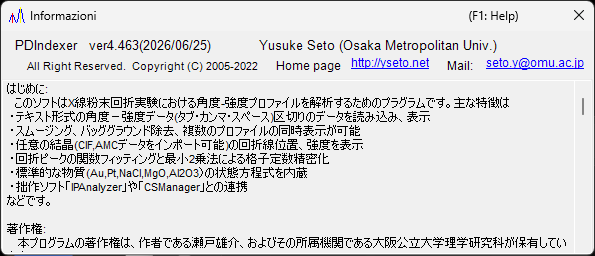

<!-- 260601Cl: migrated from legacy docx + yseto.net web manual -->
# Ambiente di esecuzione e installazione

Questa pagina descrive come installare PDIndexer e l'ambiente consigliato per un funzionamento confortevole.

## Installazione

Scarica l'ultima release dalla pagina delle release su GitHub.

- Download: <https://github.com/seto77/PDIndexer/releases/latest>

Il metodo consigliato è l'installer MSI. Scarica `PDIndexer-setup.msi` (x64) e fai doppio clic su di esso per avviare l'installazione. Su Windows on Arm (ad esempio i PC Snapdragon), scarica invece `PDIndexer-setup_arm64.msi`. <!-- 260625Cl WiX asset names + arm64 -->

Se l'installazione MSI è bloccata su un PC Windows gestito, usa come alternativa il pacchetto ZIP senza installazione. Scarica lo ZIP portatile (`PDIndexer-v.<ver>.zip` per x64, oppure `PDIndexer-v.<ver>_arm64.zip` per Arm), estrai l'intera cartella in una posizione scrivibile dall'utente ed esegui `PDIndexer.exe` dalla cartella estratta. Non eseguire `PDIndexer.exe` direttamente dall'interno del visualizzatore ZIP. <!-- 260601Ch / 260625Cl -->

!!! note "Informazioni sull'avviso di protezione di Windows"
    Quando esegui un software di ricerca non firmato appena scaricato, Windows può mostrare un avviso SmartScreen ("Windows ha protetto il PC"). Se ciò accade, fai clic su **Ulteriori informazioni** e poi scegli **Esegui comunque** per continuare.

!!! note "Informazioni sul pacchetto ZIP senza installazione"
    Il pacchetto ZIP è pensato come alternativa per gli ambienti in cui l'installazione MSI, l'approvazione dell'amministratore o l'installazione separata del .NET Desktop Runtime risultano difficili. Non è una cartella di impostazioni completamente autonoma: PDIndexer memorizza comunque le impostazioni utente e i dati predefiniti copiati nella cartella AppData dell'utente corrente, e può memorizzare le opzioni per singolo utente in `HKEY_CURRENT_USER\Software\Crystallography\PDIndexer`.

## Requisiti di esecuzione

Il seguente runtime è richiesto quando PDIndexer viene installato tramite l'installer MSI.

| Voce | Requisito |
| --- | --- |
| OS | Windows (64 bit, x64 o Arm64) |
| Runtime | `.NET Desktop Runtime 10.0` (il **Desktop Runtime**, non il semplice **.NET Runtime**; su Windows on Arm, la build **Arm64**) |

!!! warning "Scegli il Desktop Runtime"
    La pagina di download offre due prodotti: il ".NET Runtime" e il ".NET Desktop Runtime". Poiché PDIndexer è un'applicazione WinForms, assicurati di installare il **.NET Desktop Runtime**. Il semplice ".NET Runtime" da solo non avvierà il programma.

- Download del runtime: <https://dotnet.microsoft.com/download/dotnet/10.0>

Il pacchetto ZIP senza installazione è autonomo per l'architettura corrispondente (x64 o Arm64) e non richiede un'installazione separata del .NET Desktop Runtime. <!-- 260601Ch / 260625Cl arm64 -->

!!! note "Informazioni sulla versione indicata nella documentazione più vecchia"
    Il manuale legacy (docx) menziona ".NET Desktop Runtime 6.0 o successivo", ma l'attuale PDIndexer richiede **.NET 10.0**. Segui il requisito della versione più recente.

## Ambiente consigliato

Alcune funzioni di PDIndexer richiedono notevoli risorse di calcolo. Per migliorare la velocità, il calcolo è multithread ovunque possibile. Per un uso confortevole, è consigliato un computer con le seguenti specifiche ad alte prestazioni.

| Voce | Consigliato |
| --- | --- |
| OS | Windows 11 (funziona anche Windows 10 o successivo, 64 bit) |
| RAM | 16 GB o più |
| CPU | 8 core o più (efficace per il calcolo multithread) |

!!! tip "Vantaggio del multithreading"
    I calcoli dei pattern di diffrazione basati sulle strutture cristalline, l'analisi sequenziale e le attività simili vengono eseguiti più velocemente con un maggior numero di core della CPU. Più core ha la CPU, più breve è il tempo di attesa del calcolo.

## Aggiornamenti (verifica di nuove versioni)

Dal menu **Aiuto** della finestra principale, PDIndexer consente di aggiornare all'ultima versione e di visualizzare le informazioni sull'autore.

| Menu | Funzione |
| --- | --- |
| **Aiuto** ▸ **Aggiornamenti del programma** | Verifica se è stata rilasciata una versione più recente e aggiorna il programma. |
| **Aiuto** ▸ **Informazioni** | Mostra le informazioni sulla versione e sull'autore. |

Scegliendo **Aiuto** ▸ **Informazioni** si apre una finestra come quella qui sotto, in cui puoi verificare il numero di versione corrente e le informazioni sull'autore.

!!! tip "Aggiorna regolarmente"
    Correzioni di bug e nuove funzionalità vengono aggiunte continuamente. Esegui **Aiuto** ▸ **Aggiornamenti del programma** di tanto in tanto per mantenere PDIndexer aggiornato.

## Licenza

PDIndexer è distribuito sotto la **licenza MIT**. L'uso, la modifica, la distribuzione e l'uso commerciale sono liberamente consentiti, a condizione che l'avviso di copyright e il testo della licenza siano inclusi in qualsiasi ridistribuzione. Il software è fornito senza garanzia.
