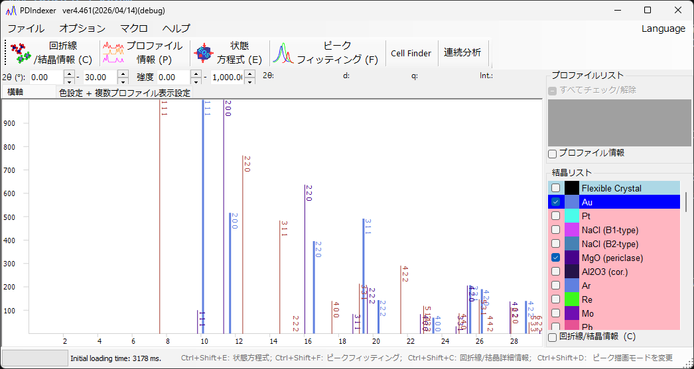

<!-- 260601Cl: migrated from legacy docx + yseto.net web manual -->
# 概要

PDIndexer は、一次元の粉末 X 線回折パターンを解析するためのソフトウェアです。粉末 X 線回折装置や、デバイ・シェラー透過光学系で得られた放射光 X 線、中性子飛行時間 (TOF) 測定などで得られた回折プロファイルを表示・解析できます。

複数プロファイルの重ね合わせ表示、既知結晶の回折線との比較、標準物質との比較による温度・圧力の校正、プロファイルフィッティング、最小二乗法による格子定数の精密化など、粉末回折データの解析に必要な機能を一通り備えています。

!!! note "本マニュアルについて"
    本ページは概要のみを扱います。各機能の詳しい操作方法は、それぞれの専用ページを参照してください。

## 主な機能

PDIndexer は以下の機能を提供します。

| 機能 | 概要 |
| --- | --- |
| プロファイルの表示・比較 | 複数の回折プロファイルを重ね合わせて表示し、比較します。横軸 (\(2\theta\) / \(d\) / \(q\))・縦軸のスケールを柔軟に切り替えられます。 |
| 既知結晶との比較 | 既知結晶の回折線を計算し、観測プロファイルと重ねて表示・同定します。詳しくは [回折線/結晶情報](3-crystal-parameter.md) を参照してください。 |
| 標準物質による校正 | NaCl EOS・Pt EOS などの状態方程式 (EOS) を用い、標準物質の格子体積から温度・圧力を見積もります。詳しくは [状態方程式 (EOS)](5-equation-of-states.md) を参照してください。 |
| ピークフィッティング | 回折ピークの位置・半値全幅 (FWHM)・強度をフィットします。詳しくは [ピークフィッティング](6-fitting-diffraction-peaks.md) を参照してください。 |
| 格子定数の精密化 | 最小二乗法によりピーク位置から格子定数を精密化します。**セルファインダー** によりピーク位置から格子定数を探索することもできます。 |
| 連続分析 | 複数ファイルを一括して処理する **連続分析** 機能を備えています。詳しくは [連続分析](7-sequential-analysis.md) を参照してください。 |
| インポート/エクスポート | CIF・AMC からの結晶構造取り込み、CSV・TSV・GSAS (リートベルト解析) 形式での書き出しに対応します。 |
| 自動取り込み | クリップボードやフォルダを監視し、他アプリ (IPAnalyzer 等) からのプロファイル/結晶や、新規に作成されたファイルを自動で読み込みます。 |

!!! tip "対応データ"
    粉末 X 線回折装置・放射光 X 線 (デバイ・シェラー透過光学系)・中性子飛行時間 (TOF) など、幅広いプロファイルを扱えます。

## ライセンス

本ソフトウェアは **MIT ライセンス** の下で配布しています ([LICENSE.md](https://github.com/seto77/PDIndexer/blob/master/LICENSE.md))。下記の条件を受け入れていただけるのであれば、誰でも自由に無料で本ソフトウェアを使用できます。

- コピー・配布・変更・変更物の配布・商用利用・有料販売など、なんにでも自由に使用できます。
- 再配布する場合は、本ソフトウェアの著作権表示とこのライセンスの全文を、ソースコード中またはソースコードに同梱したライセンス表示用の別ファイルなどに掲載してください。
- 本ソフトウェアには何の保証もついていません。本ソフトウェアを利用したことで何らかの問題が起こったとしても、作者は一切の責任を負いません。

## フィードバック

ご意見やご要望は、GitHub の [Issue](https://github.com/seto77/PDIndexer/issues) でお知らせください。ソースコードは [github.com/seto77/PDIndexer](https://github.com/seto77/PDIndexer) で公開しています。

## インストールと動作環境

PDIndexer の動作には **.NET Desktop Runtime 6.0 以上** が動作する Windows OS が必要です。機能の中には大きな計算リソースを必要とするものがあり、速度向上のためにマルチスレッド化や GPU 利用を行っています。快適に使用するには、16 GB 以上のメモリ・8 コア以上の CPU・64 bit 版の Windows 10/11 を推奨します。

詳しいインストール手順と動作環境については、[実行環境とインストール](appendix/runtime-and-installation.md) を参照してください。
