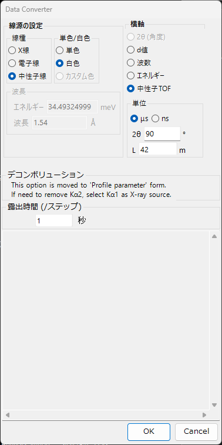

<!-- 260601Cl: migrated from legacy docx + yseto.net web manual -->
# プロファイルデータ

このページでは、PDIndexer が扱う「プロファイルデータ」そのもの（測定データ）と、その読み込み・表示・書き出しについて説明します。読み込んだあとの平滑化・バックグラウンド減算などの処理は [プロファイル情報](4-profile-parameter.md) ウィンドウで行います。サポートする拡張子の一覧は [ファイル形式](appendix/file-formats.md) を参照してください。

## プロファイルとは

プロファイルは、粉末回折測定で得られる「横軸 vs 強度」の 1 次元データです。横軸は測定方式に応じて以下のいずれかで表現されます。

- 角度分散型（通常の X 線回折）では \( 2\theta \)（回折角）
- エネルギー分散型（白色 X 線、SSD 検出）ではエネルギー
- 中性子飛行時間（TOF）法では飛行時間
- いずれの場合も、内部的には格子面間隔 \( d \) や散乱ベクトル \( q \) に変換して扱えます

縦軸は回折強度で、生のカウント（`Raw Counts`）または毎ステップ当たりのカウント（`Count per Step (CPS)`）として、リニア／対数スケールで表示できます（[メインウィンドウ](1-main-window.md) の `Vertical Axis` を参照）。

## 対応する入力形式

`File ▸ Read profile(s)` では、PDIndexer 本来の形式のほか、他ソフトの出力や汎用テキスト形式を読み込めます。

| 拡張子 | 内容 |
| --- | --- |
| `pdi` / `pdi2` | PDIndexer 本来のプロファイル形式（軸設定や処理情報を含む） |
| `csv` | WinPIP の出力（カンマ区切り） |
| `chi` | Fit2D の出力 |
| `tsv` | タブ区切りテキスト |
| `ras` | リガク（RAS）形式 |
| `nxs` | NeXus 形式 |
| `npd` / `xbm` / `rpt`（`rpf`） | SSD（半導体検出器）系の生データ |
| その他テキスト | 角度（または d 値）－強度の 2 列テキストであれば、おおむね読み込み可能 |

!!! note "汎用テキストの読み込み"
    角度－強度のテキスト形式で格納されたファイルは、上記の標準形式でなくても大体読み込めるようにしてあります。横軸の種別や波長・エネルギーが判別できない場合は、後述の `Data Converter` ダイアログで指定します。

各形式の詳しい仕様は [ファイル形式](appendix/file-formats.md) にまとめています。

## 読み込み方法

プロファイルは複数の方法で読み込めます。

- **メニュー** — `File ▸ Read profile(s)`（プロファイルを読込）。複数ファイルを同時に選択できます。
- **ドラッグ＆ドロップ** — エクスプローラーからファイルをメインウィンドウへドロップします。
- **クリップボード監視** — `Option ▸ Watch Clipboard`（クリップボードを監視）を有効にすると、IPAnalyzer や CSManager など他アプリからコピーされたプロファイル／結晶を自動で取り込みます。
- **ファイル監視** — `Option ▸ Watch File`（ファイルを監視）を有効にし、`Set Directory to the watch` で監視フォルダを指定すると、新しく作成された `pdi` プロファイルファイルを自動的に読み込みます。連続測定のリアルタイム表示に便利です。

!!! tip "横軸の自動そろえ"
    `After reading profile, change horizontal axis`（横軸を最後に読み込んだプロファイルのものにそろえる）をチェックしておくと、読み込み直後に横軸の表示が新しいプロファイルに合わせて切り替わります。

## 単一プロファイルモードと複数プロファイルモード

メインウィンドウ右側の `Single/Multi Profile`（単/複数プロファイル設定）で、表示モードを切り替えます。

- **`Single Profile`（単一プロファイルのみ表示）** — 新しいプロファイルを読み込むと、それまでのデータは置き換えられます。常に 1 本だけを表示します。
- **`Multi Profiles`（複数プロファイルを表示）** — 読み込んだプロファイルを重ねて表示します。`Increasing intensity by a profile`（プロファイル間の差）で各プロファイルの強度を少しずつずらして表示すると、複数本を見分けやすくなります。`Change automatically color`（色を自動で変更）を有効にすると、プロファイルごとに描画色が自動で割り当てられます。

## Profile チェックリスト

メインウィンドウ左側の `Profile`（プロファイルリスト）には、読み込んでいるプロファイルが一覧表示されます。

- チェックを付けたプロファイルだけが中央の表示領域に描画されます。`Check/Uncheck all`（すべてチェック/解除）で一括切り替えができます。
- `Color` 欄をクリックすると、各プロファイルの描画色を変更できます。
- リスト内の順序を入れ替えて、重ね描きの順番を調整できます。
- Single Profile モードのときはリストは無効になり、Multi Profiles モードのときに複数のプロファイルが表示されます。

より詳しいプロファイルの設定（名前・線種・平滑化・バックグラウンド減算・軸補正・プロファイル演算など）は、リスト下部の `Profile Parameter` チェックボックスをチェックして [プロファイル情報](4-profile-parameter.md) ウィンドウで行います。

## Data Converter ダイアログ

横軸の種別が判別できない汎用テキストファイルや、SSD（エネルギー分散）系の生データを読み込むと、`Data Converter` ダイアログが開き、読み込むデータの横軸とその関連パラメータを指定できます。

ダイアログでは次の項目を設定します。

| 項目 | 内容 |
| --- | --- |
| 横軸設定 | データの横軸種別（X 線の波長／エネルギー、2θ、中性子 TOF の距離・角度など）と、対応する線源パラメータを指定します。 |
| `露出時間 (/ステップ)` | データ 1 ステップあたりの露出（測定）時間を秒単位で設定します。CPS 換算に使われ、0 以下は 1 として扱われます。 |
| `デコンボリューション` | Kα2 の除去は [プロファイル情報](4-profile-parameter.md) 側へ移動しました。除去する場合は X 線源として Kα1 を選択します。 |
| `For SSD data` の `Low energy cutoff` | EDX スペクトルの低エネルギー側を、右の閾値（eV）以下で切り捨てます。 |

横軸種別がエネルギー分散（白色 X 線、EDX）の場合は、`E = a₀ + a₁ n + a₂ n²`（E: エネルギー[eV]、n: チャンネル番号）のエネルギー校正係数を入力して、チャンネル番号をエネルギーへ変換します。`OK` で設定を適用してデータを変換し、`Cancel` で読み込みを中止します。

## プロファイルの書き出し

- **`File ▸ Save profile(s)`（プロファイルを書き込み）** — 読み込み済みの全プロファイルを、PDIndexer 本来の `pdi2` 形式で保存します。軸設定や処理情報も保持されます。
- **`File ▸ Export the selected profile(s)`（プロファイルをエクスポート）** — 選択中のプロファイルを、次のいずれかの形式で書き出します。
  - `as CSV (comma separated values) file` — カンマ区切り（角度, 強度）
  - `as TSV (tab separated values) file` — タブ区切り
  - `as GSAS file` — GSAS（リートベルト解析）形式

!!! note "図の保存"
    プロファイルの「データ」ではなく「描画図」を保存したい場合は、`File ▸ Copy to Clipboard` または `File ▸ Save as Metafile`（EMF）を使います。EMF は PowerPoint や Word に読み込めるベクター形式です。
