<!-- 260601Cl: migrated from legacy docx + yseto.net web manual -->
# 回折線・結晶情報

メイン画面のツールバーから `回折線/結晶情報` アイコンをクリックすると、下図のようなサブウィンドウ（`Crystal Parameter`）が開きます。このウィンドウでは、回折ピークを表示したい結晶の種類や、回折ピークの表示方法を設定します。ウィンドウ下部には、結晶構造を検索・取り込みするための結晶データベースが組み込まれています。

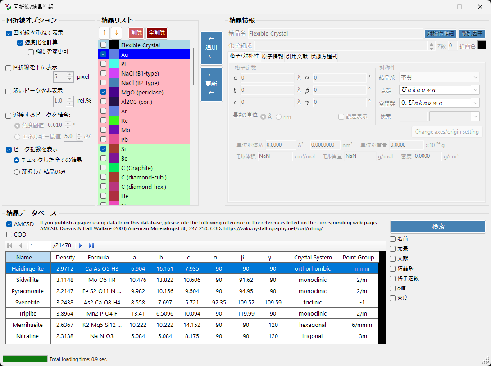

ウィンドウは大きく次の 4 つの領域に分かれます。

| 領域 | 役割 |
| --- | --- |
| 回折線オプション（`Diffraction Peak Option`） | 回折線の表示方法に関する設定 |
| 結晶リスト（`Crystal List`） | メイン画面と共有する結晶のチェックリスト |
| 結晶情報（`Crystal Information`） | 選択した結晶の詳細パラメータ（タブ切り替え） |
| 結晶データベース（`Crystal database`） | AMCSD ベースの検索・取り込み |

---

## 回折線オプション

回折線の表示に関する設定を行います。

### 回折線を重ねて表示（Show peaks over profiles）

プロファイルデータに重ねて回折線を表示するかどうかを選択します。

### 強度比を計算（Calculate intensity ratio）

構造データから回折強度（の比）を計算するかどうかを選択します。

!!! note
    原子位置が入力されていない場合は、チェック状態にかかわらず強度は計算されません。原子情報の入力については [原子情報タブ](#_8) を参照してください。

### 強度を変更可（Scalable intensity）

強度比を変えずに、回折線全体をスケーリングできるかどうかを選択します。

### 回折線を下に表示（Show peaks under profile）

プロファイルの下部に回折ピークを表示するかどうかを設定します。

#### ピーク高さ（Peak height）

プロファイル下部に表示するピークの高さをピクセル単位（`pixel`）で設定します。

### 近接するピークを結合（Combine adjacent peaks）

結晶学的には非等価でも、2θ が近い、あるいは全く同じになるピークの強度をまとめて表示するかどうかを選択します。

たとえば立方晶系では (333) 面と (115) 面は非等価であるにもかかわらず、全く同じ d 値を持つため観測上は重なってしまいます。このような場合、このチェックボックスをチェックすると、強度をまとめて表示できます。

| 項目 | 説明 |
| --- | --- |
| 角度閾値（`Angle threshold`） | どれくらい近いピークをまとめるかを角度（`°`）で指定します。 |
| エネルギー閾値（`Energy threshold`） | エネルギー分散の場合に、まとめる範囲をエネルギー（`eV`）で指定します。 |

!!! tip
    旧マニュアルでは閾値の単位をオングストロームと記載していましたが、現行版では横軸の種類に応じて角度（`°`）またはエネルギー（`eV`）で指定します。

### 弱いピークを非表示（Hide peaks below）

最強線と比べて低すぎるピークを消去するかどうかを選択します。最強線に対する比率（`rel.%`）で指定します。

### ピーク指数を表示（Show peak indices）

回折線の指数（ミラー指数）を表示する対象を選択します。

| 選択肢 | 表示対象 |
| --- | --- |
| `チェックした全ての結晶`（all checked crystals） | チェックしているすべての結晶 |
| `選択した結晶のみ`（only selected crystal） | リストで選択している結晶のみ |

---

## 結晶リスト

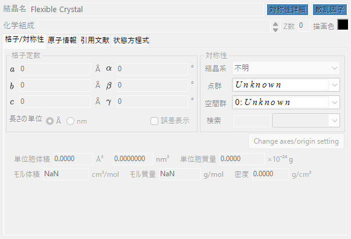

メイン画面の Profile チェックリストと同一の情報を表示します。チェックされている結晶は、メイン画面に回折線が表示されます。各行には、チェックボックス（`Check`）、描画色（`PeakColor`）、結晶名（`Crystal`）が表示されます。

### 上下矢印ボタン（↑ / ↓）

結晶の順番を変更します。

!!! note
    1〜6 個目の行は状態方程式（EOS）のために予約されており、順番を変更できません。EOS については [状態方程式](5-equation-of-states.md) を参照してください。

### 追加（Add）

右の結晶情報領域（後述）で設定した結晶を、リストに新規追加します。

### 更新（Replace）

右の結晶情報領域で設定した結晶を、現在選択されている結晶と入れ替えます。

### 削除（Delete）

現在選択されている結晶をリストから削除します。

### 全削除（Delete all）

すべての結晶をリストから削除します。

---

## 結晶情報

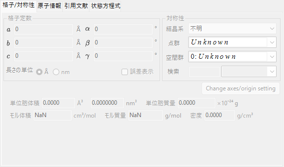

選択した結晶の詳細な情報を、タブで切り替えながら編集・表示します。主なタブは次のとおりです。

| タブ | 内容 |
| --- | --- |
| `格子/対称性`（Basic Info.） | 格子定数・結晶系・空間群などの基本情報 |
| `原子情報`（Atom Info.） | 原子の種類・占有率・座標・温度因子 |
| `引用文献`（Ref.） | 出典となる論文・著者などの文献情報 |
| `状態方程式`（EOS） | 圧縮・熱膨張を扱う状態方程式の設定 |

### 格子/対称性タブ

格子定数（a, b, c, α, β, γ）、結晶系、空間群といった基本情報を設定します。空間群を選ぶと、入力可能な格子定数や原子座標の自由度が自動的に制限されます。

!!! tip
    格子定数の入力欄を右クリックすると、アプリ起動時（またはデータベースから取り込んだ時点）の値に格子定数を回復するメニューが表示されます。フィッティングなどで値を変えた後、元の参照値に戻したいときに便利です。

### 原子情報タブ

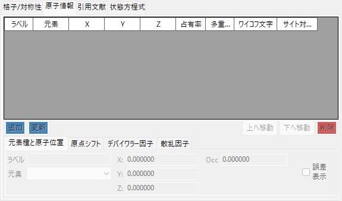

各原子の元素種、占有率、分率座標、等方／異方性温度因子などを設定します。ここに原子位置が入力されていると、[強度比を計算](#calculate-intensity-ratio) で回折強度を計算できます。

### 引用文献タブ

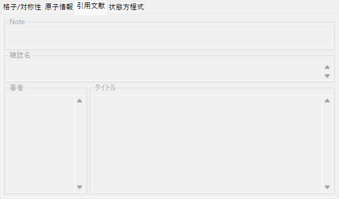

結晶構造の出典となる論文名・雑誌名・著者などの文献情報を保持します。結晶データベースから取り込んだ構造には、この情報が自動的に設定されます。

### 状態方程式タブ

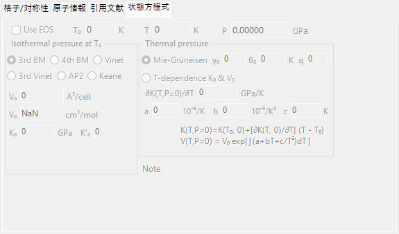

圧力・温度による格子定数の変化を扱う状態方程式（EOS）を設定します。詳細は [状態方程式](5-equation-of-states.md) を参照してください。

---

## 結晶データベース

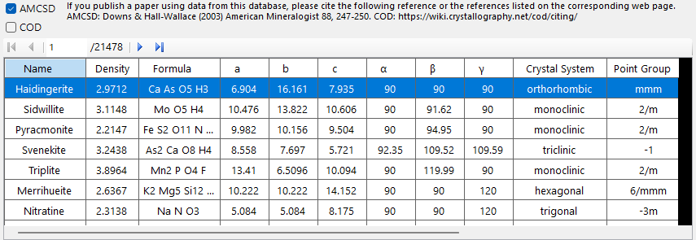

2 万件以上の結晶構造について、検索および取り込み機能を提供します。このデータベースは American Mineralogist Crystal Structure Database（AMCSD）に基づいています。

!!! warning "引用について"
    この結晶データを使用する際は、<http://rruff.geo.arizona.edu/AMS/amcsd.php> をよく読み、次の文献を必ず引用してください。

    > Downs, R.T. and Hall-Wallace, M. (2003) The American Mineralogist Crystal Structure Database. *American Mineralogist* **88**, 247-250.

### テーブル

データベースに含まれている結晶が一覧表示されます。検索条件が入力されている場合は、その条件に合った結晶のみが表示されます。

テーブル中の任意の結晶を選択すると、その情報が [結晶情報](#_5) に転送されます。結晶リストに加えたい場合は、結晶リスト領域の `追加`（Add）または `更新`（Replace）ボタンを押してください。

### 検索オプション

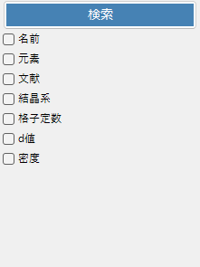

検索条件を入力します。入力後は `検索`（Search）ボタンを押すか、Enter キーを押してください。各条件はチェックボックスで有効・無効を切り替えられます。

#### 名前（Name）

結晶の名称を入力します。

#### 元素（Elements）

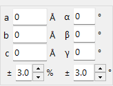

`周期表`（Periodic Table）ボタンを押すと別ウィンドウが開きます。ここで検索対象の元素を選択します。各元素のボタンは、押すごとに状態が切り替わります。

ウィンドウ上部のボタンで、全元素の状態を一括で切り替えられます。

| ボタン | 意味 |
| --- | --- |
| `may or not include` | 含んでいても含んでいなくてもよい（元素の制約をすべて解除します） |
| `must include` | 必ず含む（指定した元素をすべて含む結晶のみが残ります） |
| `must exclude` | 必ず含まない（指定した元素を 1 つでも含む結晶は除外されます） |

!!! tip
    `散乱因子を無視`（Ignore scattering factor）をチェックすると、散乱因子を考慮せずに検索を行えます。

#### 文献（Reference）

論文名、雑誌名、著者名を入力します。

#### 結晶系（Crystal System）

結晶系を指定して検索します。

#### 格子定数（Cell Params）

格子定数と、許容する誤差を入力します。

#### d 値（d-spacing）

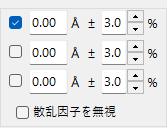

強度の強い結晶面の d 値（面間隔）と、許容する誤差を入力します。

#### 密度（Density）

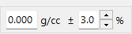

密度と、許容する誤差を入力します。
