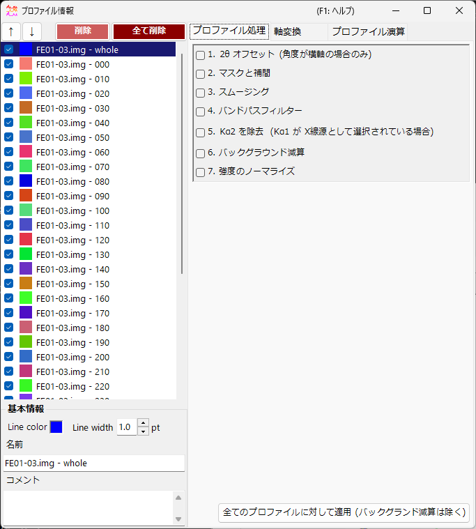
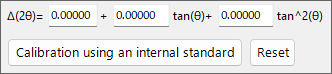
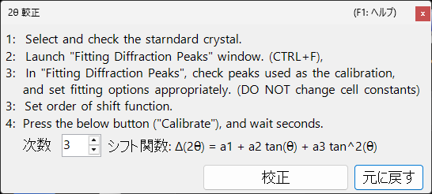
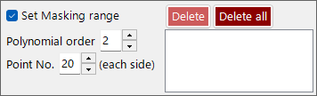
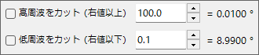
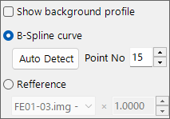
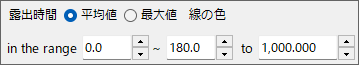

<!-- 260601Cl: migrated from legacy docx + yseto.net web manual -->
# プロファイル情報

メイン画面の `Profile parameter`（プロファイル情報）アイコンをクリックすると、このサブウィンドウが開きます。ここでは、読み込んだプロファイルに対する詳細な設定と、各種の数値処理をおこないます。

ウィンドウの左側には [Profile チェックリスト](#profile) があり、右側はタブで切り替わる 3 つのページ — [プロファイル処理](#profile-processing)、[軸変換](#axis-setting)、[プロファイル演算](#profile-operator) — に分かれています。各処理はチェックボックスで有効/無効を切り替えられ、上から順に適用されます。

!!! note
    このウィンドウで設定した内容は、[メイン画面](1-main-window.md) のプロファイルにリアルタイムで反映されます。横軸の単位や交差線の指数表示など、結晶側の設定は [Crystal Parameter](3-crystal-parameter.md) を参照してください。

---

## Profile チェックリスト {#profile}

ウィンドウ左側のリストは、メイン画面の Profile チェックリストと同一の情報を表示します。リストでプロファイルを選択すると、そのプロファイルがウィンドウ右側の各処理・設定の対象になります。

| 項目 | 説明 |
| --- | --- |
| `↑` `↓`（上下矢印ボタン） | リスト内でのプロファイルの並び順を変更します。 |
| `Delete`（削除） | 選択したプロファイルを削除します。 |
| `Delete all`（全て削除） | すべてのプロファイルを削除します。 |

リスト下部の `Basic property`（基本情報）欄では、選択中のプロファイルの基本属性を編集します。

| 項目 | 説明 |
| --- | --- |
| `Line Color`（線の色） | クリックすると、選択しているプロファイルの描画色を変更できます。 |
| `Line Width`（線の幅） | プロファイルの線の太さ（`pt`）を設定します。 |
| `Profile Name`（名前） | プロファイルの名称を設定します。 |
| `Comment`（コメント） | 自由記入のコメント欄です。 |

---

## プロファイル処理（Profile processing） {#profile-processing}

`Profile processing` タブでは、選択したプロファイルに対してさまざまな数値処理を施します。処理 1〜7 はそれぞれ独立したチェックボックスで有効化でき、有効にしたものが番号順に適用されます。

### 1. 2θ オフセット {#two-theta-offset}

`1. 2θ offeset (for angle-dispersive diffractmetry)` は、角度分散型のデータに対して角度の補正をおこないます。補正式は \( \tan\theta \) に関する二次関数です。

$$ \Delta(2\theta) = a_0 + a_1 \tan\theta + a_2 \tan^2\theta $$

内部標準試料（格子定数が既知の試料）を含むプロファイルの場合は、`Calibration using an internal standard`（内部標準試料による較正）ボタンを押し、表示されるメッセージに従って処理すると、二次関数の係数を自動で決定できます。較正ダイアログでは、観測ピーク位置と標準試料の理論ピーク位置を対応付けて係数をフィッティングします。

`Reset` ボタンを押すと、設定したオフセット係数を初期化できます。

!!! tip
    内部標準試料には、格子定数が精密に決定された Si や LaB₆ などがよく使われます。較正後は、補正された 2θ 値がそのまま以降の解析に用いられます。

### 2. マスクと補間（Mask and Interpolation） {#mask}

`2. Mask and Interpolation` は、指定した角度範囲（あるいはエネルギー範囲）をマスクし、マスク範囲の外側の強度を用いてプロファイルを補間します。

| 項目 | 説明 |
| --- | --- |
| `Set Masking range`（マスク範囲の設定） | マスクする横軸範囲を指定します。 |
| `Point No.` | 補間に用いる端点（両側）の点数を指定します。 |
| `Polynomial order`（多項式次数） | 補間に用いる多項式の次数を指定します。 |
| `Save Masking Ranges` / `Read Masking Ranges` | 設定したマスク範囲をファイルに保存・読み込みします。 |
| `Delete` / `Delete all` | 個別/すべてのマスク範囲を削除します。 |

### 3. スムージング（Smoothing） {#smoothing}

`3. Smoothing` は、選択しているプロファイルに平滑化を施します。平滑化アルゴリズムには `Savitzky-Golay` 法を用います。

この方法は、注目している \(x\) 位置から \(\pm\) `Point No.` 分のデータに対して、`Order`（次数）の多項式による最小二乗フィッティングをおこない、得られた関数 \(F(x)\) の値を改めてその \(x\) 位置の強度値として採用するものです。

!!! note
    `Order` \(= 1\) のとき、Savitzky–Golay 平滑化は単純移動平均と一致します。`Order` を上げるとピーク形状の保存性が高まり、`Point No.` を増やすと平滑化が強くなります。

### 4. バンドパスフィルター（Bandpass filter） {#bandpass}

`4. Bandpass filter` は、フーリエ変換（FFT）を用いて、指定した周波数より大きい、あるいは小さい成分をカットします。

| 項目 | 説明 |
| --- | --- |
| `Cut high-freq. over`（高周波をカット） | 指定値より高周波の成分を除去します（高周波ノイズの低減）。 |
| `Cut low-freq. under`（低周波をカット） | 指定値より低周波の成分を除去します（緩やかなバックグラウンドの除去）。 |

### 5. Kα2 を除去（Remove Kα2） {#remove-ka2}

`5. Remove Kα2 (if Kα1 is used as X-ray source)` は、選択したプロファイルが Kα1 と Kα2 を分離していない X 線で測定され、かつ Kα1 を指定して読み込まれている場合に、これをチェックすると Kα2 由来の回折強度を除去します。

!!! warning
    この処理は、X 線源として Kα1 を選択している場合にのみ有効です。横軸の単位や入射線の種類は [軸変換](#axis-setting) タブで確認・設定してください。

### 6. バックグラウンド減算（Background） {#background}

`6. Background` は、プロファイルからバックグラウンドを減算します。減算方法は 2 通りあります。

#### B-Spline curve（B スプライン曲線）

`Auto Detect`（自動検出）を押すと、自動的にバックグラウンドを計算して減算します。`Point No.` で、自動検索するバックグラウンド制御点の最大数を設定します。

制御点は手動でも変更できます。メイン画面に描かれた丸い制御点をマウスでドラッグして、適切な曲線を作成してください。

#### Reference（参照プロファイル）

選択したプロファイルに対して、別のプロファイルをバックグラウンドとして指定できます。`Show background profile` をチェックすると、バックグラウンドとして使用しているプロファイルを表示できます。

!!! note
    バックグラウンド減算（処理 6）は、後述の `Apply for all profiles` ボタンによる一括適用の対象外です。

### 7. 強度のノーマライズ（Normalize intensity） {#normalize}

`7. Normarize intensity` は、指定した横軸範囲における `Average`（平均値）あるいは `Maximum`（最大値）が、指定した強度になるようにプロファイルをノーマライズします。

| 項目 | 説明 |
| --- | --- |
| `Average` / `Maximum`（平均値 / 最大値） | 範囲内の平均値または最大値のどちらを基準にするかを選びます。 |
| `intensity between`（横軸範囲） | 対象とする横軸範囲を指定します。 |
| `to`（にノーマライズ） | ノーマライズ後の目標強度値を指定します。 |

### Apply for all profiles ボタン {#apply-all}

`Apply for all profiles (without background setting)`（全てのプロファイルに対して適用）ボタンは、処理 1〜7 のうち **6. バックグラウンド減算を除く** 設定を、すべてのプロファイルに一括で適用します。

---

## 軸変換（Axis setting） {#axis-setting}

`Axis setting` タブでは、選択したプロファイルの横軸の単位、入射線の種類、入射線のエネルギーなどを変更します。

| 項目 | 説明 |
| --- | --- |
| `Horizontal axis setting`（横軸） | 横軸の現在の単位（`horizontal unit`）を変更します。`Shift`（横軸シフト）で横軸全体をずらすこともできます。 |
| `Exposure Time`（露出時間） | CPS モード（`(for CPS mode)`）で用いる露出時間（`sec.`）を設定します。 |
| `Vertical axis setting`（縦軸） | 縦軸に関する設定をおこないます。 |

!!! note
    ここでの軸設定は、プロファイル自身が保持する物理情報（単位・入射線の種類・エネルギー）の変更です。メイン画面の表示上の軸変換とは異なり、データそのものの解釈に影響します。入射線の種類やエネルギーは回折線位置の計算に直接関わるため、正しい値を設定してください。

---

## プロファイル演算（Profile Operator） {#profile-operator}

`Profile Operator` タブでは、複数プロファイルの平均化や、プロファイル間の算術演算をおこないます。

計算対象のプロファイルと、おこないたい演算を指定したのち、`Calculate`（計算）ボタンを押すと、演算結果が新しいプロファイルとして追加されます。

| モード | 説明 |
| --- | --- |
| `Average`（平均化） | 複数のプロファイルを平均化します。 |
| `Profile and value`（プロファイルと数値） | プロファイルとスカラー値の間で演算します。 |
| `Two profiles`（プロファイル間） | 2 つのプロファイル間で算術演算（加算など）をおこないます。 |

`Output name of the profile`（出力するプロファイルの名前）で、生成されるプロファイルの名称を指定できます（既定値は `Result #01`）。

!!! tip
    複数の測定データを平均化して S/N 比を向上させたり、2 つのプロファイルの差分を取って変化分を抽出したりする用途に利用できます。
