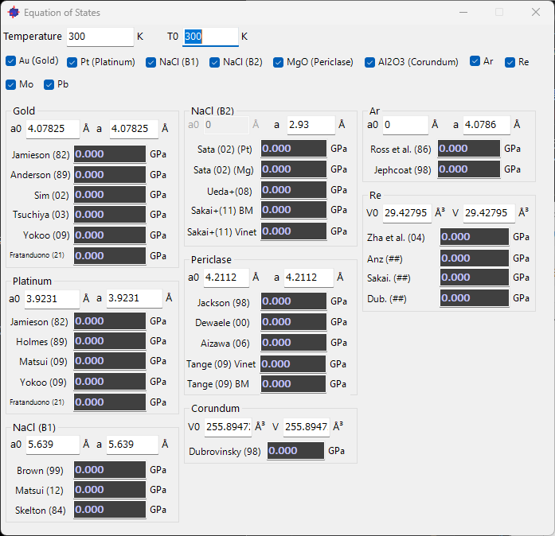
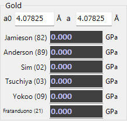
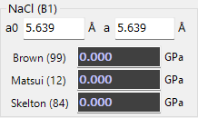
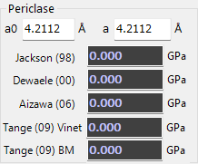

<!-- 260601Cl: migrated from legacy docx + yseto.net web manual -->
# 状態方程式

メイン画面のツールバーで `Equation of States`（状態方程式）アイコンをクリックすると、下のようなウィンドウが開きます。これは標準物質の状態方程式（EOS, Equation of State）から圧力を計算するためのツールです。

高圧実験では、試料と一緒に圧力の基準となる標準物質（圧力マーカー）を入れて測定し、その標準物質の格子定数（体積）と既知の状態方程式から圧力を逆算します。本ツールはその計算を行います。

## 使い方

1. ウィンドウ上部のチェックボックスから、圧力を求めたい標準物質を選択します。
2. 選択した物質ごとに、ウィンドウ下部にその計算結果（圧力）が表示されます。
3. 格子定数（`a`、`a0` または体積 `V`、`V0`）を直接入力して計算できます。
4. メイン画面で回折線をマウスでドラッグして動かすと、その値が即座に状態方程式の計算結果に反映されます。

!!! note "結晶リストとの対応"
    標準物質は、結晶リストの中でピンク色の行として表示されている結晶に対応します。標準で約 10 種類の物質（金 Au、白金 Pt、NaCl-B1、NaCl-B2、ペリクレース MgO、コランダム Al2O3、アルゴン Ar、レニウム Re、モリブデン Mo、鉛 Pb など）が用意されています。

## 対応している標準物質

ウィンドウ上部のチェックボックスで選択できる標準物質は次の通りです。物質ごとに複数の研究者による状態方程式（出典）が用意されており、選択したものすべての結果が個別に表示されます。

| 標準物質 | 内容 |
| --- | --- |
| `Au (Gold)` | 金 |
| `Pt (Platinum)` | 白金 |
| `NaCl (B1)` | 塩化ナトリウム（B1 構造、岩塩型） |
| `NaCl (B2)` | 塩化ナトリウム（B2 構造、CsCl 型） |
| `MgO (Periclase)` | 酸化マグネシウム（ペリクレース） |
| `Al2O3 (Corundum)` | 酸化アルミニウム（コランダム） |
| `Ar` | アルゴン |
| `Re` | レニウム |
| `Mo` | モリブデン |
| `Pb` | 鉛 |
| `hBN` | 六方晶窒化ホウ素 |

## 入力パラメータ

各物質の `groupBox` では、次の値を入力・参照します。

| 項目 | 説明 |
| --- | --- |
| `a` / `V` | 測定された格子定数、または体積。メイン画面で回折線を動かすと自動的に更新されます。 |
| `a0` / `V0` | 常圧（基準状態）での格子定数、または体積。 |
| `Temperature` | 試料の温度。熱圧力を含む状態方程式（高温 EOS）で使用します。 |
| `T0` | 基準温度。`Temperature` とあわせて熱圧力の補正に使います。 |

!!! tip "温度を考慮した状態方程式"
    一部の出典は熱圧力（thermal pressure）を含む高温状態方程式に対応しています。`Temperature` と `T0` を実験条件に合わせて入力することで、温度補正を加えた圧力が得られます。`Sakai+(11)` の Vinet/BM など、Mie-Grüneisen(-Debye) モデルを用いた式がこれにあたります。

## 物質ごとの出典（参考文献）

各物質の `groupBox` には、複数の出典による状態方程式が並んでおり、それぞれの式で計算した圧力が同時に表示されます。研究や測定条件に応じて、信頼できる出典を選んで比較できます。以下に代表的な物質の出典例を示します。

### 金（Gold）

金（`Au (Gold)`）では、`Yokoo (09)`、`Matsui (09)`、`Holmes (89)`、`Jamieson (82)`、`Fratanduono (21)` などの状態方程式が利用できます。

### NaCl（B1 構造）

`NaCl (B1)` では、`Brown (99)`、`Sakai+`、`Matsui (12)` などの状態方程式が利用できます。

### ペリクレース（Periclase, MgO）

`MgO (Periclase)` では、`Tange (09) BM`、`Tange (09) Vinet`、`Aizawa (06)`、`Dewaele (00)`、`Jackson (98)` などの状態方程式が利用できます。

!!! note "そのほかの物質"
    白金（`Pt (Platinum)`：`Fratanduono (21)`、`Holmes (89)` ほか）、`NaCl (B2)`（`Sakai (02)`、`Ueda+(08)` ほか）、コランダム（`Al2O3 (Corundum)`：`Sata (02)` ほか）、`Ar`（`Dubrovinsky (98)`、`Ross et al. (86)`、`Jephcoat (98)` ほか）、`Re`（`Zha et al. (04)` ほか）、`Mo`（`Zhao+(00)`、`Huang+(16) MGD` ほか）、`Pb`（`Strässle+(14)` ほか）も同様に、複数の出典から選択できます。

## 状態方程式の理論

本ツールで用いている状態方程式（Birch-Murnaghan、Vinet、AP2、Keane、Mie-Grüneisen(-Debye) など）の数式やパラメータの詳細は、作者による解説ページにまとめられています。

- [状態方程式（EOS）の解説](https://yseto.net/misc/misc-4/misc-4-1)

物質の温度・圧力・体積の関係を表す式が状態方程式 \( P = P(V, T) \) であり、測定した体積 \( V \) から圧力 \( P \) を求めるのが本ツールの役割です。具体的な式の形（3 次 Birch-Murnaghan 式や Vinet 式など）と各物質のパラメータについては、上記ページを参照してください。

## 関連ページ

- 結晶の登録やリスト表示については [プロファイル情報](4-profile-parameter.md) などの関連ページを参照してください。
