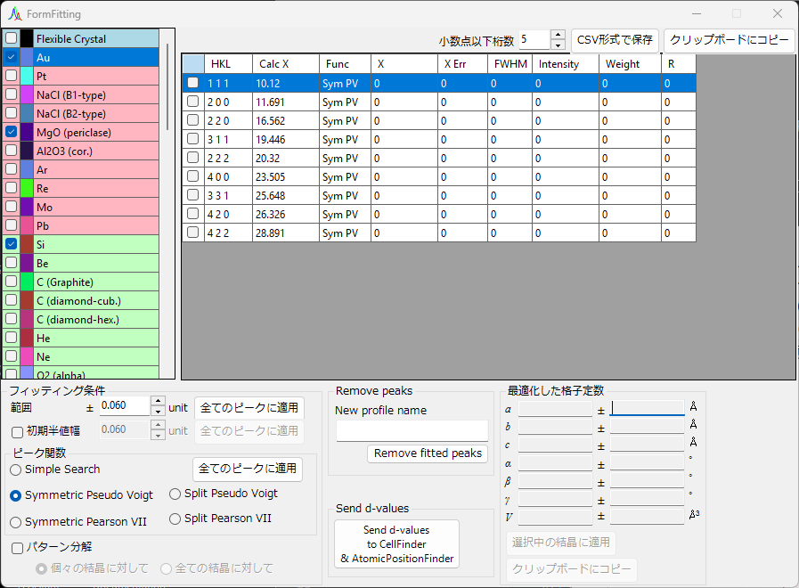
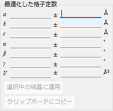
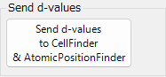
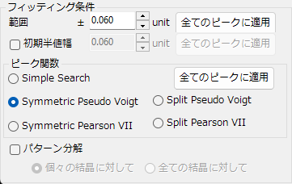
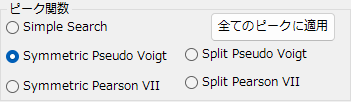
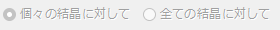
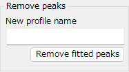
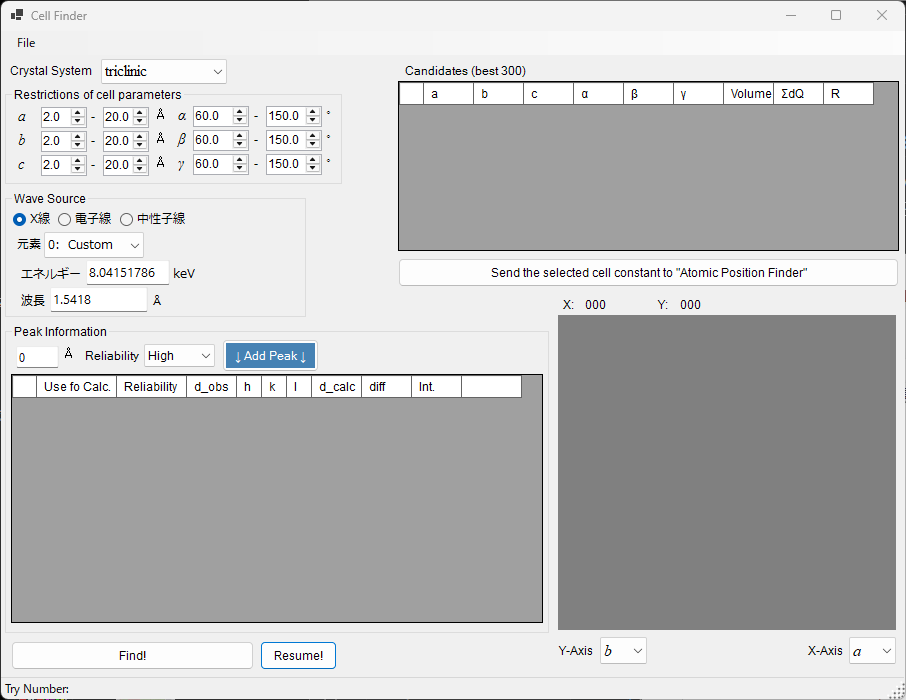
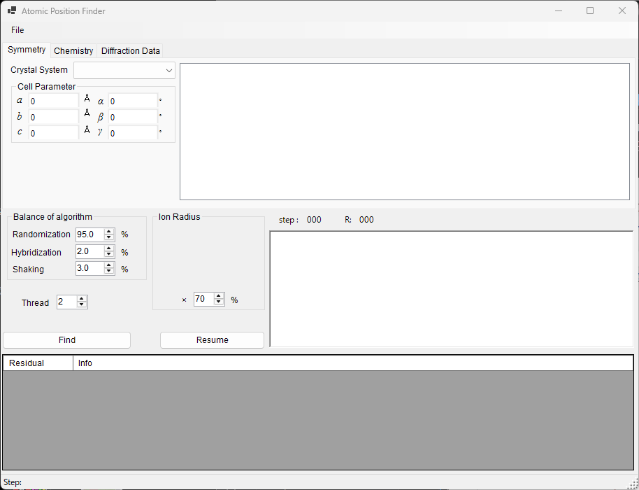

<!-- 260601Cl: migrated from legacy docx + yseto.net web manual -->
# ピークフィッティング

`Fitting diffraction peaks` ツールは、回折プロファイルのピークを適当な関数でフィッティングし、ピーク位置 2θ から d 値を求め、最小2乗法によって格子定数を最適化する一連の作業を行います。メインウィンドウのツールバーから起動します。

## 基本的な操作の流れ

1. 対象となる結晶を、結晶リストから選択しておきます（マルチプロファイルモードでは、対象とするプロファイルもあわせて選択します）。
2. メイン画面で回折線をマウスでドラッグし、測定ピークになるべく重なるように位置を調節しておきます。
3. フィッティングを行いたい回折線の指数を、回折線リスト（チェックリストボックス）から選択します。
4. 独立な指数を何本か選んで最小2乗法が計算可能になると、画面右下の `Optimized cell constants`（最適化した格子定数）パネルに最確な格子定数が誤差付きで表示されます。
5. `Apply to the crystal`（選択中の結晶に適用）ボタンを押すと、求めた格子定数がプログラム本体の結晶に反映されます。

!!! note "結晶のチェックと選択"
    結晶リストはメインウィンドウと同じ内容です。フィッティングを有効にするには、対象の結晶を「チェック」かつ「選択」しておく必要があります。

## 結晶リスト

ウィンドウ左上の結晶リストには、メインウィンドウと同じ結晶が並びます。ここでチェックして選択した結晶が、フィッティングの対象になります。詳細は [結晶パラメータ](3-crystal-parameter.md) を参照してください。

## 回折線リスト

選択中の結晶の回折線が一覧表示されます。各行のチェックボックスをオンにすると、その回折線がフィッティング対象になります。リストには次のような列が含まれます。

| 列 | 内容 |
| --- | --- |
| `Check` | フィッティング対象にするかどうか |
| `PeakColor` | 表示色 |
| `Crystal` | 結晶名 |
| `HKL` | 反射指数 |
| `Calc X` | 計算上の回折線位置 |
| `Func` | 使用するピーク関数 |
| `X` | フィッティングで求まったピーク位置 |
| `X Err` | ピーク位置の誤差 |
| `FWHM` | 半値全幅 |
| `Intensity` | ピーク強度 |
| `Weight` | 最小2乗法での重み |
| `R` | フィッティングの残差指標 |

リスト下部のボタンで結果を書き出せます。

- `Copy to clipborad`: 表の内容をクリップボードにコピーします。Excel などに直接貼り付けできます。
- `Save as CSV`: 表の内容を `.csv` ファイルとして保存します。`Effective digit`（小数点以下桁数）で有効桁数を指定できます。
- `Clear peaks`: フィッティング結果をクリアします。

## Fitting option（フィッティング条件）

ピークプロファイルをフィッティングする際の細かい設定を行います。

### Search Range / Initial FWHM

- `Search Range`（範囲）: フィッティングを行う範囲を設定します。すなわち、計算上の回折線位置から ±Search Range 分を、そのピークのフィッティング対象範囲とします。
- `Initial FWHM`（初期半値幅）: プロファイル関数の初期半値幅を指定します。最小2乗法の収束のための初期値として使われます。

`Apply to all`（全てのピークに適用）ボタンを押すと、現在の設定をすべての回折線に一括で適用します。

### Peak function（ピーク関数）

フィッティングに使用するピーク関数を選びます。

| ピーク関数 | 内容 |
| --- | --- |
| `Simple Search` | 関数フィッティングは行わず、計算上の回折線位置から ±Search Range の範囲でもっとも強度の強い点をピーク位置と認識します。 |
| `Symmetric Pseudo Voigt` | 左右対称の擬似フォークト関数でフィッティングします。 |
| `Symmetric Pearson VII` | 左右対称のピアソン VII 関数でフィッティングします。 |
| `Split Pseudo Voigt` | 左右非対称の擬似フォークト関数でフィッティングします。 |
| `Split Pearson VII` | 左右非対称のピアソン VII 関数でフィッティングします。 |

!!! tip "推奨される関数"
    特別な理由がない限り、安定性に優れた `Symmetric Pseudo Voigt` の使用を推奨します。

擬似フォークト関数は、ガウス関数 \(G(x)\) とローレンツ関数 \(L(x)\) を混合比 \(\eta\) で線形結合したもので、次式で表されます。

$$
\mathrm{pV}(x) = \eta\, L(x) + (1-\eta)\, G(x), \qquad 0 \le \eta \le 1
$$

ここで \(\eta\) はローレンツ成分の割合です。Split 型は、ピーク位置の左右で半値幅などのパラメータを独立にとることで、非対称なプロファイルを表現します。

### Pattern Decomposition（パターン分解）

選択された 2 本以上の回折線の Search Range に重なり合いがあるとき、ピーク分解（複数ピークの同時フィッティング）を行うかどうかを選択します。

- `in each crystal`（個々の結晶に対して）: 結晶ごとに独立にピーク分解を行います。
- `between crystals`（全ての結晶に対して）: すべての結晶にまたがってピーク分解を行います。

## Optimized cell constants（最適化した格子定数）

独立な指数を十分に選び、最小2乗法が計算可能になると、このパネルに最確な格子定数 \(a, b, c, \alpha, \beta, \gamma\) と体積 \(V\) が、それぞれの誤差（`±`）付きで表示されます。

!!! note "NA の表示について"
    自由度（拘束されていないパラメータ数）が不足しているとき、すなわちフィッティングしたピーク数に対して自由度が等しいか、その格子定数に自由度がない場合には、誤差として `NA` が表示されます。十分な数の独立な反射を選ぶと誤差が計算されます。

- `Apply to the crystal`（選択中の結晶に適用）: 求めた格子定数を、メインプログラム側の選択中の結晶に反映します。
- `Copy to Clipboard`（クリップボードにコピー）: 最適化した格子定数をクリップボードにコピーします。
- `Reset take off angle`: テイクオフ角（取り出し角）をリセットします。

## Remove fitted peaks（フィッティングしたピークの除去）

フィッティングしたピークをプロファイルから差し引き、残差プロファイルを新しいプロファイルとして出力します。`New profile name`（新しいプロファイル名）に出力先の名前を入力し、`Remove fitted peaks`（ピーク除去）ボタンを押すと差し引きが実行されます。バックグラウンドや重なり合うピークの分離を確認するときに利用します。

## 関連ツール（Send d-values）

`Send d-values to CellFinder && AtomicPositionFinder` ボタンを押すと、フィッティングで得られた d 値を、ツールバーから起動できる次の解析ツールに送ることができます。

### Cell Finder（格子定数の探索）

`Cell Finder` は、測定されたピーク位置（d 値の一覧）から、それを説明する単位格子（格子定数）を逆算して探索するツールです。未知試料の指数付けに利用します。

### Atomic Position Finder（原子位置の探索）

`Atomic Position Finder` は、観測された反射の強度などから、結晶構造中の原子位置を探索するツールです。

!!! tip "未知試料の同定"
    `Cell Finder` で格子定数を決めたあと、その結晶を結晶リストに登録すれば、本ツールの最小2乗フィッティングでさらに格子定数を精密化できます。
