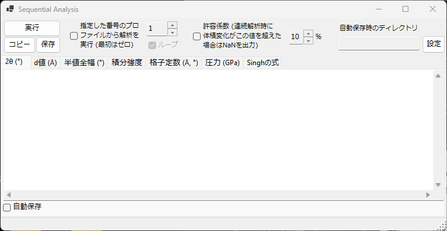
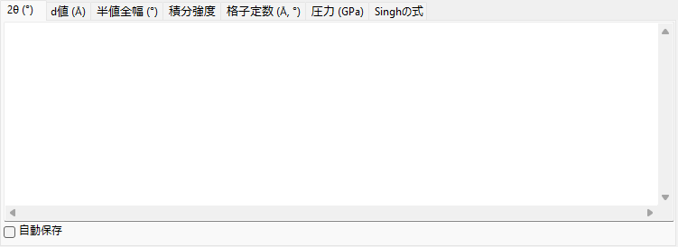
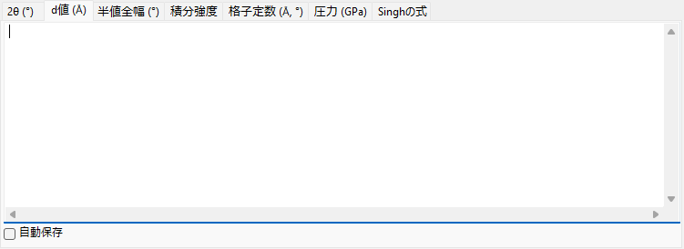
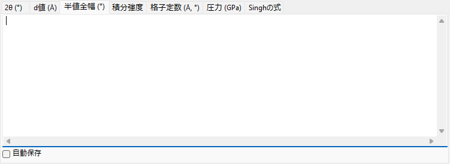
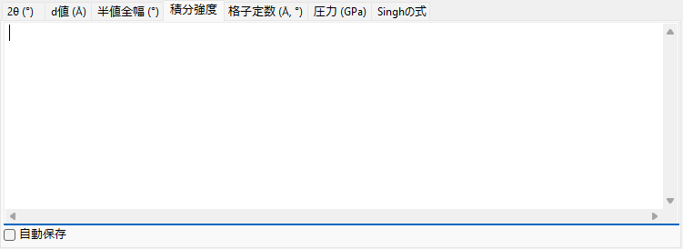
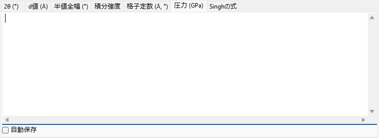
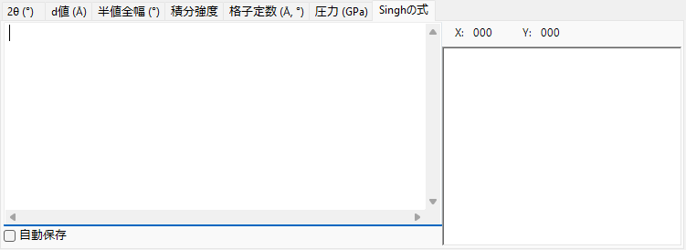

<!-- 260601Cl: migrated from legacy docx + yseto.net web manual -->
# 連続分析

`連続分析` (Sequential Analysis) は、読み込んだ多数のプロファイルに対して同じピークフィッティングを連続的に実行し、その結果を量ごとにまとめて出力するツールです。温度・圧力・時間などの条件を変えながら取得した一連のプロファイル列を一括で解析し、各回折線の 2θ、d 値、半値全幅、積分強度、格子定数、圧力、Singh の式 (一軸応力・格子歪み解析) の結果を、それぞれのタブに表として収集します。

メインウィンドウのツールバーにある `Sequential Analysis` ボタンでこのウィンドウを開閉します。

!!! note "[ピークフィッティング](6-fitting-diffraction-peaks.md) と共有"
    連続分析は、フィッティングの設定そのものを `Fitting diffraction peaks` ウィンドウと共有します。あらかじめ `Fitting diffraction peaks` ウィンドウを開き、解析対象の結晶と、フィッティングしたい回折線 (ピーク) をチェックしておく必要があります。これらが準備されていない状態で `実行` すると、その旨のメッセージが表示されます。

## 基本的な手順

1. 条件を変えながら測定した一連のプロファイル列をすべて読み込みます (4 個以上のプロファイルが必要です)。
2. [ピークフィッティング](6-fitting-diffraction-peaks.md) ウィンドウを開き、対象の結晶を選んで、解析したい回折線にチェックを入れます。ここで設定したフィッティング関数や探索範囲がそのまま連続分析でも使われます。
3. 必要に応じて、開始番号・ループ・許容係数・自動保存を設定します (下記参照)。
4. `実行` ボタンを押すと、読み込まれている各プロファイルを順番にアクティブにしながら最小二乗フィッティングを実行し、結果を各タブに蓄積していきます。
5. 各タブの内容を確認し、`コピー` または `保存` で表計算ソフト (Excel など) に取り込みます。

進行状況と経過時間は、ウィンドウ下部のステータスバーに `... % completed. Elapsed time: ... sec` のように表示されます。解析が完了すると、2θ・d 値・半値全幅・積分強度の 4 つの結果がまとめてクリップボードへコピーされます。

!!! tip "各プロファイルあたり 2 回フィッティング"
    安定した収束を得るため、各プロファイルに対して最小二乗フィッティングを 2 回実行してから結果を記録します。

## 解析オプション

`実行` ボタンの周囲には、解析範囲と異常値の扱いを制御するオプションがあります。

| オプション | 説明 |
| --- | --- |
| `指定した番号のプロファイルから解析を実行 (最初はゼロ)` | チェックすると、先頭ではなく、右の数値ボックスで指定した番号のプロファイルから解析を開始します。最初のプロファイルは番号 0 です。 |
| `ループ` | 開始番号を指定したとき、末尾まで到達した後に、スキップした手前のプロファイル (0 〜 開始番号 − 1) を続けて処理し、巻き戻して全体を解析します。開始番号を有効にした場合のみ使用できます。 |
| `許容係数 (連続解析時に体積変化がこの値を超えた場合は NaN を出力)` | チェックすると、精密化された単位胞体積が初期値から右の数値 (%) を超えて変化したフィッティングを棄却し、その行を `NaN` として出力します。フィッティングの破綻による外れ値を自動的に除外できます。 |

## 出力タブ

各タブが 1 つの出力量に対応した表になっています。各行が 1 つのプロファイル (プロファイル名)、各列が選択した回折線 (hkl 指数。flexible crystal の場合は `Peak No.`) に対応します。表はタブ区切りで保持され、`コピー` / `保存` で取り出すときにカンマ区切り (CSV) に変換できます。

### 2θ (°)

各プロファイル・各回折線について、フィッティングで得られたピーク位置を 2θ (度) で出力します。

### d 値 (Å)

各ピーク位置から計算した面間隔 d を Å 単位で出力します。波長と 2θ から \( d = \dfrac{\lambda}{2\sin\theta} \) によって求めます。

### 半値全幅 (°)

各ピークの半値全幅 (FWHM, Full Width at Half Maximum) を 2θ の度数で出力します。ピーク幅の変化を追跡できます。

### 積分強度

各ピークの積分強度 (面積) を出力します。相転移や配向変化に伴う強度変化の追跡に利用できます。

### 格子定数 (Å, °)

各プロファイルから精密化された単位胞の体積 `V`、格子定数 `A`・`B`・`C` (Å)、軸角 `Alpha`・`Beta`・`Gamma` (°) と、それぞれの推定誤差 (`_err` 列) を出力します。

### 圧力 (GPa)

各プロファイルの格子定数から、[状態方程式](5-equation-of-states.md) (Equation of State) を用いて求めた圧力を出力します。`Equation of State` ウィンドウで Gold・Pt・NaCl(B1/B2)・MgO・Corundum・Ar・Re・Mo・Pb などの圧力標準が選択されている場合は、研究者ごと (報告ごと) の圧力スケールが列として並びます。標準が選択されていない場合は、対象結晶に設定された状態方程式から算出した圧力を出力します。

### Singh の式

Singh の式に基づく一軸応力・格子歪み解析の結果を出力します。プロファイル名の末尾の数値を方位角 \( \psi \) (度) として解釈し、各反射について方位角と d 値の関係を最小二乗 (Levenberg–Marquardt 法) でフィッティングします。各反射ごとに、無応力相当の格子面間隔 `d0`、最大歪み方位 `Ψmax`、そして応力に比例する量 `t/6Ghkl` (差応力 \( t \) と剪断弾性率 \( G_{hkl} \) の比に対応) を求めます。フィッティング曲線はタブ内のグラフにも表示されます。

!!! note "Singh の式の適用条件"
    このタブは、プロファイル名が `...-whole` で終わる「応力解析モード」のデータ列に対して動作します。各プロファイル名は末尾に方位角 (例: `...-30`) を持つ必要があります。一般のプロファイル列ではこのタブは更新されません。

Singh の式が表す方位角依存の格子面間隔は、概ね次式で与えられます。

$$ d(\psi) = d_0 \left[ 1 + \alpha - 3\,\alpha \left( 1 - \frac{\lambda^2}{4 d^2} \right) \cos^2(\psi - \psi_{\max}) \right] $$

ここで \( \alpha \) は `t/6Ghkl` に相当する量、\( \psi_{\max} \) は最大歪みを与える方位です。

## 結果の取り出し

| 操作 | 説明 |
| --- | --- |
| `コピー` | 現在表示しているタブの内容を CSV (カンマ区切り) としてクリップボードへコピーします。 |
| `保存` | 現在表示しているタブの内容を CSV ファイルとして保存します (ファイル名はダイアログで指定)。 |

### 自動保存

各タブには `自動保存` チェックボックスがあり、`実行` 後に対応する量を自動的に CSV ファイルへ書き出せます。保存先は `自動保存時のディレクトリ` に表示され、`設定` ボタンでフォルダを選択します。ファイル名はプロファイル名から共通部分を抽出し、量に応じて `_2theta.csv` / `_d.csv` / `_fwhm.csv` / `_intensity.csv` / `_cell.csv` / `_pressure.csv` / `_Singh.csv` の接尾辞が付きます。

!!! tip "保存先フォルダの設定"
    自動保存をチェックしていても保存先フォルダが未設定 (存在しない) 場合は、`実行` 時にフォルダ選択ダイアログが開きます。

## マクロからの利用

連続分析の各出力は、マクロ (Python スクリプト) からも取得できます。これらは [マクロ](8-macro.md) の `PDI.Sequential` クラスに対応します。

| マクロ関数 | 対応するタブ |
| --- | --- |
| `PDI.Sequential.Open()` / `Close()` | ウィンドウの開閉 |
| `PDI.Sequential.Execute()` | 連続分析の実行 |
| `PDI.Sequential.GetCSV_2theta()` | 2θ |
| `PDI.Sequential.GetCSV_D()` | d 値 |
| `PDI.Sequential.GetCSV_FWHM()` | 半値全幅 |
| `PDI.Sequential.GetCSV_Intensity()` | 積分強度 |
| `PDI.Sequential.GetCSV_CellConstants()` | 格子定数 |
| `PDI.Sequential.GetCSV_Pressure()` | 圧力 |
| `PDI.Sequential.GetCSV_Singh()` | Singh の式 |

各 `GetCSV_...()` は、対応するタブの内容を CSV 文字列として返します。`PDI.Sequential.Directory` で保存先フォルダを取得・設定でき、`PDI.File.SaveText(...)` と組み合わせて結果をファイルへ書き出せます。詳細は [マクロ](8-macro.md) を参照してください。
