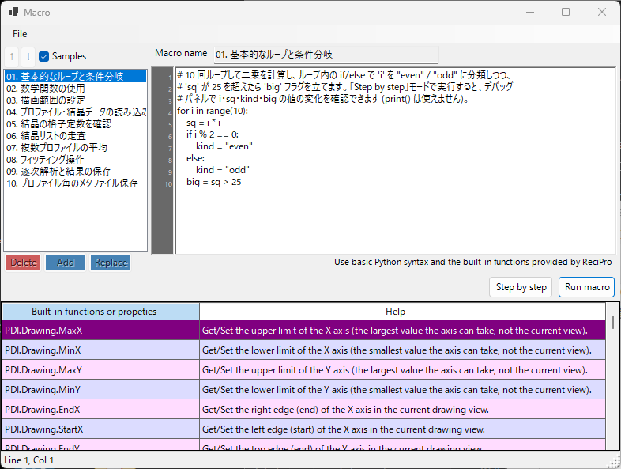

<!-- 260601Cl: migrated from legacy docx + yseto.net web manual -->
# マクロ

PDIndexer のほとんどの操作は、**マクロ**機能を使って自動化できます。マクロは [IronPython](https://ironpython.net/)（.NET 上で動く Python 実装）で記述する Python スクリプトで、専用のマクロエディタウィンドウ上で編集・実行します。繰り返し作業の自動化、複数ファイルの一括処理、結果の CSV／画像への一括出力などに利用できます。



!!! note "Python の基本知識について"
    マクロは標準的な Python の構文（`for` ループ・`if`／`else`・リスト・関数など）がそのまま使えます。本ページでは Python 言語自体の解説は行いません。PDIndexer 固有の機能は、後述の `PDI` オブジェクトを通じて呼び出します。

## マクロエディタを開く

メインウィンドウのメニューバーから **マクロ → 編集** を選ぶと、マクロエディタウィンドウ（タイトル: `Macro`）が開きます。

エディタで作成・保存したマクロは、**マクロ**メニューの下に名前付きで一覧表示され、メニューから直接呼び出して実行することもできます。マクロの一覧は PDIndexer 終了時に自動で保存され、次回起動時に復元されます。

## エディタウィンドウの構成

エディタウィンドウは、おおまかに次の部分から構成されます。

| 部分 | 説明 |
| --- | --- |
| マクロ一覧（左のリスト） | 保存済みマクロの名前一覧。クリックすると右のエディタにそのマクロが読み込まれます。 |
| コードエディタ（中央） | Python スクリプトを入力する領域。行番号ガター、オートインデント、入力補完（オートコンプリート）、関数のツールチップ表示に対応します。 |
| 関数リファレンス表 | `PDI` 以下で使える全関数の一覧表。セルをダブルクリックすると、その関数名がカーソル位置のコードへ挿入されます。 |
| デバッグパネル（右） | ステップ実行中に、その時点での変数名と値を表示します。 |
| ステータスバー | 現在のカーソル位置（`Line` / `Col`）を表示します。 |

### 一覧操作ボタン

マクロ一覧の編集には次のボタンを使います（日本語 UI でも一部は英語ラベルのまま表示されます）。

| ボタン | 動作 |
| --- | --- |
| `Add` | 現在のコードを、名前欄に入力した名前で一覧へ追加します（同名があれば上書き確認）。 |
| `Replace` | 一覧で選択中のマクロを、現在のコード内容で置き換えます。 |
| `Delete` | 選択中のマクロを一覧から削除します。 |
| `↑` / `↓` | 選択中のマクロを一覧内で上／下へ移動します。 |
| `Samples` | サンプルマクロ集の表示を切り替えます（後述）。 |

!!! tip "保存・読み込み"
    マクロは個別の `.mcr` ファイルとして保存・読み込みできます。`.mcr` ファイルをエディタウィンドウへドラッグ&ドロップすると、その内容を読み込めます。また、コード編集後に `Ctrl+S` を押すと選択中のマクロへ上書き保存されます。

## マクロの実行

コードエディタの下部にあるボタンでマクロを実行します。

| ボタン | 動作 |
| --- | --- |
| `Run macro` | マクロを最後まで通常実行します。 |
| `Step by step` | 1 行ずつステップ実行します。各行の実行前に停止し、右のデバッグパネルにその時点の変数の値を表示します。 |
| `Next step (F10)` | ステップ実行中に次の 1 行へ進みます（`F10` キーでも可）。 |
| `Stop` | 実行を中断します。中断はステップ実行（`Step by step`）中のみ有効です。 |

!!! warning "print() は使えません"
    マクロエディタには標準出力のコンソールがないため、`print()` の出力は表示されません。変数の値を確認したいときは `Step by step` でステップ実行し、デバッグパネルで値の変化を確認してください。

### サンプルマクロ集

`Samples` ボタンをチェックすると、組み込みのサンプルマクロ集が一覧に表示されます（読み取り専用）。サンプルは現在の UI 言語（日本語／英語）に合わせて表示されます。サンプルを参考にしながら、自分のマクロを作成できます。組み込みサンプルには次のものがあります。

| 名前 | 内容 |
| --- | --- |
| 01. 基本的なループと条件分岐 | `for` ループ・`if`/`else` の基本 |
| 02. 数学関数の使用 | `math` モジュール（`pi`, `sin`, `sqrt`, `exp`, `log` など）の利用 |
| 03. 描画範囲の設定 | `PDI.Drawing.SetBounds` で表示範囲を設定 |
| 04. プロファイル・結晶データの読み込み | `PDI.File.ReadProfiles` / `ReadCrystals` |
| 05. 結晶の格子定数を確認 | `PDI.Crystal` の格子定数・体積・圧力の取得 |
| 06. 結晶リストの走査 | `PDI.CrystalList` 全件のループ |
| 07. 複数プロファイルの平均 | `PDI.ProfileOperator.Average` |
| 08. フィッティング操作 | `PDI.Fitting` の一連の流れ |
| 09. 逐次解析と結果の保存 | `PDI.Sequential` の実行と CSV 出力 |
| 10. プロファイル毎のメタファイル保存 | プロファイル毎に EMF を一括保存 |

!!! note "math モジュールは import 済み"
    エディタ起動時に `import math` が自動的に実行されるため、`math.sqrt(2)` のように明示的な `import` 文なしで `math` モジュールをそのまま使えます。

---

## 関数リファレンス

PDIndexer 固有の機能は、すべてルートオブジェクト `PDI` 以下のクラスを通じて呼び出します。`PDI` はマクロのスコープにあらかじめ用意されているので、`import` などは不要です。

以下の各表は、ソースコードの `[Help]` 属性から転記したものです。同じ一覧はエディタウィンドウ内の関数リファレンス表、および [web マニュアルの 6 章](https://yseto.net/soft/pdi/pdi_06)にも掲載されています。

!!! note "表記について"
    シグネチャ欄の `(get/set)` はプロパティ（読み書き可能）、`(get)` は読み取り専用プロパティを表します。引数の `= 値` は既定引数で、省略可能です。

### PDI（ルート）

| メンバー | シグネチャ | 説明 |
| --- | --- | --- |
| `Sleep` | `Sleep(int millisec)` | 指定したミリ秒だけマクロの実行を一時停止します。 |
| `Obj` | `Obj (get/set)` | 別のプログラムから渡された引数（プロセス間引数）を取得／設定します。 |

### PDI.File — ファイル入出力

| メンバー | シグネチャ | 説明 |
| --- | --- | --- |
| `GetDirectoryPath` | `GetDirectoryPath(string filename = "")` | ディレクトリパス（末尾に `\` 付き）を取得します。`filename` を省略するとフォルダ選択ダイアログが開きます。指定した場合は `filename` のディレクトリ部分を返します。 |
| `GetFileName` | `GetFileName()` | ファイル選択ダイアログを開き、選択されたファイルのフルパスを返します。キャンセル時は空文字列を返します。 |
| `GetFileNames` | `GetFileNames()` | 複数選択可能なファイルダイアログを開き、選択されたファイルのフルパスを返します。キャンセル時は空配列を返します。 |
| `ReadProfiles` | `ReadProfiles(string filename)` | 指定したファイルからプロファイルデータを読み込みます。`filename` を省略（または存在しない）場合はファイル選択ダイアログが開きます。 |
| `SaveProfiles` | `SaveProfiles(string filename)` | プロファイルデータを指定したファイルへ保存します。`filename` を省略すると保存ダイアログが開きます。 |
| `ReadCrystals` | `ReadCrystals(string filename)` | 指定したファイルから結晶データを読み込みます。`filename` を省略（または存在しない）場合はファイル選択ダイアログが開きます。 |
| `SaveCrystals` | `SaveCrystals(string filename)` | 結晶データを指定したファイルへ保存します。`filename` を省略すると保存ダイアログが開きます。 |
| `SaveMetafile` | `SaveMetafile(string filename)` | 現在のパターンを Windows メタファイル（`.emf`）として保存します。`filename` を省略すると保存ダイアログが開きます。 |
| `SaveText` | `SaveText(string text, string filename)` | 指定したテキスト内容を `.txt` ファイルへ保存します。`filename` を省略すると保存ダイアログが開きます。 |

### PDI.Drawing — 描画範囲

| メンバー | シグネチャ | 説明 |
| --- | --- | --- |
| `MaxX` | `MaxX (get/set)` | X 軸の上限値（軸が取りうる最大値。現在の表示範囲ではありません）を取得／設定します。 |
| `MinX` | `MinX (get/set)` | X 軸の下限値（軸が取りうる最小値。現在の表示範囲ではありません）を取得／設定します。 |
| `MaxY` | `MaxY (get/set)` | Y 軸の上限値（軸が取りうる最大値。現在の表示範囲ではありません）を取得／設定します。 |
| `MinY` | `MinY (get/set)` | Y 軸の下限値（軸が取りうる最小値。現在の表示範囲ではありません）を取得／設定します。 |
| `EndX` | `EndX (get/set)` | 現在の表示範囲における X 軸の右端（終端）を取得／設定します。 |
| `StartX` | `StartX (get/set)` | 現在の表示範囲における X 軸の左端（始端）を取得／設定します。 |
| `EndY` | `EndY (get/set)` | 現在の表示範囲における Y 軸の上端（終端）を取得／設定します。 |
| `StartY` | `StartY (get/set)` | 現在の表示範囲における Y 軸の下端（始端）を取得／設定します。 |
| `SetBounds` | `SetBounds(double startX, double endX, double startY, double endY)` | 4 辺（StartX, EndX, StartY, EndY）を指定して表示範囲を設定します。 |

### PDI.Crystal — 選択中の結晶

格子定数 `CellA` 〜 `CellC` の単位は \( \mathrm{\AA} \)、`CellAlpha` 〜 `CellGamma` の単位は度（deg）です。

| メンバー | シグネチャ | 説明 |
| --- | --- | --- |
| `CellVolume` | `CellVolume (get)` | 選択中の結晶の単位胞体積（\( \mathrm{\AA}^3 \)）を取得します。結晶が選択されていない場合は 0 を返します。 |
| `Pressure` | `Pressure(double volume = 0)` | 選択中の結晶の EOS から計算した圧力（GPa）を取得します。`volume` が 0（既定）の場合は現在の単位胞体積を使用します。 |
| `Name` | `Name (get/set)` | 選択中の結晶の名前を取得／設定します。 |
| `CellA` | `CellA (get/set)` | 選択中の結晶の格子定数 a（\( \mathrm{\AA} \)）を取得／設定します。 |
| `CellB` | `CellB (get/set)` | 選択中の結晶の格子定数 b（\( \mathrm{\AA} \)）を取得／設定します。 |
| `CellC` | `CellC (get/set)` | 選択中の結晶の格子定数 c（\( \mathrm{\AA} \)）を取得／設定します。 |
| `CellAlpha` | `CellAlpha (get/set)` | 選択中の結晶の格子定数 α（deg）を取得／設定します。 |
| `CellBeta` | `CellBeta (get/set)` | 選択中の結晶の格子定数 β（deg）を取得／設定します。 |
| `CellGamma` | `CellGamma (get/set)` | 選択中の結晶の格子定数 γ（deg）を取得／設定します。 |

### PDI.CrystalList — 結晶リスト

| メンバー | シグネチャ | 説明 |
| --- | --- | --- |
| `Open` | `Open()` | 「結晶リスト」ウィンドウを開きます。 |
| `Close` | `Close()` | 「結晶リスト」ウィンドウを閉じます。 |
| `Count` | `Count (get)` | リスト内の結晶の総数を取得します。 |
| `SelectedName` | `SelectedName (get)` | 現在選択中の結晶の名前を取得します。選択されていない場合は空文字列を返します。 |
| `SelectedIndex` | `SelectedIndex (get/set)` | 現在選択中の結晶のインデックスを取得／設定します。 |
| `Select` | `Select(int index)` | 指定したインデックスの結晶を選択します。 |
| `Check` | `Check(int index = -1, bool state = true)` | 指定したインデックスの結晶のチェック状態を変更します。`index` が -1 のときは現在選択中の結晶が対象です。 |
| `Uncheck` | `Uncheck(int index = -1)` | 指定したインデックスの結晶のチェックを外します。`index` が -1 のときは現在選択中の結晶のチェックを外します。 |
| `GetCellVolume` | `GetCellVolume (get)` | 選択中の結晶の単位胞体積（\( \mathrm{\AA}^3 \)）を取得します。`PDI.Crystal.CellVolume` と同じで、後方互換のために残されています。 |

### PDI.Profile — 選択中のプロファイル

| メンバー | シグネチャ | 説明 |
| --- | --- | --- |
| `Comment` | `Comment (get/set)` | 現在選択中のプロファイルのコメント文を取得／設定します。 |
| `Name` | `Name (get/set)` | 現在選択中のプロファイルの表示名を取得／設定します。 |

### PDI.ProfileOperator — プロファイルの演算

各プロファイルはリスト内のインデックスで指定します。`output` は結果のプロファイルに付ける名前です。

| メンバー | シグネチャ | 説明 |
| --- | --- | --- |
| `Average` | `Average(int[] indices, string output)` | `indices` に列挙したインデックス（例: `[1,3,5,9]`）のプロファイルの平均を計算します。`output` は結果のプロファイルに付ける名前です。 |
| `AddTwoProfiles` | `AddTwoProfiles(int index1, int index2, string output)` | profile1 + profile2 を計算します。各プロファイルはインデックスで指定します。`output` は結果のプロファイルに付ける名前です。 |
| `SubtractTwoProfiles` | `SubtractTwoProfiles(int index1, int index2, string output)` | profile1 − profile2 を計算します。各プロファイルはインデックスで指定します。`output` は結果のプロファイルに付ける名前です。 |
| `MultiplyTwoProfiles` | `MultiplyTwoProfiles(int index1, int index2, string output)` | profile1 × profile2 を計算します。各プロファイルはインデックスで指定します。`output` は結果のプロファイルに付ける名前です。 |
| `DivideTwoProfiles` | `DivideTwoProfiles(int index1, int index2, string output)` | profile1 ÷ profile2 を計算します。各プロファイルはインデックスで指定します。`output` は結果のプロファイルに付ける名前です。 |

### PDI.ProfileList — プロファイルリスト

| メンバー | シグネチャ | 説明 |
| --- | --- | --- |
| `Open` | `Open()` | 「プロファイルリスト」ウィンドウを開きます。 |
| `Close` | `Close()` | 「プロファイルリスト」ウィンドウを閉じます。 |
| `DeleteAll` | `DeleteAll()` | リストから全プロファイルを削除します（確認ダイアログなし）。 |
| `Delete` | `Delete(int index)` | 指定したインデックスのプロファイルを削除します。 |
| `Count` | `Count (get)` | リスト内のプロファイルの総数を取得します。 |
| `SelectedName` | `SelectedName (get)` | 現在選択中のプロファイルの名前を取得します。選択されていない場合は空文字列を返します。 |
| `SelectedIndex` | `SelectedIndex (get/set)` | 現在選択中のプロファイルのインデックスを取得／設定します。 |
| `Select` | `Select(int index)` | 指定したインデックスのプロファイルを選択します。 |
| `Check` | `Check(int index = -1, bool state = true)` | 指定したインデックスのプロファイルのチェック状態を変更します。`index` が -1 のときは現在選択中のプロファイルが対象です。 |
| `Uncheck` | `Uncheck(int index = -1)` | 指定したインデックスのプロファイルのチェックを外します。`index` が -1 のときは現在選択中のプロファイルのチェックを外します。 |
| `CheckAll` | `CheckAll()` | リスト内の全プロファイルにチェックを入れます。 |
| `UncheckAll` | `UncheckAll()` | リスト内の全プロファイルのチェックを外します。 |

### PDI.Fitting — ピークフィッティング

[ピークフィッティング](6-fitting-diffraction-peaks.md)ウィンドウを操作します。

| メンバー | シグネチャ | 説明 |
| --- | --- | --- |
| `Open` | `Open()` | 「ピークフィッティング」ウィンドウを開きます。 |
| `Close` | `Close()` | 「ピークフィッティング」ウィンドウを閉じます。 |
| `Apply` | `Apply()` | 最適化された格子定数を選択中の結晶へ反映します（フィッティングウィンドウの `Confirm` ボタンを押すのと同等）。 |
| `Check` | `Check(int index = -1, bool state = true)` | 指定したインデックスの格子面のチェック状態を変更します。`index` が -1 のときは現在選択中の面が対象です。 |
| `Uncheck` | `Uncheck(int index = -1)` | 指定したインデックスの格子面のチェックを外します。`index` が -1 のときは現在選択中の面のチェックを外します。 |
| `Select` | `Select(int index)` | 指定したインデックスの格子面を選択します。 |
| `SelectedIndex` | `SelectedIndex (get/set)` | 現在選択中の格子面のインデックスを取得／設定します。 |
| `Range` | `Range(double range)` | 現在選択中の格子面に対するピーク探索範囲を設定します（X 軸と同じ単位）。 |

### PDI.Sequential — 逐次解析

[逐次解析](7-sequential-analysis.md)ウィンドウを操作します。CSV 取得系メソッドは、最後に実行した逐次解析の結果を CSV 文字列として返します。

| メンバー | シグネチャ | 説明 |
| --- | --- | --- |
| `Directory` | `Directory (get/set)` | 逐次解析の結果を保存するディレクトリのフルパスを取得／設定します。 |
| `Open` | `Open()` | 「逐次解析」ウィンドウを開きます。 |
| `Close` | `Close()` | 「逐次解析」ウィンドウを閉じます。 |
| `Execute` | `Execute()` | チェックされた全プロファイルに対して逐次解析を実行します。 |
| `GetCSV_2theta` | `GetCSV_2theta()` | 最後の逐次解析の 2θ 結果を CSV 文字列として取得します。 |
| `GetCSV_D` | `GetCSV_D()` | 最後の逐次解析の面間隔（d）結果を CSV 文字列として取得します。 |
| `GetCSV_FWHM` | `GetCSV_FWHM()` | 最後の逐次解析の半値全幅（FWHM）結果を CSV 文字列として取得します。 |
| `GetCSV_Intensity` | `GetCSV_Intensity()` | 最後の逐次解析のピーク強度結果を CSV 文字列として取得します。 |
| `GetCSV_CellConstants` | `GetCSV_CellConstants()` | 最後の逐次解析の格子定数結果を CSV 文字列として取得します。 |
| `GetCSV_Pressure` | `GetCSV_Pressure()` | 最後の逐次解析の圧力結果を CSV 文字列として取得します。 |
| `GetCSV_Singh` | `GetCSV_Singh()` | 最後の逐次解析の Singh 式の結果を CSV 文字列として取得します。 |
| `AutoSave2theta` | `AutoSave2theta (get/set)` | 逐次解析の実行ごとに 2θ 結果を自動保存するかどうかを取得／設定します。 |
| `AutoSaveDspacing` | `AutoSaveDspacing (get/set)` | 逐次解析の実行ごとに面間隔（d）結果を自動保存するかどうかを取得／設定します。 |
| `AutoSaveFWHM` | `AutoSaveFWHM (get/set)` | 逐次解析の実行ごとに FWHM 結果を自動保存するかどうかを取得／設定します。 |
| `AutoSaveIntensity` | `AutoSaveIntensity (get/set)` | 逐次解析の実行ごとにピーク強度結果を自動保存するかどうかを取得／設定します。 |
| `AutoSaveCellConstants` | `AutoSaveCellConstants (get/set)` | 逐次解析の実行ごとに格子定数結果を自動保存するかどうかを取得／設定します。 |
| `AutoSavePressure` | `AutoSavePressure (get/set)` | 逐次解析の実行ごとに圧力結果を自動保存するかどうかを取得／設定します。 |
| `AutoSaveSingh` | `AutoSaveSingh (get/set)` | 逐次解析の実行ごとに Singh 式の結果を自動保存するかどうかを取得／設定します。 |

## マクロの例

組み込みサンプルの一例として、逐次解析を実行して結果を CSV へ保存するマクロを示します。

```python
# 全プロファイルにチェックを入れて逐次解析を実行し、
# 2θ / 面間隔 / 格子定数 / 圧力の結果を CSV 文字列として取得してファイルに保存します。
PDI.ProfileList.CheckAll()
PDI.Sequential.Open()
PDI.Sequential.Execute()
dir_path = PDI.File.GetDirectoryPath()
PDI.File.SaveText(PDI.Sequential.GetCSV_2theta(),        dir_path + "seq_2theta.csv")
PDI.File.SaveText(PDI.Sequential.GetCSV_D(),             dir_path + "seq_d.csv")
PDI.File.SaveText(PDI.Sequential.GetCSV_CellConstants(), dir_path + "seq_cell.csv")
PDI.File.SaveText(PDI.Sequential.GetCSV_Pressure(),      dir_path + "seq_pressure.csv")
```

そのほかのサンプルは、エディタの `Samples` ボタンから一覧で確認できます。
